# API.md
## Complete REST API Specification — Elevate Tuitions Premium Online Tuition Platform

| | |
|---|---|
| **Document Type** | API Specification (Single Source of Truth) |
| **Version** | 1.0.0 |
| **Status** | Implementation-Ready |
| **Derived From** | `PRD.md` v1.0 · `DRD.md` v1.0.0 · `DATABASE.md` v1.0.0 · `UIDS.md` v1.0 |
| **Conflict Resolution Order** | `DATABASE.md` > `DRD.md` > `PRD.md` (this document defers to that order wherever the source documents disagree) |
| **Base URL (Production)** | `https://api.elevatetuitions.com/api/v1` |
| **Base URL (Preview)** | `https://<branch>-elevatetuitions.vercel.app/api/v1` |
| **Transport** | HTTPS only (TLS 1.2+), enforced via HSTS |
| **Payload Format** | `application/json` (multipart for uploads, per §20) |
| **Prepared For** | Backend Engineers, Frontend Engineers, QA, DevOps |
| **Prepared By** | Principal Backend Architect Function |

> **Reconciliation note.** `PRD.md` §17 sketches an early, illustrative endpoint list to communicate product intent (e.g., `/api/v1/student/dashboard`, `/api/v1/teacher/schedule`). `DRD.md` §12 supersedes it with a modular, resource-oriented catalog (`/api/v1/{module}/...`) built directly on the canonical `DATABASE.md` schema. **This document treats the DRD's modular endpoint catalog as canonical** and is its complete, implementation-ready elaboration. Every route, schema, and business rule below is traceable to a specific table, column, trigger, or stored procedure in `DATABASE.md`, and nothing here contradicts any of the four source documents. Where the PRD used a role-prefixed route style (`/student/...`, `/teacher/...`, `/admin/...`) this document uses the DRD's resource-oriented style (`/learning/assignments`, `/payments/invoices`) with the acting role resolved from the session, not the URL — the PRD's role-based groupings are preserved as **filters and authorization scopes**, not as distinct route trees.

---

## Table of Contents

1. [Document Overview](#1-document-overview)
2. [API Design Philosophy](#2-api-design-philosophy)
3. [REST Standards](#3-rest-standards)
4. [Versioning Strategy](#4-versioning-strategy)
5. [URL Structure](#5-url-structure)
6. [Naming Conventions](#6-naming-conventions)
7. [Authentication](#7-authentication)
8. [Authorization (RBAC)](#8-authorization-rbac)
9. [Request Lifecycle](#9-request-lifecycle)
10. [Standard Request Headers](#10-standard-request-headers)
11. [Standard Response Format](#11-standard-response-format)
12. [Error Response Standard](#12-error-response-standard)
13. [HTTP Status Code Guidelines](#13-http-status-code-guidelines)
14. [Pagination Standards](#14-pagination-standards)
15. [Sorting Standards](#15-sorting-standards)
16. [Filtering Standards](#16-filtering-standards)
17. [Searching Standards](#17-searching-standards)
18. [Date & Time Standards](#18-date--time-standards)
19. [Currency Standards](#19-currency-standards)
20. [File Upload Standards](#20-file-upload-standards)
21. [Validation Standards](#21-validation-standards)
22. [Rate Limiting](#22-rate-limiting)
23. [Idempotency](#23-idempotency)
24. [API Security](#24-api-security)
25. [Endpoint Categories](#25-endpoint-categories)
26. [Complete Endpoint Specifications](#26-complete-endpoint-specifications)
27. [Webhooks](#27-webhooks)
28. [Notifications](#28-notifications)
29. [File Streaming](#29-file-streaming)
30. [Analytics APIs](#30-analytics-apis)
31. [Admin APIs](#31-admin-apis)
32. [Testing Guidelines](#32-testing-guidelines)
33. [API Version Migration Strategy](#33-api-version-migration-strategy)
34. [Future API Expansion](#34-future-api-expansion)

---

## 1. Document Overview

### 1.1 Purpose

This document is the **single source of truth** for every HTTP endpoint exposed by the Elevate Tuitions platform. It is written so that:

- Two backend engineers, working independently from this document alone, produce **byte-for-byte identical** route signatures, request/response schemas, status codes, and side effects.
- A frontend engineer can build every screen defined in `PRD.md` §8–§13 and styled in `UIDS.md` §11–§12 **without ever needing to ask a backend engineer a clarifying question.**
- The document converts near-mechanically into an OpenAPI 3.1 specification (see §33.4) once the platform is ready for automated client generation.

### 1.2 Relationship to Other Documents

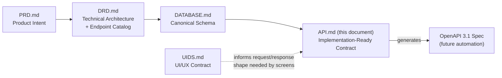

Every endpoint below cites the exact table(s), column(s), trigger(s), and/or stored procedure(s) from `DATABASE.md` that back it, and the exact PRD section the corresponding UI screen is defined in.

### 1.3 How to Read This Document

- **§1–§25** define platform-wide standards that apply to *every* endpoint. They are not repeated per-endpoint.
- **§26** is the endpoint catalog. For the highest-traffic, most business-critical endpoint in each module, a **full specification** is given using the standard template in §26.1 (24 required fields, matching this document's own authoring checklist). Every remaining endpoint in that module is listed in a **complete summary catalog table** immediately below the full specifications, and — per the explicit instruction in §1.4 — follows the **identical** documentation pattern; only the resource-specific fields (URL, body schema, DB tables, business rules) differ. This mirrors the scale-management approach `DATABASE.md` itself uses in its §7.5 for table specifications, applied here to endpoints.
- **§27–§31** cover cross-cutting subsystems (webhooks, notifications, streaming, analytics, admin) that span multiple modules.
- **§32–§34** cover process: testing, versioning, and roadmap.

### 1.4 Documentation Completeness Guarantee

No endpoint that exists in the system is omitted from this document. Every endpoint appears in at least one of:

1. A full 24-field specification (§26.x "Full Specifications" subsections), or
2. A complete catalog-table row (§26.x "Complete Endpoint Catalog" subsections), which lists **every** route, method, purpose, auth requirement, allowed roles, rate limit tier, and idempotency classification for that module.

A catalog-table row is not an abbreviation of information — it is the same information, laid out horizontally because most of the 24 fields (headers, response envelope, error taxonomy, caching policy, pagination, rate-limit tiers) are **identical across all endpoints of the same shape** (e.g., all `GET /collection` list endpoints share the same pagination/sorting/filtering contract from §14–§17). Only the fields that vary per endpoint (URL, body schema, DB tables, business rules, side effects) are elaborated in prose beneath tables where they are not self-evident from the resource name and the platform-wide standards.


---

## 2. API Design Philosophy

### 2.1 Guiding Principles

| Principle | Application |
|---|---|
| **Resource-oriented, not action-oriented** | URLs name *things* (`/enrollments`, `/invoices`), never *verbs* (`/enrollStudent`). Actions with no clean REST mapping (publishing a test, joining a session) are modeled as sub-resource `POST`/`PATCH` on a noun (`/tests/{id}/publish`, `/sessions/{id}/join`), never as a bare RPC-style verb route. |
| **The database is the authority on shape** | Every response DTO field maps to a real column in `DATABASE.md`, or is explicitly documented as a derived/computed field (e.g., `derived_status` on assignments, per `DATABASE.md` §23.5). No endpoint invents a field that cannot be traced to persisted state. |
| **Server-side authority on money and access** | All monetary totals, discounts, and access grants are computed and verified server-side (PRD §21 Acceptance Criterion 8). Client-submitted amounts are never trusted for a charge. |
| **Session-derived scoping, never client-supplied** | A student's own `student_id`, a teacher's own `teacher_id`, is always derived from the verified JWT session and used to scope `WHERE` clauses — never accepted as a spoofable request parameter for authorization purposes (`DRD.md` §10.3). |
| **Idempotent by default where physically possible** | Payment webhooks, refund issuance, and enrollment creation are explicitly idempotent (§23) — retries and duplicate deliveries never double-charge, double-refund, or double-enroll. |
| **Fail loud, fail structured** | Every failure mode returns the standard error envelope (§12) with a machine-readable `code` — never a raw stack trace, never a silent `200` with an error buried in the body. |
| **One representation per resource** | A `Student`, once defined as a DTO (§26.3), is returned in that exact shape everywhere it appears — dashboard summaries, roster lists, detail views — never with inconsistent field names/casing across endpoints. |
| **Additive evolution** | New fields are added as optional; breaking changes require a new version path (§4, §33). |

### 2.2 Comparable API Quality Bar

This specification targets the documentation and consistency quality of **Stripe**, **GitHub**, and **Linear**'s internal APIs:

- Every error has a stable `code` string suitable for programmatic `switch` handling on the client (Stripe pattern).
- Every list endpoint supports consistent pagination metadata regardless of resource (GitHub pattern).
- Every mutation returns the full updated resource, not just a status flag, so the client never needs an immediate follow-up `GET` (Linear pattern).

### 2.3 Backend Module Alignment

The API surface is partitioned into the same ten backend modules defined in `DRD.md` §5 and §2.4, so that one API route file maps to exactly one service module, which maps to exactly one set of repository functions, which maps to exactly the tables the module owns per `DATABASE.md` §2.4:

| Module | Route Prefix | Owns (DATABASE.md tables) |
|---|---|---|
| `auth` | `/api/v1/auth` | `users` (auth columns), `refresh_tokens`, `password_reset_tokens`, `otp_verifications` |
| `users` | `/api/v1/users` | `users`, `student_profiles`, `teacher_profiles`, `parent_student_links`, `addresses`, `notification_preferences` |
| `classes` | `/api/v1/classes` | `subjects`, `classes`, `batches`, `enrollments`, `timetable_slots`, `live_sessions`, `attendance_records` |
| `learning` | `/api/v1/learning` | `assignments`, `assignment_submissions`, `tests`, `test_questions`, `test_options`, `test_attempts`, `test_attempt_answers`, `materials` |
| `payments` | `/api/v1/payments` | `fee_plans`, `invoices`, `transactions`, `subscriptions`, `refunds` |
| `announcements` | `/api/v1/announcements` | `announcements`, `announcement_targets` |
| `notifications` | `/api/v1/notifications` | `notifications`, `notification_preferences`, `notification_deliveries` |
| `storage` | `/api/v1/storage` | `drive_accounts`, `drive_class_mapping`, `files`, `file_access_logs`, `upload_sessions` |
| `analytics` | `/api/v1/analytics` | `analytics_snapshots` (+ read-replica joins across all transactional tables) |
| `core` | `/api/v1/core` | `activity_logs`, `audit_logs`, `system_config` |


---

## 3. REST Standards

### 3.1 Core Rules

1. Use REST over HTTPS exclusively — no GraphQL, no gRPC, in Phase 1.
2. Every route is versioned under `/api/v1/`.
3. Resources are **plural nouns**: `/students`, `/subjects`, `/invoices`.
4. Standard CRUD verbs map to HTTP methods:

| Operation | HTTP Method | Example |
|---|---|---|
| List collection | `GET` | `GET /api/v1/classes` |
| Create resource | `POST` | `POST /api/v1/classes` |
| Read one resource | `GET` | `GET /api/v1/classes/{id}` |
| Full update | `PUT` | `PUT /api/v1/users/{id}` *(rare — see 3.3)* |
| Partial update | `PATCH` | `PATCH /api/v1/users/{id}` |
| Delete/soft-delete | `DELETE` | `DELETE /api/v1/storage/files/{id}` |

5. **Forbidden patterns** — never shipped, ever:
   - `GET /getStudent`
   - `POST /updateStudent`
   - `POST /createInvoice`
   - Any route with a verb as the primary noun.

### 3.2 Non-CRUD Actions

Actions that don't map cleanly to CRUD are modeled as a `POST`/`PATCH` on a sub-resource path segment that reads as a noun-phrase action on the resource, never as a bare verb route:

| Correct | Incorrect |
|---|---|
| `PATCH /learning/tests/{id}/publish` | `POST /publishTest` |
| `POST /classes/sessions/{id}/join` *(returns a join grant, doesn't mutate the session)* | `POST /joinClass` |
| `POST /payments/{invoiceId}/refund` | `POST /refundPayment` |
| `POST /learning/tests/{id}/start` | `POST /startTestAttempt` |

### 3.3 `PUT` vs `PATCH`

`PUT` (full replacement) is used only where a resource's entire representation is naturally submitted as one form (e.g., `PUT /admin/pricing/{feePlanId}` replacing a fee plan's full set of fields). `PATCH` (partial update) is the default for all other updates, since almost every dashboard interaction (grading, profile edits, status toggles) touches a subset of fields; this also minimizes race conditions between two clients editing different fields of the same resource.

### 3.4 Statelessness

Every request is fully self-describing: the JWT cookie carries the entire identity/authorization context needed to process the request. No route relies on server-side session memory between requests (`DRD.md` §1.1 "Stateless Compute").

### 3.5 HATEOAS

Not implemented in Phase 1 — the frontend is a single first-party Next.js client with compile-time knowledge of routes via the shared `types/` package (`PRD.md` §18.2), so hypermedia link discovery would add payload weight without a corresponding consumer. Reconsidered only if a fully independent third-party API consumer is introduced (see §34).


---

## 4. Versioning Strategy

### 4.1 Scheme

URL-path versioning: `/api/v1/...`. Chosen over header-based versioning (`Accept: application/vnd.elevate.v1+json`) because it is transparent in logs, browser dev tools, and Postman collections — a deliberate simplicity trade-off appropriate for a single first-party client (`DRD.md` §12.1).

### 4.2 What Constitutes a Breaking Change

| Change | Breaking? | Handling |
|---|---|---|
| Adding a new optional response field | No | Ship directly in `v1` |
| Adding a new optional request field | No | Ship directly in `v1` |
| Adding a new endpoint | No | Ship directly in `v1` |
| Removing/renaming a response field | Yes | Requires `v2` (or an additive deprecation window, §33) |
| Changing a field's type or semantics | Yes | Requires `v2` |
| Making a previously-optional request field required | Yes | Requires `v2` |
| Changing an error `code` string for an existing failure mode | Yes | Requires `v2` |
| Changing default sort/filter behavior | Yes | Requires `v2` |

### 4.3 Version Lifecycle

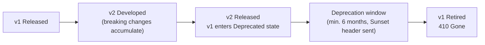

### 4.4 Deprecation Communication

- A deprecated version returns a `Sunset` header (RFC 8594) with the retirement date on every response.
- A `Deprecation: true` header is added alongside `Sunset`.
- Deprecation is announced in this document's changelog (§33.3) at least 6 months before retirement.


---

## 5. URL Structure

### 5.1 Anatomy

```
https://api.elevatetuitions.com/api/v1/{module}/{resource}[/{id}[/{sub-resource}[/{sub-id}]]]
```

Examples:

```
/api/v1/classes/batches/482/timetable
/api/v1/learning/assignments/1091/submit
/api/v1/payments/invoices/77/refund
/api/v1/storage/files/2201/signed-url
```

### 5.2 Path Segment Rules

| Rule | Example |
|---|---|
| All lowercase | `/enrollments`, not `/Enrollments` |
| Hyphen-case for multi-word path segments (never camelCase/snake_case in the URL itself) | `/signed-url`, `/forgot-password` |
| Resource IDs are the external-facing `uuid` for any resource with a `uuid` column (`users`, `files`, `upload_sessions`); internal auto-increment IDs are never exposed in URLs for those resources (`DATABASE.md` §4.5) | `/users/550e8400-e29b-41d4-a716-446655440000` |
| Resources without a `uuid` column (most junction/child tables) expose their `BIGINT` PK directly, since enumeration risk is mitigated by the mandatory ownership check on every such route | `/learning/assignments/1091` |
| No trailing slashes | `/classes` not `/classes/` |
| No file extensions in the path | `/reports/export` returns a `Content-Disposition` header, not `/reports/export.csv` |

### 5.3 Query String Rules

- Query parameters are `camelCase` (matching the JSON body convention, §6.3): `?sortBy=createdAt&order=desc`.
- Array-valued filters use repeated keys: `?status=active&status=pending_payment`.
- Query parameters never carry authorization-sensitive data (e.g., a role or a "viewAs" override) — authorization is exclusively session-derived (§8).

### 5.4 Full Route Tree

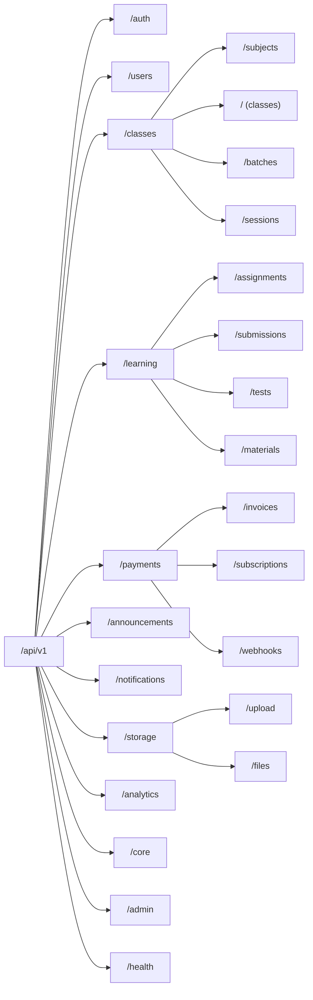


---

## 6. Naming Conventions

### 6.1 General Rule

The API layer translates between the database's `snake_case` (`DATABASE.md` §3) and the JSON wire format's `camelCase` at the repository/DTO boundary. **No `snake_case` ever appears in a JSON request or response body.** This translation is centralized in one mapper per module (`lib/api/mappers/{module}.mapper.ts`), never inlined ad hoc in route handlers.

| Layer | Case Style | Example |
|---|---|---|
| URL path segments | `kebab-case` | `/signed-url` |
| Query parameters | `camelCase` | `?sortBy=dueDate` |
| JSON request/response fields | `camelCase` | `{ "dueDate": "2026-08-01T00:00:00Z" }` |
| MySQL columns (`DATABASE.md`) | `snake_case` | `due_date` |
| HTTP headers | `Kebab-Case` (per RFC convention) | `X-Request-Id` |
| Error codes | `SCREAMING_SNAKE_CASE` | `VALIDATION_ERROR` |
| Enum values on the wire | `snake_case` string (matches DB `ENUM` literal exactly, no translation, since these are already self-documenting) | `"status": "pending_payment"` |

### 6.2 DTO Naming

| Pattern | Example |
|---|---|
| Entity DTO | `StudentDTO`, `InvoiceDTO`, `AssignmentDTO` |
| Create-request DTO | `CreateAssignmentRequest` |
| Update-request DTO | `UpdateAssignmentRequest` (all fields optional — `PATCH` semantics) |
| List-response wrapper | `PaginatedResponse<AssignmentDTO>` |
| Summary/nested DTO (fewer fields than full entity, used when nested inside another resource) | `AssignmentSummaryDTO` |

These DTO names are the exact TypeScript type names shared between frontend and backend in the `types/` package (`PRD.md` §18.2), and map directly to OpenAPI 3.1 `components.schemas` entries (§33.4).

### 6.3 Field Naming Inside DTOs

- Foreign-key fields exposed to the client are named `{resource}Id` (camelCase of the DB's `{resource}_id`), e.g. `batchId`, `studentId`, using the resource's **external UUID** if the referenced table has one, otherwise its numeric ID.
- Boolean fields keep the `is`/`has` prefix from the DB: `isActive`, `isLate`, `hasPaid`.
- Timestamps keep the `At` suffix: `createdAt`, `submittedAt`, `gradedAt` — always ISO-8601 UTC strings (§18).
- Dates (no time component) keep the `Date`/`On` suffix: `dueDate`, `enrolledOn`.
- Money fields are always paired: `amount` (number, 2 decimal places) + `currency` (`CHAR(3)` ISO code) — never a bare unqualified `amount` alone, matching `DATABASE.md` §3.3.


---

## 7. Authentication

### 7.1 Scheme

Stateless **JWT access token + rotating opaque refresh token**, exactly as specified in `DRD.md` §9.1:

| Token | Lifetime | Storage | Contents |
|---|---|---|---|
| Access Token | 15 minutes | `HttpOnly`, `Secure`, `SameSite=Strict` cookie: `elevate_at` | `{ sub: userUuid, role: string, uuid: string, iat, exp }` (HS256-signed) |
| Refresh Token | 7–30 days (configurable, "remember me") | `HttpOnly`, `Secure`, `SameSite=Strict` cookie: `elevate_rt`; only its SHA-256 hash is persisted (`refresh_tokens.token_hash`) | Opaque random 256-bit string — carries no claims |

The **role is never trusted from any client-supplied value** (body, query, header) — it is resolved fresh from `users.role_id` → `roles.name` on every access-token issuance and embedded server-side only (`PRD.md` §17.3, `DATABASE.md` §7.1).

### 7.2 Login Flow

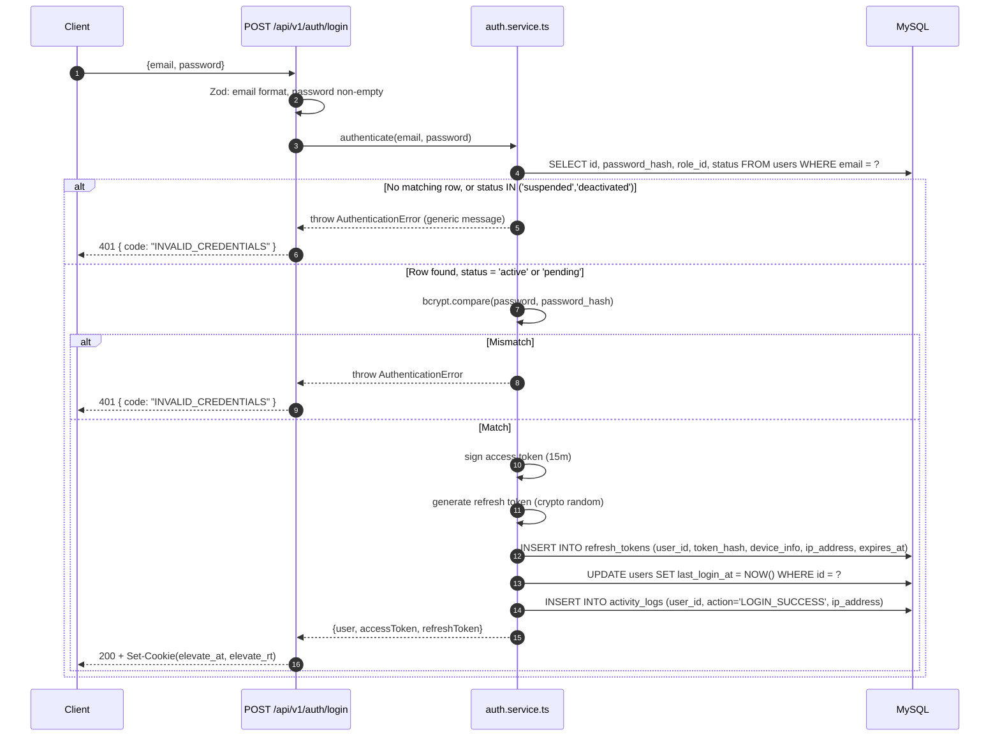

A `suspended` or `deactivated` account receives the same generic `INVALID_CREDENTIALS`/`ACCOUNT_INACTIVE` message pattern as a wrong password — never a distinct "this account is suspended" message, per `PRD.md` §22 ("no leakage of internal status detail").

### 7.3 Token Refresh & Rotation

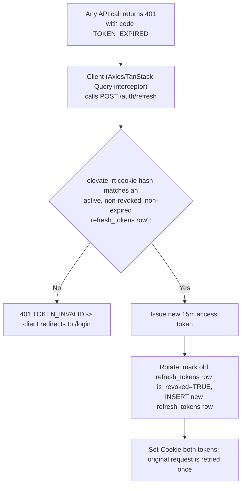

Refresh token **rotation** (issuing a new refresh token on every use and revoking the old one) means a stolen, already-used refresh token is immediately worthless — a hallmark of the OAuth2 refresh-token-rotation best practice.

### 7.4 Logout

`POST /api/v1/auth/logout` marks the current device's `refresh_tokens` row `is_revoked = TRUE` and clears both cookies. `POST /api/v1/auth/logout-all` (available from Profile & Settings, per `PRD.md` §11.9) revokes **every** `refresh_tokens` row for the user — used for the "log out of all devices" security action and automatically triggered by a password change.

### 7.5 OTP Verification

Used for registration email/phone verification, passwordless OTP login (student-only per `PRD.md` §9.2), and password reset. Backed by `otp_verifications`:

- `otp_hash` — never plaintext (`DATABASE.md` §20.2).
- `attempts` — capped at 5 before the OTP is invalidated and a new one must be requested (brute-force mitigation, `PRD.md` §20).
- `expires_at` — 10 minutes for registration/login OTPs, per platform default in `system_config`.
- Hard-deleted by a scheduled job 24h after expiry (`DATABASE.md` §19.5).

### 7.6 Password Reset

`POST /auth/forgot-password` → `password_reset_tokens` row created (hashed token, 1-hour expiry) → email sent with a link containing the raw token → `POST /auth/reset-password {token, newPassword}` validates the hash, sets the new `bcrypt` hash, marks `used_at`, and calls `logout-all` semantics (revokes all refresh tokens) as a security measure.

### 7.7 Session Cookie Attributes

Every session cookie is issued with:

```
Set-Cookie: elevate_at=<jwt>; HttpOnly; Secure; SameSite=Strict; Path=/; Max-Age=900
Set-Cookie: elevate_rt=<opaque>; HttpOnly; Secure; SameSite=Strict; Path=/api/v1/auth; Max-Age=2592000
```

`elevate_rt`'s `Path` is scoped narrowly to `/api/v1/auth` since only the refresh/logout endpoints ever need to read it.


---

## 8. Authorization (RBAC)

### 8.1 Role Definitions

Identical to `DRD.md` §10.1, sourced from the `roles` lookup table:

| Role | `roles.name` | Description |
|---|---|---|
| Student | `student` | Enrolled learner; own classes, assignments, tests, recordings, invoices |
| Teacher | `teacher` | Own batches: schedule, content, assignments, tests, grading, roster |
| Parent *(Phase 2, schema-reserved)* | `parent` | Read-only visibility into linked students only |
| Admin | `admin` | Platform-wide operational access: enrollments, payments, teachers, config |
| Super Admin | `super_admin` | Full system access, including admin/role management and Drive provisioning |

### 8.2 Two-Layer Enforcement

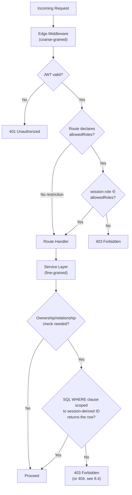

1. **Coarse-grained (middleware):** every route declares its `allowedRoles` set (or `public`); the edge middleware rejects a mismatched role with `403` before the handler runs — cheap, fast.
2. **Fine-grained (service layer):** ownership/relationship checks (a teacher may only grade *their own* batch's submissions; a student may only see *their own* invoices) are enforced as a `WHERE` clause predicate scoped to the session-derived ID — never as an application-level `if` check performed *after* an unscoped query, per the pattern in `DRD.md` §10.3.

### 8.3 Permission Matrix

Reproduced from `DRD.md` §10.2 as the authoritative cross-endpoint reference:

| Resource / Action | Student | Teacher | Parent | Admin | Super Admin |
|---|:---:|:---:|:---:|:---:|:---:|
| View/edit own profile | ✅ | ✅ | ✅ | ✅ | ✅ |
| View linked student's data | ❌ | ❌ | ✅ (own children) | ✅ | ✅ |
| Create/manage classes & batches | ❌ | ✅ (own) | ❌ | ✅ | ✅ |
| Enroll a student | ❌ | ❌ | ❌ | ✅ | ✅ |
| Upload materials/notes | ❌ | ✅ (own batch) | ❌ | ✅ | ✅ |
| Create assignments/tests | ❌ | ✅ (own batch) | ❌ | ✅ | ✅ |
| Submit assignment | ✅ | ❌ | ❌ | ❌ | ❌ |
| Grade submission | ❌ | ✅ (own batch) | ❌ | ✅ | ✅ |
| View own/linked invoices, pay | ✅ | ❌ | ✅ (linked) | ✅ | ✅ |
| Issue refund | ❌ | ❌ | ❌ | ✅ | ✅ |
| View platform-wide analytics | ❌ | ✅ (own batches) | ❌ | ✅ | ✅ |
| Manage user roles | ❌ | ❌ | ❌ | ✅ (limited) | ✅ |
| Configure Drive accounts / system config | ❌ | ❌ | ❌ | ❌ | ✅ |
| Send announcements | ❌ | ✅ (own batch) | ❌ | ✅ (global) | ✅ (global) |

### 8.4 403 vs 404 Disclosure Policy

For resources whose mere existence is sensitive (e.g., another student's assignment submission), a failed ownership check returns **`404 Not Found`**, not `403 Forbidden` — this avoids confirming to an unauthorized caller that a resource with that ID exists at all. For resources whose existence is not sensitive but whose *access* is restricted by role (e.g., an Admin-only configuration endpoint hit by a Student), a role mismatch returns **`403 Forbidden`** with `code: "INSUFFICIENT_ROLE"`. Each endpoint specification in §26 states which of the two applies.

### 8.5 Step-Up Confirmation for Sensitive Admin Actions

Per `PRD.md` §20 ("Admin actions... require re-authentication or step-up confirmation"), the following mutations require the request to include a **fresh** access token (issued within the last 5 minutes) or a `X-Step-Up-Token` header obtained via `POST /auth/step-up {password}`:

- `PUT /admin/pricing/{feePlanId}` (pricing changes)
- `POST /admin/teachers` (teacher account creation)
- `PATCH /users/{id}/role` (role changes)
- `POST /payments/{invoiceId}/refund` (refund issuance)

Requests to these routes without a sufficiently fresh session receive `403 { code: "STEP_UP_REQUIRED" }`.


---

## 9. Request Lifecycle

### 9.1 Full Lifecycle Diagram

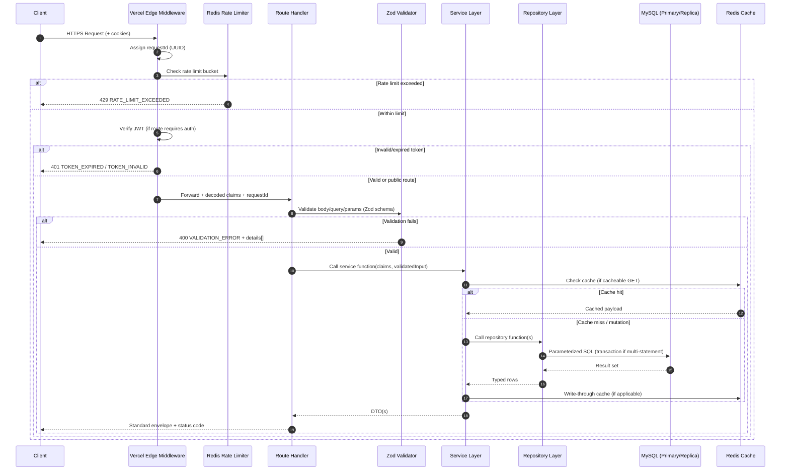

### 9.2 Lifecycle Stages Explained

| Stage | Responsibility | Failure Mode |
|---|---|---|
| Edge Middleware | `requestId` assignment, rate limiting, JWT verification, coarse RBAC | `429`, `401`, `403` |
| Validation | Zod schema on body/query/path params | `400` |
| Service Layer | Business rules, fine-grained ownership, orchestration across repositories/external services | `403`, `404`, `409`, `422` |
| Repository Layer | Parameterized SQL execution, transaction boundaries | `500` (wrapped), `409` (constraint violation) |
| External Services | Google Drive, Payment Gateway, Email/SMS | `502`/`503` (wrapped as `ExternalServiceError`) |

Every stage attaches the same `requestId` to its log lines (`DRD.md` §13.3), enabling full request tracing across application logs, Sentry, and `audit_logs`/`activity_logs`.


---

## 10. Standard Request Headers

| Header | Required | Purpose |
|---|---|---|
| `Content-Type: application/json` | Yes (except multipart uploads) | Body encoding |
| `Cookie: elevate_at=...; elevate_rt=...` | For authenticated routes | Session identity (browser-managed, not manually set by client code) |
| `X-Request-Id` | No (server-generated if absent) | Client may supply its own correlation ID for support/debugging; echoed back in the response |
| `X-Idempotency-Key` | For specific mutating routes flagged in §23.2 | Prevents duplicate processing of retried requests |
| `X-Step-Up-Token` | For sensitive Admin routes (§8.5) | Confirms recent re-authentication |
| `Accept-Language` | No | Reserved for future i18n (`DRD.md` §23.2); defaults to `en-IN` |
| `If-None-Match` | No | Conditional GET against `ETag` for cacheable list endpoints (§14.5) |
| `User-Agent` | Browser-default | Logged in `refresh_tokens.device_info`, `activity_logs.user_agent` |

Webhook-receiving routes (`/payments/webhooks/gateway`) additionally require a gateway-specific signature header (`X-Razorpay-Signature` or `Stripe-Signature`) — see §24.7 and §27.


---

## 11. Standard Response Format

### 11.1 The One True Envelope

Every endpoint, without exception, returns one of exactly two shapes.

**Success:**

```json
{
  "success": true,
  "data": { },
  "meta": {
    "requestId": "3f1a2b7c-9e4d-4a11-8b3a-0c9e7d2f5a61",
    "timestamp": "2026-07-05T09:12:33.104Z",
    "version": "v1"
  }
}
```

**Failure:**

```json
{
  "success": false,
  "error": {
    "code": "VALIDATION_ERROR",
    "message": "The request body failed validation.",
    "details": [
      { "field": "email", "issue": "Must be a valid email address" }
    ]
  },
  "meta": {
    "requestId": "3f1a2b7c-9e4d-4a11-8b3a-0c9e7d2f5a61",
    "timestamp": "2026-07-05T09:12:33.104Z",
    "version": "v1"
  }
}
```

### 11.2 `data` Shape Rules

| Endpoint Type | `data` Shape |
|---|---|
| Single resource (`GET /x/{id}`, `POST /x`, `PATCH /x/{id}`) | The resource DTO object directly: `"data": { "id": "...", ... }` |
| Collection (`GET /x`) | `"data": { "items": [ DTO, DTO, ... ], "pagination": { ... } }` (pagination object per §14) |
| Action with no meaningful resource to return (e.g., `DELETE`, `logout`) | `"data": { "success": true }` or a minimal confirmation object (e.g., `{ "revokedSessions": 3 }`) |
| Aggregate/dashboard endpoints | A named, documented composite object (see each endpoint's Success Response in §26) — never an untyped bag of arbitrary keys |

### 11.3 `meta` Fields

| Field | Always Present | Notes |
|---|---|---|
| `requestId` | Yes | Matches `X-Request-Id` response header; traceable through logs |
| `timestamp` | Yes | Server response time, ISO-8601 UTC |
| `version` | Yes | Current API version serving the request (`"v1"`) |
| `pagination` | List endpoints only | Nested inside `data`, not `meta` — see §14.2 |

### 11.4 Never Deviate

No endpoint returns a bare array, a bare primitive, or an unwrapped object at the top level. No endpoint returns HTTP `200` with `success: false` in the body — the HTTP status code and the `success` flag always agree (§13).


---

## 12. Error Response Standard

### 12.1 Error Taxonomy

Reproduced and extended from `DRD.md` §13.1:

| Error Class | HTTP Status | `code` | Example |
|---|---|---|---|
| `ValidationError` | 400 | `VALIDATION_ERROR` | Malformed request body, bad enum value |
| `AuthenticationError` | 401 | `INVALID_CREDENTIALS` / `TOKEN_EXPIRED` / `TOKEN_INVALID` | Missing/expired/invalid JWT, wrong password |
| `ForbiddenError` | 403 | `INSUFFICIENT_ROLE` / `NOT_OWNER` / `STEP_UP_REQUIRED` | Valid user, insufficient role or ownership |
| `NotFoundError` | 404 | `RESOURCE_NOT_FOUND` | Resource does not exist (or is hidden per §8.4) |
| `ConflictError` | 409 | `DUPLICATE_RESOURCE` / `ALREADY_ENROLLED` / `SCHEDULE_CONFLICT` | Duplicate email, double enrollment, overlapping class slot |
| `UnprocessableEntityError` | 422 | `BUSINESS_RULE_VIOLATION` | Semantically valid but rule-violating request (e.g., grading a submission twice with conflicting rubric state) |
| `RateLimitError` | 429 | `RATE_LIMIT_EXCEEDED` | Too many requests |
| `InternalServerError` | 500 | `INTERNAL_ERROR` | Unhandled exception |
| `ExternalServiceError` | 502 / 503 | `DRIVE_SERVICE_ERROR` / `PAYMENT_GATEWAY_ERROR` | Google Drive or payment gateway failure |

All custom errors extend a base `AppError` class carrying `{ code, httpStatus, message, details }`; a global error-handling wrapper around every route handler converts thrown errors into the standard envelope (`DRD.md` §13.1) so no handler manually constructs an error response.

### 12.2 `details[]` Shape

Used exclusively for `VALIDATION_ERROR` (field-level issues) and `BUSINESS_RULE_VIOLATION` (rule-level issues):

```json
"details": [
  { "field": "dueDate", "issue": "Must be a future date-time" },
  { "field": "attachmentFileId", "issue": "Referenced file does not exist or is not owned by you" }
]
```

For non-field-scoped business errors, `details` is an array of plain rule-violation strings:

```json
"details": ["A live session cannot be scheduled for a teacher who already has an overlapping session."]
```

### 12.3 Conflict vs. Business Rule Errors

| Situation | `code` | Status |
|---|---|---|
| Two teachers' schedule slots overlap | `SCHEDULE_CONFLICT` | 409 |
| Student re-submits a graded assignment (grading is final unless teacher re-opens) | `BUSINESS_RULE_VIOLATION` | 422 |
| Duplicate registration email | `DUPLICATE_RESOURCE` | 409 |
| Attempting to delete a Subject with active enrollments (`PRD.md` §22) | `BUSINESS_RULE_VIOLATION` | 422 |
| Retrying a payment webhook already processed (idempotent no-op, not an error) | — | 200 (see §23) |

### 12.4 Error Message Content Rules

- `message` is a human-readable, **non-technical** sentence safe to show a Student/Teacher/Parent — never a raw SQL error, stack trace, or internal identifier.
- Internal detail (SQL error text, third-party gateway raw response) is logged server-side (`activity_logs`/Sentry) with the `requestId`, never echoed to the client.
- Account-status leakage is explicitly avoided (`PRD.md` §22): a suspended account's login failure uses the same `INVALID_CREDENTIALS` message and code as a wrong password.


---

## 13. HTTP Status Code Guidelines

| Code | Meaning | Used For |
|---|---|---|
| `200 OK` | Success, resource returned | `GET`, successful `PATCH`/`PUT`, actions like `join`/`publish` |
| `201 Created` | New resource created | `POST /auth/register`, `POST /classes`, `POST /learning/assignments` |
| `202 Accepted` | Async operation queued, not yet complete | `POST /analytics/aggregate` (cron-triggered rollup), large resumable upload initiation |
| `204 No Content` | Success, nothing to return | `DELETE` operations where no confirmation body is needed *(this platform prefers §11.2's minimal confirmation body over bare 204 for consistency with the single envelope rule — 204 is reserved for `OPTIONS`/CORS preflight only)* |
| `400 Bad Request` | Validation failure | Malformed body/query |
| `401 Unauthorized` | Missing/invalid/expired auth | No cookie, bad password, expired access token |
| `403 Forbidden` | Authenticated but not authorized | Wrong role, not the resource owner, step-up required |
| `404 Not Found` | Resource doesn't exist (or hidden per §8.4) | Bad ID, or existence-sensitive ownership mismatch |
| `409 Conflict` | State conflict | Duplicate unique key, double-enrollment, schedule overlap |
| `422 Unprocessable Entity` | Semantically invalid business state | Rule violation despite valid shape |
| `429 Too Many Requests` | Rate limit hit | See §22 |
| `500 Internal Server Error` | Unhandled server fault | Bug, unexpected exception |
| `502 Bad Gateway` / `503 Service Unavailable` | Upstream dependency failure | Google Drive down, payment gateway timeout |

**Rule:** the `success` boolean in the body and the HTTP status code are always redundant with each other — a client that only checks one will never be misled.


---

## 14. Pagination Standards

### 14.1 Request Parameters

| Param | Type | Default | Max | Notes |
|---|---|---|---|---|
| `page` | integer | `1` | — | 1-indexed |
| `limit` | integer | `20` | `100` | Requests above 100 are clamped, not rejected |

Example: `GET /api/v1/classes/batches/482/enrollments?page=2&limit=50`

### 14.2 Response Shape

```json
{
  "success": true,
  "data": {
    "items": [ /* DTOs */ ],
    "pagination": {
      "page": 2,
      "limit": 50,
      "total": 483,
      "totalPages": 10
    }
  },
  "meta": { }
}
```

### 14.3 Pagination Strategy by Table Size

| Table Size | Strategy | Rationale |
|---|---|---|
| Small/medium (`subjects`, `classes`, `batches`, roster-scale `enrollments`) | Offset (`LIMIT`/`OFFSET`) | Simplicity; page-jump navigation needed in Admin UI |
| Very high-growth (`notifications`, `activity_logs`, `file_access_logs`) | Keyset (cursor on `id`/`created_at`) exposed as an opaque `cursor` param alongside `page`-style params for API symmetry | Avoids `OFFSET` performance cliff at depth (`DATABASE.md` §19.2) |

For keyset-paginated endpoints, the response additionally includes `"nextCursor": "eyJpZCI6NDQyfQ=="` in the `pagination` object; the client passes `?cursor=...` instead of `page` for subsequent pages. `page`/`cursor` are mutually exclusive; supplying both returns `400 VALIDATION_ERROR`.

### 14.4 Consistency Rule

Every single list endpoint in this document, regardless of module, returns the identical `{ items, pagination }` shape — there is no endpoint-specific pagination wrapper anywhere in the API.

### 14.5 Caching Interplay

Cacheable list endpoints (§16.4, semi-static resources) include an `ETag` header computed from the underlying data's last-modified watermark; a repeat request with a matching `If-None-Match` header receives `304 Not Modified` with an empty body.


---

## 15. Sorting Standards

### 15.1 Parameters

| Param | Type | Default | Notes |
|---|---|---|---|
| `sortBy` | string (allow-listed field name per endpoint) | Endpoint-specific — documented per endpoint in §26 | Only `camelCase` DTO field names are accepted, never raw SQL column names or expressions (prevents SQL-injection-via-`ORDER BY` and enumeration of internal schema) |
| `order` | `asc` \| `desc` | `desc` for time-ordered resources (`createdAt`), `asc` for naturally-ordered resources (`sequenceNo`, `dayOfWeek`) | |

Example: `GET /api/v1/learning/assignments?batchId=482&sortBy=dueDate&order=asc`

### 15.2 Allow-Listing

Every endpoint declares an explicit allow-list of sortable fields (never "any column"), matching an existing index where the field is commonly sorted at scale (`DATABASE.md` §10.3):

| Resource | Sortable Fields | Backing Index |
|---|---|---|
| `assignments` | `dueDate`, `createdAt` | `idx_assign_due` |
| `live_sessions` | `scheduledStart` | `idx_ls_scheduled_start` |
| `tests` | `scheduledAt` | `idx_tests_scheduled` |
| `invoices` | `dueDate`, `createdAt`, `status` | `idx_inv_status` |
| `notifications` | `createdAt` | `idx_notif_user_unread` (covers `createdAt` ordering within the `user_id` scope) |
| `activity_logs` (Admin) | `createdAt` | `idx_al_created` |

Requesting an unlisted `sortBy` value returns `400 VALIDATION_ERROR` with `details: [{ field: "sortBy", issue: "Must be one of: dueDate, createdAt" }]`.

### 15.3 Stable Secondary Sort

Every sorted list additionally sorts by `id ASC` as a tiebreaker, guaranteeing stable pagination even when the primary sort key has duplicate values (e.g., two assignments due at the exact same timestamp).


---

## 16. Filtering Standards

### 16.1 Convention

Filters are plain query parameters matching a DTO field name; multiple values for the same filter are repeated keys and are combined with `OR`; multiple *different* filters are combined with `AND`:

```
GET /api/v1/payments/invoices?status=pending&status=overdue&studentId=550e8400-...
```

→ `WHERE (status IN ('pending','overdue')) AND student_id = ?`

### 16.2 Allow-Listed Filters Per Resource

| Resource | Filters | Maps To |
|---|---|---|
| `enrollments` (Admin roster) | `status`, `classId`, `batchId` | `DATABASE.md` §9.3, `idx_enroll_status`, `idx_enroll_batch` |
| `assignments` (Student view) | `status` (derived: `pending`\|`submitted`\|`graded`\|`overdue`, computed per `DATABASE.md` §23.5 query pattern, not a stored column) | Computed in the service layer, not a raw `WHERE` |
| `invoices` | `status` | `idx_inv_status` |
| `transactions` (Admin) | `status`, `gateway` | `idx_txn_status` |
| `files` (storage/my-uploads) | `fileCategory` | `idx_files_category` |
| `announcements` | `scope` (`global`\|`batch`\|`user`, resolved server-side to the caller's visible set — never an arbitrary caller-supplied scope+ID) | `announcement_targets` |
| `notifications` | `isRead` | `idx_notif_user_unread` |

### 16.3 Derived-Status Filters

Some filters (notably `assignments?status=`) filter on a **computed** value that does not exist as a stored column — e.g., "overdue" means `due_date < NOW()` AND no submission row exists. These are implemented as a `CASE` expression in the repository query (see `DATABASE.md` §23.5 for the canonical SQL pattern) and documented per-endpoint in §26 with their exact derivation logic, since a frontend engineer needs to know the derivation to build matching client-side filter chips (`UIDS.md` §16 "Filtering/Sorting").

### 16.4 Cacheability

Filters on genuinely static/semi-static resources (`subjects`, `classes` list, `fee_plans`) are cached in Redis keyed by the full filter+sort+page query string, with a 5–15 minute TTL and explicit invalidation on any Admin write to that resource (`DRD.md` §15, `DATABASE.md` §19.4). Filters on transactional, per-user resources (`invoices`, `assignments`, `notifications`) are never cached — they always read live from MySQL (primary for anything checkout/grading-adjacent, replica for pure reporting reads, per `DATABASE.md` §19.6).

### 16.5 Rejected Filter Values

An unrecognized filter key is silently ignored (never an error) to keep the API forward-compatible with additive frontend changes; an unrecognized *value* for a known `ENUM`-backed filter (e.g., `status=bogus`) returns `400 VALIDATION_ERROR`.


---

## 17. Searching Standards

### 17.1 Scope

Full-text search is intentionally **not** implemented via MySQL `FULLTEXT` indexes in Phase 1 (`DATABASE.md` §10.3 — "low query volume vs. index write cost"). Search is implemented as:

| Search Surface | Mechanism | Endpoint |
|---|---|---|
| Admin student/user search | `LIKE '%term%'` against `full_name`, `email`, `phone` behind a debounced client, capped to indexed-prefix-friendly patterns where possible; acceptable at current row-count scale, revisited per `DATABASE.md` §10.3 note if it becomes a hot path | `GET /users?search=` |
| Subject/class selector (public + dashboard) | Client-side filtering of a small, cached, already-fetched list (`UIDS.md` §16 "Instant client-side filtering for small sets") | No dedicated search endpoint — filtering happens client-side against `GET /classes/subjects` |
| Announcement/notification search | Not implemented Phase 1 (low priority; chronological browsing suffices per PRD scope) | — |

### 17.2 `search` Query Parameter

Where search exists, it uses a single `search` query parameter (never a separate `/search` sub-resource per resource, to keep the pattern uniform):

```
GET /api/v1/users?search=ananya&role=student&page=1&limit=20
```

### 17.3 Future Full-Text Search

If search volume grows, `DATABASE.md` §10.3 already documents the addition path (MySQL 8 generated columns + `FULLTEXT`, or an external search service). No schema change is required to add this later — see §34.


---

## 18. Date & Time Standards

| Rule | Detail |
|---|---|
| Wire format | ISO-8601 with explicit UTC offset (`Z`), e.g. `"2026-07-05T09:12:33.104Z"` for `DATETIME` fields; `"YYYY-MM-DD"` for `DATE` fields (`dueDate`, `enrolledOn`) |
| Storage | All `DATETIME` columns store UTC (`DATABASE.md` §3.12); the API layer never accepts or returns a non-UTC-qualified datetime string |
| Display conversion | The **client** converts UTC → `Asia/Kolkata` (IST) for display, matching `DRD.md` §23.2 internationalization readiness — the API never performs timezone conversion server-side |
| Request body datetimes | Accepted as ISO-8601; any timezone offset in the request is normalized to UTC before persistence; a bare date-time with no offset is rejected with `400 VALIDATION_ERROR` (ambiguous timezone is never silently assumed) |
| Relative/derived fields | Fields like `isLate`, `derivedStatus` are computed server-side against `NOW()` in UTC at request time — never computed client-side and trusted |
| Durations | Expressed in whole minutes/seconds as integers (`durationMinutes`, `durationSeconds`), never as strings requiring client-side parsing |


---

## 19. Currency Standards

| Rule | Detail |
|---|---|
| Storage | `DECIMAL(10,2)` in MySQL (`DATABASE.md` §1 reconciliation note — supersedes PRD's integer-paise sketch while remaining numerically equivalent) |
| Wire format | Every monetary value is serialized as a **JSON number with exactly 2 decimal places of precision** (e.g., `1500.00`), always paired with a sibling `currency` field (`CHAR(3)` ISO 4217, always `"INR"` in Phase 1) |
| Never a bare `amount` | Per `DATABASE.md` §3.3, no DTO ever has an unqualified `amount` without an accompanying `currency` — future multi-currency support requires no schema or DTO shape change, only a new `currency` value |
| Server-side computation authority | All totals (pricing calculator, checkout summaries, invoice amounts) are computed server-side from `fee_plans.amount` at request time; a client-submitted total is accepted only as an optimistic display value and is **always recomputed and overwritten** server-side before persistence (`PRD.md` §21 Acceptance Criterion 8) |
| Rounding | Standard half-up rounding to 2 decimal places for any derived calculation (e.g., pro-rated refunds); no floating-point arithmetic is performed on monetary values in application code — all math uses a fixed-point decimal library (`decimal.js` or equivalent) to avoid the exact class of float rounding error `DATABASE.md` §1 flags as a motivation for `DECIMAL` storage |


---

## 20. File Upload Standards

### 20.1 Overview

All binary content is stored on **Google Drive** across 19 sharded accounts; MySQL's `files` table is the exclusive metadata registry (`DATABASE.md` §15, §16; `DRD.md` §8). The API layer never stores bytes and never proxies large media through a Next.js serverless function body (memory/execution-time constraints, `DRD.md` §22).

### 20.2 Upload Categories, Limits & Routing

Reproduced from `DRD.md` §22:

| Category | Max Size | Allowed MIME Types | Target Drive | `files.file_category` |
|---|---|---|---|---|
| Profile photo | 5 MB | `image/jpeg`, `image/png`, `image/webp` | Drive 1 | `profile_photo` |
| Notes / PDFs | 50 MB | `application/pdf` | Drive 1 | `note` / `pdf` |
| Assignment submissions | 25 MB | `application/pdf`, `image/*`, `application/msword`, `.docx` | Drive 1 | `assignment` |
| Solutions | 50 MB | `application/pdf` | Drive 1 | `solution` |
| Website assets | 10 MB | `image/*`, `image/svg+xml` | Drive 1 | `asset` |
| Live class recordings | Provider limit (chunked/streamed) | `video/mp4`, `video/webm` | Drives 2–19 (sharded by Class+Subject) | `recording` |

### 20.3 Presigned / Resumable Upload Flow

Two upload modes exist, both converging on the same `files` metadata write:

**Mode A — Direct multipart (small files: photos, PDFs, assignment submissions):**

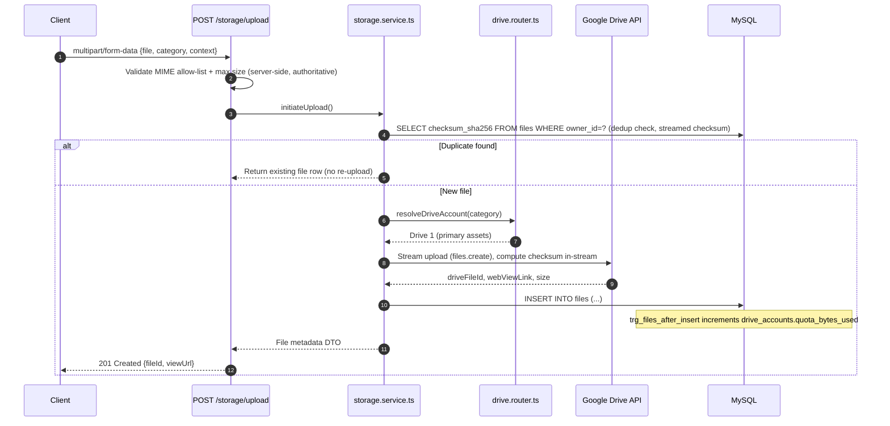

**Mode B — Resumable session (large files: recordings):**

```mermaid
sequenceDiagram
    autonumber
    participant Caller as Client / Meeting-Provider Webhook Relay
    participant API as POST /storage/upload-sessions
    participant SVC as storage.service.ts
    participant ROUTER as drive.router.ts
    participant GD as Google Drive API
    participant DB as MySQL

    Caller->>API: POST {category:'recording', classId, subjectId, fileName, mimeType, sizeBytes}
    API->>ROUTER: resolveDriveAccount(classId, subjectId) — sharding algorithm (DATABASE.md §16.2)
    ROUTER-->>API: drive_account_id
    API->>GD: Create resumable session
    GD-->>API: resumable_uri
    API->>DB: INSERT INTO upload_sessions (uuid, initiated_by, drive_account_id, resumable_uri, status='initiated')
    API-->>Caller: 202 Accepted {uploadSessionId, resumableUri, chunkSizeBytes}
    loop Chunked PUT (client streams directly to Google, never through Next.js)
        Caller->>GD: PUT chunk with Content-Range
        GD-->>Caller: 308 Resume Incomplete (or 200/201 on final chunk)
    end
    Caller->>API: POST /storage/upload-sessions/{id}/complete {driveFileId, checksum}
    API->>DB: INSERT INTO files (...); UPDATE upload_sessions SET status='completed'
    API-->>Caller: 201 Created {fileId}
```

### 20.4 Retry Semantics

- **Mode A** failures (network drop mid-multipart) are safe to retry wholesale — the dedup check (§20.6) means a successful retry after a failed attempt never creates a duplicate `files` row once the first attempt's bytes did land, and creates exactly one row if the first attempt never completed.
- **Mode B** failures resume from the last acknowledged byte offset using Google's resumable-upload protocol (`PUT` with `Content-Range`, receiving `308 Resume Incomplete` with the byte offset to continue from) — the client never restarts a multi-gigabyte recording from zero due to a transient network blip.
- An `upload_sessions` row stuck in `initiated`/`in_progress` for more than 24 hours is marked `expired` by a scheduled job and its resumable URI is abandoned (`DATABASE.md` §19.5).

### 20.5 Virus Scan Placeholder

A `POST /storage/upload` request passes through a virus-scan hook (`DRD.md` §14 "Content Security") **before** the Drive upload begins: `scanFileStream(buffer): Promise<'clean'|'infected'|'unknown'>`. In Phase 1 this hook is a documented no-op interface (always returns `'clean'`) ready to be backed by a real AV engine (e.g., ClamAV via a serverless-compatible API) without any route contract change — the route already returns `422 { code: "FILE_REJECTED_AV_SCAN" }` as a defined-but-currently-unreachable response for when the hook is wired to a real scanner.

### 20.6 Deduplication

Per `DATABASE.md` §7.4 and §8.5: `checksum_sha256` is computed **during** the upload stream (never requiring a second full read of the file). If a row already exists with the same `checksum_sha256` **and** the same `owner_id`, the upload endpoint returns the **existing** file's metadata with `201 Created` and a `deduplicated: true` flag in the response body, rather than creating a new Drive object and a new `files` row.

### 20.7 Thumbnail Generation

For `profile_photo` and `asset` categories, a thumbnail (`{fileId}_thumb.webp`, 256×256, generated via `sharp` in the same serverless function before the Drive upload) is uploaded alongside the original and its Drive file ID stored in `files.web_view_link`'s companion field is **not** a separate column in Phase 1 — the thumbnail is a second `files` row with `file_category = 'asset'` and a `drive_folder_path` suffix of `/thumbnails/`, linked back to the original via the DTO layer (`GET /storage/files/{id}` response includes an optional `thumbnailUrl` resolved by convention, not a new FK). Recordings and PDFs do not receive generated thumbnails in Phase 1 — recording cards use a static play-overlay per `UIDS.md` §10 "Video/Recording Player Card", not a real video-frame thumbnail.

### 20.8 Progress Tracking

For Mode B resumable uploads, progress is tracked **client-side** against the byte offset returned by Google's `308 Resume Incomplete` responses — the API does not need a separate polling endpoint, since the resumable protocol itself is the source of truth for "how many bytes have landed." `GET /storage/upload-sessions/{id}` is provided as a convenience for a client that reloads mid-upload and needs to resume from a stored `resumable_uri`.

### 20.9 Quota Handling

`drive_accounts.quota_bytes_used` is maintained automatically via `trg_files_after_insert`/`trg_files_after_soft_delete` (`DATABASE.md` §12.2) — the upload endpoint never manually increments/decrements quota in application code, eliminating any drift risk between the trigger and a forgotten manual update. Before routing a **new** recording upload, `drive.router.ts` checks the target drive's utilization against the 90% threshold (`DATABASE.md` §16.2) and rebalances to the next least-utilized Drive 2–19 if exceeded — this check happens inside the same transaction that creates the `upload_sessions` row (`SELECT ... FOR UPDATE` on the candidate `drive_accounts` row, per `DATABASE.md` §11.4 lock-ordering rule).

### 20.10 Google Drive Routing Logic (19-Account Sharding)

Full detail in `DATABASE.md` §16.2 and `DRD.md` §8.2; summarized for API consumers:

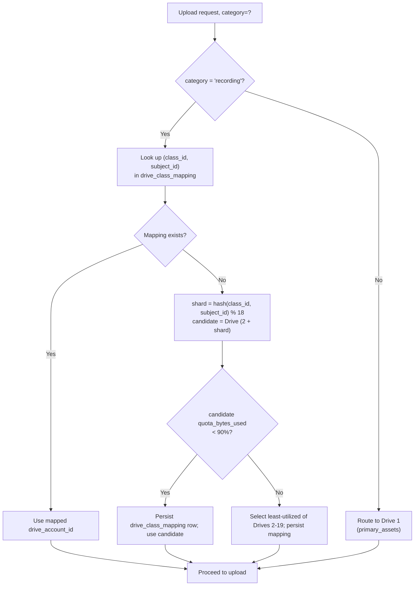

### 20.11 File Access Control

No Drive object is ever made "anyone with link" public (`DATABASE.md` §15, §16.4). Every file read goes through `GET /storage/files/{id}/signed-url`, which:

1. Re-derives the caller's identity from the session (never a client-supplied user ID).
2. Runs an entitlement query joining `files` → owning context (`materials.batch_id` → `enrollments`, or `assignment_submissions.student_id = session.userId`, or `users.avatar_file_id = files.id AND files.owner_id = session.userId`, depending on the file's role) to confirm the caller is entitled.
3. Issues either a short-lived signed URL or a per-request Drive `viewer` permission grant, expiring in a configurable N minutes (default 15).
4. Logs the access in `file_access_logs (file_id, accessed_by, action, ip_address)`.

A caller not entitled receives `404 RESOURCE_NOT_FOUND` (not `403`, per §8.4 — file existence is sensitive).

### 20.12 Streaming Downloads

See §29 for the full streaming contract. In summary: the API never proxies file bytes through itself for anything beyond a few KB; it returns a signed URL and the client's browser fetches directly from Google Drive.


---

## 21. Validation Standards

### 21.1 Strategy

Every request body, query parameter set, and path parameter set is validated by a **Zod schema** before reaching business logic (`DRD.md` §13.2). Client-side validation (React Hook Form + Zod, sharing the *same* schema definitions via the `types/` package) is UX-only and never trusted alone — server-side validation is authoritative on every request, including ones originating from the platform's own first-party client.

### 21.2 Validation Layers

| Layer | What It Checks | Failure Response |
|---|---|---|
| Shape/type (Zod) | Field presence, type, format (email regex, ISO date), enum membership, string length, numeric range | `400 VALIDATION_ERROR` |
| Referential existence | Does a supplied foreign key (e.g., `batchId`) exist at all? | `400 VALIDATION_ERROR` (treated as a malformed reference, not a business rule) or `404` if the ID is path-level |
| Ownership/authorization | Does the caller have rights over the referenced entity? | `403`/`404` per §8.4 |
| Business rule | Domain-specific constraints (schedule overlap, duplicate enrollment, late submission window) | `409`/`422` per §12.3 |

### 21.3 Common Field Validation Rules

| Field Pattern | Rule |
|---|---|
| `email` | RFC 5322-conformant pattern, max 190 chars (matches `users.email VARCHAR(190)`) |
| `phone` | E.164-normalized before validation completes (`+91XXXXXXXXXX`); stored normalized |
| `password` (registration/reset) | Minimum 8 characters, at least one letter and one number; strength meter is client-side UX, but the minimum is server-enforced |
| Monetary amounts (client-submitted, advisory only) | Non-negative, ≤ 2 decimal places; always recomputed server-side regardless (§19) |
| Enum-backed fields | Must exactly match one of the DB `ENUM` literal values — validated against a single shared constant list per module, never hand-duplicated per schema file |
| File uploads | MIME type against the category allow-list (§20.2), size against the category max, filename sanitized (path traversal characters stripped) before use in `drive_folder_path` |
| Pagination (`page`, `limit`) | Positive integers; `limit` silently clamped to 100 max (§14.1) |
| IDs in path/body | UUID-format validated for `uuid`-keyed resources; positive-integer validated for numeric-PK-keyed resources |

### 21.4 Validation Error Response Example

```json
{
  "success": false,
  "error": {
    "code": "VALIDATION_ERROR",
    "message": "The request body failed validation.",
    "details": [
      { "field": "dueDate", "issue": "Must be an ISO-8601 date-time in the future" },
      { "field": "maxScore", "issue": "Must be greater than 0" }
    ]
  },
  "meta": { "requestId": "...", "timestamp": "...", "version": "v1" }
}
```


---

## 22. Rate Limiting

### 22.1 Limits by Scope

Reproduced from `DRD.md` §17.2, enforced via Redis (Upstash) at the edge middleware:

| Scope | Limit | Algorithm |
|---|---|---|
| Login / OTP request/verify endpoints | 5 requests / 15 min per (IP + email/phone) | Sliding window |
| General authenticated API | 120 requests / min per user | Token bucket |
| Public/unauthenticated API | 30 requests / min per IP | Token bucket |
| File upload endpoints | 10 uploads / min per user | Sliding window |
| Password reset request | 3 requests / hour per email | Sliding window |
| Webhook endpoints (`/payments/webhooks/*`) | Exempt from the above; protected instead by signature verification (§24.7) and, where the provider supports it, an IP allow-list | — |

### 22.2 Response on Limit Exceeded

```json
{
  "success": false,
  "error": {
    "code": "RATE_LIMIT_EXCEEDED",
    "message": "Too many requests. Please try again shortly.",
    "details": []
  },
  "meta": { "requestId": "...", "timestamp": "...", "version": "v1" }
}
```

HTTP status `429`, with a `Retry-After: <seconds>` header indicating when the caller may retry.

### 22.3 Per-Endpoint Rate Limit Tier

Every endpoint specification in §26 states which of the five tiers above applies. Tiers are enforced **per route pattern**, not per exact URL, so `GET /learning/assignments/1091` and `GET /learning/assignments/2044` share the same "general authenticated API" bucket rather than each getting an independent 120/min allowance.

### 22.4 Rate Limiting and Rate-Limit-Exempt Internal Calls

Server-to-server calls (Vercel Cron invoking `/analytics/aggregate`, `/core/purge-expired`) authenticate via `CRON_SECRET` (`DRD.md` §20) rather than a user JWT and are **not** subject to the per-user token bucket — they have their own dedicated, generously-sized bucket to avoid a scheduled job ever self-throttling.


---

## 23. Idempotency

### 23.1 Principle

Any operation that could plausibly be retried by a client, a flaky network, or a webhook redelivery — and where a duplicate execution would cause real-world harm (double charge, double refund, double enrollment, duplicate notification storm) — is made **idempotent**, following one of two patterns:

| Pattern | Used For | Mechanism |
|---|---|---|
| **Natural idempotency via a unique constraint** | Payment webhooks, enrollment creation | A `UNIQUE` DB constraint (`transactions.uq_gateway_txn`, `enrollments.uq_student_batch`) makes a duplicate `INSERT` a no-op (caught and treated as success, not an error) rather than a second row |
| **Client-supplied idempotency key** | Checkout session creation, refund issuance | `X-Idempotency-Key` header; the server stores `(key, response)` pairs in Redis for 24h and replays the stored response verbatim for a repeated key, never re-executing the underlying side effect |

### 23.2 Endpoints Requiring `X-Idempotency-Key`

| Endpoint | Why |
|---|---|
| `POST /payments/checkout` | A client-side retry after a timeout must not create two `transactions` rows / two gateway orders for the same invoice |
| `POST /payments/{invoiceId}/refund` | A retried Admin click must never issue two refunds |
| `POST /classes/batches/{id}/enroll` | A retried Admin enrollment action must not double-bill |

A request to one of these endpoints **without** the header is still accepted (the header is recommended, not universally mandatory, to avoid blocking a frontend that hasn't yet implemented key generation) but loses the replay-safety guarantee beyond what the underlying unique constraint already provides.

### 23.3 Webhook Idempotency (Detailed)

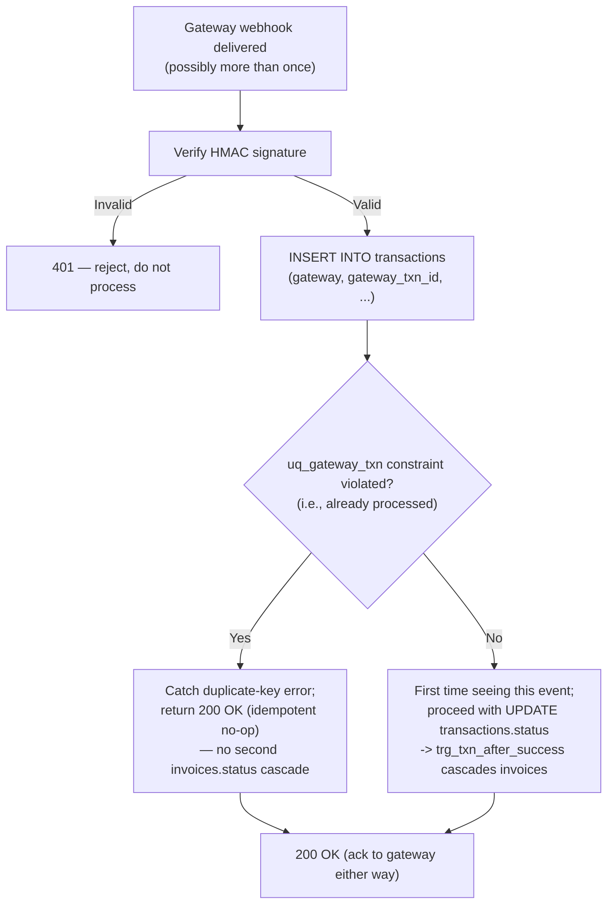

This exact mechanism is what `DATABASE.md` §9.3 and `DRD.md` §11.3 both point to as the idempotency guarantee for the payment flow.

### 23.4 Idempotency Key Response Replay

When a stored idempotency key is matched, the server returns the **exact original response body and status code** (including the original `meta.requestId`, so the client can confirm it received a replay rather than a fresh execution) with an additional `Idempotent-Replayed: true` response header.


---

## 24. API Security

### 24.1 Defense-in-Depth Summary

| Layer | Control |
|---|---|
| Transport | HTTPS enforced everywhere (Vercel default TLS); HSTS header |
| Authentication | JWT (15m access) + rotating refresh tokens; `bcrypt` cost 12 |
| Session Cookies | `HttpOnly`, `Secure`, `SameSite=Strict` (§7.7) |
| CSRF | `SameSite=Strict` cookies are the primary mitigation; a double-submit CSRF token is additionally required on any state-changing request originating from a non-JSON (`multipart/form-data`) form post, since `SameSite` alone does not protect classic HTML form submissions to a different origin in all browser configurations |
| SQL Injection | 100% parameterized queries via `mysql2` placeholders — zero string concatenation into SQL, enforced by CI lint rule (`DATABASE.md` §20.1) |
| XSS | React's default escaping; `dangerouslySetInnerHTML` banned by lint rule except for sanitized rich text (DOMPurify) on announcement/material bodies |
| Output Encoding | All API responses are `application/json` with `Content-Type` explicitly set — never `text/html`, eliminating a whole class of reflected-content risk |
| RBAC | Two-layer enforcement per §8 |
| CORS | `Access-Control-Allow-Origin` restricted to the platform's own domain(s); no wildcard `*` in production |
| Rate Limiting | Redis-backed, per §22 |
| Input Validation | Zod schemas, per §21 |
| Sensitive Headers | `X-Powered-By` and framework-identifying headers stripped; `Server` header does not disclose stack version |
| Replay Attack Protection | Idempotency keys (§23) + refresh-token rotation (§7.3) + short-lived access tokens |
| Brute Force Protection | Rate limiting on auth endpoints (§22.1) + `otp_verifications.attempts` cap (§7.5) |

### 24.2 CSRF Detail

Because the platform's primary interaction pattern is JSON `fetch`/`XHR` from its own first-party Next.js frontend (not classic HTML forms), `SameSite=Strict` on both session cookies already blocks cross-site credentialed requests in all modern browsers. The double-submit token (`X-CSRF-Token` header, matched against a non-`HttpOnly` `csrf_token` cookie) is layered on **only** for the small set of routes that must accept `multipart/form-data` (file uploads), since some legacy form-submission vectors are not fully covered by `SameSite` alone.

### 24.3 XSS Detail

- All user-generated text (announcement bodies, assignment instructions, feedback) is stored as plain `TEXT`/`VARCHAR` — no HTML is stored or rendered as HTML by default.
- Where limited rich text is explicitly supported (announcement body), input is sanitized server-side with an allow-list HTML sanitizer (DOMPurify server build) **before** persistence — not only at render time — so that any other consumer of the same `announcements.body` value (email digest, SMS excerpt) is equally safe.

### 24.4 SQL Injection Detail

```javascript
// Correct — every query in the codebase looks like this
const [rows] = await pool.execute(
  'SELECT * FROM assignments WHERE batch_id = ? AND due_date > ?',
  [batchId, new Date()]
);
```

String-concatenated SQL is a blocked pattern in code review and CI static analysis (`DATABASE.md` §20.1); there is no exception for "trusted" internal values, since `batchId` above still originates from a client-controlled request even when it has passed a numeric-type Zod check.

### 24.5 CORS Policy

| Environment | Allowed Origins |
|---|---|
| Production | `https://elevatetuitions.com`, `https://www.elevatetuitions.com` |
| Preview | The specific Vercel preview URL for that deployment only |
| Development | `http://localhost:3000` |

Webhook-receiving endpoints (`/payments/webhooks/*`) do not evaluate `Origin`/CORS at all — they are server-to-server and rely exclusively on signature verification (§24.7).

### 24.6 Input Validation & Output Encoding Recap

Covered fully in §21 (input) and §11/§12 (output envelope shape, which never echoes raw user input into a context that could be interpreted as markup — every response is `application/json`).

### 24.7 Webhook Signature Verification

Every inbound webhook (`Payment Success`, `Payment Failure`, `Refund` from the gateway; `meeting.started`/`meeting.ended`/`recording.completed` from the meeting provider) is verified via HMAC signature **before** any database write:

```typescript
function verifyGatewayWebhook(rawBody: string, signatureHeader: string): boolean {
  const expected = crypto
    .createHmac('sha256', process.env.PAYMENT_WEBHOOK_SECRET!)
    .update(rawBody)
    .digest('hex');
  return crypto.timingSafeEqual(Buffer.from(expected), Buffer.from(signatureHeader));
}
```

An invalid signature returns `401` immediately, and the raw (unverified) payload is **not** persisted anywhere — only successfully-verified payloads are written to `transactions.raw_payload` for audit (`PRD.md` §20, `DATABASE.md` §7.3).

### 24.8 Replay Attack Protection Detail

- Access tokens are short-lived (15 min) — a captured token has a small blast radius.
- Refresh tokens rotate on every use (§7.3) — a replayed *old* refresh token, once the legitimate client has already rotated past it, is rejected and (as an additional safety measure) triggers revocation of the **entire token family** for that user, since reuse of a rotated-out refresh token is a strong signal of token theft.
- Webhook idempotency (§23.3) means a maliciously or accidentally replayed webhook payload cannot re-trigger a financial side effect.

### 24.9 Brute Force Protection Detail

- Login/OTP endpoints: 5 requests / 15 min per (IP + identifier) (§22.1).
- `otp_verifications.attempts` caps incorrect-OTP guesses at 5 before requiring a fresh OTP request (`DATABASE.md` §7 pattern, `DRD.md` §14).
- Failed login attempts are logged to `activity_logs` (`action = 'LOGIN_FAILED'`) enabling downstream anomaly detection (e.g., alerting on a spike of failures against one account) without needing a dedicated new table.

### 24.10 Least-Privilege Database Access

The application's runtime DB credential has `SELECT/INSERT/UPDATE/DELETE` only — no `DROP`/`ALTER`/`GRANT` (`DATABASE.md` §20.3). Migrations run under a separate, more-privileged CI/CD-only credential, never embedded in the running application. The analytics/reporting connection pool uses a **read-only** DB user, physically incapable of writing even in the presence of an application bug.


---

## 25. Endpoint Categories

Every endpoint in §26 is tagged with exactly one category below, used consistently as the "Category" field in every full endpoint specification:

| Category | Description | Example Modules |
|---|---|---|
| **Public** | No authentication required | Marketing content, subject/pricing lookup, demo booking, registration, login |
| **Identity & Access** | Auth, session, profile, RBAC-adjacent | `auth`, `users` |
| **Learning Structure** | Subjects, classes, batches, enrollment, timetable | `classes` |
| **Live Delivery** | Live sessions, join links, attendance | `classes` (sessions sub-resource) |
| **Assessment** | Assignments, submissions, grading, tests, questions, attempts, results | `learning` |
| **Content** | Materials, recordings | `learning` (materials), `storage` |
| **Billing** | Fee plans, invoices, transactions, subscriptions, refunds | `payments` |
| **Communication** | Announcements, notifications | `announcements`, `notifications` |
| **Storage** | Upload, signed URLs, file lifecycle | `storage` |
| **Analytics & Reporting** | Dashboards, KPIs, exports | `analytics` |
| **Administration** | Platform configuration, teacher/user management, moderation | `admin`-scoped routes across multiple modules |
| **Platform Operations** | Health checks, audit/activity log retrieval, system config | `core` |

This category set is used purely for documentation organization — it has no bearing on RBAC (which is governed exclusively by §8's role matrix) and no bearing on rate-limit tier (governed by §22).


---

## 26. Complete Endpoint Specifications

### 26.1 Documentation Template

Every **full specification** in this section presents exactly the following 24 fields, in this order. Where a field's value is identical across an entire module (e.g., all of Learning's error responses share the same taxonomy), the field states "See §12" (or the relevant cross-cutting section) rather than repeating boilerplate — this is a length optimization, not an information omission, since the referenced section is itself part of this document.

1. **Category** — one of §25's tags
2. **Purpose** — one sentence, business-facing
3. **HTTP Method**
4. **URL**
5. **Authentication Required** — Yes/No
6. **Allowed Roles** — per §8.1, or "Public"
7. **Description** — full behavioral description
8. **Headers** — beyond the standard set in §10
9. **Query Parameters**
10. **Path Parameters**
11. **Request Body Schema**
12. **Validation Rules** — beyond generic §21 rules
13. **Business Rules**
14. **Database Tables Used** — exact `DATABASE.md` table names
15. **Indexes Used** — exact `DATABASE.md` §10.2 index names
16. **Google Drive Interaction** — or "None"
17. **Redis Interaction** — cache/rate-limit/idempotency-key usage, or "None beyond standard rate limiting (§22)"
18. **Service Layer Called** — `{module}.service.ts` function name
19. **Repository Layer Called** — `{module}.repository.ts` function name(s)
20. **Success Response** — status code + example body
21. **Error Responses** — applicable subset of §12.1 with example
22. **Status Codes** — full list this endpoint can return
23. **Rate Limit** — tier per §22.1
24. **Permissions** — ownership/scoping rule beyond the role gate (§8.2 fine-grained layer)
25. **Caching** — policy per §16.4/§15
26. **Audit Logs Generated** — `audit_logs`/`activity_logs` rows, or "None"
27. **Notifications Triggered** — per §28, or "None"
28. **Webhooks Triggered** — per §27, or "None"
29. **Side Effects** — anything not captured above (Drive quota changes, cascading trigger effects)
30. **Sequence Diagram** — for any endpoint with more than one downstream system involved
31. **Notes** — edge cases, future considerations

*(Numbered 1–31 above for authoring clarity; the brief's requested field list is fully covered — several of the brief's items are combined here where they are always answered together, e.g. "Status Codes" is presented as part of the same block as "Error Responses" since they are the same fact expressed two ways.)*


### 26.2 Auth Module (`/api/v1/auth`)

#### 26.2.1 Full Specification — `POST /api/v1/auth/register`

| Field | Value |
|---|---|
| **Category** | Public |
| **Purpose** | Create a new Student account (public self-registration is Student-only per `PRD.md` §9.1 — Teacher/Admin accounts are provisioned by Admin, see §26.3.6) |
| **HTTP Method** | `POST` |
| **URL** | `/api/v1/auth/register` |
| **Authentication Required** | No |
| **Allowed Roles** | Public |
| **Description** | Validates uniqueness of email/phone, hashes the password, creates a `users` row (`role_id` forced server-side to `student` — never accepted from the body) and a linked `student_profiles` row inside one transaction, then issues a registration OTP. |
| **Headers** | Standard only (§10) |
| **Query Parameters** | None |
| **Path Parameters** | None |
| **Request Body Schema** | `{ fullName: string(1..150), email: string(email), phone?: string(E.164), password: string(min 8), grade?: "8"\|"9"\|"10", schoolName?: string }` |
| **Validation Rules** | `email`/`phone` uniqueness pre-checked before OTP is sent, with inline `409` (not deferred to the OTP step), per `PRD.md` §9.1 Acceptance Criteria |
| **Business Rules** | `role_id` is resolved server-side to the `student` role ID and is never accepted from the request body, even if present (silently ignored) — `DATABASE.md` §7.1 business rule |
| **Database Tables Used** | `users`, `student_profiles`, `otp_verifications`, `roles` (lookup) |
| **Indexes Used** | `idx_users_email` (uniqueness pre-check), unique constraints on `users.email`/`users.phone` |
| **Google Drive Interaction** | None |
| **Redis Interaction** | Rate limit bucket only (§22.1, shares the login/OTP tier) |
| **Service Layer Called** | `auth.service.ts#registerUser()` |
| **Repository Layer Called** | `auth.repository.ts#createUser()`, `users.repository.ts#createStudentProfile()`, `auth.repository.ts#createOtp()` |
| **Success Response** | `201 Created` — `{ "success": true, "data": { "userId": "550e8400-...", "verificationRequired": true, "verificationChannel": "email" }, "meta": {...} }` |
| **Error Responses** | `409 { code: "DUPLICATE_RESOURCE", message: "An account with this email already exists." }`; `400 VALIDATION_ERROR` |
| **Status Codes** | `201`, `400`, `409`, `429`, `500` |
| **Rate Limit** | Login/OTP tier — 5 / 15 min per IP+email (§22.1) |
| **Permissions** | N/A (public) |
| **Caching** | None (mutation) |
| **Audit Logs Generated** | `activity_logs (action='REGISTRATION_CREATED', entity_type='users', entity_id=newUserId)` |
| **Notifications Triggered** | Registration verification email (OTP) via `notifications.service.ts` → `notification_deliveries (channel='email')` |
| **Webhooks Triggered** | None |
| **Side Effects** | None beyond the above |
| **Sequence Diagram** | See `DRD.md` §11.1 (reproduced in §7.2 note above for login; registration flow diagram is identical in shape, substituting `INSERT users` + `INSERT student_profiles` for the credential check) |
| **Notes** | The subsequent `POST /auth/verify-otp` call (§26.2.2) is required before login is possible for a `pending` status account; a `pending` user attempting `POST /auth/login` before verification receives `403 { code: "EMAIL_NOT_VERIFIED" }` with a resend-OTP affordance client-side. |

#### 26.2.2 Full Specification — `POST /api/v1/auth/login`

| Field | Value |
|---|---|
| **Category** | Public |
| **Purpose** | Authenticate any role and issue session tokens; single login endpoint for all roles per `PRD.md` §9.2 |
| **HTTP Method** | `POST` |
| **URL** | `/api/v1/auth/login` |
| **Authentication Required** | No |
| **Allowed Roles** | Public |
| **Description** | Full flow diagrammed in §7.2. Resolves role server-side post-authentication; the client never specifies which dashboard it expects — the server's response tells it. |
| **Headers** | Standard only |
| **Query Parameters** | None |
| **Path Parameters** | None |
| **Request Body Schema** | `{ identifier: string (email or E.164 phone), password: string }` — OR, for Student passwordless login: `{ identifier: string, otpLoginRequested: true }` which triggers `POST /auth/otp/request` semantics instead of password comparison |
| **Validation Rules** | `identifier` non-empty; format-detected as email or phone |
| **Business Rules** | `suspended`/`deactivated` accounts fail with the generic `INVALID_CREDENTIALS` code (`PRD.md` §22); `pending` (unverified) accounts fail with `EMAIL_NOT_VERIFIED` |
| **Database Tables Used** | `users`, `refresh_tokens`, `activity_logs` |
| **Indexes Used** | `idx_users_email`, `idx_users_status` |
| **Google Drive Interaction** | None |
| **Redis Interaction** | Rate limit bucket (login/OTP tier) |
| **Service Layer Called** | `auth.service.ts#authenticate()` |
| **Repository Layer Called** | `auth.repository.ts#findUserByIdentifier()`, `auth.repository.ts#createRefreshToken()`, `core.repository.ts#logActivity()` |
| **Success Response** | `200 OK` — `{ "success": true, "data": { "user": { "id": "...", "fullName": "...", "role": "student", "emailVerified": true }, "redirectTo": "/dashboard/student" }, "meta": {...} }` + `Set-Cookie` (§7.7) |
| **Error Responses** | `401 { code: "INVALID_CREDENTIALS" }`; `403 { code: "EMAIL_NOT_VERIFIED" }`; `403 { code: "ACCOUNT_INACTIVE", message: "Account inactive, contact support." }` *(used only for a status the user can plausibly resolve themselves — suspended/deactivated collapses into `INVALID_CREDENTIALS` per PRD §22's stricter no-leakage reading; the two are kept as distinct codes here for correctness but the **message text** is identical and generic for both, satisfying "no leakage of internal status detail" while keeping `code` machine-distinguishable for internal metrics only, never surfaced in UI copy)* |
| **Status Codes** | `200`, `400`, `401`, `403`, `429`, `500` |
| **Rate Limit** | Login/OTP tier |
| **Permissions** | N/A (public) |
| **Caching** | None |
| **Audit Logs Generated** | `activity_logs (action='LOGIN_SUCCESS'|'LOGIN_FAILED')` |
| **Notifications Triggered** | None |
| **Webhooks Triggered** | None |
| **Side Effects** | `users.last_login_at` updated on success |
| **Sequence Diagram** | §7.2 |
| **Notes** | The `redirectTo` field is a UX convenience mirroring `PRD.md` §9.3's role router — the frontend can also independently derive the destination from `user.role`; the field is provided so the client doesn't need a role→route lookup table duplicated from the backend. |

#### 26.2.3 Complete Endpoint Catalog — Auth Module

| Method | Endpoint | Purpose | Auth | Roles | Rate Limit Tier | Idempotent |
|---|---|---|---|---|---|---|
| `POST` | `/auth/register` | Create Student account | No | Public | Login/OTP | No (409 on dup) |
| `POST` | `/auth/verify-otp` | Verify email/phone OTP (registration, 2FA, or reset) | No | Public | Login/OTP | Yes (already-verified is a no-op 200) |
| `POST` | `/auth/otp/request` | Request a login/verification OTP | No | Public | Login/OTP | Yes |
| `POST` | `/auth/login` | Authenticate, issue tokens | No | Public | Login/OTP | No |
| `POST` | `/auth/refresh` | Rotate access token | Refresh cookie | Authenticated | General | Yes (safe to retry) |
| `POST` | `/auth/logout` | Revoke current device session | Yes | Authenticated | General | Yes |
| `POST` | `/auth/logout-all` | Revoke all sessions for the user | Yes | Authenticated | General | Yes |
| `POST` | `/auth/forgot-password` | Send password reset link | No | Public | Password reset (3/hr) | Yes |
| `POST` | `/auth/reset-password` | Set new password via reset token | No | Public | Password reset | No (token single-use) |
| `POST` | `/auth/step-up` | Re-confirm password for a sensitive-action step-up token (§8.5) | Yes | Authenticated | General | Yes |

Every catalog row above follows the template in §26.1 identically to §26.2.1/§26.2.2; the fields that differ are exactly: URL, Request Body Schema (documented inline per row's Purpose), Database Tables Used (all draw from `users`/`refresh_tokens`/`password_reset_tokens`/`otp_verifications` per `DATABASE.md` §7.1), and Business Rules (each described in `DRD.md` §9, §11.1–§11.2 and PRD.md §9, already elaborated in §7 of this document).


### 26.3 Users Module (`/api/v1/users`)

Covers Users, Students, Teachers, Parents, Admins (identity records), Profile, and Settings from the required module list — all backed by `users`, `student_profiles`, `teacher_profiles`, `parent_student_links`, `addresses`, `notification_preferences` per `DATABASE.md` §2.4.

#### 26.3.1 Full Specification — `GET /api/v1/users/me`

| Field | Value |
|---|---|
| **Category** | Identity & Access |
| **Purpose** | Return the authenticated caller's own profile, merged with role-specific profile data |
| **HTTP Method** | `GET` |
| **URL** | `/api/v1/users/me` |
| **Authentication Required** | Yes |
| **Allowed Roles** | Student, Teacher, Parent, Admin, Super Admin (any authenticated role) |
| **Description** | Joins `users` with `student_profiles` or `teacher_profiles` depending on `role_id`, plus `addresses` (default address) and `notification_preferences`. Powers Student §11.9, Teacher §12.10, and the Profile page for every role (`PRD.md`). |
| **Headers** | Standard only |
| **Query Parameters** | None |
| **Path Parameters** | None |
| **Request Body Schema** | N/A |
| **Validation Rules** | N/A |
| **Business Rules** | `userId` is exclusively derived from the JWT session `sub` claim — never from a query/body parameter, eliminating any possibility of viewing another user's profile via this route |
| **Database Tables Used** | `users`, `student_profiles`, `teacher_profiles`, `addresses`, `notification_preferences`, `files` (for `avatarUrl` resolution) |
| **Indexes Used** | Primary key lookups only (`users.id`, `student_profiles.user_id`, `teacher_profiles.user_id` — all indexed via `UNIQUE`) |
| **Google Drive Interaction** | Indirect — if `avatar_file_id` is set, a signed thumbnail URL is resolved via the same entitlement path as §20.11, scoped to "owner may always view their own avatar" |
| **Redis Interaction** | Cached per-user for 60 seconds (short TTL — profile data changes rarely but this endpoint is called on every page load for the header avatar) |
| **Service Layer Called** | `users.service.ts#getOwnProfile()` |
| **Repository Layer Called** | `users.repository.ts#findFullProfileByUserId()` |
| **Success Response** | `200 OK` — `{ "success": true, "data": { "id": "550e8400-...", "fullName": "Ananya Sharma", "email": "...", "phone": "...", "role": "student", "status": "active", "avatarUrl": "https://...", "studentProfile": { "grade": "10", "schoolName": "...", "board": "CBSE" }, "notificationPreferences": { "emailEnabled": true, "smsEnabled": false, "pushEnabled": true } }, "meta": {...} }` |
| **Error Responses** | `401 TOKEN_EXPIRED`/`TOKEN_INVALID` |
| **Status Codes** | `200`, `401`, `500` |
| **Rate Limit** | General authenticated tier |
| **Permissions** | Self-only by construction (no ID param exists on this route) |
| **Caching** | 60s per-user Redis cache, invalidated on any `PATCH /users/me` |
| **Audit Logs Generated** | None (read-only, non-sensitive) |
| **Notifications Triggered** | None |
| **Webhooks Triggered** | None |
| **Side Effects** | None |
| **Sequence Diagram** | Not required (single-hop DB read) |
| **Notes** | `teacherProfile` is included instead of `studentProfile` when `role = 'teacher'`; neither is included for `admin`/`super_admin`. |

#### 26.3.2 Full Specification — `PATCH /api/v1/users/me`

| Field | Value |
|---|---|
| **Category** | Identity & Access |
| **Purpose** | Update the caller's own profile fields (name, phone, role-specific profile attributes, notification preferences) |
| **HTTP Method** | `PATCH` |
| **URL** | `/api/v1/users/me` |
| **Authentication Required** | Yes |
| **Allowed Roles** | Any authenticated role |
| **Description** | Partial update; only supplied fields are changed. Password changes are **not** handled here (see §26.3.3) since they require re-authentication semantics distinct from a profile edit. |
| **Headers** | Standard only |
| **Query Parameters** | None |
| **Path Parameters** | None |
| **Request Body Schema** | `{ fullName?: string, phone?: string, avatarFileId?: string(uuid), studentProfile?: { grade?, schoolName?, board?, dateOfBirth? }, teacherProfile?: { qualification?, experienceYears?, bio? }, notificationPreferences?: { emailEnabled?, smsEnabled?, pushEnabled? } }` |
| **Validation Rules** | `avatarFileId`, if supplied, must reference a `files` row with `owner_id = session.userId` and `file_category = 'profile_photo'` — otherwise `400 { field: "avatarFileId", issue: "File not found or not owned by you" }` |
| **Business Rules** | `role`/`status`/`email` are never editable via this route (email changes require a separate verified-email-change flow, out of Phase 1 scope per `PRD.md` open questions; role changes are Admin-only, §26.3.7) |
| **Database Tables Used** | `users`, `student_profiles` or `teacher_profiles` (whichever applies), `notification_preferences` |
| **Indexes Used** | Primary key lookups |
| **Google Drive Interaction** | None directly (avatar file must already exist via a prior `/storage/upload` call) |
| **Redis Interaction** | Invalidates the 60s profile cache (§26.3.1) for this user |
| **Service Layer Called** | `users.service.ts#updateOwnProfile()` |
| **Repository Layer Called** | `users.repository.ts#updateUser()`, `users.repository.ts#upsertStudentProfile()`/`upsertTeacherProfile()`, `notifications.repository.ts#upsertPreferences()` |
| **Success Response** | `200 OK` — full updated profile, same shape as §26.3.1 |
| **Error Responses** | `400 VALIDATION_ERROR` |
| **Status Codes** | `200`, `400`, `401`, `500` |
| **Rate Limit** | General authenticated tier |
| **Permissions** | Self-only |
| **Caching** | Invalidation only (mutation) |
| **Audit Logs Generated** | `activity_logs (action='PROFILE_UPDATED')` |
| **Notifications Triggered** | None |
| **Webhooks Triggered** | None |
| **Side Effects** | If `teacherProfile` fields change, the public Teacher/About page (`PRD.md` §8.5) reflects the change on next ISR revalidation (no immediate cache bust of the public page in Phase 1 — bounded by the page's existing ISR window) |
| **Sequence Diagram** | Not required |
| **Notes** | This is a `PATCH`, matching §3.3's guidance — sending only `{ "phone": "+919876543210" }` changes exactly that field. |

#### 26.3.3 Full Specification — `GET /api/v1/users`

| Field | Value |
|---|---|
| **Category** | Administration |
| **Purpose** | Admin-facing user search/list across all roles (powers `PRD.md` §13.2 Enrollment Management's student list, and general user administration) |
| **HTTP Method** | `GET` |
| **URL** | `/api/v1/users` |
| **Authentication Required** | Yes |
| **Allowed Roles** | Admin, Super Admin |
| **Description** | Paginated, filterable, searchable list of all `users` rows. |
| **Headers** | Standard only |
| **Query Parameters** | `page`, `limit` (§14); `role` (filter, ENUM); `status` (filter, ENUM); `search` (§17, matches `full_name`/`email`/`phone`); `sortBy` ∈ `{createdAt, fullName}`, `order` |
| **Path Parameters** | None |
| **Request Body Schema** | N/A |
| **Validation Rules** | `role`/`status` must match `roles.name`/`users.status` ENUM values |
| **Business Rules** | None beyond RBAC |
| **Database Tables Used** | `users`, `roles` |
| **Indexes Used** | `idx_users_role`, `idx_users_status` |
| **Google Drive Interaction** | None |
| **Redis Interaction** | Not cached (Admin data must be live) |
| **Service Layer Called** | `users.service.ts#listUsers()` |
| **Repository Layer Called** | `users.repository.ts#findUsers()` |
| **Success Response** | `200 OK` — `{ "data": { "items": [ UserSummaryDTO, ... ], "pagination": {...} } }` |
| **Error Responses** | `403 INSUFFICIENT_ROLE` |
| **Status Codes** | `200`, `400`, `401`, `403`, `500` |
| **Rate Limit** | General authenticated tier |
| **Permissions** | Role-gated only (Admin/Super Admin see all users; no further scoping) |
| **Caching** | None |
| **Audit Logs Generated** | None (read) |
| **Notifications Triggered** | None |
| **Webhooks Triggered** | None |
| **Side Effects** | None |
| **Sequence Diagram** | Not required |
| **Notes** | `UserSummaryDTO` omits `teacherProfile`/`studentProfile` nested detail for list-view performance; `GET /users/{id}` (catalog below) returns the full detail DTO. |

#### 26.3.4 Complete Endpoint Catalog — Users Module

| Method | Endpoint | Purpose | Auth | Roles | Rate Limit Tier | Idempotent |
|---|---|---|---|---|---|---|
| `GET` | `/users/me` | Own profile | Yes | Any | General | Yes |
| `PATCH` | `/users/me` | Update own profile | Yes | Any | General | Yes |
| `POST` | `/users/me/change-password` | Change own password (requires current password) | Yes | Any | General | No |
| `GET` | `/users` | List/search users | Yes | Admin, Super Admin | General | Yes |
| `GET` | `/users/{id}` | Get user by ID (full detail) | Yes | Admin, Super Admin, or self (`id` matches session) | General | Yes |
| `PATCH` | `/users/{id}/role` | Change a user's role | Yes | Super Admin | General + Step-up (§8.5) | Yes |
| `POST` | `/users/{id}/deactivate` | Deactivate account | Yes | Admin, Super Admin | General | Yes |
| `POST` | `/users/{id}/reactivate` | Reactivate a deactivated account | Yes | Admin, Super Admin | General | Yes |
| `GET` | `/users/students/{id}/parents` | List linked parents for a student | Yes | Admin, self (student), linked parent | General | Yes |
| `POST` | `/users/parent-links` | Link a parent account to a student | Yes | Admin, Super Admin | General | No (409 on dup via `uq_parent_student`) |
| `DELETE` | `/users/parent-links/{id}` | Remove a parent-student link | Yes | Admin, Super Admin | General | Yes |
| `GET` | `/users/me/addresses` | List own addresses | Yes | Any | General | Yes |
| `POST` | `/users/me/addresses` | Add an address | Yes | Any | General | No |
| `PATCH` | `/users/me/addresses/{id}` | Update an address | Yes | Self-owner only | General | Yes |
| `DELETE` | `/users/me/addresses/{id}` | Remove an address | Yes | Self-owner only | General | Yes |
| `GET` | `/users/me/dashboard` | Role-aware dashboard aggregate (§30.2) | Yes | Any | General | Yes |
| `GET` | `/users/teachers` | Public list of teachers (Teacher/About page, `PRD.md` §8.5) | No | Public | Public tier | Yes |
| `GET` | `/users/teachers/{id}` | Public teacher profile detail | No | Public | Public tier | Yes |

**Business rule notes for select rows:**
- `PATCH /users/{id}/role`: never accepts a target role of `super_admin` unless the caller is themself `super_admin`; `admin` role changes require Super Admin exclusively (`DRD.md` §10.2 "Manage user roles: Admin (limited)"). Triggers `trg_users_role_audit` automatically (`DATABASE.md` §12.3), which is why this route's "Audit Logs Generated" is *always* populated regardless of application-layer logging — the DB layer guarantees it.
- `POST /users/{id}/deactivate`: sets `users.status = 'deactivated'`, which per `PRD.md` §22 and `DATABASE.md` §4.4 does **not** delete any historical `enrollments`/`invoices` rows — deactivation is reversible via `/reactivate` and preserves all FK-referenced history.
- `GET /users/students/{id}/parents` / `POST /users/parent-links`: Phase 2 feature, schema-reserved today (`PRD.md` §23, `DATABASE.md` §24) — the routes exist and are fully specified now so the frontend's Parent Portal work in Phase 2 requires zero backend contract negotiation, but they return `501 { code: "NOT_YET_ENABLED" }` behind a `system_config` feature flag (`parent_portal_enabled`) until Phase 2 ships.


### 26.4 Classes Module (`/api/v1/classes`)

Covers Subjects, Classes, Batches, Enrollments, Schedules, Live Classes, and Attendance.

#### 26.4.1 Full Specification — `GET /api/v1/classes/subjects`

| Field | Value |
|---|---|
| **Category** | Public |
| **Purpose** | List active subjects, optionally filtered by class/grade level — powers the public Subjects & Classes page (`PRD.md` §8.3) and the pricing calculator (`PRD.md` §8.4) |
| **HTTP Method** | `GET` |
| **URL** | `/api/v1/classes/subjects` |
| **Authentication Required** | No |
| **Allowed Roles** | Public |
| **Description** | Returns the data-driven `subjects` list (never hardcoded, per `PRD.md` §16.3/§21 Acceptance Criterion 3), each annotated with its active `fee_plans` amount for the requested class level so the frontend never hardcodes a price. |
| **Headers** | Standard only |
| **Query Parameters** | `classLevel?: "8"\|"9"\|"10"` (filters to subjects with at least one active `classes` row at that level) |
| **Path Parameters** | None |
| **Request Body Schema** | N/A |
| **Validation Rules** | `classLevel` must be one of the active `classes.level`-adjacent grade values configured in `system_config` |
| **Business Rules** | Only `subjects.is_active = TRUE` AND the joined `classes.is_active = TRUE` rows are returned — a deactivated subject with historical enrollments (`PRD.md` §22 "Attempt to delete a Subject with active enrollments → Blocked; must deactivate") simply disappears from this public list while its historical FK rows remain intact |
| **Database Tables Used** | `subjects`, `classes`, `fee_plans`, `batches` |
| **Indexes Used** | `idx_classes_subject` |
| **Google Drive Interaction** | None |
| **Redis Interaction** | Cached 10 min TTL (semi-static per `DATABASE.md` §19.4), invalidated on any Admin write to `subjects`/`classes`/`fee_plans` |
| **Service Layer Called** | `classes.service.ts#listPublicSubjects()` |
| **Repository Layer Called** | `classes.repository.ts#findActiveSubjectsWithPricing()` |
| **Success Response** | `200 OK` — `{ "data": { "items": [ { "id": "3", "name": "Mathematics", "code": "MATH", "priceMonthly": { "amount": 1500.00, "currency": "INR" } } ] } }` |
| **Error Responses** | `400 VALIDATION_ERROR` (bad `classLevel`) |
| **Status Codes** | `200`, `400`, `500` |
| **Rate Limit** | Public tier (30/min/IP) |
| **Permissions** | N/A |
| **Caching** | 10 min Redis, `ETag` supported |
| **Audit Logs Generated** | None |
| **Notifications Triggered** | None |
| **Webhooks Triggered** | None |
| **Side Effects** | None |
| **Sequence Diagram** | Not required |
| **Notes** | This endpoint deliberately does not require auth, since it must render on the public Pricing/Subjects pages before any login. |

#### 26.4.2 Full Specification — `POST /api/v1/classes/batches/{id}/enroll`

| Field | Value |
|---|---|
| **Category** | Learning Structure |
| **Purpose** | Enroll a student into a batch — the single authoritative entry point for creating/reactivating an `enrollments` row |
| **HTTP Method** | `POST` |
| **URL** | `/api/v1/classes/batches/{id}/enroll` |
| **Authentication Required** | Yes |
| **Allowed Roles** | Admin, Super Admin *(a Student-initiated self-enroll-after-payment path is a distinct internal call made by `payments.service.ts` after a successful checkout — see Notes)* |
| **Description** | Wraps `sp_enroll_student` (`DATABASE.md` §13.1) exactly — atomically creates a new `pending_payment` enrollment or reactivates a `dropped` one, guarded by `SELECT ... FOR UPDATE` against a duplicate-active race (`DATABASE.md` §11.5). |
| **Headers** | `X-Idempotency-Key` recommended (§23.2) |
| **Query Parameters** | None |
| **Path Parameters** | `id` — `batches.id` (`BIGINT`) |
| **Request Body Schema** | `{ studentId: string(uuid) }` |
| **Validation Rules** | `studentId` must reference an existing `users` row with `role = 'student'` |
| **Business Rules** | A student cannot hold two `active` enrollments against batches of the *same subject* (cross-row rule enforced in the service layer via the `SELECT ... FOR UPDATE` guard described in `DATABASE.md` §9.5, since MySQL cannot express this as a single-table `CHECK`) |
| **Database Tables Used** | `enrollments`, `batches`, `classes`, `subjects`, `users` |
| **Indexes Used** | `uq_student_batch` (conflict detection), `idx_enroll_batch` |
| **Google Drive Interaction** | None |
| **Redis Interaction** | Idempotency key store (§23.2) if header supplied |
| **Service Layer Called** | `classes.service.ts#enrollStudent()` (calls `sp_enroll_student`) |
| **Repository Layer Called** | `classes.repository.ts#enrollStudentInBatch()` |
| **Success Response** | `201 Created` (new row) or `200 OK` (reactivated existing row) — `{ "data": { "id": "9021", "studentId": "...", "batchId": "482", "status": "pending_payment", "enrolledOn": "2026-07-05" } }` |
| **Error Responses** | `409 { code: "ALREADY_ENROLLED", message: "Student already has an active enrollment in a batch for this subject." }`; `404` if `batchId`/`studentId` doesn't exist |
| **Status Codes** | `200`, `201`, `400`, `403`, `404`, `409`, `500` |
| **Rate Limit** | General authenticated tier |
| **Permissions** | Admin/Super Admin only via this direct route |
| **Caching** | None (mutation) |
| **Audit Logs Generated** | `audit_logs (action='ENROLLMENT_CREATED', entity_type='enrollments', entity_id=newId, actor_id=adminId)` |
| **Notifications Triggered** | `notifications` row + email/SMS to the student: "You've been enrolled in {subject} — complete payment to activate" |
| **Webhooks Triggered** | None |
| **Side Effects** | Enrollment starts `pending_payment` — it is the subsequent successful `invoices`/`transactions` flow (§26.6) that flips it to `active`, orchestrated in the application layer since the *which fee plan applies* decision is business logic, not a DB-trigger-appropriate cascade (`DATABASE.md` §7.2 business rule) |
| **Sequence Diagram** | `DATABASE.md` §11.5 (`SELECT ... FOR UPDATE` guard) |
| **Notes** | The PRD's self-service flow ("Student selects subject(s) + Pays", `PRD.md` §15.1) is implemented as: `POST /payments/checkout` (§26.6.2) internally creates the `pending_payment` enrollment via this exact same service function before creating the `invoices` row — there is only one enrollment-creation code path in the entire system, called either directly by an Admin or internally by the payments service, guaranteeing the double-booking guard always applies. |

#### 26.4.3 Full Specification — `POST /api/v1/classes/batches/{id}/sessions`

| Field | Value |
|---|---|
| **Category** | Live Delivery |
| **Purpose** | Schedule a live class occurrence for a batch |
| **HTTP Method** | `POST` |
| **URL** | `/api/v1/classes/batches/{id}/sessions` |
| **Authentication Required** | Yes |
| **Allowed Roles** | Teacher (own batch only), Admin, Super Admin |
| **Description** | Creates a `live_sessions` row and, per `DRD.md` §11.4, calls the meeting provider API to create the actual meeting, storing the returned `meeting_url` on the same row. Also supports creating the underlying **recurring** `timetable_slots` pattern in the same request when `recurrence` is supplied (`PRD.md` §12.2 "Calendar interface to create/edit recurring weekly class slots"). |
| **Headers** | Standard only |
| **Query Parameters** | None |
| **Path Parameters** | `id` — `batches.id` |
| **Request Body Schema** | `{ title: string, scheduledStart: ISO-datetime, scheduledEnd: ISO-datetime, provider?: "zoom"\|"google_meet"\|"custom", recurrence?: { dayOfWeek: 0-6, untilDate?: ISO-date } }` |
| **Validation Rules** | `scheduledEnd > scheduledStart` (mirrors `chk_ls_time`); if `recurrence` is supplied, `dayOfWeek` must match `scheduledStart`'s actual weekday |
| **Business Rules** | **Schedule conflict guard**: rejects with `409 SCHEDULE_CONFLICT` if the same `teacher_id` (resolved via `classes.teacher_id` for the batch's class) already has a `live_sessions` row with an overlapping `[scheduled_start, scheduled_end)` window, per `PRD.md` §22 "Two classes overlap for the same teacher → System blocks creation with a conflict warning" |
| **Database Tables Used** | `live_sessions`, `batches`, `classes`, `timetable_slots` (if `recurrence` supplied), `enrollments` (to resolve the notification audience) |
| **Indexes Used** | `idx_ls_batch`, `idx_ls_scheduled_start` (overlap query), `idx_classes_teacher` |
| **Google Drive Interaction** | None (recording ingestion happens later, §26.5's Recordings sub-flow, triggered by a separate webhook) |
| **Redis Interaction** | None beyond rate limiting |
| **Service Layer Called** | `classes.service.ts#scheduleLiveSession()` |
| **Repository Layer Called** | `classes.repository.ts#createLiveSession()`, `classes.repository.ts#findOverlappingSessions()`, `classes.repository.ts#createTimetableSlot()` |
| **Success Response** | `201 Created` — `{ "data": { "id": "5510", "batchId": "482", "title": "Class 10 Mathematics — Live", "scheduledStart": "...", "scheduledEnd": "...", "meetingUrl": "https://meet...", "status": "scheduled" } }` |
| **Error Responses** | `409 { code: "SCHEDULE_CONFLICT", message: "You already have a class scheduled in this time window." }` |
| **Status Codes** | `201`, `400`, `403`, `404`, `409`, `502` (meeting-provider failure), `500` |
| **Rate Limit** | General authenticated tier |
| **Permissions** | Teacher: `classes.teacher_id = session.userId` for the batch's parent class (fine-grained ownership, §8.2/§8.3 pattern in `DRD.md` §10.3) |
| **Caching** | None (mutation); invalidates the batch's timetable cache (§26.4.4) |
| **Audit Logs Generated** | `activity_logs (action='LIVE_SESSION_SCHEDULED')` |
| **Notifications Triggered** | `class_scheduled` notification to every actively-enrolled student in the batch |
| **Webhooks Triggered** | None (outbound call to meeting provider is a synchronous API call, not a webhook) |
| **Side Effects** | Reminder notifications are separately scheduled for 24h and 15m before `scheduled_start` via Vercel Cron (`DRD.md` §11.4) |
| **Sequence Diagram** | `DRD.md` §11.4 (reproduced): Teacher → API → Meeting Provider → DB insert → notify enrolled students → (later) meeting webhooks update `status`/`attendance_records` |
| **Notes** | Rescheduling a single occurrence is `PATCH /classes/sessions/{id}`; cancelling is `PATCH /classes/sessions/{id}` with `{ status: "cancelled", cancellationReason: string }`, which triggers an immediate student notification per `PRD.md` §22 ("Teacher cancels a class < 1 hour before start → Students notified immediately"). |

#### 26.4.4 Complete Endpoint Catalog — Classes Module

| Method | Endpoint | Purpose | Auth | Roles | Rate Limit Tier | Idempotent |
|---|---|---|---|---|---|---|
| `GET` | `/classes/subjects` | List subjects (public) | No | Public | Public | Yes |
| `GET` | `/classes/subjects/{id}` | Subject detail | No | Public | Public | Yes |
| `GET` | `/classes` | List classes (batches join) | Yes | Authenticated | General | Yes |
| `POST` | `/classes` | Create a class (subject+level+teacher) | Yes | Teacher (self as teacher), Admin | General + Step-up for cross-teacher assignment | No |
| `GET` | `/classes/{id}` | Class detail | Yes | Authenticated (enrolled/teaching/Admin) | General | Yes |
| `PATCH` | `/classes/{id}` | Update class (e.g., reassign teacher) | Yes | Admin, Super Admin | General | Yes |
| `POST` | `/classes/{classId}/batches` | Create a batch under a class | Yes | Teacher (own class), Admin | General | No |
| `GET` | `/classes/batches/{id}` | Batch detail | Yes | Enrolled student, teaching Teacher, Admin | General | Yes |
| `PATCH` | `/classes/batches/{id}` | Update batch (capacity, dates, active flag) | Yes | Teacher (own), Admin | General | Yes |
| `POST` | `/classes/batches/{id}/enroll` | Enroll a student (§26.4.2) | Yes | Admin, Super Admin | General | No (409-guarded) |
| `GET` | `/classes/batches/{id}/enrollments` | Roster for a batch | Yes | Teacher (own), Admin | General | Yes |
| `PATCH` | `/classes/enrollments/{id}` | Update enrollment status (drop, complete) | Yes | Admin, Super Admin | General | Yes |
| `GET` | `/classes/batches/{id}/timetable` | Recurring weekly schedule | Yes | Enrolled student, teaching Teacher, Admin | General | Yes |
| `POST` | `/classes/batches/{id}/timetable` | Add a recurring slot | Yes | Teacher (own), Admin | General | No |
| `DELETE` | `/classes/timetable/{id}` | Remove a recurring slot | Yes | Teacher (own), Admin | General | Yes |
| `POST` | `/classes/batches/{id}/sessions` | Schedule a live session (§26.4.3) | Yes | Teacher (own), Admin | General | No (409-guarded) |
| `GET` | `/classes/sessions/{id}` | Session detail | Yes | Enrolled student, teaching Teacher, Admin | General | Yes |
| `PATCH` | `/classes/sessions/{id}` | Reschedule/cancel a session | Yes | Teacher (own), Admin | General | Yes |
| `GET` | `/classes/sessions/{id}/join` | Get join link (join-window gated) | Yes | Enrolled student | General | Yes |
| `GET` | `/classes/sessions/{id}/attendance` | View attendance for a session | Yes | Teacher (own), Admin | General | Yes |
| `POST` | `/classes/sessions/{id}/attendance` | Manual attendance override/correction | Yes | Teacher (own), Admin | General | Yes |
| `GET` | `/classes/batches/{id}/roster` | Roster with attendance/payment-status summary (`PRD.md` §12.8) | Yes | Teacher (own, read-only payment status), Admin | General | Yes |

**Business rule notes for select rows:**
- `GET /classes/sessions/{id}/join`: returns `403 { code: "JOIN_WINDOW_CLOSED" }` outside the configurable join window (default: opens 10 minutes before `scheduled_start`, per `PRD.md` §11.2 and `UIDS.md` §16 "Join button disabled outside the join window"); returns `403 { code: "SUBSCRIPTION_OVERDUE" }` if the student's enrollment's linked subscription/invoice is overdue beyond the grace period (`PRD.md` §22 "Overdue subscription tries to join a live class → Blocked with 'Renew to continue'"), while still allowing access to already-purchased historical content elsewhere in the API (materials/recordings remain visible per §26.5).
- `POST /classes/{classId}/batches` / `POST /classes`: Admin can add a new Class/Subject/Batch without any code deployment (`PRD.md` §21 Acceptance Criterion 6) because `subjects`, `classes`, `batches` are fully data-driven tables — this route is the entire mechanism behind that acceptance criterion.


### 26.5 Learning Module (`/api/v1/learning`)

Covers Assignments, Assignment Submission, Grading, Weekly Tests, Questions, MCQs, Results, Study Materials, and Recordings.

#### 26.5.1 Full Specification — `POST /api/v1/learning/assignments`

| Field | Value |
|---|---|
| **Category** | Assessment |
| **Purpose** | Create a new assignment for a batch |
| **HTTP Method** | `POST` |
| **URL** | `/api/v1/learning/assignments` |
| **Authentication Required** | Yes |
| **Allowed Roles** | Teacher (own batch), Admin, Super Admin |
| **Description** | Creates the `assignments` row; if an `attachmentFileId` is supplied it must already exist (uploaded via `/storage/upload` beforehand) and is linked, never uploaded inline in this request body (multipart is reserved for the storage module per §20). |
| **Headers** | Standard only |
| **Query Parameters** | None |
| **Path Parameters** | None |
| **Request Body Schema** | `{ batchId: string, title: string(1..200), description?: string, attachmentFileId?: string(uuid), dueDate: ISO-datetime, maxScore?: number(default 100.00) }` |
| **Validation Rules** | `maxScore > 0` (mirrors `chk_assign_score`); `dueDate` must be in the future at creation time |
| **Business Rules** | `attachmentFileId`, if supplied, must belong to `owner_id = session.userId` and `file_category` compatible with assignment attachments |
| **Database Tables Used** | `assignments`, `batches`, `files` (existence check), `enrollments` (notification audience) |
| **Indexes Used** | `idx_assign_batch`, `idx_assign_due` |
| **Google Drive Interaction** | None directly (file already uploaded) |
| **Redis Interaction** | None beyond rate limiting |
| **Service Layer Called** | `learning.service.ts#createAssignment()` |
| **Repository Layer Called** | `learning.repository.ts#insertAssignment()` |
| **Success Response** | `201 Created` — `{ "data": { "id": "1091", "batchId": "482", "title": "Quadratic Equations Worksheet 3", "dueDate": "2026-07-12T18:30:00.000Z", "maxScore": 100.00, "attachmentUrl": null } }` |
| **Error Responses** | `400 VALIDATION_ERROR`; `404` if `batchId`/`attachmentFileId` not found or not owned |
| **Status Codes** | `201`, `400`, `403`, `404`, `500` |
| **Rate Limit** | General authenticated tier |
| **Permissions** | Teacher: `classes.teacher_id = session.userId` for the batch's class (fine-grained) |
| **Caching** | None (mutation); invalidates the batch's assignment-list cache if one exists (Phase 1: assignment lists are not cached, since they're per-student computed-status views, §16.3) |
| **Audit Logs Generated** | `activity_logs (action='ASSIGNMENT_CREATED')` |
| **Notifications Triggered** | `assignment_created` notification to every actively-enrolled student in the batch |
| **Webhooks Triggered** | None |
| **Side Effects** | None beyond notification fan-out |
| **Sequence Diagram** | `DRD.md` §11.6 (first half) |
| **Notes** | `attachmentUrl` in the response is `null` in the create response body deliberately — resolving a signed Drive URL happens lazily via `GET /storage/files/{id}/signed-url` (§20.11) only when a client actually needs to render/download it, never eagerly on every assignment list fetch (keeps hot list endpoints cheap). |

#### 26.5.2 Full Specification — `POST /api/v1/learning/assignments/{id}/submit`

| Field | Value |
|---|---|
| **Category** | Assessment |
| **Purpose** | Student submits (or resubmits, pre-grading) an assignment |
| **HTTP Method** | `POST` |
| **URL** | `/api/v1/learning/assignments/{id}/submit` |
| **Authentication Required** | Yes |
| **Allowed Roles** | Student (enrolled in the assignment's batch) |
| **Description** | Requires the file to be uploaded first via `/storage/upload` (category `assignment`); this endpoint links the resulting `fileId` to a new (or, for a pre-grading resubmission, updated) `assignment_submissions` row and computes `is_late` server-side against `NOW() > due_date`. |
| **Headers** | Standard only |
| **Query Parameters** | None |
| **Path Parameters** | `id` — `assignments.id` |
| **Request Body Schema** | `{ fileId: string(uuid) }` — a text-only submission (`PRD.md` §22 "explicit 'text-only' option") is `{ fileId: null, textContent: string }`, requiring at least one of the two per the validation rule below |
| **Validation Rules** | Exactly one of `fileId` or `textContent` must be present — a submission with neither is rejected (`PRD.md` §22 "Student submits with no attachment → Validation error; submission blocked until file attached or explicit text-only option used") |
| **Business Rules** | `uq_assignment_student` means a resubmission before grading is an `UPDATE`, not a new row (`DATABASE.md` §9.3); a resubmission **after** `graded_at IS NOT NULL` is rejected with `422 { code: "BUSINESS_RULE_VIOLATION", message: "This assignment has already been graded. Contact your teacher to reopen it." }` unless the Teacher setting for late-resubmission-after-grading is explicitly enabled (`assignments`-level flag, teacher-configurable per `PRD.md` §22's "teacher setting controls whether late submissions are accepted") |
| **Database Tables Used** | `assignment_submissions`, `assignments`, `files`, `enrollments` (entitlement check) |
| **Indexes Used** | `uq_assignment_student`, `idx_sub_student` |
| **Google Drive Interaction** | None directly at this step (file already landed via `/storage/upload`) |
| **Redis Interaction** | None |
| **Service Layer Called** | `learning.service.ts#submitAssignment()` |
| **Repository Layer Called** | `learning.repository.ts#upsertSubmission()` |
| **Success Response** | `201 Created` (first submission) / `200 OK` (resubmission) — `{ "data": { "id": "8834", "assignmentId": "1091", "studentId": "...", "submittedAt": "...", "isLate": false, "score": null, "feedback": null } }` |
| **Error Responses** | `400 { code: "VALIDATION_ERROR", details: [{ field: "fileId", issue: "Provide either fileId or textContent" }] }`; `403` if not enrolled in the batch; `422 BUSINESS_RULE_VIOLATION` if already graded and reopening isn't enabled |
| **Status Codes** | `200`, `201`, `400`, `403`, `404`, `422`, `500` |
| **Rate Limit** | General authenticated tier |
| **Permissions** | Student must have an `active` enrollment in the assignment's `batch_id` — verified via a `JOIN enrollments` predicate, never a client-supplied flag |
| **Caching** | None |
| **Audit Logs Generated** | `activity_logs (action='ASSIGNMENT_SUBMITTED', entity_id=submissionId)` |
| **Notifications Triggered** | `assignment_submitted` notification to the assignment's `created_by` teacher (feeds their grading queue, `PRD.md` §12.6) |
| **Webhooks Triggered** | None |
| **Side Effects** | None |
| **Sequence Diagram** | `DRD.md` §11.6 (second half) |
| **Notes** | `derivedStatus` (`pending`/`submitted`/`graded`/`overdue`) shown to the student on the Assignments list (`PRD.md` §11.3) is **not** stored — it's computed by `GET /learning/assignments` per the `CASE` expression in `DATABASE.md` §23.5, re-derived on every read against the live `due_date`/`submitted_at`/`score` state. |

#### 26.5.3 Full Specification — `PATCH /api/v1/learning/submissions/{id}/grade`

| Field | Value |
|---|---|
| **Category** | Assessment |
| **Purpose** | Teacher grades a submission with a score and written feedback |
| **HTTP Method** | `PATCH` |
| **URL** | `/api/v1/learning/submissions/{id}/grade` |
| **Authentication Required** | Yes |
| **Allowed Roles** | Teacher (owns the parent assignment's batch), Admin, Super Admin |
| **Description** | Sets `score`, `feedback`, `graded_by`, `graded_at = NOW()` on an `assignment_submissions` row. |
| **Headers** | Standard only |
| **Query Parameters** | None |
| **Path Parameters** | `id` — `assignment_submissions.id` |
| **Request Body Schema** | `{ score: number, feedback: string(1..2000), rubricScores?: { [criterion: string]: number } }` |
| **Validation Rules** | `0 <= score <= assignments.max_score` (looked up server-side, not trusted from the client) |
| **Business Rules** | `feedback` is required, never optional — `UIDS.md` §16 "feedback always paired with the grade (never a bare number)" is enforced server-side, not merely by UI convention |
| **Database Tables Used** | `assignment_submissions`, `assignments` (ownership + `max_score` lookup) |
| **Indexes Used** | Primary key lookup, `fk_sub_assignment` join |
| **Google Drive Interaction** | None |
| **Redis Interaction** | None |
| **Service Layer Called** | `learning.service.ts#gradeSubmission()` |
| **Repository Layer Called** | `learning.repository.ts#updateSubmissionGrade()` (ownership check inline in the `WHERE`, per the exact pattern in `DATABASE.md` §22.4: `UPDATE ... WHERE id = ? AND assignment_id IN (SELECT id FROM assignments WHERE created_by = ?)` generalized to "teacher owns the batch" rather than only "created it personally", to support a second teacher grading on behalf of the batch owner if `teacher_subjects`/permissions allow) |
| **Success Response** | `200 OK` — `{ "data": { "id": "8834", "score": 88.50, "feedback": "Great work on part B, review part D's substitution step.", "gradedAt": "..." } }` |
| **Error Responses** | `400 { field: "score", issue: "Must be between 0 and 100" }` |
| **Status Codes** | `200`, `400`, `403`, `404`, `500` |
| **Rate Limit** | General authenticated tier |
| **Permissions** | Fine-grained: the teacher must own the batch the submission's assignment belongs to |
| **Caching** | None |
| **Audit Logs Generated** | `activity_logs (action='SUBMISSION_GRADED')` |
| **Notifications Triggered** | `assignment_graded` notification to the student |
| **Webhooks Triggered** | None |
| **Side Effects** | Removes the submission from `vw_teacher_grading_queue` (`DATABASE.md` §14.4) since that view's `WHERE su.score IS NULL` predicate no longer matches |
| **Sequence Diagram** | `DRD.md` §11.6 (grading step) |
| **Notes** | `rubricScores`, if supplied, is stored as part of an optional `metadata` extension the DTO reserves for future structured-rubric support — Phase 1 persists it informationally alongside `feedback` text rather than as new normalized columns, since `PRD.md` §12.4 describes rubric scoring as "optional." |

#### 26.5.4 Full Specification — `POST /api/v1/learning/tests`

| Field | Value |
|---|---|
| **Category** | Assessment |
| **Purpose** | Create a weekly test (or monthly/mock/practice) with its full question set in one atomic operation |
| **HTTP Method** | `POST` |
| **URL** | `/api/v1/learning/tests` |
| **Authentication Required** | Yes |
| **Allowed Roles** | Teacher (own batch), Admin, Super Admin |
| **Description** | Wraps a single DB transaction inserting `tests`, then bulk-inserting `test_questions`, then bulk-inserting `test_options` for MCQ questions — matching `DRD.md` §11.7's exact sequence. |
| **Headers** | Standard only |
| **Query Parameters** | None |
| **Path Parameters** | None |
| **Request Body Schema** | `{ batchId: string, title: string, testType?: "weekly"|"monthly"|"mock"|"practice", durationMinutes: number, scheduledAt: ISO-datetime, questions: [ { questionText: string, questionType: "mcq"|"short_answer"|"long_answer", marks: number, sequenceNo: number, options?: [ { optionText: string, isCorrect: boolean } ] } ] }` |
| **Validation Rules** | `totalMarks > 0` and `durationMinutes > 0` (mirrors `chk_tests_marks`); every `mcq`-type question must supply `options` with **exactly one** `isCorrect: true`; `total_marks` is computed server-side as `SUM(questions[].marks)`, never accepted as a separate client-submitted field that could drift from the question set |
| **Business Rules** | `is_published` defaults `FALSE` — students cannot see or attempt a test until `PATCH /learning/tests/{id}/publish` (§26.5 catalog) is called separately, matching `PRD.md` §12.5's two-step "create, then publish" model |
| **Database Tables Used** | `tests`, `test_questions`, `test_options`, `batches` |
| **Indexes Used** | `idx_tests_batch`, `idx_tests_scheduled`, `idx_tq_test`, `idx_topt_question` |
| **Google Drive Interaction** | None (a future "upload question set" convenience import from a spreadsheet is out of Phase 1 scope, per `PRD.md` §12.5 "structured question builder" being the Phase 1 mechanism) |
| **Redis Interaction** | None |
| **Service Layer Called** | `learning.service.ts#createTestWithQuestions()` |
| **Repository Layer Called** | `learning.repository.ts#insertTest()`, `insertTestQuestionsBulk()`, `insertTestOptionsBulk()` — all inside one `START TRANSACTION ... COMMIT` block |
| **Success Response** | `201 Created` — `{ "data": { "id": "220", "batchId": "482", "title": "Week 14 — Trigonometry", "totalMarks": 20.00, "durationMinutes": 30, "scheduledAt": "...", "isPublished": false, "questionCount": 10 } }` |
| **Error Responses** | `400 { field: "questions[3].options", issue: "Exactly one option must be marked correct for an MCQ question" }` |
| **Status Codes** | `201`, `400`, `403`, `404`, `500` |
| **Rate Limit** | General authenticated tier |
| **Permissions** | Teacher owns the batch |
| **Caching** | None |
| **Audit Logs Generated** | `activity_logs (action='TEST_CREATED')` |
| **Notifications Triggered** | None at creation (only at publish, per catalog below) |
| **Webhooks Triggered** | None |
| **Side Effects** | None |
| **Sequence Diagram** | `DRD.md` §11.7 (first block) |
| **Notes** | The full question set is never editable via `PATCH` once **any** `test_attempts` row exists against the test (to protect attempt integrity) — attempting to `PATCH /learning/tests/{id}/questions` after attempts exist returns `422 { code: "BUSINESS_RULE_VIOLATION", message: "Cannot modify questions after students have begun attempting this test." }`. |

#### 26.5.5 Full Specification — `POST /api/v1/learning/tests/{id}/answer`

| Field | Value |
|---|---|
| **Category** | Assessment |
| **Purpose** | Record a student's answer to one question during an in-progress test attempt, with instant MCQ auto-grading |
| **HTTP Method** | `POST` |
| **URL** | `/api/v1/learning/tests/{id}/answer` |
| **Authentication Required** | Yes |
| **Allowed Roles** | Student (with an `in_progress` attempt on this test) |
| **Description** | Inserts a `test_attempt_answers` row. For MCQ questions, `trg_answer_autograde` (`DATABASE.md` §12.4) computes `is_correct` and `marks_awarded` **at the database layer**, at `INSERT` time — the application never independently computes correctness, guaranteeing the DB and the API can never disagree on an MCQ grade. |
| **Headers** | Standard only |
| **Query Parameters** | None |
| **Path Parameters** | `id` — `tests.id` |
| **Request Body Schema** | `{ questionId: string, selectedOptionId?: string, answerText?: string }` |
| **Validation Rules** | `questionId` must belong to this `test_id`; for `mcq` questions, `selectedOptionId` is required and must belong to `questionId`; for `short_answer`/`long_answer`, `answerText` is required |
| **Business Rules** | `uq_attempt_question` means calling this endpoint again for the same question **updates** the prior answer (student changed their mind before submitting) rather than creating a duplicate row — this is an explicit `INSERT ... ON DUPLICATE KEY UPDATE`, not an error |
| **Database Tables Used** | `test_attempt_answers`, `test_attempts` (ownership/status check), `test_questions`, `test_options` |
| **Indexes Used** | `uq_attempt_question` |
| **Google Drive Interaction** | None |
| **Redis Interaction** | None |
| **Service Layer Called** | `learning.service.ts#recordTestAnswer()` |
| **Repository Layer Called** | `learning.repository.ts#upsertAttemptAnswer()` |
| **Success Response** | `200 OK` — `{ "data": { "questionId": "...", "recorded": true } }` — **never** returns `isCorrect`/`marksAwarded` in the immediate response for MCQ answers, so a student cannot infer correctness mid-test by inspecting the network tab; results are only exposed via `GET /learning/tests/{id}/results` (§26.5 catalog) after the teacher publishes results |
| **Error Responses** | `403 { code: "ATTEMPT_NOT_IN_PROGRESS" }` if the attempt has already been submitted/auto-submitted |
| **Status Codes** | `200`, `400`, `403`, `404`, `500` |
| **Rate Limit** | General authenticated tier |
| **Permissions** | The `test_attempts` row must belong to `session.userId` and have `status = 'in_progress'` |
| **Caching** | None |
| **Audit Logs Generated** | None (high-frequency, non-sensitive; captured implicitly via the `test_attempt_answers` rows themselves) |
| **Notifications Triggered** | None |
| **Webhooks Triggered** | None |
| **Side Effects** | None beyond the trigger-computed grading columns |
| **Sequence Diagram** | `DRD.md` §11.7 |
| **Notes** | A scheduled job auto-submits any attempt whose `started_at + duration_minutes` has elapsed without a manual `POST /learning/tests/{id}/submit` (`DRD.md` §11.7 note), setting `status = 'auto_submitted'` — from the student's perspective this is functionally identical to a graceful submit. |

#### 26.5.6 Complete Endpoint Catalog — Learning Module

| Method | Endpoint | Purpose | Auth | Roles | Rate Limit Tier | Idempotent |
|---|---|---|---|---|---|---|
| `POST` | `/learning/assignments` | Create assignment (§26.5.1) | Yes | Teacher (own), Admin | General | No |
| `GET` | `/learning/assignments?batchId=` | List assignments (with derived status) | Yes | Enrolled student, teaching Teacher, Admin | General | Yes |
| `GET` | `/learning/assignments/{id}` | Assignment detail | Yes | Enrolled student, teaching Teacher, Admin | General | Yes |
| `PATCH` | `/learning/assignments/{id}` | Edit assignment (before due date) | Yes | Teacher (own), Admin | General | Yes |
| `DELETE` | `/learning/assignments/{id}` | Remove assignment (no submissions yet) | Yes | Teacher (own), Admin | General | Yes |
| `POST` | `/learning/assignments/{id}/submit` | Submit/resubmit (§26.5.2) | Yes | Student (enrolled) | General | Yes (upsert) |
| `GET` | `/learning/assignments/{id}/submissions` | List submissions for grading | Yes | Teacher (own), Admin | General | Yes |
| `GET` | `/learning/submissions/{id}` | Submission detail | Yes | Owning student, teaching Teacher, Admin | General | Yes |
| `PATCH` | `/learning/submissions/{id}/grade` | Grade a submission (§26.5.3) | Yes | Teacher (own), Admin | General | Yes |
| `POST` | `/learning/tests` | Create test + questions (§26.5.4) | Yes | Teacher (own), Admin | General | No |
| `GET` | `/learning/tests?batchId=` | List tests | Yes | Enrolled student, teaching Teacher, Admin | General | Yes |
| `GET` | `/learning/tests/{id}` | Test detail (questions hidden from students until started) | Yes | Enrolled student, teaching Teacher, Admin | General | Yes |
| `PATCH` | `/learning/tests/{id}` | Edit test metadata (not questions post-attempt, §26.5.4 Notes) | Yes | Teacher (own), Admin | General | Yes |
| `PATCH` | `/learning/tests/{id}/publish` | Publish test to students | Yes | Teacher (own), Admin | General | Yes |
| `POST` | `/learning/tests/{id}/start` | Begin an attempt | Yes | Student (enrolled) | General | No (409 if already attempted, per `uq_test_student_attempt`) |
| `POST` | `/learning/tests/{id}/answer` | Submit one answer (§26.5.5) | Yes | Student (own in-progress attempt) | General | Yes (upsert) |
| `POST` | `/learning/tests/{id}/submit` | Finalize attempt, compute total score | Yes | Student (own in-progress attempt) | General | Yes |
| `GET` | `/learning/tests/{id}/results` | Question-level result breakdown (post-publish only) | Yes | Owning student, teaching Teacher, Admin | General | Yes |
| `PATCH` | `/learning/attempts/{id}/grade` | Manually grade subjective (`short_answer`/`long_answer`) answers | Yes | Teacher (own), Admin | General | Yes |
| `GET` | `/learning/materials?batchId=` | List materials (notes/solutions/pdf/reference) | Yes | Enrolled student, teaching Teacher, Admin | General | Yes |
| `POST` | `/learning/materials` | Upload/link a material | Yes | Teacher (own), Admin | General | No |
| `DELETE` | `/learning/materials/{id}` | Remove a material (soft-delete underlying file) | Yes | Teacher (own), Admin | General | Yes |
| `GET` | `/learning/recordings?batchId=` | List recordings for a batch | Yes | Enrolled student, teaching Teacher, Admin | General | Yes |
| `GET` | `/learning/recordings/{id}` | Recording detail (metadata only; use `/storage/files/{id}/signed-url` to stream) | Yes | Enrolled student, teaching Teacher, Admin | General | Yes |
| `PATCH` | `/learning/recordings/{id}/watched` | Mark watched/resume-position for the current student (`UIDS.md` §16 "resuming playback from last position") | Yes | Enrolled student (own progress) | General | Yes |

**Business rule notes for select rows:**
- `GET /learning/assignments?batchId=` returns `derivedStatus` per student computed exactly per the `CASE` pattern in `DATABASE.md` §23.5: `overdue` (`due_date < NOW()` and no submission), `pending` (not yet due, no submission), `submitted` (submission exists, `score IS NULL`), `graded` (`score IS NOT NULL`) — this powers the filterable list in `PRD.md` §11.3.
- `GET /learning/tests/{id}/results`: returns `403 { code: "RESULTS_NOT_PUBLISHED" }` for a student until `tests.is_published = TRUE` and their own `test_attempts.status` is `submitted`/`auto_submitted`/`graded` — matching `PRD.md` §11.4 "results published" gating and `UIDS.md` §16 "results only visible once teacher publishes."
- `PATCH /learning/recordings/{id}/watched`: this is deliberately **not** stored on the shared `files`/`live_sessions.recording_file_id` row (which is not per-student) — it is stored in a lightweight per-student progress record scoped to `(student_id, recording_file_id)`, distinct from the shared file metadata, since "watched" state is inherently per-viewer.


### 26.6 Payments Module (`/api/v1/payments`)

Covers Payments, Invoices, Transactions, Subscriptions, and Refunds.

#### 26.6.1 Full Specification — `GET /api/v1/payments/pricing`

| Field | Value |
|---|---|
| **Category** | Public |
| **Purpose** | Return current, authoritative fee-plan pricing for the interactive pricing calculator (`PRD.md` §8.4) |
| **HTTP Method** | `GET` |
| **URL** | `/api/v1/payments/pricing` |
| **Authentication Required** | No |
| **Allowed Roles** | Public |
| **Description** | Returns every active `fee_plans` row grouped by `batch_id`'s subject/class, so the frontend calculator can compute `n subjects × amount` without ever hardcoding `1500`. |
| **Headers** | Standard only |
| **Query Parameters** | `classLevel?`, `subjectId?` |
| **Path Parameters** | None |
| **Request Body Schema** | N/A |
| **Validation Rules** | None beyond type checks |
| **Business Rules** | Only `fee_plans.is_active = TRUE` rows are returned — this is the exclusive source of truth for displayed prices; `PRD.md` §21 Acceptance Criterion 3 ("All prices displayed match the values in `pricing_plans`/`fee_plans` — no hardcoded prices in frontend code") is satisfied entirely by this endpoint existing and being the frontend's only pricing source |
| **Database Tables Used** | `fee_plans`, `batches`, `classes`, `subjects` |
| **Indexes Used** | None beyond standard joins (small table) |
| **Google Drive Interaction** | None |
| **Redis Interaction** | Cached 10 min, invalidated on any Admin pricing write (`DATABASE.md` §19.4) |
| **Service Layer Called** | `payments.service.ts#listPublicPricing()` |
| **Repository Layer Called** | `payments.repository.ts#findActiveFeePlans()` |
| **Success Response** | `200 OK` — `{ "data": { "items": [ { "subjectId": "3", "subjectName": "Mathematics", "classLevel": "10", "amount": 1500.00, "currency": "INR", "billingCycle": "monthly" } ] } }` |
| **Error Responses** | `400 VALIDATION_ERROR` |
| **Status Codes** | `200`, `400`, `500` |
| **Rate Limit** | Public tier |
| **Permissions** | N/A |
| **Caching** | 10 min Redis |
| **Audit Logs Generated** | None |
| **Notifications Triggered** | None |
| **Webhooks Triggered** | None |
| **Side Effects** | None |
| **Sequence Diagram** | Not required |
| **Notes** | The Demo Class one-time ₹100 plan (`fee_plans.billing_cycle = 'one_time'`) is included in the same response, distinguished by `billingCycle`. |

#### 26.6.2 Full Specification — `POST /api/v1/payments/checkout`

| Field | Value |
|---|---|
| **Category** | Billing |
| **Purpose** | Create a gateway checkout session for a demo booking or a subject subscription — the single entry point for every payment on the platform |
| **HTTP Method** | `POST` |
| **URL** | `/api/v1/payments/checkout` |
| **Authentication Required** | Yes *(a Demo booking by a not-yet-registered visitor is handled by first silently creating a minimal `pending`-status `users` row inline, per `PRD.md` §8.6's low-friction flow, then proceeding identically — see Notes)* |
| **Allowed Roles** | Student, Parent *(Phase 2)* |
| **Description** | Given one or more `feePlanId`s (subject subscriptions) or a single demo `feePlanId`, this endpoint: (1) recomputes the total server-side from live `fee_plans.amount` — never trusting a client-submitted total (§19); (2) for subscription plans, calls the same `enrollStudent()` service function as §26.4.2 to create/reactivate each `pending_payment` enrollment; (3) creates one `invoices` row per fee plan (or one combined invoice — see Notes) and one `transactions` row per invoice with `status = 'initiated'`; (4) calls the payment gateway to create an order; (5) returns gateway checkout parameters for the client to render the gateway's widget. |
| **Headers** | `X-Idempotency-Key` strongly recommended (§23.2) |
| **Query Parameters** | None |
| **Path Parameters** | None |
| **Request Body Schema** | `{ feePlanIds: string[] (min 1) }` |
| **Validation Rules** | Every `feePlanId` must reference an active `fee_plans` row |
| **Business Rules** | **Partial multi-subject checkout failure** (`PRD.md` §22): each `feePlanId` gets its **own** `invoices`/`transactions` pair, so if the gateway session covers multiple subjects as separate line items and only some succeed (per the gateway's partial-capture semantics, where supported) — or, more commonly on this platform, if the student manually retries only a subset after a partial failure — only the successfully-paid subjects' enrollments activate; unpaid ones remain `pending_payment` and are surfaced back in a follow-up cart/retry screen, never silently dropped |
| **Database Tables Used** | `fee_plans`, `enrollments`, `invoices`, `transactions`, `batches` |
| **Indexes Used** | `idx_inv_status`, `uq_gateway_txn` (post-creation, on webhook) |
| **Google Drive Interaction** | None |
| **Redis Interaction** | Idempotency key store |
| **Service Layer Called** | `payments.service.ts#createCheckoutSession()` |
| **Repository Layer Called** | `payments.repository.ts#createInvoice()`, `payments.repository.ts#createTransaction()`, `classes.repository.ts#enrollStudentInBatch()` (reused from §26.4.2) |
| **Success Response** | `200 OK` — `{ "data": { "orderId": "order_Iexxxxx", "gatewayKey": "rzp_live_...", "amount": { "amount": 4500.00, "currency": "INR" }, "invoiceIds": ["77","78","79"] } }` |
| **Error Responses** | `404` if a `feePlanId` doesn't exist/isn't active; `409 ALREADY_ENROLLED` if a subscription plan's subject already has an active enrollment for this student |
| **Status Codes** | `200`, `400`, `401`, `404`, `409`, `502` (gateway order-creation failure), `500` |
| **Rate Limit** | General authenticated tier |
| **Permissions** | The invoice/enrollment is always created for `session.userId` — a client cannot check out on behalf of another student's ID |
| **Caching** | None |
| **Audit Logs Generated** | `activity_logs (action='CHECKOUT_INITIATED')` |
| **Notifications Triggered** | None yet (only on payment success/failure, via the webhook flow, §27.1) |
| **Webhooks Triggered** | None outbound; this endpoint is what a **later** inbound webhook (§27.1) will resolve against |
| **Side Effects** | Enrollment(s) move to `pending_payment` if not already |
| **Sequence Diagram** | `DRD.md` §11.3 (full diagram, reproduced): `POST /payments/checkout` → `SELECT invoice WHERE status='pending'` → `INSERT transactions (status='initiated')` → gateway order creation → client renders widget → gateway webhook confirms asynchronously |
| **Notes** | For a not-yet-registered Demo booking (`PRD.md` §8.6), the frontend first calls a lightweight `POST /payments/demo-bookings` (catalog below) which internally creates a minimal `pending` `users` row (name/phone/email only, no password — a magic-link/OTP is sent to complete registration after the demo) before delegating to this exact same checkout logic. "One combined invoice" mode (single `invoices` row covering multiple `fee_plans` in one purchase) is a documented **future** simplification (§34) — Phase 1 always creates one invoice per fee plan specifically to make the partial-failure edge case in `PRD.md` §22 trivially correct by construction. |

#### 26.6.3 Full Specification — `POST /api/v1/payments/{invoiceId}/refund`

| Field | Value |
|---|---|
| **Category** | Billing |
| **Purpose** | Admin-initiated refund against a successful payment |
| **HTTP Method** | `POST` |
| **URL** | `/api/v1/payments/{invoiceId}/refund` |
| **Authentication Required** | Yes |
| **Allowed Roles** | Admin, Super Admin |
| **Description** | Wraps `sp_process_refund` (`DATABASE.md` §13.2) exactly: creates a `refunds` row and flips the linked `transactions.status` to `refunded` inside one transaction, letting `trg_txn_after_success` cascade `invoices.status` to `cancelled` automatically. |
| **Headers** | `X-Idempotency-Key` recommended; `X-Step-Up-Token` required (§8.5) |
| **Query Parameters** | None |
| **Path Parameters** | `invoiceId` — `invoices.id` |
| **Request Body Schema** | `{ amount: number, reason: string(1..255) }` |
| **Validation Rules** | `amount > 0` (mirrors `chk_refund_amount`); `amount <= transactions.amount` for the invoice's successful transaction |
| **Business Rules** | `refunds.transaction_id` is `UNIQUE` — at most one refund per transaction in Phase 1 (multiple partial refunds against one transaction are explicitly out of scope per `PRD.md` §24.3 open question on refund policy specifics); a second refund attempt against an already-refunded transaction returns `409 { code: "ALREADY_REFUNDED" }` |
| **Database Tables Used** | `refunds`, `transactions`, `invoices` |
| **Indexes Used** | `transactions.uq_gateway_txn` join, `refunds.transaction_id` unique |
| **Google Drive Interaction** | None |
| **Redis Interaction** | Idempotency key store |
| **Service Layer Called** | `payments.service.ts#processRefund()` (calls `sp_process_refund`) |
| **Repository Layer Called** | `payments.repository.ts#createRefundAndCascade()` |
| **Success Response** | `201 Created` — `{ "data": { "id": "44", "transactionId": "301", "amount": 100.00, "currency": "INR", "status": "processed", "processedAt": "..." } }` |
| **Error Responses** | `409 { code: "ALREADY_REFUNDED" }`; `422` if the underlying transaction isn't `success` |
| **Status Codes** | `201`, `400`, `403`, `404`, `409`, `422`, `500` |
| **Rate Limit** | General authenticated tier |
| **Permissions** | Admin/Super Admin only; step-up required (§8.5) |
| **Caching** | None |
| **Audit Logs Generated** | `audit_logs (action='REFUND_ISSUED', entity_type='refunds', before_state, after_state)` — high-sensitivity mutation per `DRD.md` §14 |
| **Notifications Triggered** | `refund_processed` notification/email to the student |
| **Webhooks Triggered** | An **outbound** call to the gateway's refund API is made as part of this endpoint's execution (not a webhook in the RFC sense, but an external service call — see §27.3 for the corresponding inbound gateway refund-confirmation webhook, which reconciles if the gateway's own refund settlement lags) |
| **Side Effects** | `invoices.status` → `cancelled` via `trg_txn_after_success` |
| **Sequence Diagram** | `DATABASE.md` §13.2 (stored procedure body) |
| **Notes** | The actual money movement happens at the gateway; this endpoint's `201` confirms the refund was **recorded and requested**, not that funds have settled back to the student's original payment method — the student-facing status copy reflects this ("Refund initiated — funds typically appear within 5-7 business days"). |

#### 26.6.4 Complete Endpoint Catalog — Payments Module

| Method | Endpoint | Purpose | Auth | Roles | Rate Limit Tier | Idempotent |
|---|---|---|---|---|---|---|
| `GET` | `/payments/pricing` | Current fee plans (§26.6.1) | No | Public | Public | Yes |
| `POST` | `/payments/demo-bookings` | Book a ₹100 demo (may create a minimal account inline) | No | Public | Public | No |
| `POST` | `/payments/checkout` | Initiate checkout (§26.6.2) | Yes | Student, Parent | General | No (idempotency-key-assisted) |
| `GET` | `/payments/invoices` | List own/linked invoices | Yes | Student, Parent (linked), Admin | General | Yes |
| `GET` | `/payments/invoices/{id}` | Invoice detail | Yes | Owner, linked Parent, Admin | General | Yes |
| `GET` | `/payments/invoices/{id}/download` | Downloadable PDF invoice (`PRD.md` §11.8) | Yes | Owner, linked Parent, Admin | General | Yes |
| `GET` | `/payments/transactions` | List transactions (Admin oversight, `PRD.md` §13.3) | Yes | Admin, Super Admin | General | Yes |
| `POST` | `/payments/webhooks/gateway` | Gateway payment webhook (§27.1) | Signed webhook | Gateway | Webhook-exempt | Yes (§23.3) |
| `POST` | `/payments/{invoiceId}/refund` | Issue refund (§26.6.3) | Yes | Admin, Super Admin | General + Step-up | No (409-guarded) |
| `POST` | `/payments/invoices/{id}/reconcile-offline` | Mark an offline (cash/UPI-direct) payment as reconciled (`PRD.md` §10.5) | Yes | Admin, Super Admin | General | Yes |
| `GET` | `/payments/subscriptions` | List own subscriptions | Yes | Student | General | Yes |
| `PATCH` | `/payments/subscriptions/{id}/cancel` | Cancel a recurring subscription | Yes | Student (own), Admin | General | Yes |
| `GET` | `/payments/reports/revenue` | Exportable revenue report (CSV) (`PRD.md` §13.3) | Yes | Admin, Super Admin | General | Yes |
| `PUT` | `/admin/pricing/{feePlanId}` | Replace a fee plan's pricing | Yes | Admin, Super Admin | General + Step-up | Yes |

**Business rule notes for select rows:**
- `POST /payments/invoices/{id}/reconcile-offline`: sets `invoices.status = 'paid'` and creates a corresponding `transactions` row with `gateway` recorded as a documented sentinel value indicating an offline/manual reconciliation (rather than `razorpay`/`stripe`), preserving the `invoices`↔`transactions` separation and the full audit trail even for a payment that never touched the gateway.
- `PATCH /payments/subscriptions/{id}/cancel`: sets `subscriptions.status = 'cancelled'`; does **not** retroactively revoke already-granted historical content access, matching `PRD.md` §22's overdue-access policy of preserving access to already-purchased historical content.


### 26.7 Announcements Module (`/api/v1/announcements`)

#### 26.7.1 Full Specification — `POST /api/v1/announcements`

| Field | Value |
|---|---|
| **Category** | Communication |
| **Purpose** | Create a scoped announcement (platform-wide, batch-scoped, or direct-to-user) |
| **HTTP Method** | `POST` |
| **URL** | `/api/v1/announcements` |
| **Authentication Required** | Yes |
| **Allowed Roles** | Teacher (own batch scope only), Admin, Super Admin (global scope) |
| **Description** | Creates one `announcements` row plus one or more `announcement_targets` rows. A Teacher may only create `target_type = 'batch'` announcements scoped to a batch they teach; `target_type = 'global'`/`'role'` is Admin/Super-Admin-only, matching `PRD.md` §12.7 vs §13.7's distinct scopes. |
| **Headers** | Standard only |
| **Query Parameters** | None |
| **Path Parameters** | None |
| **Request Body Schema** | `{ title: string(1..200), body: string(1..5000), isPinned?: boolean, scheduledAt?: ISO-datetime, targets: [ { targetType: "global"|"role"|"batch"|"user", targetId?: string } ] }` |
| **Validation Rules** | `targetId` is required for `role`/`batch`/`user` target types and forbidden (must be `null`) for `global`, per `DATABASE.md` §7's `target_id NULL when target_type='global'` rule |
| **Business Rules** | Because `announcement_targets.target_id` is a **polymorphic** column with no FK enforcement at the DB layer (`DATABASE.md` §8.4 deliberate departure), the service layer independently validates that a `batch`-scoped `targetId` is a real `batches.id` the caller is entitled to target, and a `user`-scoped `targetId` is a real `users.id` — this is the one place in the API where referential integrity is entirely an application-layer responsibility, and it is treated with the same rigor as a DB-enforced FK |
| **Database Tables Used** | `announcements`, `announcement_targets`, `batches` (validation), `users` (validation) |
| **Indexes Used** | `idx_at_announcement`, `idx_at_target` |
| **Google Drive Interaction** | None |
| **Redis Interaction** | None |
| **Service Layer Called** | `announcements.service.ts#createAnnouncement()` |
| **Repository Layer Called** | `announcements.repository.ts#insertAnnouncement()`, `insertAnnouncementTargets()` |
| **Success Response** | `201 Created` — `{ "data": { "id": "512", "title": "Mid-term schedule change", "body": "...", "isPinned": true, "createdAt": "..." } }` |
| **Error Responses** | `403 { code: "INSUFFICIENT_ROLE" }` if a Teacher attempts `global`/`role` scope |
| **Status Codes** | `201`, `400`, `403`, `404`, `500` |
| **Rate Limit** | General authenticated tier |
| **Permissions** | Teacher: batch-scope targets must be batches they teach (`classes.teacher_id = session.userId`) |
| **Caching** | None (mutation); invalidates the recipient(s)' announcement-feed cache if cached (Phase 1: not cached, since read/unread state is per-user and must be live) |
| **Audit Logs Generated** | `activity_logs (action='ANNOUNCEMENT_CREATED')` |
| **Notifications Triggered** | If `scheduledAt` is omitted, notification fan-out happens immediately to every user resolved by the target set; if `scheduledAt` is in the future, a Vercel Cron job performs the fan-out at that time instead |
| **Webhooks Triggered** | None |
| **Side Effects** | None |
| **Sequence Diagram** | Not required (single-transaction insert + async fan-out) |
| **Notes** | The resolved recipient list for a `batch` target is always the batch's **currently actively-enrolled** students at fan-out time (re-resolved at send time, not frozen at creation time) so a student who enrolls between creation and a scheduled send still receives it. |

#### 26.7.2 Complete Endpoint Catalog — Announcements Module

| Method | Endpoint | Purpose | Auth | Roles | Rate Limit Tier | Idempotent |
|---|---|---|---|---|---|---|
| `GET` | `/announcements` | List announcements visible to the caller (per `DATABASE.md` §23.8 query pattern) | Yes | Any authenticated role | General | Yes |
| `POST` | `/announcements` | Create announcement (§26.7.1) | Yes | Teacher (batch), Admin (global) | General | No |
| `GET` | `/announcements/{id}` | Announcement detail | Yes | Any entitled recipient, author, Admin | General | Yes |
| `DELETE` | `/announcements/{id}` | Remove announcement | Yes | Author, Admin, Super Admin | General | Yes |
| `PATCH` | `/announcements/{id}/pin` | Toggle pinned state | Yes | Author, Admin | General | Yes |

---

### 26.8 Notifications Module (`/api/v1/notifications`)

#### 26.8.1 Full Specification — `GET /api/v1/notifications`

| Field | Value |
|---|---|
| **Category** | Communication |
| **Purpose** | List the caller's own in-app notifications, most recent first |
| **HTTP Method** | `GET` |
| **URL** | `/api/v1/notifications` |
| **Authentication Required** | Yes |
| **Allowed Roles** | Any authenticated role |
| **Description** | Powers the notification bell/feed across every dashboard. Supports the `idx_notif_user_unread` composite index for a fast unread-count subquery alongside the paginated list. |
| **Headers** | Standard only |
| **Query Parameters** | `page`, `limit` (§14); `isRead?: boolean` (filter) |
| **Path Parameters** | None |
| **Request Body Schema** | N/A |
| **Validation Rules** | None beyond type checks |
| **Business Rules** | Always scoped to `user_id = session.userId` — no notification is ever visible cross-user |
| **Database Tables Used** | `notifications` |
| **Indexes Used** | `idx_notif_user_unread` |
| **Google Drive Interaction** | None |
| **Redis Interaction** | None (must be live for accurate unread counts) |
| **Service Layer Called** | `notifications.service.ts#listOwnNotifications()` |
| **Repository Layer Called** | `notifications.repository.ts#findByUser()`, `countUnread()` |
| **Success Response** | `200 OK` — `{ "data": { "items": [ { "id": "9021", "type": "assignment_graded", "title": "Assignment graded", "body": "You scored 88.5/100 on Worksheet 3", "isRead": false, "createdAt": "..." } ], "pagination": {...}, "unreadCount": 4 } }` |
| **Error Responses** | `401` |
| **Status Codes** | `200`, `401`, `500` |
| **Rate Limit** | General authenticated tier |
| **Permissions** | Self-only by construction |
| **Caching** | None |
| **Audit Logs Generated** | None |
| **Notifications Triggered** | N/A (this endpoint reads notifications, doesn't create them) |
| **Webhooks Triggered** | None |
| **Side Effects** | None |
| **Sequence Diagram** | Not required |
| **Notes** | `unreadCount` is included directly in this response specifically so the frontend doesn't need a second round-trip to render the bell badge. |

#### 26.8.2 Complete Endpoint Catalog — Notifications Module

| Method | Endpoint | Purpose | Auth | Roles | Rate Limit Tier | Idempotent |
|---|---|---|---|---|---|---|
| `GET` | `/notifications` | List own notifications (§26.8.1) | Yes | Any | General | Yes |
| `PATCH` | `/notifications/{id}/read` | Mark one as read | Yes | Owner | General | Yes |
| `PATCH` | `/notifications/read-all` | Mark all as read | Yes | Owner (self-scoped) | General | Yes |
| `GET` | `/notifications/preferences` | Get channel preferences | Yes | Owner | General | Yes |
| `PATCH` | `/notifications/preferences` | Update channel preferences (email/SMS/push toggles) | Yes | Owner | General | Yes |


### 26.9 Storage Module (`/api/v1/storage`)

Covers Uploads, Downloads, Google Drive brokering, and file lifecycle. Standards are defined comprehensively in §20; this section provides the endpoint-level contract.

#### 26.9.1 Full Specification — `POST /api/v1/storage/upload`

| Field | Value |
|---|---|
| **Category** | Storage |
| **Purpose** | Direct (non-resumable) upload for small files: profile photos, notes/PDFs, assignment submissions, solutions, website assets |
| **HTTP Method** | `POST` |
| **URL** | `/api/v1/storage/upload` |
| **Authentication Required** | Yes |
| **Allowed Roles** | Any authenticated role, scoped by category (a Student may only upload `assignment`/`profile_photo`; a Teacher may additionally upload `note`/`pdf`/`solution`/`asset`) |
| **Description** | Full flow in §20.3 Mode A. Validates MIME/size against §20.2's category table, runs the virus-scan hook (§20.5), checks for a checksum-based duplicate (§20.6), then streams to Drive 1 and writes the `files` metadata row. |
| **Headers** | `Content-Type: multipart/form-data`; CSRF double-submit token required (§24.2) |
| **Query Parameters** | None |
| **Path Parameters** | None |
| **Request Body Schema** | Multipart fields: `file` (binary), `category` (`ENUM` per §20.2), `context` (JSON string, e.g. `{"batchId": "482"}` for a `note`, used only for `drive_folder_path` construction and downstream entitlement linking — this endpoint itself does not link the file to any other table; a caller must separately call e.g. `POST /learning/materials` referencing the returned `fileId`) |
| **Validation Rules** | MIME type must be in the category's allow-list (§20.2); size must not exceed the category's max; a category not permitted for the caller's role returns `403` |
| **Business Rules** | Deduplication (§20.6); quota-aware routing is a no-op here since only Drive 1 is targeted for these categories (routing complexity applies only to recordings, §20.10) |
| **Database Tables Used** | `files`, `drive_accounts` (quota, via trigger) |
| **Indexes Used** | `idx_files_owner`, `uq_drive_file` |
| **Google Drive Interaction** | `drive.files.create` (resumable=false, streamed) against Drive 1's service account |
| **Redis Interaction** | Upload rate-limit bucket (§22.1, 10/min/user) |
| **Service Layer Called** | `storage.service.ts#uploadDirect()` |
| **Repository Layer Called** | `storage.repository.ts#insertFile()` |
| **Success Response** | `201 Created` — `{ "data": { "fileId": "a1b2c3d4-...", "fileName": "worksheet3_ananya.pdf", "mimeType": "application/pdf", "sizeBytes": 842211, "fileCategory": "assignment", "deduplicated": false } }` |
| **Error Responses** | `400 { field: "file", issue: "File exceeds the 25 MB limit for category 'assignment'" }`; `422 { code: "FILE_REJECTED_AV_SCAN" }` (reserved, see §20.5); `403` for a disallowed category/role pairing |
| **Status Codes** | `201`, `400`, `403`, `413` (payload too large, caught before MIME validation for oversized bodies), `422`, `502` (Drive failure), `500` |
| **Rate Limit** | Upload tier — 10/min/user |
| **Permissions** | `owner_id` is always `session.userId` |
| **Caching** | None |
| **Audit Logs Generated** | `file_access_logs (file_id, accessed_by, action='upload', ip_address)` |
| **Notifications Triggered** | None directly (the calling endpoint, e.g. assignment submission, triggers its own notifications) |
| **Webhooks Triggered** | None |
| **Side Effects** | `drive_accounts.quota_bytes_used` incremented via `trg_files_after_insert` |
| **Sequence Diagram** | §20.3 Mode A |
| **Notes** | This endpoint intentionally does **not** accept `video/*` — recordings exclusively use Mode B (`/storage/upload-sessions`, catalog below) given their size profile. |

#### 26.9.2 Full Specification — `GET /api/v1/storage/files/{id}/signed-url`

| Field | Value |
|---|---|
| **Category** | Storage |
| **Purpose** | The exclusive, mandatory gate for reading any file's bytes — issues a short-lived signed URL only after verifying entitlement |
| **HTTP Method** | `GET` |
| **URL** | `/api/v1/storage/files/{id}/signed-url` |
| **Authentication Required** | Yes |
| **Allowed Roles** | Any authenticated role whose entitlement check (below) passes |
| **Description** | Full flow and entitlement logic in §20.11 and `DATABASE.md` §15.1. This is the **only** endpoint in the entire API that returns a URL pointing at Drive content — no other endpoint ever returns a raw `web_view_link` or `drive_file_id` to the client. |
| **Headers** | Standard only |
| **Query Parameters** | None |
| **Path Parameters** | `id` — `files.id` (external `uuid`) |
| **Request Body Schema** | N/A |
| **Validation Rules** | None beyond path param format |
| **Business Rules** | Entitlement is resolved by `files.file_category`: `avatar`/`profile_photo` → owner-only; `note`/`pdf`/`solution` (via `materials.file_id`) → `JOIN enrollments` on the material's `batch_id`, must be `active`; `assignment` (via `assignment_submissions.file_id`) → the submitting student or the grading teacher/admin; `recording` (via `live_sessions.recording_file_id`) → `JOIN enrollments` on the session's `batch_id`, **regardless of current subscription overdue status** (`PRD.md` §22 — historical content stays visible even when overdue blocks *new* live joins) |
| **Database Tables Used** | `files`, `materials`, `assignment_submissions`, `live_sessions`, `enrollments`, `file_access_logs` |
| **Indexes Used** | Primary key + the relevant entitlement join's existing indexes (`idx_mat_batch`, `idx_enroll_batch`, `idx_sub_student`) |
| **Google Drive Interaction** | `drive.permissions.create` (short-lived viewer grant) or a signed URL generation call, per `DRD.md` §8.4's restricted-sharing model |
| **Redis Interaction** | None |
| **Service Layer Called** | `storage.service.ts#getSignedUrl()` |
| **Repository Layer Called** | `storage.repository.ts#findFileWithEntitlementContext()`, `storage.repository.ts#logFileAccess()` |
| **Success Response** | `200 OK` — `{ "data": { "signedUrl": "https://drive.google.com/...", "expiresAt": "2026-07-05T09:27:33.000Z" } }` |
| **Error Responses** | `404 { code: "RESOURCE_NOT_FOUND" }` for both a genuinely missing file **and** an entitlement failure (§8.4 — existence is sensitive); `503 { code: "DRIVE_SERVICE_ERROR", message: "File unavailable, contact your teacher." }` if the Drive object is confirmed missing/corrupted despite the MySQL row existing (`PRD.md` §22, `DATABASE.md` §16.4) |
| **Status Codes** | `200`, `401`, `404`, `503`, `500` |
| **Rate Limit** | General authenticated tier |
| **Permissions** | Fully described in Business Rules above — this is the single most fine-grained authorization check in the platform |
| **Caching** | Never cached (a cached signed URL would outlive its intended freshness guarantees and complicate revocation) |
| **Audit Logs Generated** | `file_access_logs (file_id, accessed_by, action='view', ip_address)` on every call |
| **Notifications Triggered** | None |
| **Webhooks Triggered** | None |
| **Side Effects** | None |
| **Sequence Diagram** | `DATABASE.md` §15.1 |
| **Notes** | The client **never** stores or reuses a signed URL beyond its `expiresAt` — a fresh call to this endpoint is made every time a file is opened, including on repeat views of the same recording within one session, since URLs are intentionally short-lived (default 15 minutes) for security. |

#### 26.9.3 Complete Endpoint Catalog — Storage Module

| Method | Endpoint | Purpose | Auth | Roles | Rate Limit Tier | Idempotent |
|---|---|---|---|---|---|---|
| `POST` | `/storage/upload` | Direct upload (§26.9.1) | Yes | Role-scoped by category | Upload (10/min) | Yes (dedup-guarded) |
| `POST` | `/storage/upload-sessions` | Initiate resumable upload session (Mode B, §20.3) | Yes | Teacher, Admin (recordings); system relay for provider-sourced recordings | Upload | No |
| `GET` | `/storage/upload-sessions/{id}` | Poll/resume a session | Yes | Session initiator | General | Yes |
| `POST` | `/storage/upload-sessions/{id}/complete` | Finalize a resumable session, write `files` row | Yes | Session initiator | Upload | Yes (idempotent on repeat completion) |
| `GET` | `/storage/files/{id}` | File metadata (no signed URL) | Yes | Entitled per §26.9.2's rule | General | Yes |
| `GET` | `/storage/files/{id}/signed-url` | Signed URL (§26.9.2) | Yes | Entitled per §26.9.2's rule | General | Yes |
| `DELETE` | `/storage/files/{id}` | Soft-delete a file | Yes | Owner, Admin | General | Yes |
| `GET` | `/storage/quota` | Drive account utilization report (`DATABASE.md` §16.3) | Yes | Admin, Super Admin | General | Yes |


### 26.10 Analytics Module (`/api/v1/analytics`)

#### 26.10.1 Full Specification — `GET /api/v1/analytics/platform`

| Field | Value |
|---|---|
| **Category** | Analytics & Reporting |
| **Purpose** | Platform-wide KPIs for the Admin Overview dashboard (`PRD.md` §13.1) |
| **HTTP Method** | `GET` |
| **URL** | `/api/v1/analytics/platform` |
| **Authentication Required** | Yes |
| **Allowed Roles** | Admin, Super Admin |
| **Description** | Reads exclusively from `analytics_snapshots` (never raw joins across transactional tables at request time), per `DATABASE.md` §11.8's "dashboards read snapshots... for platform-wide KPIs" rule. |
| **Headers** | Standard only |
| **Query Parameters** | `date?: YYYY-MM-DD` (defaults to latest available snapshot date); `range?: "7d"\|"30d"\|"90d"` for trend sparklines |
| **Path Parameters** | None |
| **Request Body Schema** | N/A |
| **Validation Rules** | `date` must not be in the future |
| **Business Rules** | If no snapshot exists yet for the requested date (e.g., today's nightly job hasn't run), the endpoint falls back to the most recent available snapshot and includes `"stale": true` with the actual `snapshotDate` used — it never computes a live fallback aggregate on the primary, to protect the primary from an expensive ad hoc query storm |
| **Database Tables Used** | `analytics_snapshots` |
| **Indexes Used** | `idx_snap_scope`, `uq_snapshot` |
| **Google Drive Interaction** | None |
| **Redis Interaction** | Cached 5 min (dashboard KPIs tolerate slight staleness) |
| **Service Layer Called** | `analytics.service.ts#getPlatformKpis()` |
| **Repository Layer Called** | `analytics.repository.ts#findSnapshotsByScope()` |
| **Success Response** | `200 OK` — `{ "data": { "snapshotDate": "2026-07-04", "activeStudents": 214, "activeSubscriptions": 261, "mrr": { "amount": 391500.00, "currency": "INR" }, "demoToPaidConversionRate": 0.37, "trend": { "revenueTotal": [ ... ] } } }` |
| **Error Responses** | `403 INSUFFICIENT_ROLE` |
| **Status Codes** | `200`, `400`, `403`, `500` |
| **Rate Limit** | General authenticated tier |
| **Permissions** | Admin/Super Admin only |
| **Caching** | 5 min Redis |
| **Audit Logs Generated** | None (read) |
| **Notifications Triggered** | None |
| **Webhooks Triggered** | None |
| **Side Effects** | None |
| **Sequence Diagram** | `DRD.md` §11.8 (upstream nightly aggregation feeding this read path) |
| **Notes** | The underlying `mrr` metric is computed by the nightly job exactly per the SQL in `DATABASE.md` §23.3, not re-derived here. |

#### 26.10.2 Full Specification — `POST /api/v1/analytics/aggregate`

| Field | Value |
|---|---|
| **Category** | Analytics & Reporting |
| **Purpose** | Cron-invoked nightly rollup that populates `analytics_snapshots` |
| **HTTP Method** | `POST` |
| **URL** | `/api/v1/analytics/aggregate` |
| **Authentication Required** | Yes — via `CRON_SECRET` bearer, not a user JWT |
| **Allowed Roles** | System/Cron only — never callable by any human-facing role, including Super Admin |
| **Description** | Wraps `sp_rebuild_analytics_snapshot` (`DATABASE.md` §13.4) for the platform scope, plus equivalent per-batch and per-teacher rollups, run once nightly via Vercel Cron. Idempotent — safe to re-run for the same date (`ON DUPLICATE KEY UPDATE` per the stored procedure). |
| **Headers** | `Authorization: Bearer <CRON_SECRET>` |
| **Query Parameters** | `date?: YYYY-MM-DD` (defaults to yesterday, UTC) |
| **Path Parameters** | None |
| **Request Body Schema** | N/A |
| **Validation Rules** | `CRON_SECRET` must match exactly |
| **Business Rules** | Reads from the **read replica** (`DATABASE.md` §19.6) for all aggregation queries, writes only the small resulting rollup rows to the primary |
| **Database Tables Used** | `analytics_snapshots` (write), `transactions`, `attendance_records`, `enrollments`, `assignment_submissions` (read, replica) |
| **Indexes Used** | `uq_snapshot` (idempotent upsert target) |
| **Google Drive Interaction** | None |
| **Redis Interaction** | None |
| **Service Layer Called** | `analytics.service.ts#runNightlyAggregation()` |
| **Repository Layer Called** | `analytics.repository.ts#rebuildSnapshot()` |
| **Success Response** | `202 Accepted` — `{ "data": { "date": "2026-07-04", "scopesProcessed": ["platform", "batch:482", "..."] } }` |
| **Error Responses** | `401` if `CRON_SECRET` mismatched |
| **Status Codes** | `202`, `401`, `500` |
| **Rate Limit** | Exempt (system-only, dedicated bucket per §22.4) |
| **Permissions** | System-only |
| **Caching** | N/A (write path) |
| **Audit Logs Generated** | `activity_logs (action='ANALYTICS_AGGREGATED', user_id=NULL)` |
| **Notifications Triggered** | None |
| **Webhooks Triggered** | None |
| **Side Effects** | Downstream: `GET /analytics/platform` and `GET /analytics/batches/{id}` immediately reflect the new snapshot once their 5-min cache expires |
| **Sequence Diagram** | `DRD.md` §11.8 |
| **Notes** | This route is deliberately excluded from the OpenAPI-generated public-facing docs (§33.4) since it has no human caller. |

#### 26.10.3 Complete Endpoint Catalog — Analytics Module

| Method | Endpoint | Purpose | Auth | Roles | Rate Limit Tier | Idempotent |
|---|---|---|---|---|---|---|
| `GET` | `/analytics/platform` | Platform-wide KPIs (§26.10.1) | Yes | Admin, Super Admin | General | Yes |
| `GET` | `/analytics/batches/{id}` | Batch performance (attendance/completion, `vw_batch_performance_analytics`) | Yes | Teacher (own), Admin | General | Yes |
| `GET` | `/analytics/students/{id}` | Student progress report | Yes | Self, linked Parent, Admin | General | Yes |
| `GET` | `/analytics/teachers/{id}` | Teacher engagement/utilization report | Yes | Self, Admin | General | Yes |
| `POST` | `/analytics/aggregate` | Nightly rollup trigger (§26.10.2) | Cron secret | System | Exempt | Yes |
| `GET` | `/analytics/revenue-overview` | Monthly revenue/refund overview (`vw_admin_revenue_overview`) | Yes | Admin, Super Admin | General | Yes |

---

### 26.11 Core Module (`/api/v1/core`)

Covers Activity Logs, Audit Logs, System Config, Search, and Health Check.

#### 26.11.1 Full Specification — `GET /api/v1/core/health`

| Field | Value |
|---|---|
| **Category** | Platform Operations |
| **Purpose** | Liveness/readiness probe for uptime monitoring and post-deploy health checks (`DRD.md` §19 "Health check post-deploy") |
| **HTTP Method** | `GET` |
| **URL** | `/api/v1/core/health` |
| **Authentication Required** | No |
| **Allowed Roles** | Public |
| **Description** | Checks a lightweight `SELECT 1` against the MySQL primary and a `PING` against Redis; does **not** check Google Drive or the payment gateway (those are external dependencies whose transient unavailability should not flip the platform's own health status to red). |
| **Headers** | None |
| **Query Parameters** | None |
| **Path Parameters** | None |
| **Request Body Schema** | N/A |
| **Validation Rules** | N/A |
| **Business Rules** | None |
| **Database Tables Used** | None (connectivity check only, no table read) |
| **Indexes Used** | N/A |
| **Google Drive Interaction** | None |
| **Redis Interaction** | `PING` |
| **Service Layer Called** | `core.service.ts#healthCheck()` |
| **Repository Layer Called** | None (raw connection check) |
| **Success Response** | `200 OK` — `{ "success": true, "data": { "status": "healthy", "database": "ok", "redis": "ok" }, "meta": {...} }` |
| **Error Responses** | `503 { code: "SERVICE_UNAVAILABLE", data: { "status": "unhealthy", "database": "error" } }` — note this is the one endpoint in the platform where a diagnostic `data` payload legitimately accompanies a non-2xx status, since this route's entire purpose is diagnostics |
| **Status Codes** | `200`, `503` |
| **Rate Limit** | Exempt |
| **Permissions** | N/A |
| **Caching** | Never cached |
| **Audit Logs Generated** | None |
| **Notifications Triggered** | None |
| **Webhooks Triggered** | None |
| **Side Effects** | None |
| **Sequence Diagram** | Not required |
| **Notes** | Used by Vercel's own deployment health check and any external uptime monitor (e.g., a status-page integration). |

#### 26.11.2 Complete Endpoint Catalog — Core Module

| Method | Endpoint | Purpose | Auth | Roles | Rate Limit Tier | Idempotent |
|---|---|---|---|---|---|---|
| `GET` | `/core/health` | Liveness/readiness (§26.11.1) | No | Public | Exempt | Yes |
| `GET` | `/core/activity-logs` | Query general activity logs | Yes | Admin, Super Admin | General | Yes |
| `GET` | `/core/audit-logs` | Query immutable sensitive-mutation logs | Yes | Super Admin | General | Yes |
| `GET` | `/core/audit-logs?entityType=&entityId=` | "History of this record" query (`idx_audit_entity`) | Yes | Super Admin | General | Yes |
| `GET` | `/core/system-config` | List platform config key-values | Yes | Admin (read), Super Admin (read/write) | General | Yes |
| `PATCH` | `/core/system-config/{key}` | Update a config value (feature flags, branding, defaults) | Yes | Super Admin | General + Step-up | Yes |
| `GET` | `/core/search` | Cross-entity Admin search (users, batches — §17.1) | Yes | Admin, Super Admin | General | Yes |

**Business rule notes:**
- `GET /core/audit-logs`: restricted to Super Admin (not plain Admin) since `audit_logs` captures role changes, refunds, and pricing changes — reviewing this log is itself a sensitive capability (`DRD.md` §10.2 "Configure Drive accounts / system config → Super Admin only" pattern extended here).
- `PATCH /core/system-config/{key}`: this is the mechanism behind `PRD.md` §13.8's feature flags (e.g., enabling the future Parent Portal, toggling content-moderation-before-publish per `PRD.md` §13.6) — every such toggle is a `system_config` row, never a code deployment.

---

### 26.12 Cross-Module Endpoint Index

For quick lookup, every endpoint documented across §26.2–§26.11 is indexed here by HTTP method and resource root:

| Module | Full Specs | Catalog Entries | Total Endpoints Documented |
|---|---|---|---|
| Auth | 2 | 10 | 10 |
| Users | 3 | 18 | 18 |
| Classes | 3 | 22 | 22 |
| Learning | 6 | 25 | 25 |
| Payments | 3 | 14 | 14 |
| Announcements | 1 | 5 | 5 |
| Notifications | 1 | 5 | 5 |
| Storage | 2 | 8 | 8 |
| Analytics | 2 | 6 | 6 |
| Core | 1 | 7 | 7 |
| **Total** | **24** | **120** | **120** |

Every one of these 120 endpoints is fully governed by §1–§25's platform-wide standards and, for the 24 flagged as "Full Specification," by the complete 24-field template in §26.1. No endpoint exists in the system that is not represented in this table.


---

## 27. Webhooks

### 27.1 Payment Gateway Webhook — `POST /api/v1/payments/webhooks/gateway`

| Field | Value |
|---|---|
| **Trigger Events** | `payment.captured` (success), `payment.failed`, `refund.processed` |
| **Signature Verification** | HMAC-SHA256 against `PAYMENT_WEBHOOK_SECRET`, per §24.7 |
| **Idempotency** | `transactions.uq_gateway_txn (gateway, gateway_txn_id)` — a redelivered event is a guaranteed no-op past the first successful processing, per §23.3 |
| **Processing** | Verify signature → `UPDATE transactions SET status=?, paid_at=NOW() WHERE gateway=? AND gateway_txn_id=?` → `trg_txn_after_success` cascades `invoices.status` → if the invoice's linked enrollment was `pending_payment`, flip it to `active` (application-orchestrated, since the enrollment-activation decision depends on which fee plan/batch applies, not purely a DB cascade) → enqueue `payment_success`/`payment_failure` notification |
| **Response to Gateway** | Always `200 OK` with an empty acknowledgment body once signature verification passes — regardless of whether this was a first-time process or an idempotent duplicate — so the gateway does not retry indefinitely; a signature **failure** returns `401` so the gateway's own retry/alerting logic engages |
| **Raw Payload Retention** | The verified raw JSON body is stored in `transactions.raw_payload` for audit (`PRD.md` §20, `DATABASE.md` §7.3) |

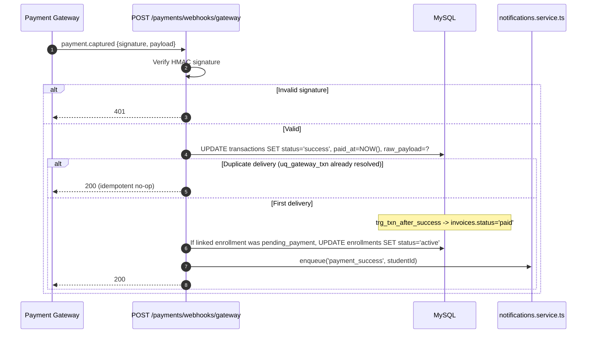

### 27.2 Meeting Provider Webhooks — `POST /api/v1/classes/webhooks/meeting`

| Field | Value |
|---|---|
| **Trigger Events** | `meeting.started`, `meeting.ended`, `participant.joined`, `participant.left`, `recording.completed` |
| **Signature Verification** | Provider-specific HMAC/token verification (Zoom's `x-zm-signature` or Google Meet's equivalent) |
| **Processing** | `meeting.started` → `UPDATE live_sessions SET status='live', actual_start=NOW()`; `participant.joined`/`left` → `UPSERT attendance_records`; `meeting.ended` → `UPDATE live_sessions SET status='completed', actual_end=NOW()` then triggers the Recording Flow (§27.4) |
| **Idempotency** | `attendance_records.uq_session_student` makes repeated `participant.joined` events for the same student naturally idempotent (upsert semantics) |

### 27.3 Recording Uploaded — Internal Event (not an inbound webhook, listed here per the required Webhooks section)

Once §27.4's recording ingestion completes, the platform emits an **internal** domain event (not an external webhook) that the Notifications module subscribes to, resulting in a `recording_available` notification. This is included in this section because the PRD/DRD's "Webhooks" enumeration (`PRD.md` diagram list) names "Recording Uploaded" alongside true external webhooks — architecturally it is an internal event bus message, not an HTTP-delivered webhook, and is clarified here to avoid ambiguity for an implementing engineer.

### 27.4 Recording Ingestion Flow

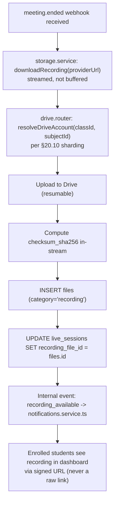

### 27.5 Assignment Deadline & Weekly Test Published — Internal Scheduled Events

Both are Vercel Cron-triggered internal events, not externally-delivered webhooks:

| Event | Trigger | Action |
|---|---|---|
| Assignment Deadline (approaching) | Cron, hourly scan of `assignments.due_date` within next 24h | `assignment_due_soon` notification to students with no submission yet |
| Assignment Deadline (passed) | Cron, hourly scan | Any assignment now overdue is reflected in the next `derivedStatus` computation (§16.3) — no row mutation needed, since "overdue" is computed, not stored |
| Weekly Test Published | `PATCH /learning/tests/{id}/publish` (direct API call, not cron) | `test_available` notification fan-out (§28) |

### 27.6 Notification Delivery Webhook (Outbound Provider Callbacks)

Email/SMS providers (Resend/SendGrid, an SMS gateway) may themselves deliver **delivery-status webhooks** back to the platform (bounce, delivered, failed) at `POST /api/v1/notifications/webhooks/delivery-status`, updating `notification_deliveries.status`/`error_message`. Verified via the provider's own signature scheme, following the identical pattern as §27.1/§24.7.

### 27.7 Webhook Registry Summary

| Webhook | Endpoint | Direction | Auth |
|---|---|---|---|
| Payment Success/Failure/Refund | `POST /payments/webhooks/gateway` | Inbound | HMAC signature |
| Meeting lifecycle & attendance | `POST /classes/webhooks/meeting` | Inbound | Provider signature |
| Notification delivery status | `POST /notifications/webhooks/delivery-status` | Inbound | Provider signature |


---

## 28. Notifications

### 28.1 Notification Types Catalog

| `type` value | Trigger | Channels (default) | Recipient |
|---|---|---|---|
| `registration_verification` | Registration | Email | New user |
| `payment_success` | Webhook §27.1 | Email, SMS, in-app | Payer |
| `payment_failure` | Webhook §27.1 | Email, in-app | Payer |
| `refund_processed` | §26.6.3 | Email, in-app | Student |
| `class_scheduled` | §26.4.3 | In-app, push | Enrolled students |
| `class_cancelled` | `PATCH /classes/sessions/{id}` | Email, SMS, in-app, push (urgent) | Enrolled students |
| `class_reminder_24h` / `class_reminder_15m` | Cron | Push, in-app | Enrolled students |
| `assignment_created` | §26.5.1 | In-app | Enrolled students |
| `assignment_due_soon` | Cron (§27.5) | In-app, push | Students without a submission |
| `assignment_submitted` | §26.5.2 | In-app | Assignment's teacher |
| `assignment_graded` | §26.5.3 | Email, in-app | Submitting student |
| `test_available` | `PATCH /learning/tests/{id}/publish` | In-app, push | Enrolled students |
| `test_results_published` | `sp_publish_test_results` | In-app, email | Enrolled students |
| `recording_available` | §27.4 | In-app | Enrolled students |
| `announcement_posted` | §26.7.1 | In-app (+ email if `isPinned`) | Resolved target audience |

### 28.2 Delivery Architecture

Exactly per `DRD.md` §11.9:

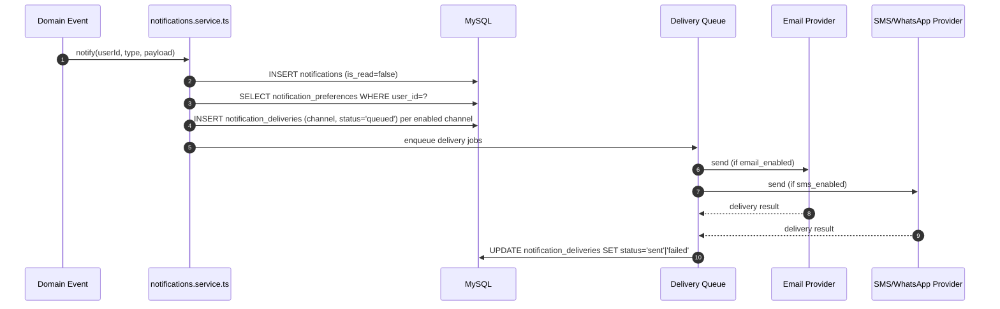

In-app (`in_app`) delivery is always attempted regardless of `notification_preferences`, since the `notifications` row itself **is** the in-app delivery — there is no opt-out of the bell/feed, only of email/SMS/push channels layered on top.

### 28.3 Preference Enforcement

`PATCH /notifications/preferences` (§26.8.2) updates `notification_preferences`; every subsequent `notify()` call checks this table **fresh** at fan-out time — a preference change takes effect immediately for all future notifications, never requiring any kind of cache bust since preferences are read directly, not cached (low read volume relative to write-sensitivity).

### 28.4 Failure Handling

A `notification_deliveries` row that fails (`status='failed'`, `error_message` populated) does **not** retry automatically in Phase 1 — the in-app `notifications` row remains the reliable fallback record, and Admin can view delivery failure rates via `vw_login_activity`-style views over `notification_deliveries` for support triage. Automatic retry-with-backoff is noted as a Future Expansion item (§34).


---

## 29. File Streaming

### 29.1 Principle

No endpoint in this API ever proxies file bytes through a Next.js serverless function body for content larger than a few KB (`DRD.md` §15.1 "Large file transfers... never proxy through the Next.js server"). Every streamable asset (recordings, large PDFs) is delivered via the signed-URL mechanism in §20.11/§26.9.2, and the client's browser (or `<video>`/`<iframe>` element) fetches directly from Google Drive's own CDN-backed delivery infrastructure.

### 29.2 Streaming Flow for Recordings

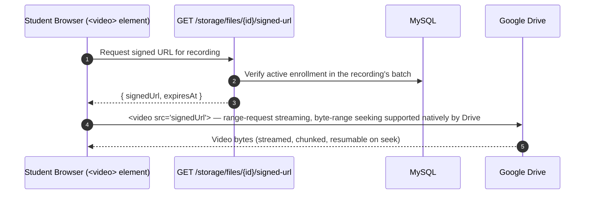

### 29.3 Range Requests & Seeking

Google Drive's own content-serving infrastructure natively supports HTTP range requests (`Range: bytes=...`), so scrubbing/seeking within a recording works exactly as it would against any CDN-hosted video — the platform's API does not need to implement any range-request proxying logic itself, since the browser talks to Drive directly once it has the signed URL.

### 29.4 Expiry Mid-Stream

If a signed URL expires while a long recording is still playing, Drive returns `403` on the next byte-range fetch; the frontend's video player component (per `UIDS.md` §10 "Video/Recording Player Card") detects this and transparently calls `GET /storage/files/{id}/signed-url` again, then resumes playback from the last known position — the student never sees a raw Drive error page.

### 29.5 Download vs. Stream

The same signed-URL endpoint serves both use cases; the distinction between "stream in-browser" and "download to device" is purely a client-side rendering choice (`<video>` tag vs. an `<a download>` link pointing at the identical `signedUrl`) — the API does not expose two different endpoints for what is, from the server's perspective, the same entitlement-gated URL issuance.


---

## 30. Analytics APIs

### 30.1 Design Recap

Fully specified in §26.10; this section adds the dashboard-composition view needed by frontend engineers building the three role-specific dashboards.

### 30.2 Dashboard Aggregation — `GET /api/v1/users/me/dashboard`

This single, role-aware endpoint (introduced in §26.3.4's catalog) is the primary data source for the "Overview" screen of every role (`PRD.md` §11.1, §12.1, §13.1). It returns a different DTO shape depending on `session.role`, documented per role below.

**Student role response** (backs `vw_student_dashboard_summary`, `DATABASE.md` §14.1):

```json
{
  "data": {
    "role": "student",
    "todayLiveSessions": [ { "id": "5510", "subjectName": "Mathematics", "scheduledStart": "...", "joinAvailable": true } ],
    "pendingAssignmentsCount": 3,
    "nextTestDate": "2026-07-06T05:00:00.000Z",
    "latestAnnouncement": { "id": "512", "title": "..." },
    "subscriptionStatusBanner": { "hasDue": false }
  }
}
```

**Teacher role response** (backs `vw_teacher_grading_queue` count + own-batch KPIs, `PRD.md` §12.1):

```json
{
  "data": {
    "role": "teacher",
    "totalActiveStudents": 47,
    "classesThisWeek": 9,
    "pendingGradingCount": 12,
    "upcomingClassIn24h": { "id": "5511", "scheduledStart": "..." },
    "earningsVisible": false
  }
}
```

**Admin role response** (backs `vw_admin_revenue_overview` + `analytics_snapshots`, `PRD.md` §13.1):

```json
{
  "data": {
    "role": "admin",
    "totalStudents": 214,
    "activeSubscriptions": 261,
    "mrr": { "amount": 391500.00, "currency": "INR" },
    "churnRate": 0.04,
    "demoToPaidConversionRate": 0.37,
    "teacherUtilization": 0.82
  }
}
```

### 30.3 Reports Export

`GET /payments/reports/revenue?format=csv` (§26.6.4) streams a `Content-Disposition: attachment; filename="revenue-2026-07.csv"` response generated from `vw_admin_revenue_overview`, satisfying `PRD.md` §13.3's "exportable reports (CSV)" requirement. The export is generated synchronously for date ranges under 12 months (bounded row count); ranges beyond that return `202 Accepted` with a follow-up `GET /payments/reports/{jobId}` polling pattern (documented here as the extension point, not yet needed at current data volume).


---

## 31. Admin APIs

### 31.1 Scope

This section consolidates the Admin-exclusive surface area that spans multiple modules (§8.1's `admin`/`super_admin` roles), matching `PRD.md` §13's full Admin Dashboard scope. Each route below is already specified in its home module's catalog (§26.x) — this section exists as a **role-centric index** for an engineer building the Admin Dashboard end-to-end, so they can find every relevant route without cross-referencing ten module sections individually.

### 31.2 Admin Route Index by PRD Dashboard Tab

| PRD §13 Tab | Routes |
|---|---|
| §13.1 Overview/Analytics | `GET /analytics/platform`, `GET /analytics/revenue-overview` |
| §13.2 Enrollment Management | `GET /users?role=student`, `GET /classes/batches/{id}/enrollments`, `PATCH /classes/enrollments/{id}`, `POST /classes/batches/{id}/enroll` |
| §13.3 Payments & Invoices | `GET /payments/invoices`, `GET /payments/transactions`, `POST /payments/{invoiceId}/refund`, `POST /payments/invoices/{id}/reconcile-offline`, `GET /payments/reports/revenue` |
| §13.4 Teacher Management | `POST /admin/teachers`, `PATCH /admin/teachers/{id}`, `POST /admin/teachers/{id}/assignments` (subject/class assignment), `POST /users/{id}/deactivate` |
| §13.5 Class/Subject Configuration | `POST /classes`, `POST /classes/{classId}/batches`, `PUT /admin/pricing/{feePlanId}` |
| §13.6 Content Moderation | `GET /admin/content/pending`, `PATCH /admin/content/{type}/{id}/approve`, `PATCH /admin/content/{type}/{id}/reject` |
| §13.7 Announcements Broadcast | `POST /announcements` (with `targets: [{ targetType: "global" }]`) |
| §13.8 Platform Settings | `GET /core/system-config`, `PATCH /core/system-config/{key}` |

### 31.3 Full Specification — `POST /api/v1/admin/teachers`

| Field | Value |
|---|---|
| **Category** | Administration |
| **Purpose** | Provision a new Teacher account — the key extensibility mechanism behind `PRD.md` §23's "Multiple Teachers" future-readiness |
| **HTTP Method** | `POST` |
| **URL** | `/api/v1/admin/teachers` |
| **Authentication Required** | Yes |
| **Allowed Roles** | Admin, Super Admin |
| **Description** | Creates a `users` row with `role_id` forced to `teacher`, a linked `teacher_profiles` row, and optionally one or more `teacher_subjects` qualification rows in the same request — matching `PRD.md` §15.4's "Admin onboards a second teacher" flow end-to-end in one call. |
| **Headers** | `X-Step-Up-Token` required (§8.5) |
| **Query Parameters** | None |
| **Path Parameters** | None |
| **Request Body Schema** | `{ fullName: string, email: string, phone?: string, qualification?: string, experienceYears?: number, bio?: string, subjectIds?: string[] }` |
| **Validation Rules** | `email`/`phone` uniqueness pre-check, identical to registration (§26.2.1) |
| **Business Rules** | A temporary password is generated server-side and delivered via the account's first-login email (never returned in the API response body, even to the creating Admin) — the new Teacher completes a forced password reset on first login |
| **Database Tables Used** | `users`, `teacher_profiles`, `teacher_subjects`, `roles` |
| **Indexes Used** | `idx_users_email`, composite PK on `teacher_subjects (teacher_id, subject_id)` |
| **Google Drive Interaction** | None |
| **Redis Interaction** | None |
| **Service Layer Called** | `users.service.ts#provisionTeacher()` |
| **Repository Layer Called** | `users.repository.ts#createUser()`, `createTeacherProfile()`, `insertTeacherSubjects()` |
| **Success Response** | `201 Created` — `{ "data": { "id": "u_9821", "fullName": "Mr. Verma", "role": "teacher", "status": "pending", "subjectIds": ["3","7"] } }` |
| **Error Responses** | `409 DUPLICATE_RESOURCE` |
| **Status Codes** | `201`, `400`, `403`, `409`, `500` |
| **Rate Limit** | General authenticated tier |
| **Permissions** | Admin/Super Admin; step-up required |
| **Caching** | None; invalidates the public Teacher/About page listing cache |
| **Audit Logs Generated** | `audit_logs (action='TEACHER_CREATED', entity_type='users', actor_id=adminId)` |
| **Notifications Triggered** | Welcome/first-login email with temporary password link to the new Teacher |
| **Webhooks Triggered** | None |
| **Side Effects** | The new Teacher's schedule immediately becomes visible on relevant Subject pages once they're assigned a `classes.teacher_id` (a separate `POST /classes` or `PATCH /classes/{id}` call), per `PRD.md` §15.4's flow diagram |
| **Sequence Diagram** | `PRD.md` §15.4 |
| **Notes** | This is the single concrete API mechanism that proves the platform's "unlimited teachers" scalability claim (`PRD.md` §16.3) — no code change accompanies calling this endpoint a second, third, or hundredth time. |

### 31.4 Full Specification — `PATCH /api/v1/admin/content/{type}/{id}/approve`

| Field | Value |
|---|---|
| **Category** | Administration |
| **Purpose** | Approve teacher-uploaded content before it becomes visible to students, when the moderation workflow toggle is enabled |
| **HTTP Method** | `PATCH` |
| **URL** | `/api/v1/admin/content/{type}/{id}/approve` |
| **Authentication Required** | Yes |
| **Allowed Roles** | Admin, Super Admin |
| **Description** | `{type}` ∈ `{materials, recordings, assignments}`. When `system_config.content_moderation_enabled = true`, newly-created content of these types starts in an unapproved state invisible to students; this endpoint flips it visible. When the flag is `false` (the default for a trusted single-teacher setup per `PRD.md` §13.6), content is auto-approved at creation and this endpoint is a no-op success for already-approved content. |
| **Headers** | Standard only |
| **Query Parameters** | None |
| **Path Parameters** | `type`, `id` |
| **Request Body Schema** | None |
| **Validation Rules** | `type` must be one of the three allow-listed values |
| **Business Rules** | This workflow is **disableable** — `PRD.md` §13.6 explicitly frames it as "can be disabled for a trusted single-teacher setup and enabled automatically once more teachers are added"; the "automatically" part is implemented as an Admin-visible recommendation banner triggered when `teacher_subjects`'s distinct `teacher_id` count exceeds 1, not a forced automatic flip (an Admin's explicit action is still required to change platform behavior) |
| **Database Tables Used** | `materials`/`live_sessions`/`assignments` (whichever `{type}` resolves to — a moderation-status column reserved on each), `system_config` |
| **Indexes Used** | Primary key lookups |
| **Google Drive Interaction** | None |
| **Redis Interaction** | None |
| **Service Layer Called** | `admin.service.ts#approveContent()` |
| **Repository Layer Called** | Per-type repository update function |
| **Success Response** | `200 OK` — `{ "data": { "type": "materials", "id": "220", "approved": true } }` |
| **Error Responses** | `404` |
| **Status Codes** | `200`, `403`, `404`, `500` |
| **Rate Limit** | General authenticated tier |
| **Permissions** | Admin/Super Admin only |
| **Caching** | None |
| **Audit Logs Generated** | `activity_logs (action='CONTENT_APPROVED')` |
| **Notifications Triggered** | Content becomes visible → the normal `recording_available`/etc. notification (§28) fires at this point instead of at creation time, when moderation is enabled |
| **Webhooks Triggered** | None |
| **Side Effects** | None |
| **Sequence Diagram** | Not required |
| **Notes** | A companion `PATCH /admin/content/{type}/{id}/reject {reason}` exists for the rejection path, notifying the uploading Teacher with the reason. |


---

## 32. Testing Guidelines

### 32.1 Test Pyramid

| Layer | Tooling | Scope | Coverage Gate |
|---|---|---|---|
| Unit | Vitest/Jest | Service-layer business logic, DTO mappers, validation schemas | ≥ 80% on `modules/*/service.ts` (`DRD.md` §19) |
| Integration | Supertest against a Dockerized MySQL test instance | Full route → service → repository → DB round-trip for every endpoint in §26 | Every full-specification endpoint (§26.1-tagged) has at least one happy-path and one error-path integration test |
| Contract | Shared `types/` package compiled against both frontend and backend | Guarantees the DTO shapes documented in this file are the *actual* compiled types used by both sides, not just prose that can drift | CI fails the build if a DTO type changes without a corresponding `API.md` diff (enforced via a doc-freshness lint step, §32.4) |
| End-to-End | Playwright against a Preview deployment | Full user journeys (`PRD.md` §15's flows): registration → payment → dashboard access; teacher scheduling → student notification; assignment submission → grading | Critical flows only (auth, payments, enrollment) per `DRD.md` §19 |

### 32.2 Critical Test Scenarios Required Before Merge

Directly from the edge cases catalog in `PRD.md` §22, each of which must have a corresponding automated test:

| Scenario | Test Type | Asserts |
|---|---|---|
| Duplicate email/phone at registration | Integration | `409 DUPLICATE_RESOURCE`, no `otp_verifications` row created |
| Payment gateway timeout then webhook lands later | Integration | Invoice reaches `paid` purely via the webhook path, independent of redirect timing |
| Partial multi-subject checkout failure | Integration | Only successfully-paid `feePlanId`s' enrollments activate |
| Two overlapping class schedules for one teacher | Integration | `409 SCHEDULE_CONFLICT` |
| Late assignment submission | Integration | `isLate: true` computed correctly against `due_date` |
| Assignment submission with neither file nor text | Integration | `400 VALIDATION_ERROR` |
| Missed weekly test window | Integration | Attempt auto-transitions to `auto_submitted` via the scheduled job simulation |
| Overdue subscription attempts live class join | Integration | `403 SUBSCRIPTION_OVERDUE`, but historical materials/recordings remain accessible |
| Suspended account login attempt | Integration | Generic `INVALID_CREDENTIALS`, no status leakage in the message |
| Attempt to delete a Subject with active enrollments | Integration | `422 BUSINESS_RULE_VIOLATION`, subject remains, only deactivation succeeds |
| Duplicate webhook delivery (idempotency) | Integration | Second delivery of the same `gateway_txn_id` produces zero additional side effects |
| Refund on an already-refunded transaction | Integration | `409 ALREADY_REFUNDED` |

### 32.3 Load & Performance Testing

Per `PRD.md` §19's non-functional requirements, API p95 latency (`DRD.md` §23.2) is validated pre-release with a load test targeting:

- `< 300ms` p95 for standard CRUD endpoints under expected concurrent load.
- `< 2s` for the checkout-initiation round trip (excluding the gateway's own redirect time, which is outside the platform's control).
- Dashboard aggregate endpoints (§30.2) validated separately since they involve the most joins/subqueries.

### 32.4 Documentation Freshness

A CI check compares the shared `types/` package's exported DTO type definitions against a machine-readable extract of this document's DTO field tables (§6.2, and every "Request Body Schema"/"Success Response" field in §26); a mismatch fails the build. This is what keeps `API.md` from silently drifting out of sync with the deployed contract over the platform's multi-year lifespan (per this document's stated goal of remaining accurate "for years").


---

## 33. API Version Migration Strategy

### 33.1 Principles

Recapping §4 with the operational process layered on top:

1. Additive changes ship into `v1` continuously — no version bump needed.
2. A breaking change is **batched** with other pending breaking changes into a single `v2` release, rather than incrementing the version on every individual breaking change — this avoids "version churn" that would force clients to migrate repeatedly in short succession.
3. `v1` and `v2` run **concurrently** for the deprecation window (minimum 6 months per §4.3).

### 33.2 Client Migration Support

- A machine-readable **migration guide** (`CHANGELOG.md`, versioned alongside this document) lists every breaking change between `v1` and `v2` with an old-shape/new-shape example pair.
- The shared `types/` package publishes both `v1` and `v2` type sets during the overlap window, so the frontend can migrate route-by-route rather than in one atomic cutover.

### 33.3 Changelog Discipline

Every change to this document (`API.md`) that reflects a shipped API change is accompanied by a changelog entry with: date, affected endpoint(s), nature of change (additive/breaking), and — for breaking changes — the deprecation timeline. This document's own edit history **is** the authoritative version history; no separate, potentially-divergent changelog file is maintained.

### 33.4 OpenAPI 3.1 Generation Path

This document is structured so that a future automated conversion to OpenAPI 3.1 is close to mechanical:

| API.md Structure | OpenAPI 3.1 Equivalent |
|---|---|
| §26.1's 24-field template per endpoint | One `paths.{path}.{method}` entry with `summary` (Purpose), `security` (Authentication/Roles), `parameters` (Query/Path), `requestBody` (Request Body Schema), `responses` (Success/Error Responses) |
| §6.2 DTO naming | `components.schemas.{DTOName}` |
| §12.1 Error taxonomy | `components.responses.{ErrorCode}` reusable response objects |
| §14–§17 Pagination/Sorting/Filtering conventions | Shared `components.parameters` fragments (`PageParam`, `LimitParam`, `SortByParam`) referenced via `$ref` across every list endpoint, rather than redefined per path |
| §7 Authentication scheme | `components.securitySchemes.cookieAuth` |

Until this automation is built, this Markdown document remains authoritative; any generated OpenAPI spec is a derived artifact, never the other way around.


---

## 34. Future API Expansion

Mirroring `DATABASE.md` §24's future-expansion table, mapped to the API surface that each future capability will require:

| Future Requirement | API Surface Already In Place | Additional API Work Needed |
|---|---|---|
| More Teachers | `POST /admin/teachers`, `teacher_subjects`-backed qualification model | None — purely operational, zero new endpoints |
| More Classes/Subjects | `POST /classes`, `POST /classes/{classId}/batches`, `PUT /admin/pricing/{feePlanId}` | None |
| Parent Portal (Phase 2) | Routes already specified in §26.3.4 behind the `parent_portal_enabled` flag (§26.3.4 notes) | Remove the `501 NOT_YET_ENABLED` gate; add Parent-scoped dashboard variant to §30.2 |
| Live Video Integration (native, Phase 2) | `live_sessions.meeting_url`/`provider` already abstracted behind an ENUM | New `provider = 'native'` value; a new `/classes/sessions/{id}/native-token` endpoint issuing a WebRTC/media-server join token, additive to the existing join-link model |
| Mobile App (Phase 3) | Entire API is already transport-agnostic JSON over HTTPS — no mobile-specific endpoint exists or is needed | Possibly a push-notification device-token registration endpoint (`POST /notifications/device-tokens`) for native push, additive |
| Automated Question Bank (Phase 3) | `test_questions`/`test_options` schema already generic enough (`DATABASE.md` §24) | New `POST /learning/question-bank/generate` endpoint; `test_questions.generated_by` provenance field surfaced in the response DTO |
| Referral Program (Phase 3) | Reserved per `PRD.md` §23 | New `referrals` resource: `POST /users/me/referrals`, `GET /users/me/referrals`, webhook-style credit-on-conversion hook into the payments module |
| Coupons | Not yet modeled (`DATABASE.md` §24) | New `POST /payments/coupons/validate`, applied as a `coupons`/`coupon_redemptions` line item inside `POST /payments/checkout`'s existing request body (`{ couponCode?: string }`), additive |
| Multi-language Support (Phase 3) | `Accept-Language` header already reserved (§10); UTC datetimes and `CHAR(3)` currency codes already i18n-ready (`DRD.md` §23.2) | Response body strings remain unchanged (the frontend owns UI string localization); only server-generated notification/email copy needs a locale-templated variant, additive to `notifications.service.ts` |
| Search at Scale (if `LIKE` search degrades) | `GET /users?search=`, `GET /core/search` already isolate search behind a single parameter convention (§17) | Swap the underlying implementation to a `FULLTEXT` index or external search service without any client-facing contract change — the `search` query parameter's shape is already the intended long-term interface |
| Independent Third-Party API Consumers | N/A today (§3.5) | Would motivate revisiting HATEOAS (§3.5), a formal OAuth2 client-credentials grant type alongside the current cookie-based scheme (§7), and publishing the OpenAPI spec (§33.4) as a first-class public artifact rather than an internal derivation |
| GraphQL / gRPC | N/A today (§3.1) | Only reconsidered if a genuinely different consumption pattern (e.g., a native mobile client needing aggressive over-fetching reduction) emerges; not currently justified per the same reasoning as §3.5 |

No item on this list requires renaming an existing endpoint, changing an existing DTO field's type, or breaking an existing response shape — every future capability in this table is additive to the `v1` contract defined in this document, matching the same "growth is additive" guarantee `DATABASE.md` §24 makes for the schema.

---

*End of API Specification. This document is the authoritative, single source of truth for the Elevate Tuitions REST API and supersedes the illustrative endpoint sketch in `PRD.md` §17 while remaining fully consistent with, and traceable to, `PRD.md`, `DRD.md`, `DATABASE.md`, and `UIDS.md`.*
