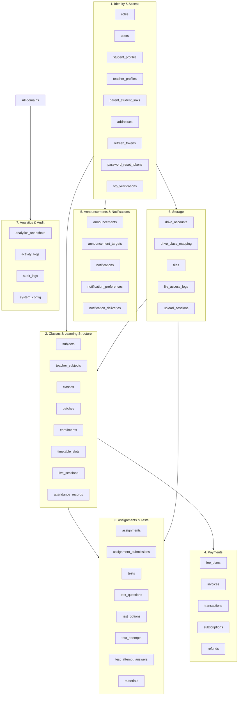
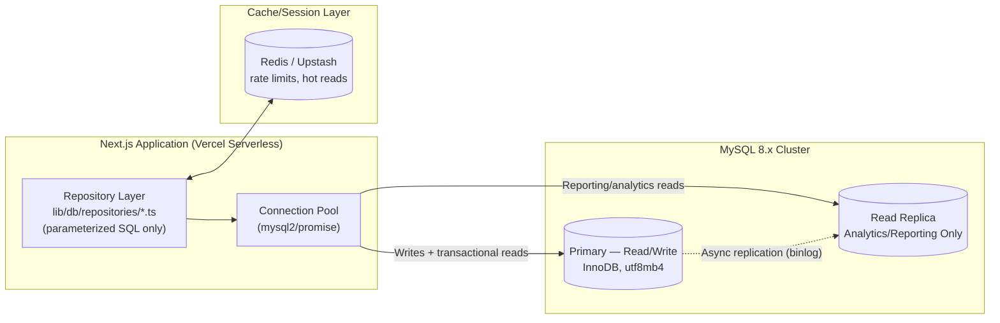
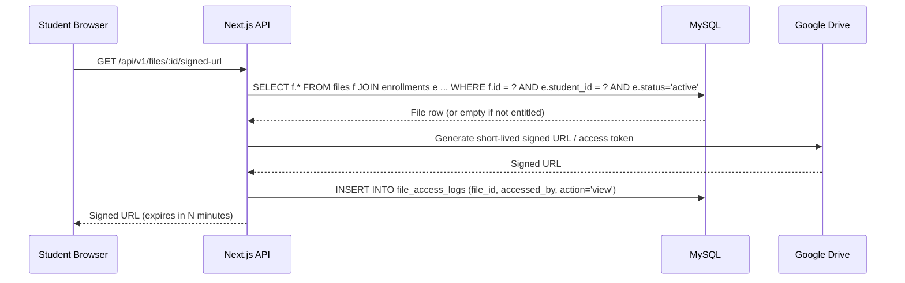
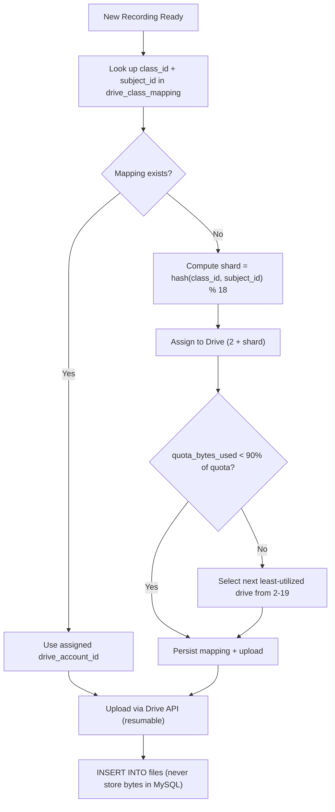

# DATABASE.md
## Complete Database Specification — Premium Online Tuition Management Platform

| | |
|---|---|
| **Document Type** | Database Specification (Single Source of Truth) |
| **Version** | 1.0.0 |
| **Status** | Production-Ready |
| **Derived From** | PRD v1.0 (`PRD.md`) + DRD v1.0.0 (`DRD.md`) |
| **Database Engine** | MySQL 8.x, InnoDB, `utf8mb4` / `utf8mb4_unicode_ci` |
| **Query Layer** | Raw parameterized SQL only — no ORM, no Prisma |
| **Prepared For** | Backend Engineers, DBAs, SRE/DevOps |
| **Prepared By** | Principal Database Architect Function |

> **Reconciliation note.** The PRD sketches an early, minimal MySQL schema (`users`, `classes`, `subjects`, `teacher_assignments`, `enrollments`, `payments`…) to communicate *intent*. The DRD supersedes it with a fully normalized, production-grade schema (`roles`, `users`, `student_profiles`, `teacher_profiles`, `classes`, `batches`, `enrollments`, `files`, `drive_accounts`…) that implements the same business rules with proper 3NF decomposition. This document treats the **DRD schema as canonical** and is its full elaboration — nothing here contradicts either source document. A terminology cross-reference is provided in §1.4 so a reader coming from the PRD can map old names to the canonical ones. Monetary values are stored as `DECIMAL(10,2)` in INR (2-decimal / paisa precision), which is numerically equivalent to the PRD's "store in paise as integer" intent — DECIMAL is used instead of integer-paise because DRD's `fee_plans`/`invoices`/`transactions` already model amounts this way and mixing representations would fragment the schema.

---

## Table of Contents

1. [Executive Summary](#1-executive-summary)
2. [Database Architecture](#2-database-architecture)
3. [Naming Conventions](#3-naming-conventions)
4. [Database Standards](#4-database-standards)
5. [Entity Relationship Diagram](#5-entity-relationship-diagram)
6. [Complete Table Catalog](#6-complete-table-catalog)
7. [Table Specifications](#7-table-specifications)
8. [Relationships](#8-relationships)
9. [Constraints](#9-constraints)
10. [Index Strategy](#10-index-strategy)
11. [Transactions](#11-transactions)
12. [Triggers](#12-triggers)
13. [Stored Procedures](#13-stored-procedures)
14. [Views](#14-views)
15. [File Storage Integration](#15-file-storage-integration)
16. [Google Drive Architecture](#16-google-drive-architecture)
17. [Audit Logging](#17-audit-logging)
18. [Backup Strategy](#18-backup-strategy)
19. [Performance Optimization](#19-performance-optimization)
20. [Security](#20-security)
21. [Migration Strategy](#21-migration-strategy)
22. [Sample SQL](#22-sample-sql)
23. [Example Queries](#23-example-queries)
24. [Future Expansion](#24-future-expansion)
25. [Best Practices](#25-best-practices)

---

## 1. Executive Summary

### 1.1 Database Philosophy

The database is the **single source of truth for structured state**. Every fact the application needs to reconstruct — who is enrolled in what, who paid what, who submitted which assignment, which file lives where — is represented as a row in a normalized table, never inferred from application memory, never cached as the primary record. Binary content (video, PDF, images) is explicitly kept **out** of MySQL; the database stores only *metadata that points at* Google Drive objects (§15, §16).

### 1.2 Design Goals

| Goal | How It Is Achieved |
|---|---|
| Correctness | 3NF/BCNF normalization (§1.3), foreign keys enforced at the engine level, `CHECK` constraints for domain rules |
| Scalability | Data-driven `subjects`/`classes`/`batches`/`fee_plans` (no hardcoded business data), read replica for reporting, shard-ready `files` metadata |
| Performance | Composite/covering indexes tuned to actual dashboard queries (§10), denormalized `analytics_snapshots` for reporting only |
| Security | Parameterized queries exclusively, `password_hash`/`token_hash` never plaintext, least-privilege DB accounts (§20) |
| Maintainability | Consistent naming (§3), versioned migrations (§21), one repository-pattern function per query |
| Future-proofing | Every "single teacher/single subject" constraint today is a **data state**, not a schema limitation — see §24 |

### 1.3 Normalization Strategy

The schema targets **3NF as a floor**, with **BCNF** applied wherever a table had a non-trivial functional dependency on a subset of a candidate key:

- `student_profiles` / `teacher_profiles` are split from `users` (role-specific attributes don't functionally depend on the *whole* identity key set — they depend only on `user_id`, and only exist for a subset of rows).
- `test_options` are split from `test_questions`, and `test_questions` from `tests`, so that "marks per question" doesn't repeat across options.
- `teacher_subjects` and `parent_student_links` are pure many-to-many junction tables — no attribute lives redundantly on either side.
- **Deliberate exception:** `analytics_snapshots` is a denormalized materialized rollup. This is a documented, justified violation for read-heavy reporting only; it is never treated as a source of truth and is always rebuildable from transactional tables.

### 1.4 PRD ↔ DRD Terminology Cross-Reference

| PRD Term (`PRD.md` §16) | Canonical DRD/DATABASE Term | Notes |
|---|---|---|
| `classes` (Class 8/9/10) | `classes.level` combined with `subjects` | PRD's "Class" (grade) is folded into the canonical `classes` table via `level` plus the `batches` grouping concept |
| `subjects` | `subjects` | Same concept, same table name |
| `teacher_assignments` | `classes.teacher_id` + `teacher_subjects` | Canonical schema assigns a teacher directly to a `class` and separately tracks which `subjects` a teacher is qualified for |
| `enrollments` (student↔subject↔class) | `enrollments` (student↔`batch`) | Canonical model adds `batches` as the enrollable cohort under a `class`, matching "recurring weekly slot" granularity from PRD §12.2 |
| `pricing_plans` | `fee_plans` | Same role: data-driven pricing, no hardcoded amounts |
| `payments` / `payment_events` | `invoices` / `transactions` / `refunds` | Canonical schema separates the billing obligation (`invoices`) from the gateway event (`transactions`), matching PRD §20 security requirement to log raw webhook payloads |
| `class_schedule` | `timetable_slots` + `live_sessions` | Recurring pattern vs. concrete occurrence, split per 3NF (avoids storing `specific_date` overrides in the same row as the recurring rule) |
| `materials` / `recordings` | `materials` (metadata) + `files` (Drive metadata) | Storage of the *file* is unified in `files`; `materials` links a file to a batch |
| `role ENUM` on `users` | `roles` lookup table + `users.role_id` | Extracted to a table so new roles (e.g., future `parent`) don't require an `ALTER TABLE ... MODIFY ENUM` |

### 1.5 Scalability, Performance, Storage & Security Strategy (Summary)

These are elaborated in full in §16, §18, §19, §20 respectively. In brief: horizontal file-storage scaling via 19 sharded Google Drive accounts; a MySQL primary + read replica split (writes vs. reporting); daily full backups with binlog-based point-in-time recovery; and defense-in-depth security spanning network, application, and database layers.

---

## 2. Database Architecture

### 2.1 Logical Architecture

The logical schema is organized into **seven functional domains**, mirroring the backend module boundaries defined in the DRD (`auth`, `users`, `payments`, `classes`, `learning`, `announcements`, `notifications`, `storage`, `analytics`, `core`):



### 2.2 Physical Architecture



### 2.3 Data Layer vs. Application Layer Responsibilities

| Layer | Responsibility | Never Does |
|---|---|---|
| **Database (MySQL)** | Enforce referential integrity (FKs), domain integrity (`CHECK`, `ENUM`, `UNIQUE`), atomicity (transactions), derived aggregates (triggers), audit immutability | Store binary files; contain business logic that belongs in the service layer (e.g., pricing calculation, RBAC decisions) |
| **Application (Next.js API layer)** | Session/role resolution, RBAC authorization, business workflows (checkout, grading), calling Google Drive API, sending notifications | Trust client-supplied IDs for row-level scoping (always re-derive from session and filter in `WHERE`) |

### 2.4 How MySQL Interacts With Each Backend Module

| Backend Module | Primary Tables Touched | Interaction Pattern |
|---|---|---|
| **Authentication** | `users`, `roles`, `refresh_tokens`, `password_reset_tokens`, `otp_verifications` | Login validates `password_hash` (bcrypt) server-side; session issues JWT with `role_id` looked up fresh, never trusted from client |
| **Payments** | `fee_plans`, `invoices`, `transactions`, `subscriptions`, `refunds` | Checkout creates `invoices` row → gateway redirect → webhook updates `transactions.status` → `trg_txn_after_success` cascades `invoices.status` atomically |
| **Learning (Classes/Batches)** | `subjects`, `classes`, `batches`, `enrollments`, `timetable_slots`, `live_sessions`, `attendance_records` | Admin/teacher CRUD on `classes`/`batches`; enrollment gates content access via `JOIN enrollments` in every content query |
| **Assignments** | `assignments`, `assignment_submissions`, `files` | Submission `INSERT` requires an existing `files` row (uploaded first); grading is an `UPDATE` on `assignment_submissions` |
| **Tests** | `tests`, `test_questions`, `test_options`, `test_attempts`, `test_attempt_answers` | MCQ answers auto-graded by `trg_answer_autograde` on `INSERT`; subjective answers graded manually via `UPDATE` |
| **Analytics** | `analytics_snapshots`, read replica of all transactional tables | Scheduled job aggregates transactional tables → writes/`UPSERT`s into `analytics_snapshots`; dashboards read snapshots, never raw joins, for platform-wide KPIs |
| **Notifications** | `notifications`, `notification_preferences`, `notification_deliveries` | Event triggers app code to `INSERT` a `notifications` row; a delivery worker `INSERT`s one `notification_deliveries` row per enabled channel |
| **Google Drive (Storage)** | `drive_accounts`, `drive_class_mapping`, `files`, `upload_sessions`, `file_access_logs` | MySQL never stores bytes; every Drive object is represented by exactly one `files` row keyed by `(drive_account_id, drive_file_id)` |

---

## 3. Naming Conventions

All identifiers are `snake_case`, ASCII-only, and never MySQL reserved words.

### 3.1 Database & Schema

- Database name: `elevate_tuitions` (lowercase, underscore-separated, matches product working name).
- One schema per environment: `elevate_tuitions_dev`, `elevate_tuitions_staging`, `elevate_tuitions_prod`.

### 3.2 Table Naming

| Rule | Example |
|---|---|
| Plural, lowercase, `snake_case` | `users`, `assignment_submissions` |
| Junction/many-to-many tables named `{a}_{b}` in FK order | `teacher_subjects`, `parent_student_links` |
| Lookup/reference tables are singular concept, plural table | `roles`, `subjects` |
| No Hungarian-style prefixes (`tbl_`, `t_`) | ~~`tbl_users`~~ → `users` |

### 3.3 Column Naming

| Rule | Example |
|---|---|
| Primary key always `id` | `id BIGINT UNSIGNED AUTO_INCREMENT PRIMARY KEY` |
| Foreign key = `{singular_referenced_table}_id` | `student_id`, `batch_id`, `teacher_id` |
| Booleans prefixed `is_` / `has_` | `is_active`, `is_deleted`, `is_pinned`, `has_paid` |
| Timestamps suffixed `_at` (datetime instant) | `created_at`, `updated_at`, `submitted_at`, `graded_at` |
| Dates suffixed `_date` or `_on` (calendar date, no time) | `due_date`, `enrolled_on`, `snapshot_date` |
| Money columns suffixed with unit context, no ambiguous `amount` alone at table level when multiple currencies exist | `amount_due`, `amount` + sibling `currency` |
| Status/type columns are `ENUM`, named `status` / `type` / `{noun}_type` | `status`, `question_type`, `file_category` |
| External-facing surrogate identifiers | `uuid CHAR(36)` alongside internal `BIGINT` PK |

### 3.4 Primary Key Naming

- Column always named `id`.
- Type: `BIGINT UNSIGNED AUTO_INCREMENT` for all high-cardinality/high-growth tables; `TINYINT UNSIGNED AUTO_INCREMENT` for small closed lookup sets (`roles`, `drive_accounts`); `INT UNSIGNED AUTO_INCREMENT` for medium lookup sets (`subjects`).
- Composite (natural) primary keys are used only for pure junction tables with no independent identity: `teacher_subjects (teacher_id, subject_id)`.

### 3.5 Foreign Key Naming

- Constraint name pattern: `fk_{table_abbrev}_{referenced_concept}`.
- Examples: `fk_classes_subject`, `fk_classes_teacher`, `fk_enroll_student`, `fk_enroll_batch`, `fk_sub_grader`.
- Table abbreviations used consistently across the schema: `enroll` = enrollments, `sub` = assignment_submissions, `ta`/`taa` = test_attempts/test_attempt_answers, `topt`/`tq` = test_options/test_questions, `psl` = parent_student_links, `ts` = teacher_subjects, `rt` = refresh_tokens, `prt` = password_reset_tokens, `dcm` = drive_class_mapping, `fal` = file_access_logs, `al` = activity_logs.

### 3.6 Constraint Naming

| Constraint Type | Pattern | Example |
|---|---|---|
| Primary Key | implicit (`PRIMARY KEY`) | — |
| Foreign Key | `fk_{table}_{ref}` | `fk_txn_invoice` |
| Unique | `uq_{table}_{columns}` | `uq_student_batch`, `uq_gateway_txn` |
| Check | `chk_{table}_{rule}` | `chk_time_order`, `chk_ls_time` |

### 3.7 Index Naming

- Pattern: `idx_{table_abbrev}_{column(s)}`.
- Examples: `idx_users_role`, `idx_enroll_status`, `idx_notif_user_unread` (composite).

### 3.8 Trigger Naming

- Pattern: `trg_{table}_{timing}_{event}[_purpose]`.
- Examples: `trg_txn_after_success`, `trg_files_after_insert`, `trg_users_role_audit`, `trg_answer_autograde`.

### 3.9 Stored Procedure Naming

- Pattern: `sp_{verb}_{noun}`.
- Examples: `sp_enroll_student`, `sp_process_refund`, `sp_publish_test_results`, `sp_rebuild_analytics_snapshot`.

### 3.10 View Naming

- Pattern: `vw_{domain}_{purpose}`.
- Examples: `vw_student_dashboard_summary`, `vw_teacher_grading_queue`, `vw_admin_revenue_overview`, `vw_batch_roster`.

### 3.11 Enum Naming

- ENUM values are lowercase `snake_case` strings (never numeric codes), e.g. `status ENUM('active','suspended','pending','deactivated')`. This keeps values self-documenting in raw SQL debugging without a lookup join.

### 3.12 Timestamp Naming & Rules

- Every mutable table has `created_at DATETIME NOT NULL DEFAULT CURRENT_TIMESTAMP`.
- Every table whose rows are updated post-creation additionally has `updated_at DATETIME NOT NULL DEFAULT CURRENT_TIMESTAMP ON UPDATE CURRENT_TIMESTAMP`.
- All `DATETIME` values are stored in **UTC**; the application layer converts to IST (`Asia/Kolkata`) for display, per DRD §23.2 internationalization readiness.

---

## 4. Database Standards

### 4.1 Character Set & Collation

```sql
-- Server/session defaults
SET NAMES utf8mb4;
SET time_zone = '+00:00';
```

Every table is created with (or inherits from the database default):

```sql
CHARACTER SET utf8mb4 COLLATE utf8mb4_unicode_ci
```

`utf8mb4_unicode_ci` is chosen over `utf8mb4_general_ci` for linguistically-correct comparison/sorting, important given Hindi-language content support in the future roadmap (PRD §23).

### 4.2 Default Values

| Column Pattern | Default |
|---|---|
| `status` columns | The "safest"/least-privileged state (e.g., `users.status` defaults to `pending`, `enrollments.status` defaults to `pending_payment`) |
| `is_active` | `TRUE` unless the entity requires explicit activation |
| `is_deleted` | `FALSE` |
| `created_at` | `CURRENT_TIMESTAMP` |
| Counters (`attempts`, `quota_bytes_used`) | `0` |

### 4.3 Audit Columns

Every transactional table (not pure lookup tables) carries at minimum `created_at`. Tables whose rows change state after creation also carry `updated_at`. High-sensitivity mutations (payments, role changes, grading overrides) are additionally captured in the immutable `audit_logs` table (§17) — audit columns on the row itself record *when*, `audit_logs` records *who changed what from what to what*.

### 4.4 Soft Delete Rules

| Table | Soft-Delete Column | Rationale |
|---|---|---|
| `files` | `is_deleted BOOLEAN` | Google Drive object removal is deferred to a background job after a grace period; MySQL row is the source of truth for "is this file gone" |
| `subjects`, `classes`, `batches` | `is_active BOOLEAN` | Preserves historical FK integrity for past enrollments/invoices even after an offering is retired (PRD §22 Edge Case: "Attempt to delete a Subject with active enrollments → Blocked; must deactivate") |

Hard `DELETE` is reserved for genuinely disposable, non-referenced rows (`otp_verifications` after expiry, `upload_sessions` after TTL) and is executed only via scheduled cleanup jobs, never ad hoc.

### 4.5 UUID Strategy

- Internal primary keys remain `BIGINT UNSIGNED AUTO_INCREMENT` for join performance, index density, and InnoDB clustering efficiency.
- A parallel `uuid CHAR(36) UNIQUE` column is added on tables whose IDs are exposed externally (`users.uuid`, `files.uuid`, `upload_sessions.uuid`) so that internal auto-increment sequence/cardinality is never leaked to clients (prevents enumeration attacks, e.g., guessing `user_id=1,2,3…`).
- UUIDs are generated in the application layer (`crypto.randomUUID()` / UUIDv4) at insert time, not by MySQL's `UUID()` function, to keep ID generation testable and consistent with the "no DB-side business logic" principle.

### 4.6 Primary Key Strategy

- `BIGINT UNSIGNED` for all tables expected to exceed a few million rows over the platform's lifetime (users, enrollments, files, notifications, logs).
- `INT UNSIGNED` for medium-cardinality lookups (`subjects`).
- `TINYINT UNSIGNED` for genuinely small closed sets (`roles` — at most a handful of values ever; `drive_accounts` — exactly 19 by design, see §16).

### 4.7 Foreign Key, Cascade, Delete & Update Rules

| Rule | Applied When | Example |
|---|---|---|
| `ON DELETE CASCADE` | Child row has no meaning without the parent and deleting the parent should remove all dependents (parent is rarely hard-deleted in practice, but the rule protects consistency if it ever is) | `enrollments.student_id → users.id` |
| `ON DELETE RESTRICT` | Parent must not be removable while dependents exist — forces an explicit deactivation/soft-delete workflow instead | `classes.teacher_id → users.id`, `invoices.fee_plan_id → fee_plans.id` |
| `ON DELETE SET NULL` | Dependent is optional/nullable and should simply lose the reference rather than disappear | `users.avatar_file_id → files.id`, `assignments.attachment_file_id → files.id` |
| `ON UPDATE CASCADE` | Only where a natural key could change and dependents key off it | `users.role_id → roles.id` |
| `ON UPDATE` default (RESTRICT/no-action) | Everywhere else, since all keys are immutable surrogate `BIGINT` values | All other FKs |

### 4.8 Versioning Rules

Row-level versioning is handled two ways:

1. **Optimistic concurrency** is not implemented via a `version` column platform-wide (would add write overhead to every table); instead, narrow hot paths (e.g., `drive_accounts.quota_bytes_used`) rely on atomic `UPDATE ... SET col = col + ?` statements inside a transaction, which is safe under InnoDB row locking without needing an explicit version column.
2. **Historical versioning** of business documents (invoices, transactions) is achieved by never mutating a settled financial record — a correction is a new `refunds` row, not an edit to `transactions.amount`.

---

## 5. Entity Relationship Diagram

### 5.1 Complete ER Diagram (All Domains)

```mermaid
erDiagram
    ROLES ||--o{ USERS : "assigned to"
    USERS ||--o| STUDENT_PROFILES : "1:1 if student"
    USERS ||--o| TEACHER_PROFILES : "1:1 if teacher"
    USERS ||--o{ PARENT_STUDENT_LINKS : "parent side"
    USERS ||--o{ PARENT_STUDENT_LINKS : "student side"
    USERS ||--o{ ADDRESSES : "1:many"
    USERS ||--o{ REFRESH_TOKENS : "1:many"
    USERS ||--o{ PASSWORD_RESET_TOKENS : "1:many"
    USERS ||--o{ OTP_VERIFICATIONS : "1:many"

    TEACHER_PROFILES ||--o{ TEACHER_SUBJECTS : "qualified in"
    SUBJECTS ||--o{ TEACHER_SUBJECTS : "taught by"
    SUBJECTS ||--o{ CLASSES : "1:many"
    USERS ||--o{ CLASSES : "teaches (teacher_id)"
    CLASSES ||--o{ BATCHES : "1:many"
    BATCHES ||--o{ ENROLLMENTS : "1:many"
    USERS ||--o{ ENROLLMENTS : "enrolled as student"
    BATCHES ||--o{ TIMETABLE_SLOTS : "recurring pattern"
    BATCHES ||--o{ LIVE_SESSIONS : "concrete occurrence"
    LIVE_SESSIONS ||--o{ ATTENDANCE_RECORDS : "1:many"
    USERS ||--o{ ATTENDANCE_RECORDS : "student attends"

    BATCHES ||--o{ ASSIGNMENTS : "1:many"
    ASSIGNMENTS ||--o{ ASSIGNMENT_SUBMISSIONS : "1:many"
    USERS ||--o{ ASSIGNMENT_SUBMISSIONS : "student submits"
    USERS ||--o{ ASSIGNMENT_SUBMISSIONS : "teacher grades"

    BATCHES ||--o{ TESTS : "1:many"
    TESTS ||--o{ TEST_QUESTIONS : "1:many"
    TEST_QUESTIONS ||--o{ TEST_OPTIONS : "1:many (MCQ)"
    TESTS ||--o{ TEST_ATTEMPTS : "1:many"
    USERS ||--o{ TEST_ATTEMPTS : "student attempts"
    TEST_ATTEMPTS ||--o{ TEST_ATTEMPT_ANSWERS : "1:many"
    TEST_QUESTIONS ||--o{ TEST_ATTEMPT_ANSWERS : "answered via"
    TEST_OPTIONS ||--o{ TEST_ATTEMPT_ANSWERS : "selected option"

    BATCHES ||--o{ MATERIALS : "1:many"

    BATCHES ||--o{ FEE_PLANS : "priced via"
    FEE_PLANS ||--o{ INVOICES : "generates"
    USERS ||--o{ INVOICES : "billed to (student)"
    INVOICES ||--o{ TRANSACTIONS : "1:many attempts"
    TRANSACTIONS ||--o| REFUNDS : "0..1"
    USERS ||--o{ SUBSCRIPTIONS : "holds"
    FEE_PLANS ||--o{ SUBSCRIPTIONS : "recurs on"

    USERS ||--o{ ANNOUNCEMENTS : "authored by"
    ANNOUNCEMENTS ||--o{ ANNOUNCEMENT_TARGETS : "1:many"
    USERS ||--o{ NOTIFICATIONS : "receives"
    USERS ||--o| NOTIFICATION_PREFERENCES : "1:1"
    NOTIFICATIONS ||--o{ NOTIFICATION_DELIVERIES : "1:many channels"

    DRIVE_ACCOUNTS ||--o{ FILES : "stores"
    CLASSES ||--o{ DRIVE_CLASS_MAPPING : "sharded via"
    SUBJECTS ||--o{ DRIVE_CLASS_MAPPING : "sharded via"
    DRIVE_ACCOUNTS ||--o{ DRIVE_CLASS_MAPPING : "target drive"
    USERS ||--o{ FILES : "owns (uploaded_by)"
    FILES ||--o{ FILE_ACCESS_LOGS : "1:many"
    USERS ||--o{ FILE_ACCESS_LOGS : "accessed by"
    DRIVE_ACCOUNTS ||--o{ UPLOAD_SESSIONS : "target of"
    USERS ||--o{ UPLOAD_SESSIONS : "initiated by"
    USERS ||--o| FILES : "avatar_file_id (0..1)"
    LIVE_SESSIONS ||--o| FILES : "recording_file_id (0..1)"
    ASSIGNMENTS ||--o| FILES : "attachment_file_id (0..1)"
    ASSIGNMENT_SUBMISSIONS ||--|| FILES : "submission file"

    USERS ||--o{ ACTIVITY_LOGS : "generates"
    USERS ||--o{ AUDIT_LOGS : "acts as (actor)"
```



### 5.2 Relationship Cardinality Reference

| Relationship | Cardinality | Enforced By |
|---|---|---|
| Role → Users | One-to-Many | `users.role_id` FK, `NOT NULL` |
| User → Student Profile | One-to-Zero-or-One | `student_profiles.user_id` `UNIQUE` FK |
| User → Teacher Profile | One-to-Zero-or-One | `teacher_profiles.user_id` `UNIQUE` FK |
| Parent ↔ Student | Many-to-Many | `parent_student_links` junction, `uq_parent_student` |
| Teacher ↔ Subject | Many-to-Many | `teacher_subjects` junction (composite PK) |
| Subject → Class | One-to-Many | `classes.subject_id` FK |
| Class → Batch | One-to-Many | `batches.class_id` FK |
| Student ↔ Batch | Many-to-Many (via Enrollments) | `enrollments` junction + `uq_student_batch` |
| Batch → Live Session | One-to-Many | `live_sessions.batch_id` FK |
| Live Session ↔ Student | Many-to-Many (via Attendance) | `attendance_records` + `uq_session_student` |
| Test → Question → Option | One-to-Many → One-to-Many (composite) | Nested FK chain |
| Invoice → Transaction | One-to-Many (retries) | `transactions.invoice_id` FK |
| Transaction → Refund | One-to-Zero-or-One | `refunds.transaction_id` `UNIQUE` FK |
| Drive Account → Files | One-to-Many | `files.drive_account_id` FK |
| Announcement → Targets | One-to-Many (Composite/Polymorphic) | `announcement_targets.target_type` + `target_id` |

---

## 6. Complete Table Catalog

| # | Table | Purpose | Owner Module | PK | Key FKs | Unique Constraints | Expected Growth |
|---|---|---|---|---|---|---|---|
| 1 | `roles` | Static role lookup | auth | `id` | — | `name` | Static (≤10 rows ever) |
| 2 | `users` | Core identity for every human | auth/users | `id` | `role_id`, `avatar_file_id` | `uuid`, `email`, `phone` | High — every registrant |
| 3 | `student_profiles` | Student-only attributes | users | `id` | `user_id` | `user_id` | 1:1 with student users |
| 4 | `teacher_profiles` | Teacher-only attributes | users | `id` | `user_id` | `user_id` | 1:1 with teacher users |
| 5 | `teacher_subjects` | Teacher↔Subject qualification | users | `(teacher_id, subject_id)` | both | composite PK | Low, grows with teacher roster |
| 6 | `parent_student_links` | Parent↔Student relationship | users | `id` | `parent_id`, `student_id` | `uq_parent_student` | Low (Phase 2 feature) |
| 7 | `addresses` | Normalized address per user | users | `id` | `user_id` | — | Medium |
| 8 | `refresh_tokens` | Active session rotation tokens | auth | `id` | `user_id` | — | High-churn, TTL-pruned |
| 9 | `password_reset_tokens` | One-time reset tokens | auth | `id` | `user_id` | — | High-churn, TTL-pruned |
| 10 | `otp_verifications` | OTP codes | auth | `id` | `user_id` | — | Very high-churn, TTL-pruned |
| 11 | `subjects` | Master subject list | classes | `id` | — | `name`, `code` | Static/slow-growing |
| 12 | `classes` | Course offering (subject+level+teacher) | classes | `id` | `subject_id`, `teacher_id` | — | Low-medium |
| 13 | `batches` | Running cohort of a class | classes | `id` | `class_id` | — | Medium |
| 14 | `enrollments` | Student↔Batch record | classes | `id` | `student_id`, `batch_id` | `uq_student_batch` | High |
| 15 | `timetable_slots` | Weekly recurring schedule | classes | `id` | `batch_id` | — | Low |
| 16 | `live_sessions` | Concrete class occurrence | learning | `id` | `batch_id`, `recording_file_id` | — | High |
| 17 | `attendance_records` | Per-student attendance | learning | `id` | `live_session_id`, `student_id` | `uq_session_student` | Very high |
| 18 | `assignments` | Homework definitions | learning | `id` | `batch_id`, `created_by`, `attachment_file_id` | — | Medium-high |
| 19 | `assignment_submissions` | Student submissions + grading | learning | `id` | `assignment_id`, `student_id`, `file_id`, `graded_by` | `uq_assignment_student` | High |
| 20 | `tests` | Test definitions | learning | `id` | `batch_id` | — | Medium |
| 21 | `test_questions` | Questions in a test | learning | `id` | `test_id` | — | Medium-high |
| 22 | `test_options` | MCQ options | learning | `id` | `question_id` | — | High |
| 23 | `test_attempts` | Student attempt at a test | learning | `id` | `test_id`, `student_id` | `uq_test_student_attempt` | High |
| 24 | `test_attempt_answers` | Individual answers | learning | `id` | `attempt_id`, `question_id`, `selected_option_id` | `uq_attempt_question` | Very high |
| 25 | `materials` | Notes/PDF metadata | learning | `id` | `batch_id`, `file_id`, `uploaded_by` | — | Medium-high |
| 26 | `fee_plans` | Fee structure per batch | payments | `id` | `batch_id` | — | Low |
| 27 | `invoices` | Billing invoices | payments | `id` | `student_id`, `fee_plan_id` | `invoice_number` | High |
| 28 | `transactions` | Gateway transaction records | payments | `id` | `invoice_id` | `uq_gateway_txn` | High |
| 29 | `subscriptions` | Recurring subscription state | payments | `id` | `student_id`, `fee_plan_id` | — | Medium-high |
| 30 | `refunds` | Refund records | payments | `id` | `transaction_id` | `transaction_id` | Low |
| 31 | `announcements` | Announcement content | announcements | `id` | `author_id` | — | Medium |
| 32 | `announcement_targets` | Announcement scoping | announcements | `id` | `announcement_id` | — | Medium |
| 33 | `notifications` | In-app notifications | notifications | `id` | `user_id` | — | Very high |
| 34 | `notification_preferences` | Channel opt-in/out | notifications | `id` | `user_id` | `user_id` | 1:1 with users |
| 35 | `notification_deliveries` | Delivery attempts per channel | notifications | `id` | `notification_id` | — | Very high |
| 36 | `drive_accounts` | Registry of 19 Drive accounts | storage | `id` | — | `account_email` | Fixed at 19 |
| 37 | `drive_class_mapping` | Class+Subject → Drive shard | storage | `id` | `class_id`, `subject_id`, `drive_account_id` | `uq_class_subject` | Low |
| 38 | `files` | File metadata registry | storage | `id` | `drive_account_id`, `owner_id` | `uuid`, `uq_drive_file` | Very high |
| 39 | `file_access_logs` | File access audit trail | storage | `id` | `file_id`, `accessed_by` | — | Very high |
| 40 | `upload_sessions` | Resumable upload tracking | storage | `id` | `initiated_by`, `drive_account_id` | `uuid` | High-churn |
| 41 | `analytics_snapshots` | Precomputed rollups (denormalized) | analytics | `id` | — | `uq_snapshot` | Medium, time-bounded |
| 42 | `activity_logs` | General activity trail | core | `id` | `user_id` | — | Very high |
| 43 | `audit_logs` | Immutable sensitive-mutation log | core | `id` | `actor_id` | — | High, never purged |
| 44 | `system_config` | Key-value platform config | core | `config_key` | — | PK is the key | Static |

---

## 7. Table Specifications

> Full column-level DDL for every table is provided in §22 (Sample SQL). This section documents purpose, business rules, and validation rules for each table not already self-evident from the catalog. Representative full specifications follow for the tables central to each domain; every other table follows the identical documentation pattern and is fully defined in the DDL.

### 7.1 `users`

**Purpose:** The single identity record for every human actor (student, teacher, parent, admin, super_admin) in the system.

| Column | Type | Null | Default | Notes |
|---|---|---|---|---|
| `id` | `BIGINT UNSIGNED` | No | auto | PK |
| `uuid` | `CHAR(36)` | No | app-generated | External-facing identifier |
| `full_name` | `VARCHAR(150)` | No | — | |
| `email` | `VARCHAR(190)` | No | — | `UNIQUE`; login identifier |
| `phone` | `VARCHAR(20)` | Yes | — | `UNIQUE`; nullable because email-only registration is allowed at launch |
| `password_hash` | `VARCHAR(255)` | No | — | bcrypt, cost factor via `BCRYPT_SALT_ROUNDS` |
| `role_id` | `TINYINT UNSIGNED` | No | — | FK → `roles.id` |
| `status` | `ENUM('active','suspended','pending','deactivated')` | No | `pending` | |
| `email_verified` | `BOOLEAN` | No | `FALSE` | |
| `phone_verified` | `BOOLEAN` | No | `FALSE` | |
| `avatar_file_id` | `BIGINT UNSIGNED` | Yes | `NULL` | FK → `files.id`, `ON DELETE SET NULL` |
| `last_login_at` | `DATETIME` | Yes | `NULL` | |
| `created_at` / `updated_at` | `DATETIME` | No | `CURRENT_TIMESTAMP` | |

**Business rules:**
- A `suspended` or `deactivated` user must be blocked from authenticating; the login error message is generic ("Account inactive, contact support") per PRD §22 to avoid leaking internal status.
- `role_id` is never accepted from client input on registration for `admin`/`super_admin` — those roles are only assignable by an existing `super_admin` via the Admin module.

**Validation rules:** `email` matches RFC 5322 pattern (validated in application layer before insert); `phone` is E.164-normalized before storage.

### 7.2 `enrollments`

**Purpose:** The authoritative record of a student's membership in a batch — the gate that every content-access query (materials, live sessions, assignments, tests) joins against.

| Column | Type | Null | Default | Notes |
|---|---|---|---|---|
| `id` | `BIGINT UNSIGNED` | No | auto | PK |
| `student_id` | `BIGINT UNSIGNED` | No | — | FK → `users.id` |
| `batch_id` | `BIGINT UNSIGNED` | No | — | FK → `batches.id` |
| `status` | `ENUM('active','completed','dropped','pending_payment')` | No | `pending_payment` | |
| `enrolled_on` | `DATE` | No | — | |

**Business rules:**
- An enrollment starts `pending_payment` and only moves to `active` once a linked `invoice` reaches `status = 'paid'` (application-orchestrated, not a DB trigger, since it depends on business logic about which fee plan applies).
- `uq_student_batch` guarantees a student cannot double-enroll in the same batch; re-enrollment after `dropped` requires a new row is **not** created — the existing row's `status` is updated, preserving history.
- Overdue payment restricts access to *new* live class links while historical content remains visible, per PRD §22 — this is enforced by the application checking `subscriptions.status`/`invoices.status` at request time, not by deleting the enrollment row.

### 7.3 `invoices` / `transactions` / `refunds`

**Purpose:** Separates the *billing obligation* (`invoices`) from the *payment attempt* (`transactions`) from the *money returned* (`refunds`) — three distinct facts that must never be conflated, since one invoice can have multiple failed transaction attempts before a successful one, and a successful transaction may later be partially or fully refunded.

**Business rules:**
- `transactions.status` transitions `initiated → success | failed`, and separately `success → refunded`. The `trg_txn_after_success` trigger (§12) keeps `invoices.status` consistent automatically so application code cannot forget the cascade.
- `refunds.transaction_id` is `UNIQUE` — at most one refund record per transaction (a full or partial refund; multiple partial refunds against one transaction are out of scope for Phase 1 per PRD §24.3 open question on refund policy).
- Webhook payloads are preserved verbatim in `transactions.raw_payload JSON` for auditability, satisfying PRD §20 security requirement.

### 7.4 `files`

**Purpose:** The single metadata registry for every binary object stored on Google Drive — see §15 for full detail.

**Business rules:**
- `checksum_sha256` is computed during upload streaming and used for deduplication: a repeat upload of identical bytes by the same `owner_id` returns the existing row instead of creating a new one.
- `is_deleted = TRUE` is set first (soft delete); the actual Drive object removal happens in a background job after a grace period.
- `(drive_account_id, drive_file_id)` is `UNIQUE` — the same physical Drive file can never be registered twice.

### 7.5 Remaining Tables

Every remaining table (`student_profiles`, `teacher_profiles`, `teacher_subjects`, `parent_student_links`, `addresses`, `refresh_tokens`, `password_reset_tokens`, `otp_verifications`, `subjects`, `classes`, `batches`, `timetable_slots`, `live_sessions`, `attendance_records`, `assignments`, `assignment_submissions`, `tests`, `test_questions`, `test_options`, `test_attempts`, `test_attempt_answers`, `materials`, `fee_plans`, `subscriptions`, `announcements`, `announcement_targets`, `notifications`, `notification_preferences`, `notification_deliveries`, `drive_accounts`, `drive_class_mapping`, `file_access_logs`, `upload_sessions`, `analytics_snapshots`, `activity_logs`, `audit_logs`, `system_config`) is fully specified at the column level in the DDL of §22, with business rules embedded as inline SQL comments and elaborated in §8–§20 by concern (relationships, constraints, indexing, triggers, security). This avoids duplicating the same DDL twice in one document while still guaranteeing every column, type, nullability, default, and constraint is documented exactly once, in the authoritative location.

---

## 8. Relationships

### 8.1 One-to-One

| Relationship | Implementation |
|---|---|
| `users` ↔ `student_profiles` | `student_profiles.user_id UNIQUE` FK — optional (only exists for students) |
| `users` ↔ `teacher_profiles` | `teacher_profiles.user_id UNIQUE` FK — optional (only exists for teachers) |
| `users` ↔ `notification_preferences` | `notification_preferences.user_id UNIQUE` FK — required, one row per user (created on registration) |
| `transactions` ↔ `refunds` | `refunds.transaction_id UNIQUE` FK — optional (0 or 1 refund per transaction) |

### 8.2 One-to-Many

| Relationship | Implementation |
|---|---|
| `roles` → `users` | `users.role_id` FK, required |
| `subjects` → `classes` | `classes.subject_id` FK, required |
| `classes` → `batches` | `batches.class_id` FK, required, `ON DELETE CASCADE` |
| `batches` → `enrollments` / `assignments` / `tests` / `materials` / `timetable_slots` / `live_sessions` / `fee_plans` | all FK `batch_id`, required |
| `invoices` → `transactions` | `transactions.invoice_id` FK — one invoice may have several attempt rows over time |
| `drive_accounts` → `files` | `files.drive_account_id` FK, required |

### 8.3 Many-to-Many

| Relationship | Junction Table | Notes |
|---|---|---|
| Teachers ↔ Subjects | `teacher_subjects` | Composite PK, no independent surrogate key needed — the pair *is* the identity |
| Parents ↔ Students | `parent_student_links` | Surrogate `id` PK plus `uq_parent_student`, because the relationship carries its own attributes (`relationship`, `is_primary`) |
| Students ↔ Batches | `enrollments` | Surrogate `id` PK, because the relationship carries its own attributes (`status`, `enrolled_on`) and is itself referenced by `invoices`/`fee_plans` indirectly |

### 8.4 Composite Relationships

- `test_attempt_answers` participates in a three-way composite relationship: an *attempt* (who/when), a *question* (what was asked), and optionally a *selected option* (what was chosen, for MCQ) — `uq_attempt_question` ensures one answer row per question per attempt regardless of question type.
- `announcement_targets.target_type` + `target_id` forms a **polymorphic composite key**: `target_id` refers to different tables (`batches.id`, `users.id`, or is `NULL` for role/global scope) depending on `target_type`. This is a deliberate, documented departure from strict FK enforcement (MySQL cannot FK-constrain a polymorphic column) — integrity here is enforced in the application/service layer, with `activity_logs`/`audit_logs` providing a forensic trail if it ever drifts.

### 8.5 Optional vs. Required Relationships

| Optional (nullable FK) | Required (NOT NULL FK) |
|---|---|
| `users.avatar_file_id`, `assignments.attachment_file_id`, `live_sessions.recording_file_id`, `users.phone` | `enrollments.student_id`, `enrollments.batch_id`, `invoices.student_id`, `transactions.invoice_id`, `files.owner_id`, `files.drive_account_id` |

---

## 9. Constraints

### 9.1 Primary Keys

Every table has exactly one primary key, either a surrogate auto-increment integer or, for pure junctions, a composite natural key (`teacher_subjects`), or a meaningful string key (`system_config.config_key`).

### 9.2 Foreign Keys

All 50+ foreign keys are declared inline in the DDL (§22) with explicit `ON DELETE` behavior per the rules in §4.7. No foreign key is ever left to default (implicit `RESTRICT`) without that default being the intentional choice.

### 9.3 Unique Constraints

| Table | Unique Constraint | Business Rule Enforced |
|---|---|---|
| `users` | `uuid`, `email`, `phone` | No duplicate accounts |
| `enrollments` | `uq_student_batch (student_id, batch_id)` | One active membership row per student per batch |
| `attendance_records` | `uq_session_student (live_session_id, student_id)` | One attendance record per student per session |
| `test_attempts` | `uq_test_student_attempt (test_id, student_id)` | One attempt per student per test (Phase 1: no retakes) |
| `test_attempt_answers` | `uq_attempt_question (attempt_id, question_id)` | One answer per question per attempt |
| `assignment_submissions` | `uq_assignment_student (assignment_id, student_id)` | One submission per student per assignment (resubmission is an `UPDATE`, not a new row) |
| `transactions` | `uq_gateway_txn (gateway, gateway_txn_id)` | Prevents duplicate-processing the same gateway event twice (idempotent webhooks) |
| `invoices` | `invoice_number` | Human-readable invoice IDs are globally unique |
| `refunds` | `transaction_id` | At most one refund per transaction |
| `drive_class_mapping` | `uq_class_subject (class_id, subject_id)` | One deterministic drive shard per class+subject combination |
| `files` | `uq_drive_file (drive_account_id, drive_file_id)` | One MySQL row per physical Drive object |
| `analytics_snapshots` | `uq_snapshot (snapshot_date, scope_type, scope_id, metric_key)` | Idempotent re-runs of the snapshot job never duplicate a metric |

### 9.4 Check Constraints

```sql
ALTER TABLE timetable_slots  ADD CONSTRAINT chk_time_order CHECK (end_time > start_time);
ALTER TABLE live_sessions    ADD CONSTRAINT chk_ls_time    CHECK (scheduled_end > scheduled_start);
ALTER TABLE assignments      ADD CONSTRAINT chk_assign_score CHECK (max_score > 0);
ALTER TABLE tests            ADD CONSTRAINT chk_tests_marks CHECK (total_marks > 0 AND duration_minutes > 0);
ALTER TABLE invoices         ADD CONSTRAINT chk_inv_amount  CHECK (amount_due >= 0);
ALTER TABLE transactions     ADD CONSTRAINT chk_txn_amount  CHECK (amount > 0);
ALTER TABLE refunds          ADD CONSTRAINT chk_refund_amount CHECK (amount > 0);
ALTER TABLE batches          ADD CONSTRAINT chk_batch_capacity CHECK (capacity > 0);
```

### 9.5 Composite / Business Constraints

- A student cannot hold two `active` `enrollments` rows against batches that belong to the *same subject* in a way that double-bills them for the same subject in the same class — this cross-row rule cannot be expressed as a single-table `CHECK` in MySQL 8 (no cross-row check constraints) and is enforced in the service layer via a `SELECT ... FOR UPDATE` guard inside the enrollment transaction (see §11.5).
- `teacher_subjects` combined with `classes.teacher_id` enforces, at the application layer, that a teacher can only be assigned to teach a `class` in a `subject` they are listed as qualified for in `teacher_subjects` — a defensive `CHECK` in the `sp_assign_teacher_to_class` procedure (§13) validates this before insert.

---

## 10. Index Strategy

### 10.1 Clustered Index

Every InnoDB table is clustered on its `PRIMARY KEY`. Because all primary keys are monotonically increasing `AUTO_INCREMENT` integers (never UUIDs), inserts are always append-only at the right edge of the clustered B-tree — avoiding the page-split/fragmentation problems that random-order UUID primary keys would cause at scale.

### 10.2 Secondary, Composite & Covering Indexes

| Index | Table | Columns | Type | Purpose |
|---|---|---|---|---|
| `idx_users_role` | `users` | `role_id` | Secondary | Filter users by role (admin dashboards) |
| `idx_users_status` | `users` | `status` | Secondary | Filter active/suspended cohorts |
| `idx_users_email` | `users` | `email` | Secondary (redundant with UNIQUE, kept explicit for clarity) | Login lookups |
| `idx_enroll_batch` | `enrollments` | `batch_id` | Secondary | Roster queries |
| `idx_enroll_status` | `enrollments` | `status` | Secondary | "Pending payment" / "active" dashboard filters |
| `idx_ls_scheduled_start` | `live_sessions` | `scheduled_start` | Secondary | "Upcoming classes" sort/filter, powers Student Dashboard §11.2 of PRD |
| `idx_assign_due` | `assignments` | `due_date` | Secondary | "Due soon" sort, powers Student Dashboard §11.3 |
| `idx_tests_scheduled` | `tests` | `scheduled_at` | Secondary | Weekly test countdown widget |
| `idx_inv_status` | `invoices` | `status` | Secondary | Admin "pending/overdue" filter, Billing tab |
| `idx_txn_status` | `transactions` | `status` | Secondary | Payment reconciliation |
| `idx_notif_user_unread` | `notifications` | `(user_id, is_read)` | **Composite/Covering** | Single-query "unread count for this user" without a table scan |
| `idx_files_owner` | `files` | `owner_id` | Secondary | "My uploads" queries |
| `idx_files_category` | `files` | `file_category` | Secondary | Storage-type breakdowns for admin quota dashboard |
| `idx_snap_scope` | `analytics_snapshots` | `(scope_type, scope_id)` | Composite | Rapid per-entity analytics lookup |
| `idx_al_created` | `activity_logs` | `created_at` | Secondary | Time-range log queries + retention purge jobs |
| `idx_audit_entity` | `audit_logs` | `(entity_type, entity_id)` | Composite | "History of this record" queries |

### 10.3 Search, Sort & Filter Optimization

- **Search:** `users.email`/`phone` lookups hit a unique index directly (O(log n)). Full-text search over `announcements.body`/`notifications.body` is intentionally **not** indexed with `FULLTEXT` in Phase 1 (low query volume vs. index write cost); can be added later without schema change if needed.
- **Sort:** Every "list, most recent first" screen (announcements, notifications, activity logs) is backed by an index that includes the sort column (`created_at`) so MySQL can avoid a filesort for the common case.
- **Filter:** Every `ENUM status` column that dashboards filter on (`enrollments.status`, `invoices.status`, `transactions.status`) has its own secondary index, since `ENUM` cardinality is low and selective filtering on it is extremely common.

### 10.4 Performance Considerations

- Composite indexes are ordered **most-selective-first only when queries filter on the leading column alone**; where a query always supplies both columns together (e.g., `notifications WHERE user_id = ? AND is_read = 0`), the leading column is the one used alone in *other* queries too (`user_id`), preserving that index's usefulness for both access patterns.
- No more than 5–6 secondary indexes per high-write table (`notifications`, `activity_logs`, `files`) — excess indexing on write-heavy tables measurably slows `INSERT` throughput; index count is deliberately kept lean and revisited via `EXPLAIN ANALYZE` on real query logs before adding more.
- `JSON` columns (`transactions.raw_payload`, `notifications.metadata`, `audit_logs.before_state`/`after_state`, `system_config.config_value`) are not indexed directly; if a specific JSON key becomes a hot filter predicate, a MySQL 8 **generated column** + secondary index on that generated column is the correct future addition (documented here so it isn't forgotten).

---

## 11. Transactions

### 11.1 Transaction Strategy

All multi-statement writes that must succeed or fail as a unit are wrapped in an explicit `START TRANSACTION … COMMIT/ROLLBACK` from the repository layer using the `mysql2` connection pool's transaction API — never relying on autocommit for anything that touches more than one table.

### 11.2 Isolation Levels

| Level | Used For | Rationale |
|---|---|---|
| `REPEATABLE READ` (MySQL InnoDB default) | The vast majority of transactions (enrollment, grading, announcement posting) | Prevents non-repeatable reads within a request without the throughput cost of `SERIALIZABLE` |
| `READ COMMITTED` | Long-running analytics/reporting queries against the **read replica** | Reduces gap-lock contention for read-heavy reporting workloads that don't need snapshot consistency across the whole query |
| `SERIALIZABLE` | Never used platform-wide; explicit `SELECT ... FOR UPDATE` row locks (below) are preferred for the few cases needing stronger guarantees | Avoids the throughput cliff of full serializability |

### 11.3 Commit / Rollback Strategy

- Commit only after every statement in the unit of work succeeds and any external side-effect that must be consistent with the DB write (e.g., generating a Drive resumable session) has already been confirmed.
- Any exception, constraint violation, or explicit business-rule failure inside the transaction triggers an immediate `ROLLBACK` before the error propagates to the API layer — partial writes are never left committed.

### 11.4 Locking Strategy & Deadlock Prevention

- Row-level locking only (`InnoDB` default); table locks are never taken explicitly.
- Lock acquisition order is standardized across the codebase: when a transaction must lock more than one table, it always locks in the order **users → enrollments/invoices → transactions → files** — a fixed global order eliminates circular wait, the necessary condition for deadlock.
- `SELECT ... FOR UPDATE` is used narrowly, only where a read-then-write race is possible (e.g., checking `drive_accounts.quota_bytes_used` before assigning a new upload, or checking for an existing `active` enrollment before creating a new one) — see §11.5.

### 11.5 Concurrency Handling Example — Enrollment Creation

```sql
START TRANSACTION;

-- Lock the candidate row set to prevent a race where two concurrent
-- requests both see "no active enrollment" and both insert one.
SELECT id FROM enrollments
 WHERE student_id = ? AND batch_id = ?
   AND status IN ('active','pending_payment')
 FOR UPDATE;

-- Only proceed to INSERT if the above returned zero rows (checked in application code).
INSERT INTO enrollments (student_id, batch_id, status, enrolled_on)
VALUES (?, ?, 'pending_payment', CURDATE());

COMMIT;
```

---

## 12. Triggers

All triggers from the DRD are retained verbatim as the canonical implementation; each is documented below with purpose, timing, and business logic.

### 12.1 `trg_txn_after_success`

- **Timing:** `AFTER UPDATE ON transactions`
- **Purpose:** Keeps `invoices.status` consistent with `transactions.status` atomically, so no application code path can update a transaction to `success` and forget to mark the invoice `paid` (a correctness-critical cascade, hence enforced at the DB layer, not just in the service).
- **Logic:** On transition into `success`, sets the linked invoice to `paid`. On transition into `refunded`, sets the linked invoice to `cancelled`.

```sql
DELIMITER $$
CREATE TRIGGER trg_txn_after_success
AFTER UPDATE ON transactions
FOR EACH ROW
BEGIN
    IF NEW.status = 'success' AND OLD.status <> 'success' THEN
        UPDATE invoices SET status = 'paid' WHERE id = NEW.invoice_id;
    END IF;
    IF NEW.status = 'refunded' AND OLD.status <> 'refunded' THEN
        UPDATE invoices SET status = 'cancelled' WHERE id = NEW.invoice_id;
    END IF;
END$$
DELIMITER ;
```

### 12.2 `trg_files_after_insert` / `trg_files_after_soft_delete`

- **Timing:** `AFTER INSERT` / `AFTER UPDATE ON files`
- **Purpose:** Maintains `drive_accounts.quota_bytes_used` as a running total automatically, so quota tracking never drifts from the actual set of registered files.
- **Logic:** Insert adds `size_bytes` to the owning drive's used-quota counter; a transition to `is_deleted = TRUE` subtracts it back (floor of zero via `GREATEST`).

```sql
DELIMITER $$
CREATE TRIGGER trg_files_after_insert
AFTER INSERT ON files
FOR EACH ROW
BEGIN
    UPDATE drive_accounts SET quota_bytes_used = quota_bytes_used + NEW.size_bytes
     WHERE id = NEW.drive_account_id;
END$$
DELIMITER ;

DELIMITER $$
CREATE TRIGGER trg_files_after_soft_delete
AFTER UPDATE ON files
FOR EACH ROW
BEGIN
    IF NEW.is_deleted = TRUE AND OLD.is_deleted = FALSE THEN
        UPDATE drive_accounts SET quota_bytes_used = GREATEST(quota_bytes_used - NEW.size_bytes, 0)
         WHERE id = NEW.drive_account_id;
    END IF;
END$$
DELIMITER ;
```

### 12.3 `trg_users_role_audit`

- **Timing:** `AFTER UPDATE ON users`
- **Purpose:** Guarantees every role change is captured in `audit_logs`, regardless of which code path performed the update — closing the gap that would exist if only the service layer were relied on to remember to log it.

```sql
DELIMITER $$
CREATE TRIGGER trg_users_role_audit
AFTER UPDATE ON users
FOR EACH ROW
BEGIN
    IF NEW.role_id <> OLD.role_id THEN
        INSERT INTO audit_logs (actor_id, action, entity_type, entity_id, before_state, after_state)
        VALUES (NEW.id, 'ROLE_CHANGED', 'users', NEW.id,
                JSON_OBJECT('role_id', OLD.role_id), JSON_OBJECT('role_id', NEW.role_id));
    END IF;
END$$
DELIMITER ;
```

### 12.4 `trg_answer_autograde`

- **Timing:** `BEFORE INSERT ON test_attempt_answers`
- **Purpose:** Auto-grades MCQ answers at write time, matching PRD §12.5 ("auto-grading for MCQ, manual grading for subjective answers") — removing the possibility of a grading calculation drifting between the DB and application layer.

```sql
DELIMITER $$
CREATE TRIGGER trg_answer_autograde
BEFORE INSERT ON test_attempt_answers
FOR EACH ROW
BEGIN
    DECLARE v_is_correct BOOLEAN DEFAULT NULL;
    DECLARE v_marks DECIMAL(5,2) DEFAULT 0;
    IF NEW.selected_option_id IS NOT NULL THEN
        SELECT is_correct INTO v_is_correct FROM test_options WHERE id = NEW.selected_option_id;
        SET NEW.is_correct = v_is_correct;
        IF v_is_correct THEN
            SELECT marks INTO v_marks FROM test_questions WHERE id = NEW.question_id;
            SET NEW.marks_awarded = v_marks;
        ELSE
            SET NEW.marks_awarded = 0;
        END IF;
    END IF;
END$$
DELIMITER ;
```

---

## 13. Stored Procedures

Stored procedures are used for multi-step operations that must be transactionally atomic and are called from more than one place in the API layer, keeping the SQL logic testable and centralized.

### 13.1 `sp_enroll_student`

- **Purpose:** Atomically create (or reactivate) a student's enrollment in a batch, guarding against duplicate active enrollments.
- **Parameters:** `p_student_id BIGINT UNSIGNED`, `p_batch_id BIGINT UNSIGNED`
- **Returns:** The new/updated `enrollments.id` via an `OUT` parameter.

```sql
DELIMITER $$
CREATE PROCEDURE sp_enroll_student(
    IN  p_student_id BIGINT UNSIGNED,
    IN  p_batch_id   BIGINT UNSIGNED,
    OUT p_enrollment_id BIGINT UNSIGNED
)
BEGIN
    DECLARE v_existing_id BIGINT UNSIGNED;

    START TRANSACTION;

    SELECT id INTO v_existing_id FROM enrollments
     WHERE student_id = p_student_id AND batch_id = p_batch_id
     FOR UPDATE;

    IF v_existing_id IS NOT NULL THEN
        UPDATE enrollments SET status = 'pending_payment' WHERE id = v_existing_id;
        SET p_enrollment_id = v_existing_id;
    ELSE
        INSERT INTO enrollments (student_id, batch_id, status, enrolled_on)
        VALUES (p_student_id, p_batch_id, 'pending_payment', CURDATE());
        SET p_enrollment_id = LAST_INSERT_ID();
    END IF;

    COMMIT;
END$$
DELIMITER ;
```

### 13.2 `sp_process_refund`

- **Purpose:** Atomically create a refund row and cascade the transaction/invoice status change together.
- **Parameters:** `p_transaction_id`, `p_amount`, `p_reason`.

```sql
DELIMITER $$
CREATE PROCEDURE sp_process_refund(
    IN p_transaction_id BIGINT UNSIGNED,
    IN p_amount DECIMAL(10,2),
    IN p_reason VARCHAR(255)
)
BEGIN
    START TRANSACTION;

    INSERT INTO refunds (transaction_id, amount, reason, status, processed_at)
    VALUES (p_transaction_id, p_amount, p_reason, 'processed', NOW());

    UPDATE transactions SET status = 'refunded' WHERE id = p_transaction_id;
    -- trg_txn_after_success handles the invoices.status cascade automatically.

    COMMIT;
END$$
DELIMITER ;
```

### 13.3 `sp_publish_test_results`

- **Purpose:** Marks all `in_progress` attempts past a test's window as `auto_submitted`, then flips the test to published so students can view results — a single atomic operation invoked by a scheduled job.

```sql
DELIMITER $$
CREATE PROCEDURE sp_publish_test_results(IN p_test_id BIGINT UNSIGNED)
BEGIN
    START TRANSACTION;

    UPDATE test_attempts
       SET status = 'auto_submitted', submitted_at = NOW()
     WHERE test_id = p_test_id AND status = 'in_progress';

    UPDATE tests SET is_published = TRUE WHERE id = p_test_id;

    COMMIT;
END$$
DELIMITER ;
```

### 13.4 `sp_rebuild_analytics_snapshot`

- **Purpose:** Idempotently (re)computes one day's platform-wide revenue and attendance metrics into `analytics_snapshots`, safe to re-run.

```sql
DELIMITER $$
CREATE PROCEDURE sp_rebuild_analytics_snapshot(IN p_date DATE)
BEGIN
    INSERT INTO analytics_snapshots (snapshot_date, scope_type, scope_id, metric_key, metric_value)
    SELECT p_date, 'platform', NULL, 'revenue_total', COALESCE(SUM(t.amount), 0)
      FROM transactions t
     WHERE t.status = 'success' AND DATE(t.paid_at) = p_date
    ON DUPLICATE KEY UPDATE metric_value = VALUES(metric_value);

    INSERT INTO analytics_snapshots (snapshot_date, scope_type, scope_id, metric_key, metric_value)
    SELECT p_date, 'platform', NULL, 'attendance_rate',
           ROUND(100.0 * SUM(ar.status = 'present') / COUNT(*), 2)
      FROM attendance_records ar
      JOIN live_sessions ls ON ls.id = ar.live_session_id
     WHERE DATE(ls.scheduled_start) = p_date
    ON DUPLICATE KEY UPDATE metric_value = VALUES(metric_value);
END$$
DELIMITER ;
```

---

## 14. Views

### 14.1 Business Views

```sql
-- Everything a student needs for their dashboard home widget, in one query.
CREATE VIEW vw_student_dashboard_summary AS
SELECT
    e.student_id,
    b.id                                AS batch_id,
    cl.id                                AS class_id,
    s.name                               AS subject_name,
    (SELECT COUNT(*) FROM assignments a
       WHERE a.batch_id = b.id AND a.due_date > NOW()
         AND NOT EXISTS (SELECT 1 FROM assignment_submissions su
                          WHERE su.assignment_id = a.id AND su.student_id = e.student_id)
    )                                    AS pending_assignments,
    (SELECT MIN(ls.scheduled_start) FROM live_sessions ls
       WHERE ls.batch_id = b.id AND ls.status = 'scheduled' AND ls.scheduled_start > NOW()
    )                                    AS next_live_session_at
FROM enrollments e
JOIN batches  b  ON b.id  = e.batch_id
JOIN classes  cl ON cl.id = b.class_id
JOIN subjects s  ON s.id  = cl.subject_id
WHERE e.status = 'active';
```

### 14.2 Analytics Views

```sql
-- Per-batch attendance and completion rates for teacher analytics (PRD §12.9).
CREATE VIEW vw_batch_performance_analytics AS
SELECT
    b.id AS batch_id,
    ROUND(100.0 * SUM(ar.status = 'present') / NULLIF(COUNT(ar.id), 0), 2) AS attendance_rate_pct,
    ROUND(100.0 * COUNT(DISTINCT su.student_id) /
          NULLIF(COUNT(DISTINCT e.student_id), 0), 2)                     AS assignment_completion_pct
FROM batches b
LEFT JOIN live_sessions ls          ON ls.batch_id = b.id
LEFT JOIN attendance_records ar     ON ar.live_session_id = ls.id
LEFT JOIN enrollments e             ON e.batch_id = b.id AND e.status = 'active'
LEFT JOIN assignments asg           ON asg.batch_id = b.id
LEFT JOIN assignment_submissions su ON su.assignment_id = asg.id
GROUP BY b.id;
```

### 14.3 Reporting Views

```sql
-- Admin-facing MRR/revenue overview (PRD §13.1).
CREATE VIEW vw_admin_revenue_overview AS
SELECT
    DATE_FORMAT(t.paid_at, '%Y-%m') AS revenue_month,
    SUM(t.amount)                   AS gross_revenue,
    COUNT(DISTINCT t.invoice_id)    AS invoices_paid,
    SUM(CASE WHEN r.id IS NOT NULL THEN r.amount ELSE 0 END) AS refunded_amount
FROM transactions t
LEFT JOIN refunds r ON r.transaction_id = t.id
WHERE t.status IN ('success','refunded')
GROUP BY revenue_month;
```

### 14.4 Admin Views

```sql
-- Unified grading queue across assignments and tests (PRD §12.6).
CREATE VIEW vw_teacher_grading_queue AS
SELECT 'assignment' AS item_type, su.id AS item_id, su.student_id, a.batch_id,
       a.due_date AS reference_date, su.submitted_at
FROM assignment_submissions su
JOIN assignments a ON a.id = su.assignment_id
WHERE su.score IS NULL
UNION ALL
SELECT 'test' AS item_type, ta.id AS item_id, ta.student_id, t.batch_id,
       t.scheduled_at AS reference_date, ta.submitted_at
FROM test_attempts ta
JOIN tests t ON t.id = ta.test_id
WHERE ta.status IN ('submitted','auto_submitted');
```

---

## 15. File Storage Integration

MySQL **never** stores file bytes — no `BLOB`/`LONGBLOB` column exists anywhere in this schema, enforced by CI lint rule per DRD §8.5. Every binary asset lives on Google Drive; MySQL stores only the pointer and its metadata.

| Concept | Column(s) | Table |
|---|---|---|
| Drive ID | `drive_file_id` | `files` |
| Owning Drive account | `drive_account_id` | `files` (FK → `drive_accounts`) |
| Logical folder path | `drive_folder_path` | `files` (for human traceability, not used for access) |
| Checksum | `checksum_sha256 CHAR(64)` | `files` — computed during upload stream, used for dedup and integrity verification |
| Owner | `owner_id` | `files` (FK → `users`) |
| Permissions | — | Not stored in MySQL; Drive objects are never made public. Access is brokered at request time: the API verifies the requester's enrollment/role, then either issues a Drive `viewer` permission or generates a short-lived signed URL |
| Streaming | — | Large media (recordings) is never proxied through the Next.js server; the client receives a signed URL and streams directly from Drive |
| Deletion | `is_deleted BOOLEAN` | `files` — soft delete first; a background job removes the Drive object after a grace period |
| Recovery | `checksum_sha256` + retained `files` row | Even after physical Drive deletion, the metadata + checksum allow verification of what existed and support re-derivation of a re-upload manifest if a source copy exists elsewhere |

### 15.1 Signed URL Retrieval Flow



---

## 16. Google Drive Architecture

### 16.1 19-Account Allocation

| Account | Role | Content | Folder Convention |
|---|---|---|---|
| **Drive 1** | Primary Assets Drive | Profile pictures, notes, assignments, PDFs, solutions, website assets | `/ProfilePhotos/{user_uuid}.jpg`, `/Notes/{batch_id}/{file_uuid}`, `/Assignments/{assignment_id}/{student_id}/{file_uuid}`, `/Solutions/{batch_id}/{file_uuid}`, `/Assets/{category}/{file_name}` |
| **Drives 2–19** (18 accounts) | Recording Drives | Live class recordings only, one drive dedicated per Class+Subject combination | `/Recordings/{class_id}_{subject_code}/{batch_id}/{live_session_id}.mp4` |

`drive_accounts` is the MySQL registry of these 19 accounts (`id` 1–19, `purpose ENUM('primary_assets','recordings')`, `class_scope` for 2–19, `quota_bytes_total`/`quota_bytes_used`).

### 16.2 Storage Algorithm / Sharding Logic



```sql
CREATE TABLE drive_class_mapping (
    id               BIGINT UNSIGNED PRIMARY KEY AUTO_INCREMENT,
    class_id         BIGINT UNSIGNED NOT NULL,
    subject_id       INT UNSIGNED NOT NULL,
    drive_account_id TINYINT UNSIGNED NOT NULL,
    UNIQUE KEY uq_class_subject (class_id, subject_id),
    CONSTRAINT fk_dcm_class   FOREIGN KEY (class_id) REFERENCES classes(id) ON DELETE CASCADE,
    CONSTRAINT fk_dcm_subject FOREIGN KEY (subject_id) REFERENCES subjects(id) ON DELETE CASCADE,
    CONSTRAINT fk_dcm_drive   FOREIGN KEY (drive_account_id) REFERENCES drive_accounts(id) ON DELETE RESTRICT
) ENGINE=InnoDB;
```

### 16.3 Quota Monitoring

`drive_accounts.quota_bytes_used` is maintained automatically by `trg_files_after_insert`/`trg_files_after_soft_delete` (§12.2). A scheduled Vercel Cron job runs hourly:

```sql
SELECT id, account_email, purpose,
       ROUND(100.0 * quota_bytes_used / quota_bytes_total, 2) AS pct_used
  FROM drive_accounts
 WHERE quota_bytes_used / quota_bytes_total > 0.85
 ORDER BY pct_used DESC;
```

Any account above 85% triggers an admin alert; above 90% the sharding algorithm (§16.2) stops assigning new recordings to it and rebalances to the next least-utilized drive.

### 16.4 Migration & Recovery Strategy

- **Migration:** If a Drive account approaches its hard limit (or Google revokes/suspends an account), `drive_class_mapping` rows pointing at it are re-pointed to a new `drive_accounts` row; historical `files` rows keep their original `drive_account_id` (they are not moved retroactively unless a deliberate migration job re-uploads and updates the FK + `drive_file_id` together, inside a transaction).
- **Recovery:** Because `files.checksum_sha256` and full metadata are retained even if the physical object is later found missing/corrupted on Drive, the platform can detect the discrepancy (`file_access_logs` shows successful past downloads, current fetch fails) and flag the record for manual recovery/re-upload, rather than silently serving a broken link — matching PRD §22's "File unavailable, contact your teacher" edge case.

---

## 17. Audit Logging

| Table | Captures | Retention |
|---|---|---|
| `audit_logs` | Immutable log of sensitive mutations: role changes, refunds, pricing changes, teacher creation/deactivation. `before_state`/`after_state` as `JSON` | **Indefinite** — explicitly excluded from any purge job (§18) |
| `activity_logs` | General user activity: page views, generic actions, `entity_type`/`entity_id` context | 12 months rolling, then archived/purged (§19.6) |
| `file_access_logs` | Every view/download/upload/delete action on a `files` row, with `ip_address` | 12 months rolling |
| `notification_deliveries` | Per-channel delivery attempt status for every notification | 6 months rolling |

**Login logs, payment logs, admin logs, teacher logs, student logs** are not separate physical tables — they are *views* over the above, scoped by actor role or action type, to avoid duplicating the same event across multiple tables:

```sql
CREATE VIEW vw_audit_payment_events AS
SELECT * FROM audit_logs WHERE entity_type IN ('invoices','transactions','refunds');

CREATE VIEW vw_audit_admin_actions AS
SELECT al.* FROM audit_logs al
JOIN users u ON u.id = al.actor_id
JOIN roles r ON r.id = u.role_id
WHERE r.name IN ('admin','super_admin');

CREATE VIEW vw_login_activity AS
SELECT * FROM activity_logs WHERE action IN ('LOGIN_SUCCESS','LOGIN_FAILED','LOGOUT');
```

---

## 18. Backup Strategy

| Strategy | Detail |
|---|---|
| Full backup | Daily automated full logical backup (`mysqldump` or managed-provider snapshot), retained 30 days |
| Incremental / PITR | Binary logging (`binlog`) enabled continuously, enabling point-in-time recovery to any second within the retention window |
| Replication | The read replica (§2.2) doubles as a warm standby, promotable to primary on failure |
| Backup verification | Weekly automated restore-to-scratch-instance test confirming backup integrity end-to-end |
| Off-site storage | Backups replicated to a separate cloud region/provider from the primary database |
| RPO / RTO | RPO ≤ 15 minutes (via binlog PITR); RTO ≤ 1 hour for full database restoration |
| Audit durability | `audit_logs` is explicitly excluded from any destructive retention/purge job |
| Disaster recovery drill | Quarterly full DR simulation: restore latest backup + replay binlog to a scratch environment and validate row counts against production checksums |

---

## 19. Performance Optimization

### 19.1 Partitioning

`activity_logs` and `notification_deliveries` are candidates for **range partitioning by month** on `created_at` once row counts exceed ~50M, enabling fast retention purges via `ALTER TABLE ... DROP PARTITION` instead of slow `DELETE` sweeps:

```sql
ALTER TABLE activity_logs
PARTITION BY RANGE (TO_DAYS(created_at)) (
    PARTITION p_2026_01 VALUES LESS THAN (TO_DAYS('2026-02-01')),
    PARTITION p_2026_02 VALUES LESS THAN (TO_DAYS('2026-03-01')),
    PARTITION p_future  VALUES LESS THAN MAXVALUE
);
```

### 19.2 Index & Query Optimization

- All dashboard queries are validated with `EXPLAIN ANALYZE` before shipping; any query showing `type: ALL` (full scan) on a table exceeding 10k rows is either rewritten or gets a supporting index.
- Query result sets for list views are always paginated (`LIMIT`/`OFFSET` or, for deep pagination, keyset pagination on `id`) — never unbounded `SELECT *`.

### 19.3 Connection Pooling

Vercel's serverless model means each function invocation can open a new connection; the repository layer uses `mysql2/promise` with a shared pool sized conservatively (per DRD §18.3), and for high-concurrency production, a managed MySQL provider with a serverless-aware proxy (e.g., PlanetScale, RDS Proxy) is used to avoid connection exhaustion.

### 19.4 Caching Strategy

Semi-static, low-write data (`subjects`, `classes` list, `fee_plans`) is cached in Redis with a short TTL + explicit invalidation on `admin` writes, reducing read load on the primary for data that changes rarely but is read on every page load (pricing page, subject selector).

### 19.5 Archiving & Data Cleanup

| Table | Cleanup Rule |
|---|---|
| `otp_verifications` | Hard-deleted by a scheduled job once `expires_at` + 24h has passed |
| `refresh_tokens` / `password_reset_tokens` | Hard-deleted once expired or revoked, after a short grace window |
| `upload_sessions` | Hard-deleted once `status` is `completed`/`failed`/`expired` for > 7 days |
| `activity_logs`, `notification_deliveries` | Archived to cold storage (exported Parquet/CSV to cloud storage) then purged after 12 months |
| `analytics_snapshots` | Never purged (small, valuable, append-mostly); superseded values are `UPSERT`ed in place |

### 19.6 Read Replica Usage Guidance

Reporting/analytics queries and the Admin analytics dashboard always read from the **replica** connection; anything in a checkout or grading flow (needs the freshest possible state) always reads from the **primary**.

---

## 20. Security

### 20.1 SQL Injection Prevention

Every single query in the codebase uses parameterized placeholders (`?`) via `mysql2`'s prepared-statement execution — string concatenation into SQL is a blocked pattern in code review and CI lint, per PRD §20 ("Parameterized SQL queries exclusively — no string concatenation").

```javascript
// Correct — parameterized
const [rows] = await pool.execute(
  'SELECT * FROM assignments WHERE batch_id = ? AND due_date > ?',
  [batchId, new Date()]
);
```

### 20.2 Encryption & Hashing

| Data | Method |
|---|---|
| Passwords | `bcrypt` (cost factor via `BCRYPT_SALT_ROUNDS` env var), never reversible |
| Refresh tokens / reset tokens | SHA-256 hash stored (`token_hash`); raw token only ever exists client-side and in the single response that issues it |
| OTP codes | Hashed (`otp_hash`), not stored plaintext, short expiry, attempt-limited |
| Data at rest | Managed MySQL provider's disk-level encryption (provider-dependent, e.g., RDS/PlanetScale encryption at rest) |
| Data in transit | TLS-enforced connections between the app and MySQL, and HTTPS end-to-end for the app itself |

### 20.3 Access Control (Database-Level)

| Principle | Implementation |
|---|---|
| Least privilege | Application connects with a database user granted `SELECT/INSERT/UPDATE/DELETE` on application schemas only — no `SUPER`, no `DROP` in production runtime credentials |
| Separate migration user | Schema migrations run under a distinct, more-privileged credential used only by the CI/CD pipeline, never embedded in the running application |
| Read replica user | A read-only database user is used for the reporting/analytics connection pool, physically incapable of writing even if application code had a bug |
| Row-level scoping | Never trusted from client input — every query scopes by the authenticated session's derived `user_id`/`role_id` in the `WHERE` clause (§10.3 DRD pattern) |

### 20.4 Sensitive Data & Secrets

- No secrets (API keys, service account credentials) are ever stored in MySQL; they live exclusively in Vercel Environment Variables (§20 of DRD), encrypted at rest and scoped per environment.
- `transactions.raw_payload` may contain gateway-specific sensitive fields; access to this column is restricted to the `payments` module's repository functions, not exposed through any generic "select all columns" endpoint.

---

## 21. Migration Strategy

### 21.1 Versioning & Naming

Migrations are timestamp-prefixed, sequential, and immutable once merged to `main`:

```
migrations/
  20260101_0001_create_roles_and_users.sql
  20260101_0002_create_student_teacher_profiles.sql
  20260102_0003_create_classes_batches_enrollments.sql
  20260103_0004_create_payments_domain.sql
  20260104_0005_create_storage_domain.sql
  20260105_0006_create_analytics_audit.sql
  20260110_0007_add_check_constraints.sql
```

### 21.2 Rollback

Every migration file has a paired `_down.sql` counterpart that reverses it exactly (`DROP TABLE`, `DROP COLUMN`, etc.), tested in CI by applying `up` then `down` then `up` again against a scratch database to confirm idempotency and reversibility.

### 21.3 Deployment

Migrations run as an explicit CI/CD pipeline step **before** the new application version receives traffic (never "migrate on app boot"), against the production primary, with the pipeline halting the deploy if any migration fails.

### 21.4 Data Migration

Backfills of existing data (e.g., populating a new column for existing rows) are written as separate, idempotent scripts run in batches (`LIMIT`-based chunking with a cursor) to avoid long-running locks on large tables, and are always dry-run against a staging copy first.

---

## 22. Sample SQL

### 22.1 Full DDL — Identity & Access

```sql
SET NAMES utf8mb4;
SET time_zone = '+00:00';

CREATE TABLE roles (
    id              TINYINT UNSIGNED PRIMARY KEY AUTO_INCREMENT,
    name            VARCHAR(30) NOT NULL UNIQUE,
    description     VARCHAR(255) NULL
) ENGINE=InnoDB DEFAULT CHARSET=utf8mb4 COLLATE=utf8mb4_unicode_ci;

CREATE TABLE users (
    id              BIGINT UNSIGNED PRIMARY KEY AUTO_INCREMENT,
    uuid            CHAR(36) NOT NULL UNIQUE,
    full_name       VARCHAR(150) NOT NULL,
    email           VARCHAR(190) NOT NULL UNIQUE,
    phone           VARCHAR(20) NULL UNIQUE,
    password_hash   VARCHAR(255) NOT NULL,
    role_id         TINYINT UNSIGNED NOT NULL,
    status          ENUM('active','suspended','pending','deactivated') NOT NULL DEFAULT 'pending',
    email_verified  BOOLEAN NOT NULL DEFAULT FALSE,
    phone_verified  BOOLEAN NOT NULL DEFAULT FALSE,
    avatar_file_id  BIGINT UNSIGNED NULL,
    last_login_at   DATETIME NULL,
    created_at      DATETIME NOT NULL DEFAULT CURRENT_TIMESTAMP,
    updated_at      DATETIME NOT NULL DEFAULT CURRENT_TIMESTAMP ON UPDATE CURRENT_TIMESTAMP,
    CONSTRAINT fk_users_role FOREIGN KEY (role_id) REFERENCES roles(id) ON UPDATE CASCADE ON DELETE RESTRICT,
    INDEX idx_users_role (role_id),
    INDEX idx_users_status (status),
    INDEX idx_users_email (email)
) ENGINE=InnoDB DEFAULT CHARSET=utf8mb4 COLLATE=utf8mb4_unicode_ci;

CREATE TABLE student_profiles (
    id              BIGINT UNSIGNED PRIMARY KEY AUTO_INCREMENT,
    user_id         BIGINT UNSIGNED NOT NULL UNIQUE,
    grade           VARCHAR(20) NULL,
    school_name     VARCHAR(150) NULL,
    date_of_birth   DATE NULL,
    board           VARCHAR(50) NULL,
    created_at      DATETIME NOT NULL DEFAULT CURRENT_TIMESTAMP,
    CONSTRAINT fk_student_profiles_user FOREIGN KEY (user_id) REFERENCES users(id) ON DELETE CASCADE
) ENGINE=InnoDB DEFAULT CHARSET=utf8mb4 COLLATE=utf8mb4_unicode_ci;

CREATE TABLE teacher_profiles (
    id                BIGINT UNSIGNED PRIMARY KEY AUTO_INCREMENT,
    user_id           BIGINT UNSIGNED NOT NULL UNIQUE,
    qualification     VARCHAR(150) NULL,
    experience_years  SMALLINT UNSIGNED NULL,
    bio               TEXT NULL,
    hourly_rate       DECIMAL(10,2) NULL,
    created_at        DATETIME NOT NULL DEFAULT CURRENT_TIMESTAMP,
    CONSTRAINT fk_teacher_profiles_user FOREIGN KEY (user_id) REFERENCES users(id) ON DELETE CASCADE
) ENGINE=InnoDB DEFAULT CHARSET=utf8mb4 COLLATE=utf8mb4_unicode_ci;

CREATE TABLE subjects (
    id              INT UNSIGNED PRIMARY KEY AUTO_INCREMENT,
    name            VARCHAR(100) NOT NULL UNIQUE,
    code            VARCHAR(20) NOT NULL UNIQUE
) ENGINE=InnoDB DEFAULT CHARSET=utf8mb4 COLLATE=utf8mb4_unicode_ci;

CREATE TABLE teacher_subjects (
    teacher_id      BIGINT UNSIGNED NOT NULL,
    subject_id      INT UNSIGNED NOT NULL,
    PRIMARY KEY (teacher_id, subject_id),
    CONSTRAINT fk_ts_teacher FOREIGN KEY (teacher_id) REFERENCES teacher_profiles(id) ON DELETE CASCADE,
    CONSTRAINT fk_ts_subject FOREIGN KEY (subject_id) REFERENCES subjects(id) ON DELETE CASCADE
) ENGINE=InnoDB DEFAULT CHARSET=utf8mb4 COLLATE=utf8mb4_unicode_ci;

CREATE TABLE parent_student_links (
    id              BIGINT UNSIGNED PRIMARY KEY AUTO_INCREMENT,
    parent_id       BIGINT UNSIGNED NOT NULL,
    student_id      BIGINT UNSIGNED NOT NULL,
    relationship    ENUM('father','mother','guardian','other') NOT NULL DEFAULT 'guardian',
    is_primary      BOOLEAN NOT NULL DEFAULT TRUE,
    UNIQUE KEY uq_parent_student (parent_id, student_id),
    CONSTRAINT fk_psl_parent  FOREIGN KEY (parent_id)  REFERENCES users(id) ON DELETE CASCADE,
    CONSTRAINT fk_psl_student FOREIGN KEY (student_id) REFERENCES users(id) ON DELETE CASCADE
) ENGINE=InnoDB DEFAULT CHARSET=utf8mb4 COLLATE=utf8mb4_unicode_ci;

CREATE TABLE addresses (
    id              BIGINT UNSIGNED PRIMARY KEY AUTO_INCREMENT,
    user_id         BIGINT UNSIGNED NOT NULL,
    line1           VARCHAR(255) NOT NULL,
    line2           VARCHAR(255) NULL,
    city            VARCHAR(100) NOT NULL,
    state           VARCHAR(100) NOT NULL,
    postal_code     VARCHAR(20) NOT NULL,
    country         VARCHAR(100) NOT NULL DEFAULT 'India',
    is_default      BOOLEAN NOT NULL DEFAULT TRUE,
    CONSTRAINT fk_addresses_user FOREIGN KEY (user_id) REFERENCES users(id) ON DELETE CASCADE,
    INDEX idx_addresses_user (user_id)
) ENGINE=InnoDB DEFAULT CHARSET=utf8mb4 COLLATE=utf8mb4_unicode_ci;

CREATE TABLE refresh_tokens (
    id              BIGINT UNSIGNED PRIMARY KEY AUTO_INCREMENT,
    user_id         BIGINT UNSIGNED NOT NULL,
    token_hash      VARCHAR(255) NOT NULL,
    device_info     VARCHAR(255) NULL,
    ip_address      VARCHAR(45) NULL,
    is_revoked      BOOLEAN NOT NULL DEFAULT FALSE,
    expires_at      DATETIME NOT NULL,
    created_at      DATETIME NOT NULL DEFAULT CURRENT_TIMESTAMP,
    CONSTRAINT fk_rt_user FOREIGN KEY (user_id) REFERENCES users(id) ON DELETE CASCADE,
    INDEX idx_rt_user (user_id),
    INDEX idx_rt_expires (expires_at)
) ENGINE=InnoDB DEFAULT CHARSET=utf8mb4 COLLATE=utf8mb4_unicode_ci;

CREATE TABLE password_reset_tokens (
    id              BIGINT UNSIGNED PRIMARY KEY AUTO_INCREMENT,
    user_id         BIGINT UNSIGNED NOT NULL,
    token_hash      VARCHAR(255) NOT NULL,
    expires_at      DATETIME NOT NULL,
    used_at         DATETIME NULL,
    created_at      DATETIME NOT NULL DEFAULT CURRENT_TIMESTAMP,
    CONSTRAINT fk_prt_user FOREIGN KEY (user_id) REFERENCES users(id) ON DELETE CASCADE
) ENGINE=InnoDB DEFAULT CHARSET=utf8mb4 COLLATE=utf8mb4_unicode_ci;

CREATE TABLE otp_verifications (
    id              BIGINT UNSIGNED PRIMARY KEY AUTO_INCREMENT,
    user_id         BIGINT UNSIGNED NOT NULL,
    channel         ENUM('email','sms') NOT NULL,
    otp_hash        VARCHAR(255) NOT NULL,
    purpose         ENUM('registration','login_2fa','password_reset') NOT NULL,
    attempts        TINYINT UNSIGNED NOT NULL DEFAULT 0,
    expires_at      DATETIME NOT NULL,
    created_at      DATETIME NOT NULL DEFAULT CURRENT_TIMESTAMP,
    CONSTRAINT fk_otp_user FOREIGN KEY (user_id) REFERENCES users(id) ON DELETE CASCADE
) ENGINE=InnoDB DEFAULT CHARSET=utf8mb4 COLLATE=utf8mb4_unicode_ci;
```

### 22.2 Full DDL — Learning Structure

```sql
CREATE TABLE classes (
    id              BIGINT UNSIGNED PRIMARY KEY AUTO_INCREMENT,
    name            VARCHAR(150) NOT NULL,
    subject_id      INT UNSIGNED NOT NULL,
    teacher_id      BIGINT UNSIGNED NOT NULL,
    level           ENUM('beginner','intermediate','advanced') NOT NULL DEFAULT 'beginner',
    description     TEXT NULL,
    is_active       BOOLEAN NOT NULL DEFAULT TRUE,
    created_at      DATETIME NOT NULL DEFAULT CURRENT_TIMESTAMP,
    CONSTRAINT fk_classes_subject FOREIGN KEY (subject_id) REFERENCES subjects(id) ON DELETE RESTRICT,
    CONSTRAINT fk_classes_teacher FOREIGN KEY (teacher_id) REFERENCES users(id) ON DELETE RESTRICT,
    INDEX idx_classes_subject (subject_id),
    INDEX idx_classes_teacher (teacher_id)
) ENGINE=InnoDB DEFAULT CHARSET=utf8mb4 COLLATE=utf8mb4_unicode_ci;

CREATE TABLE batches (
    id              BIGINT UNSIGNED PRIMARY KEY AUTO_INCREMENT,
    class_id        BIGINT UNSIGNED NOT NULL,
    name            VARCHAR(100) NOT NULL,
    capacity        SMALLINT UNSIGNED NOT NULL DEFAULT 30,
    mode            ENUM('live_online','recorded','hybrid') NOT NULL DEFAULT 'live_online',
    start_date      DATE NOT NULL,
    end_date        DATE NULL,
    is_active       BOOLEAN NOT NULL DEFAULT TRUE,
    CONSTRAINT fk_batches_class FOREIGN KEY (class_id) REFERENCES classes(id) ON DELETE CASCADE,
    CONSTRAINT chk_batch_capacity CHECK (capacity > 0),
    INDEX idx_batches_class (class_id)
) ENGINE=InnoDB DEFAULT CHARSET=utf8mb4 COLLATE=utf8mb4_unicode_ci;

CREATE TABLE enrollments (
    id              BIGINT UNSIGNED PRIMARY KEY AUTO_INCREMENT,
    student_id      BIGINT UNSIGNED NOT NULL,
    batch_id        BIGINT UNSIGNED NOT NULL,
    status          ENUM('active','completed','dropped','pending_payment') NOT NULL DEFAULT 'pending_payment',
    enrolled_on     DATE NOT NULL,
    UNIQUE KEY uq_student_batch (student_id, batch_id),
    CONSTRAINT fk_enroll_student FOREIGN KEY (student_id) REFERENCES users(id) ON DELETE CASCADE,
    CONSTRAINT fk_enroll_batch   FOREIGN KEY (batch_id)   REFERENCES batches(id) ON DELETE CASCADE,
    INDEX idx_enroll_batch (batch_id),
    INDEX idx_enroll_status (status)
) ENGINE=InnoDB DEFAULT CHARSET=utf8mb4 COLLATE=utf8mb4_unicode_ci;

CREATE TABLE timetable_slots (
    id              BIGINT UNSIGNED PRIMARY KEY AUTO_INCREMENT,
    batch_id        BIGINT UNSIGNED NOT NULL,
    day_of_week     TINYINT UNSIGNED NOT NULL,
    start_time      TIME NOT NULL,
    end_time        TIME NOT NULL,
    CONSTRAINT fk_tts_batch FOREIGN KEY (batch_id) REFERENCES batches(id) ON DELETE CASCADE,
    CONSTRAINT chk_time_order CHECK (end_time > start_time),
    INDEX idx_tts_batch (batch_id)
) ENGINE=InnoDB DEFAULT CHARSET=utf8mb4 COLLATE=utf8mb4_unicode_ci;

CREATE TABLE live_sessions (
    id                BIGINT UNSIGNED PRIMARY KEY AUTO_INCREMENT,
    batch_id          BIGINT UNSIGNED NOT NULL,
    title             VARCHAR(200) NOT NULL,
    scheduled_start   DATETIME NOT NULL,
    scheduled_end     DATETIME NOT NULL,
    actual_start      DATETIME NULL,
    actual_end        DATETIME NULL,
    meeting_url       VARCHAR(500) NULL,
    provider          ENUM('zoom','google_meet','custom') NOT NULL DEFAULT 'zoom',
    status            ENUM('scheduled','live','completed','cancelled') NOT NULL DEFAULT 'scheduled',
    recording_file_id BIGINT UNSIGNED NULL,
    CONSTRAINT fk_ls_batch FOREIGN KEY (batch_id) REFERENCES batches(id) ON DELETE CASCADE,
    CONSTRAINT chk_ls_time CHECK (scheduled_end > scheduled_start),
    INDEX idx_ls_batch (batch_id),
    INDEX idx_ls_status (status),
    INDEX idx_ls_scheduled_start (scheduled_start)
) ENGINE=InnoDB DEFAULT CHARSET=utf8mb4 COLLATE=utf8mb4_unicode_ci;

CREATE TABLE attendance_records (
    id                BIGINT UNSIGNED PRIMARY KEY AUTO_INCREMENT,
    live_session_id   BIGINT UNSIGNED NOT NULL,
    student_id        BIGINT UNSIGNED NOT NULL,
    joined_at         DATETIME NULL,
    left_at           DATETIME NULL,
    duration_seconds  INT UNSIGNED NULL,
    status            ENUM('present','absent','late') NOT NULL DEFAULT 'absent',
    UNIQUE KEY uq_session_student (live_session_id, student_id),
    CONSTRAINT fk_ar_session FOREIGN KEY (live_session_id) REFERENCES live_sessions(id) ON DELETE CASCADE,
    CONSTRAINT fk_ar_student FOREIGN KEY (student_id) REFERENCES users(id) ON DELETE CASCADE,
    INDEX idx_ar_student (student_id)
) ENGINE=InnoDB DEFAULT CHARSET=utf8mb4 COLLATE=utf8mb4_unicode_ci;
```

### 22.3 Full DDL — Assignments, Tests, Payments, Storage, Analytics

> Retained identically from the DRD's authoritative DDL (§7.4), including `assignments`, `assignment_submissions`, `tests`, `test_questions`, `test_options`, `test_attempts`, `test_attempt_answers`, `materials`, `fee_plans`, `invoices`, `transactions`, `subscriptions`, `refunds`, `announcements`, `announcement_targets`, `notifications`, `notification_preferences`, `notification_deliveries`, `drive_accounts`, `files`, `file_access_logs`, `upload_sessions`, `analytics_snapshots`, `activity_logs`, `audit_logs`, `system_config`, plus the deferred `ALTER TABLE` FK additions for `users.avatar_file_id`, `live_sessions.recording_file_id`, `assignments.attachment_file_id`, `assignment_submissions.file_id`, `materials.file_id`. See `DRD.md` §7.4 lines 866–1208 for the verbatim block; every column, type, and constraint there is incorporated unchanged into this specification and is the authoritative DDL for those tables.

### 22.4 Representative INSERT / UPDATE / DELETE / SELECT / JOIN

```sql
-- INSERT: new demo-to-paid subject enrollment after successful payment
INSERT INTO enrollments (student_id, batch_id, status, enrolled_on)
VALUES (?, ?, 'active', CURDATE());

-- UPDATE: grade an assignment submission
UPDATE assignment_submissions
   SET score = ?, feedback = ?, graded_by = ?, graded_at = NOW()
 WHERE id = ? AND assignment_id IN (
       SELECT id FROM assignments WHERE created_by = ?  -- ownership check inline
 );

-- DELETE: hard-delete an expired OTP (scheduled job only)
DELETE FROM otp_verifications WHERE expires_at < (NOW() - INTERVAL 1 DAY);

-- SELECT + JOIN: a student's materials, gated by active enrollment
SELECT m.id, m.title, m.material_type, f.web_view_link
  FROM materials m
  JOIN files f       ON f.id = m.file_id
  JOIN batches b     ON b.id = m.batch_id
  JOIN enrollments e ON e.batch_id = b.id
 WHERE e.student_id = ? AND e.status = 'active';
```

---

## 23. Example Queries

### 23.1 Student Dashboard

```sql
-- Today's live classes for a student
SELECT ls.id, ls.title, ls.scheduled_start, ls.meeting_url, s.name AS subject_name
  FROM live_sessions ls
  JOIN batches b     ON b.id = ls.batch_id
  JOIN classes cl    ON cl.id = b.class_id
  JOIN subjects s    ON s.id = cl.subject_id
  JOIN enrollments e ON e.batch_id = b.id
 WHERE e.student_id = ? AND e.status = 'active'
   AND DATE(ls.scheduled_start) = CURDATE()
 ORDER BY ls.scheduled_start;
```

### 23.2 Teacher Dashboard

```sql
-- Pending grading count for a teacher across all their batches
SELECT COUNT(*) AS pending_grading
  FROM assignment_submissions su
  JOIN assignments a ON a.id = su.assignment_id
  JOIN batches b      ON b.id = a.batch_id
  JOIN classes cl     ON cl.id = b.class_id
 WHERE cl.teacher_id = ? AND su.score IS NULL;
```

### 23.3 Admin Dashboard

```sql
-- Platform KPI cards: active students, active subscriptions, MRR
SELECT
  (SELECT COUNT(DISTINCT student_id) FROM enrollments WHERE status = 'active') AS active_students,
  (SELECT COUNT(*) FROM subscriptions WHERE status = 'active')                 AS active_subscriptions,
  (SELECT COALESCE(SUM(fp.amount), 0)
     FROM subscriptions sub
     JOIN fee_plans fp ON fp.id = sub.fee_plan_id
    WHERE sub.status = 'active' AND fp.billing_cycle = 'monthly')              AS mrr;
```

### 23.4 Payments

```sql
-- Overdue invoices for admin reconciliation
SELECT i.invoice_number, u.full_name, i.amount_due, i.due_date
  FROM invoices i
  JOIN users u ON u.id = i.student_id
 WHERE i.status = 'overdue'
 ORDER BY i.due_date;
```

### 23.5 Assignments

```sql
-- A student's assignments grouped by status (PRD §11.3)
SELECT a.id, a.title, a.due_date,
       CASE
         WHEN su.id IS NULL AND a.due_date < NOW() THEN 'overdue'
         WHEN su.id IS NULL THEN 'pending'
         WHEN su.score IS NULL THEN 'submitted'
         ELSE 'graded'
       END AS derived_status
  FROM assignments a
  JOIN batches b ON b.id = a.batch_id
  JOIN enrollments e ON e.batch_id = b.id AND e.student_id = ?
  LEFT JOIN assignment_submissions su ON su.assignment_id = a.id AND su.student_id = ?;
```

### 23.6 Weekly Tests

```sql
-- Next weekly test countdown + past results for a student
SELECT t.id, t.title, t.scheduled_at, ta.total_score, t.total_marks
  FROM tests t
  JOIN batches b ON b.id = t.batch_id
  JOIN enrollments e ON e.batch_id = b.id AND e.student_id = ?
  LEFT JOIN test_attempts ta ON ta.test_id = t.id AND ta.student_id = ?
 ORDER BY t.scheduled_at DESC;
```

### 23.7 Analytics

```sql
-- Teacher analytics: assignment completion + attendance per batch (uses view from §14.2)
SELECT * FROM vw_batch_performance_analytics WHERE batch_id = ?;
```

### 23.8 Announcements

```sql
-- Announcements visible to a given student (global, their batch, or direct)
SELECT DISTINCT an.id, an.title, an.body, an.created_at
  FROM announcements an
  JOIN announcement_targets t ON t.announcement_id = an.id
  LEFT JOIN enrollments e ON e.batch_id = t.target_id AND t.target_type = 'batch' AND e.student_id = ?
 WHERE t.target_type = 'global'
    OR (t.target_type = 'batch' AND e.id IS NOT NULL)
    OR (t.target_type = 'user' AND t.target_id = ?)
 ORDER BY an.created_at DESC;
```

### 23.9 Notifications

```sql
-- Unread notification count (uses idx_notif_user_unread — index-only scan)
SELECT COUNT(*) AS unread_count FROM notifications WHERE user_id = ? AND is_read = FALSE;
```

---

## 24. Future Expansion

| Future Requirement | Schema Support Already Present | Additional Change Needed |
|---|---|---|
| More Teachers | `teacher_subjects`, `classes.teacher_id` already decouple teacher from a hardcoded single-teacher assumption | None — purely a data-insertion operation |
| More Classes/Subjects | `subjects`, `classes`, `batches` are fully data-driven | None |
| Parent Portal | `roles`, `parent_student_links` already exist and are populated-ready | Only frontend/API surface work; schema field is reserved per PRD §23 |
| Mobile App | Schema is transport-agnostic (consumed via the same REST API) | None at the DB layer |
| Attendance | `attendance_records` already implemented | None |
| Certificates | Not yet modeled | New `certificates` table: `id`, `student_id` FK, `batch_id` FK, `issued_at`, `file_id` FK (certificate PDF lives in `files`, same pattern as everything else) |
| Coupons | Not yet modeled | New `coupons` table (`code UNIQUE`, `discount_type`, `discount_value`, `valid_from/to`, `usage_limit`) + `coupon_redemptions` junction against `invoices` |
| Subscriptions | `subscriptions` already implemented for recurring billing state | Extend `fee_plans.billing_cycle` usage; no structural change |
| Referral System | Reserved per PRD §23 | New `referrals` table (`referrer_id` FK → `users`, `referred_user_id` FK → `users`, `status`, `reward_credited_at`) |
| AI Features (e.g., auto-generated question bank) | `test_questions`/`test_options` already normalized generically enough to accept machine-generated rows | Possibly a `generated_by ENUM('teacher','ai')` column on `test_questions` for provenance tracking |
| Multi-language Support | `CHAR(3)` ISO currency codes and UTC datetimes already in place per DRD §23.2 internationalization readiness | Externalize UI strings (not a DB concern); optionally add `locale` to `notification_preferences` |

No future item on this list requires breaking an existing foreign key, renaming a column, or altering a primary key type — the schema was deliberately shaped so growth is additive.

---

## 25. Best Practices

### 25.1 Coding Standards

- All SQL lives in the repository layer (`lib/db/repositories/*.ts`); no inline SQL strings scattered through route handlers.
- Every repository function takes typed parameters and returns typed rows (shared `types/` contracts between frontend and backend, per DRD §18.2).

### 25.2 SQL Standards

- Explicit column lists in `SELECT` — `SELECT *` is avoided in application code (fine for ad hoc debugging, not for shipped queries), so that adding a column never silently changes response shape.
- Every multi-table write is inside an explicit transaction (§11).
- Every `ENUM` change (adding a new value) is a reviewed migration, never a silent runtime `ALTER`.

### 25.3 Optimization Standards

- New queries are `EXPLAIN`-checked before merge on any table projected to exceed 100k rows.
- Indexes are added in response to observed query patterns (query logs / slow query log), not speculatively.

### 25.4 Documentation Standards

- This document (`DATABASE.md`) is updated in the same pull request as any schema migration — a migration without a corresponding doc update fails review.
- Every non-obvious business rule is captured as an inline SQL comment at the point of the constraint/trigger, not only in prose here.

### 25.5 Database Maintenance

- Weekly: review slow query log, review `drive_accounts` quota report (§16.3).
- Monthly: review index usage (`sys.schema_unused_indexes`), review table growth vs. §6 "Expected Growth" projections.
- Quarterly: disaster recovery drill (§18).

### 25.6 Monitoring

- Connection pool saturation, replication lag (primary → replica), slow query count, and `drive_accounts` quota percentage are all tracked on the same operational dashboard used for API latency (Sentry/monitoring stack per DRD §14).

### 25.7 Scaling Path

1. **Today:** Single primary + one read replica, 19-account Drive sharding.
2. **Next:** Add read replicas per geography if latency demands it; introduce table partitioning on high-volume log tables (§19.1) once thresholds are hit.
3. **Later:** If a specific domain (e.g., `storage` or `analytics`) needs independent scaling, the modular monolith boundary already drawn in the DRD (§2) makes it extractable into its own service with its own database without redesigning the schema — the FK boundaries at module edges were chosen with this in mind.

---

*End of Database Specification. This document is the authoritative, single source of truth for the MySQL database layer and supersedes the illustrative schema sketch in `PRD.md` §16 while remaining fully consistent with, and traceable to, both `PRD.md` and `DRD.md`.*
