# Design Requirements Document (DRD)
## Premium Online Tuition Management Platform

| | |
|---|---|
| **Document Type** | Design Requirements Document (DRD) |
| **Version** | 1.0.0 |
| **Status** | Production-Ready Specification |
| **Classification** | Multi-Role SaaS Educational Platform |
| **Prepared For** | Engineering, DevOps, QA, and Product Teams |
| **Prepared By** | Principal Software Architect |

> **Note on the reference image**: No visual reference file was received with this request. Per the instruction that any such reference is inspirational only, this document defines the platform's information architecture, data model, and engineering standards independent of any specific visual layout. UI/UX teams retain full creative freedom to design screens using the design tokens and component conventions defined in the Frontend Architecture section.

---

## Table of Contents

1. Executive Summary
2. System Architecture
3. Technology Stack
4. Repository & Folder Structure
5. Backend Architecture (Modules)
6. Frontend Architecture
7. Database Design (MySQL, 3NF+)
8. Google Drive Storage Architecture (19 Accounts)
9. Authentication & Authorization
10. Role-Based Access Control (RBAC)
11. Core Business Flows (Registration, Login, Payment, Live Class, Recording, Assignment, Weekly Test, Analytics, Notification, Storage)
12. API Architecture & REST Endpoint Catalog
13. Error Handling, Logging & Validation
14. Security Architecture
15. Caching & Performance Strategy
16. Scalability Strategy
17. Session Management & Rate Limiting
18. Deployment Architecture (GitHub + Vercel)
19. CI/CD Recommendations
20. Environment Variables
21. Database Backup & Disaster Recovery
22. File Upload Strategy
23. Appendices

---

## 1. Executive Summary

This document specifies the complete technical architecture for a **premium, production-grade, multi-role online tuition management platform**. The platform connects **Students, Teachers/Tutors, Parents, and Administrators** through a unified system supporting live classes, recorded content, assignments, weekly tests, payments, analytics, and real-time notifications.

The system is built as a **single Next.js application** (App Router) serving both the frontend (React/TypeScript/Tailwind/Framer Motion) and backend (Next.js Route Handlers / Server Actions acting as a REST API layer), backed by a **normalized MySQL database** accessed via **raw SQL** (no ORM), and a **distributed 19-account Google Drive storage layer** for all binary content (videos, PDFs, images, assignments).

### 1.1 Design Principles

| Principle | Application |
|---|---|
| **Separation of Concerns** | Modular backend (`auth`, `users`, `payments`, `classes`, `learning`, `announcements`, `notifications`, `storage`, `analytics`, `core`) — each module owns its own SQL queries, types, services, and route handlers |
| **Database ≠ File Store** | MySQL never stores binary data; only Google Drive `file_id`, `web_view_link`, checksums, and metadata are persisted |
| **Stateless Compute** | Vercel serverless/edge functions remain stateless; session state lives in JWT + Redis (optional) rather than server memory |
| **Defense in Depth** | Security enforced at network (rate limiting, HTTPS), application (JWT, RBAC, validation), and database (constraints, prepared statements) layers |
| **Horizontal Scalability** | Google Drive sharding across 19 accounts and read-replica-ready MySQL schema allow the platform to scale without redesign |
| **Auditability** | Every sensitive mutation (payments, role changes, grading) is logged to an immutable `audit_logs` table |

---

## 2. System Architecture

The platform follows a **Modular Monolith** pattern deployed on Vercel: one Next.js codebase, cleanly separated into vertical modules, communicating internally via typed service functions and externally via versioned REST endpoints. This avoids the operational overhead of microservices while preserving the ability to extract a module into its own service later if scale demands it.

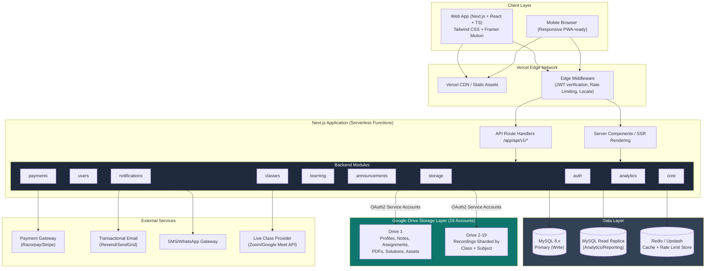

### 2.2 Architectural Style Justification

| Option Considered | Verdict | Reason |
|---|---|---|
| Full Microservices | ❌ Rejected | Overkill for launch scale; adds network latency, deployment complexity, and cost not justified by current load |
| Modular Monolith (Chosen) | ✅ Selected | Single deployable unit on Vercel, clean module boundaries, easy to later extract `storage` or `analytics` into standalone services |
| ORM (Prisma/TypeORM) | ❌ Rejected per requirement | Raw SQL mandated for full query control, performance tuning, and avoidance of ORM abstraction overhead |
| Serverless Functions | ✅ Selected | Matches Vercel's execution model; auto-scales; pay-per-use |

### 2.3 Request Lifecycle (High-Level)

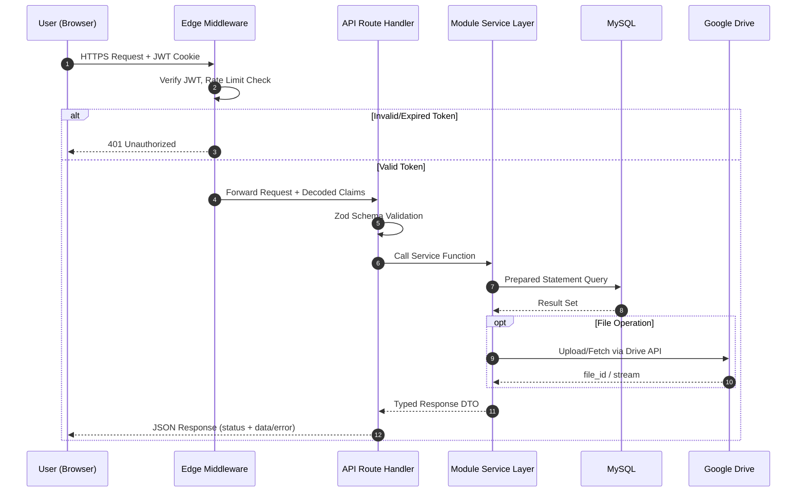


---

## 3. Technology Stack

| Layer | Technology | Purpose |
|---|---|---|
| Frontend Framework | Next.js 14+ (App Router) | SSR/SSG/ISR, file-based routing, React Server Components |
| Language | TypeScript (strict mode) | Type safety across frontend and backend |
| Styling | Tailwind CSS | Utility-first, design-token driven styling |
| Animation | Framer Motion | Page transitions, micro-interactions |
| Backend Runtime | Next.js Route Handlers (Node.js runtime) | REST API layer co-located with frontend |
| Database | MySQL 8.x | Relational data store, raw SQL via `mysql2` driver |
| Query Layer | Raw SQL + parameterized queries (`mysql2/promise`) | Full control, no ORM overhead |
| File Storage | Google Drive API v3 (19 accounts) | Binary storage: media, documents, recordings |
| Auth | JWT (access + refresh tokens) + bcrypt | Stateless authentication, secure password hashing |
| Cache/Session Aux | Redis (Upstash, serverless-friendly) | Rate limiting, session blacklist, hot-data cache |
| Hosting | Vercel | Serverless deployment, edge network, preview deployments |
| VCS/CI | GitHub + GitHub Actions | Source control, automated testing, deployment gating |
| Payments | Razorpay/Stripe (region-dependent) | Subscription & one-time fee collection |
| Email/SMS | Resend/SendGrid, Twilio/WhatsApp Business API | Notifications |
| Live Classes | Zoom SDK / Google Meet API | Live session hosting, hooks for recording ingestion |
| Monitoring | Vercel Analytics, Sentry | Performance monitoring, error tracking |

---

## 4. Repository & Folder Structure

A **single monorepo** houses the entire application, keeping frontend and backend co-located as is idiomatic for Next.js full-stack apps, while enforcing strict module boundaries internally.

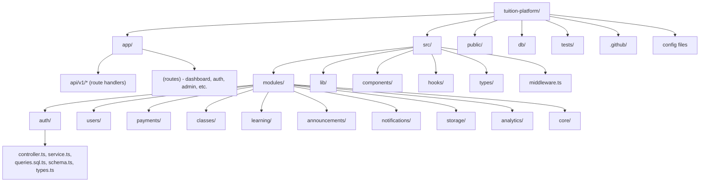

### 4.1 Full Directory Tree

```text
tuition-platform/
├── .github/
│   └── workflows/
│       ├── ci.yml                     # Lint, typecheck, test on PR
│       ├── deploy-preview.yml         # Vercel preview deploy
│       └── deploy-production.yml      # Vercel production deploy on main
├── app/
│   ├── (marketing)/                   # Public landing pages
│   │   ├── page.tsx
│   │   ├── pricing/page.tsx
│   │   └── about/page.tsx
│   ├── (auth)/
│   │   ├── login/page.tsx
│   │   ├── register/page.tsx
│   │   ├── forgot-password/page.tsx
│   │   └── reset-password/page.tsx
│   ├── (dashboard)/
│   │   ├── layout.tsx                 # Role-aware shell
│   │   ├── student/
│   │   ├── teacher/
│   │   ├── parent/
│   │   └── admin/
│   ├── api/
│   │   └── v1/
│   │       ├── auth/                  # login, register, refresh, logout
│   │       ├── users/
│   │       ├── payments/
│   │       ├── classes/
│   │       ├── learning/              # assignments, tests, materials
│   │       ├── announcements/
│   │       ├── notifications/
│   │       ├── storage/               # drive upload/fetch proxy
│   │       ├── analytics/
│   │       └── webhooks/              # payment/gateway webhooks
│   ├── layout.tsx
│   └── globals.css
├── src/
│   ├── modules/
│   │   ├── auth/
│   │   │   ├── auth.controller.ts
│   │   │   ├── auth.service.ts
│   │   │   ├── auth.queries.ts
│   │   │   ├── auth.schema.ts         # zod validation
│   │   │   ├── auth.types.ts
│   │   │   └── auth.test.ts
│   │   ├── users/
│   │   ├── payments/
│   │   ├── classes/
│   │   ├── learning/
│   │   ├── announcements/
│   │   ├── notifications/
│   │   ├── storage/
│   │   │   ├── drive.client.ts        # Google Drive SDK wrapper
│   │   │   ├── drive.router.ts        # Chooses which of 19 accounts to use
│   │   │   └── storage.service.ts
│   │   ├── analytics/
│   │   └── core/
│   │       ├── db.ts                  # MySQL pool singleton
│   │       ├── logger.ts
│   │       ├── errors.ts              # Custom error classes
│   │       ├── response.ts            # Standard API response envelope
│   │       └── constants.ts
│   ├── lib/
│   │   ├── jwt.ts
│   │   ├── bcrypt.ts
│   │   ├── rateLimiter.ts
│   │   ├── validation.ts
│   │   ├── cache.ts
│   │   └── env.ts                     # Typed env var loader/validator
│   ├── components/
│   │   ├── ui/                        # Buttons, Cards, Modals (design system)
│   │   ├── forms/
│   │   ├── dashboard/
│   │   └── shared/
│   ├── hooks/
│   ├── types/
│   └── middleware.ts                  # JWT check, RBAC gate, rate limit
├── db/
│   ├── migrations/
│   │   ├── 0001_init_core_tables.sql
│   │   ├── 0002_payments.sql
│   │   ├── 0003_classes_learning.sql
│   │   ├── 0004_storage_metadata.sql
│   │   ├── 0005_notifications_analytics.sql
│   │   └── 0006_triggers_and_indexes.sql
│   ├── seeds/
│   └── schema.sql                     # Full consolidated schema (reference)
├── tests/
│   ├── unit/
│   ├── integration/
│   └── e2e/
├── public/
│   ├── icons/
│   └── images/
├── .env.example
├── next.config.ts
├── tailwind.config.ts
├── tsconfig.json
├── package.json
└── README.md
```

---

## 5. Backend Architecture (Modules)

Each module is a vertical slice containing its own controller (route handler), service (business logic), queries (raw SQL), schema (Zod validation), and types. Modules communicate with each other only through exported service functions — never by directly querying another module's tables — to preserve loose coupling.

### 5.1 Module Responsibility Matrix

| Module | Responsibilities | Key Tables Owned |
|---|---|---|
| **auth** | Registration, login, JWT issuance/refresh, password reset, email/OTP verification, logout, session revocation | `users` (credentials portion), `refresh_tokens`, `password_reset_tokens`, `otp_verifications` |
| **users** | Profile CRUD, role management, parent-student linking, teacher profiles, admin user management | `users`, `student_profiles`, `teacher_profiles`, `parent_student_links`, `addresses` |
| **payments** | Fee plans, invoices, transactions, payment gateway webhooks, refunds, subscription lifecycle | `fee_plans`, `invoices`, `transactions`, `subscriptions`, `refunds` |
| **classes** | Class/batch definitions, subjects, timetable/schedule, enrollments, live session metadata | `classes`, `subjects`, `batches`, `enrollments`, `timetable_slots`, `live_sessions` |
| **learning** | Assignments, submissions, grading, weekly tests, test attempts, materials/notes metadata | `assignments`, `assignment_submissions`, `tests`, `test_questions`, `test_attempts`, `materials` |
| **announcements** | Class/global announcements, comments, pinning | `announcements`, `announcement_targets` |
| **notifications** | In-app notifications, email/SMS dispatch queue, read/unread state, preferences | `notifications`, `notification_preferences`, `notification_deliveries` |
| **storage** | Google Drive account routing, file metadata registry, upload session tracking, quota monitoring | `drive_accounts`, `files`, `file_access_logs`, `upload_sessions` |
| **analytics** | Attendance aggregation, performance dashboards, revenue reports, engagement metrics | `attendance_records`, `analytics_snapshots`, `activity_logs` |
| **core** | Shared infrastructure: DB pool, logger, error classes, response envelope, config, audit log | `audit_logs`, `system_config` |

### 5.2 Module Internal Structure (Example: `payments`)

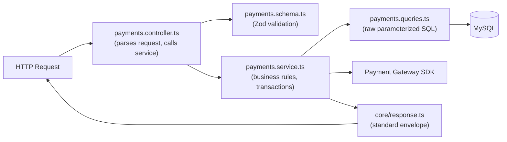

### 5.3 Layered Backend Architecture (Cross-Cutting)

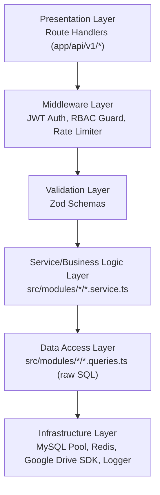

### 5.4 Standard API Response Envelope

All endpoints return a consistent shape to simplify frontend error handling:

```typescript
// Success
{
  "success": true,
  "data": { /* payload */ },
  "meta": { "requestId": "uuid", "timestamp": "ISO8601" }
}

// Failure
{
  "success": false,
  "error": {
    "code": "VALIDATION_ERROR",
    "message": "Human readable message",
    "details": [ { "field": "email", "issue": "Invalid email format" } ]
  },
  "meta": { "requestId": "uuid", "timestamp": "ISO8601" }
}
```

---

## 6. Frontend Architecture

### 6.1 Rendering Strategy

| Route Type | Strategy | Rationale |
|---|---|---|
| Marketing pages (`/`, `/pricing`, `/about`) | Static Generation (SSG) + ISR (revalidate 1hr) | SEO, fast TTFB, low change frequency |
| Auth pages | Client-rendered forms inside Server Component shell | Interactive forms, minimal SEO need |
| Dashboards (student/teacher/parent/admin) | Server Components fetch initial data + Client Components for interactivity | Fast first paint, reduced client JS |
| Live class page | Fully client-rendered (WebRTC/Meet SDK embed) | Requires browser APIs |
| Analytics dashboards | Server Component data fetch + client-side chart hydration | Heavy chart libs loaded only where needed |

### 6.2 Component Architecture

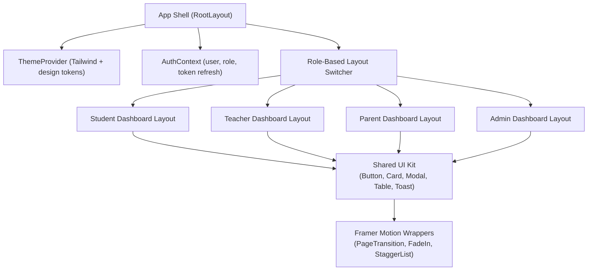

### 6.3 State Management Strategy

| State Type | Tool | Example |
|---|---|---|
| Server state (data fetched from API) | React Server Components + `fetch` with tags, plus TanStack Query on client for mutations/refetch | Class lists, assignments |
| Auth/session state | React Context + HTTP-only cookie (JWT) | Current user, role, permissions |
| UI/local state | `useState`/`useReducer` | Modal open/close, form steps |
| Global ephemeral state | Zustand (lightweight) | Notification toast queue, sidebar collapse |
| Form state | React Hook Form + Zod resolver | All forms (registration, payment, assignment upload) |

### 6.4 Design System Conventions

- **Design tokens** defined in `tailwind.config.ts` (`colors.brand.*`, `spacing`, `radius`, `shadow.premium`) to keep a consistent premium visual identity independent of any single reference layout.
- **Framer Motion** used for: route transitions, skeleton-to-content fades, dashboard card stagger-in, modal enter/exit — kept subtle (150–300ms) to preserve a premium, non-gimmicky feel.
- **Accessibility**: All interactive components meet WCAG 2.1 AA (focus rings, ARIA labels, color contrast ≥ 4.5:1).
- **Responsiveness**: Mobile-first Tailwind breakpoints (`sm/md/lg/xl/2xl`); dashboard sidebars collapse to bottom nav / drawer under `md`.

---

## 7. Database Design (MySQL, 3NF+)

### 7.1 Normalization Approach

The schema is normalized to **Third Normal Form (3NF)** as a baseline, with selected **BCNF-level** decisions (e.g., separating `student_profiles` from `users`, separating `test_questions` from `test_options`) to eliminate transitive dependencies. Deliberate, documented denormalization is limited to the `analytics_snapshots` table (a materialized rollup) for read performance — this is a standard, justified exception to 3NF for reporting workloads.

| Normal Form | How It's Satisfied |
|---|---|
| 1NF | Every column holds a single atomic value; no repeating groups (e.g., multiple subjects per teacher are stored in `teacher_subjects`, not a CSV column) |
| 2NF | Every non-key column depends on the *whole* primary key; composite-keyed tables like `enrollments` (student_id, class_id) have no column depending on only part of the key |
| 3NF | No transitive dependencies — e.g., `invoice.student_name` is never stored; it is derived via `invoice.student_id → users.full_name` |

### 7.2 Entity Relationship Diagram (Core Domain)

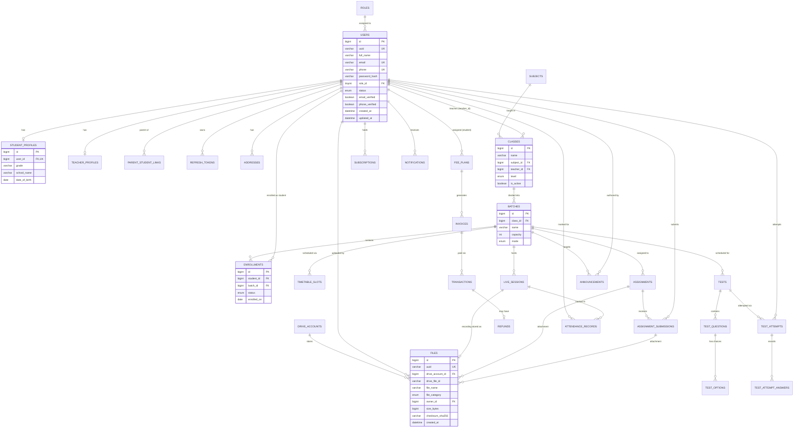

### 7.3 Table Catalog

| # | Table | Purpose |
|---|---|---|
| 1 | `roles` | Static lookup of roles (student, teacher, parent, admin, super_admin) |
| 2 | `users` | Core identity record for every human in the system |
| 3 | `student_profiles` | Student-specific attributes (1:1 with users) |
| 4 | `teacher_profiles` | Teacher-specific attributes (1:1 with users) |
| 5 | `teacher_subjects` | Many-to-many: teacher ↔ subjects qualified to teach |
| 6 | `parent_student_links` | Many-to-many: parent ↔ student, with relationship type |
| 7 | `addresses` | Normalized address records per user |
| 8 | `refresh_tokens` | Active refresh tokens for session rotation/revocation |
| 9 | `password_reset_tokens` | One-time password reset tokens |
| 10 | `otp_verifications` | OTP codes for phone/email verification |
| 11 | `subjects` | Master list of subjects (Math, Physics, etc.) |
| 12 | `classes` | A course offering: subject + level + teacher |
| 13 | `batches` | A running instance/section of a class (time-bound cohort) |
| 14 | `enrollments` | Student ↔ Batch enrollment record |
| 15 | `timetable_slots` | Weekly recurring schedule for a batch |
| 16 | `live_sessions` | A specific instance of a live class occurrence |
| 17 | `attendance_records` | Per-student attendance for a live session |
| 18 | `assignments` | Homework/assignment definitions per batch |
| 19 | `assignment_submissions` | Student submissions + grading |
| 20 | `tests` | Weekly/periodic test definitions |
| 21 | `test_questions` | Questions belonging to a test |
| 22 | `test_options` | MCQ options belonging to a question |
| 23 | `test_attempts` | A student's attempt at a test |
| 24 | `test_attempt_answers` | Individual answers within an attempt |
| 25 | `materials` | Notes/PDFs metadata (pointer to `files`) |
| 26 | `fee_plans` | Fee structure assigned to a student/batch |
| 27 | `invoices` | Billing invoices generated from fee plans |
| 28 | `transactions` | Payment gateway transaction records |
| 29 | `subscriptions` | Recurring subscription state |
| 30 | `refunds` | Refund records linked to transactions |
| 31 | `announcements` | Announcement content |
| 32 | `announcement_targets` | Which batch/role/user an announcement targets |
| 33 | `notifications` | In-app notification records |
| 34 | `notification_preferences` | Per-user channel opt-in/out |
| 35 | `notification_deliveries` | Delivery attempts/status per channel |
| 36 | `drive_accounts` | Registry of the 19 Google Drive service accounts |
| 37 | `files` | Metadata for every file stored on Drive |
| 38 | `file_access_logs` | Audit trail of file views/downloads |
| 39 | `upload_sessions` | Resumable upload session tracking |
| 40 | `analytics_snapshots` | Precomputed daily/weekly rollups (denormalized, justified) |
| 41 | `activity_logs` | General user activity trail (page views, actions) |
| 42 | `audit_logs` | Immutable log of sensitive mutations (payments, role changes) |
| 43 | `system_config` | Key-value platform configuration |

### 7.4 Full DDL (MySQL 8.x)

```sql
-- ============================================================
-- 0. EXTENSIONS / SETTINGS
-- ============================================================
SET NAMES utf8mb4;
SET time_zone = '+00:00';

-- ============================================================
-- 1. IDENTITY & ACCESS
-- ============================================================
CREATE TABLE roles (
    id              TINYINT UNSIGNED PRIMARY KEY AUTO_INCREMENT,
    name            VARCHAR(30) NOT NULL UNIQUE,          -- 'student','teacher','parent','admin','super_admin'
    description     VARCHAR(255) NULL
) ENGINE=InnoDB;

CREATE TABLE users (
    id              BIGINT UNSIGNED PRIMARY KEY AUTO_INCREMENT,
    uuid            CHAR(36) NOT NULL UNIQUE,
    full_name       VARCHAR(150) NOT NULL,
    email           VARCHAR(190) NOT NULL UNIQUE,
    phone           VARCHAR(20) NULL UNIQUE,
    password_hash   VARCHAR(255) NOT NULL,                -- bcrypt hash
    role_id         TINYINT UNSIGNED NOT NULL,
    status          ENUM('active','suspended','pending','deactivated') NOT NULL DEFAULT 'pending',
    email_verified  BOOLEAN NOT NULL DEFAULT FALSE,
    phone_verified  BOOLEAN NOT NULL DEFAULT FALSE,
    avatar_file_id  BIGINT UNSIGNED NULL,                 -- FK to files, added after files table exists
    last_login_at   DATETIME NULL,
    created_at      DATETIME NOT NULL DEFAULT CURRENT_TIMESTAMP,
    updated_at      DATETIME NOT NULL DEFAULT CURRENT_TIMESTAMP ON UPDATE CURRENT_TIMESTAMP,
    CONSTRAINT fk_users_role FOREIGN KEY (role_id) REFERENCES roles(id) ON UPDATE CASCADE ON DELETE RESTRICT,
    INDEX idx_users_role (role_id),
    INDEX idx_users_status (status),
    INDEX idx_users_email (email)
) ENGINE=InnoDB;

CREATE TABLE student_profiles (
    id              BIGINT UNSIGNED PRIMARY KEY AUTO_INCREMENT,
    user_id         BIGINT UNSIGNED NOT NULL UNIQUE,
    grade           VARCHAR(20) NULL,
    school_name     VARCHAR(150) NULL,
    date_of_birth   DATE NULL,
    board           VARCHAR(50) NULL,                     -- CBSE/ICSE/State/etc.
    created_at      DATETIME NOT NULL DEFAULT CURRENT_TIMESTAMP,
    CONSTRAINT fk_student_profiles_user FOREIGN KEY (user_id) REFERENCES users(id) ON DELETE CASCADE
) ENGINE=InnoDB;

CREATE TABLE teacher_profiles (
    id              BIGINT UNSIGNED PRIMARY KEY AUTO_INCREMENT,
    user_id         BIGINT UNSIGNED NOT NULL UNIQUE,
    qualification   VARCHAR(150) NULL,
    experience_years SMALLINT UNSIGNED NULL,
    bio             TEXT NULL,
    hourly_rate     DECIMAL(10,2) NULL,
    created_at      DATETIME NOT NULL DEFAULT CURRENT_TIMESTAMP,
    CONSTRAINT fk_teacher_profiles_user FOREIGN KEY (user_id) REFERENCES users(id) ON DELETE CASCADE
) ENGINE=InnoDB;

CREATE TABLE subjects (
    id              INT UNSIGNED PRIMARY KEY AUTO_INCREMENT,
    name            VARCHAR(100) NOT NULL UNIQUE,
    code            VARCHAR(20) NOT NULL UNIQUE
) ENGINE=InnoDB;

CREATE TABLE teacher_subjects (
    teacher_id      BIGINT UNSIGNED NOT NULL,
    subject_id      INT UNSIGNED NOT NULL,
    PRIMARY KEY (teacher_id, subject_id),
    CONSTRAINT fk_ts_teacher FOREIGN KEY (teacher_id) REFERENCES teacher_profiles(id) ON DELETE CASCADE,
    CONSTRAINT fk_ts_subject FOREIGN KEY (subject_id) REFERENCES subjects(id) ON DELETE CASCADE
) ENGINE=InnoDB;

CREATE TABLE parent_student_links (
    id              BIGINT UNSIGNED PRIMARY KEY AUTO_INCREMENT,
    parent_id       BIGINT UNSIGNED NOT NULL,
    student_id      BIGINT UNSIGNED NOT NULL,
    relationship    ENUM('father','mother','guardian','other') NOT NULL DEFAULT 'guardian',
    is_primary      BOOLEAN NOT NULL DEFAULT TRUE,
    UNIQUE KEY uq_parent_student (parent_id, student_id),
    CONSTRAINT fk_psl_parent FOREIGN KEY (parent_id) REFERENCES users(id) ON DELETE CASCADE,
    CONSTRAINT fk_psl_student FOREIGN KEY (student_id) REFERENCES users(id) ON DELETE CASCADE
) ENGINE=InnoDB;

CREATE TABLE addresses (
    id              BIGINT UNSIGNED PRIMARY KEY AUTO_INCREMENT,
    user_id         BIGINT UNSIGNED NOT NULL,
    line1           VARCHAR(255) NOT NULL,
    line2           VARCHAR(255) NULL,
    city            VARCHAR(100) NOT NULL,
    state           VARCHAR(100) NOT NULL,
    postal_code     VARCHAR(20) NOT NULL,
    country         VARCHAR(100) NOT NULL DEFAULT 'India',
    is_default      BOOLEAN NOT NULL DEFAULT TRUE,
    CONSTRAINT fk_addresses_user FOREIGN KEY (user_id) REFERENCES users(id) ON DELETE CASCADE,
    INDEX idx_addresses_user (user_id)
) ENGINE=InnoDB;

CREATE TABLE refresh_tokens (
    id              BIGINT UNSIGNED PRIMARY KEY AUTO_INCREMENT,
    user_id         BIGINT UNSIGNED NOT NULL,
    token_hash      VARCHAR(255) NOT NULL,                -- SHA-256 of the refresh token
    device_info     VARCHAR(255) NULL,
    ip_address      VARCHAR(45) NULL,
    is_revoked      BOOLEAN NOT NULL DEFAULT FALSE,
    expires_at      DATETIME NOT NULL,
    created_at      DATETIME NOT NULL DEFAULT CURRENT_TIMESTAMP,
    CONSTRAINT fk_rt_user FOREIGN KEY (user_id) REFERENCES users(id) ON DELETE CASCADE,
    INDEX idx_rt_user (user_id),
    INDEX idx_rt_expires (expires_at)
) ENGINE=InnoDB;

CREATE TABLE password_reset_tokens (
    id              BIGINT UNSIGNED PRIMARY KEY AUTO_INCREMENT,
    user_id         BIGINT UNSIGNED NOT NULL,
    token_hash      VARCHAR(255) NOT NULL,
    expires_at      DATETIME NOT NULL,
    used_at         DATETIME NULL,
    created_at      DATETIME NOT NULL DEFAULT CURRENT_TIMESTAMP,
    CONSTRAINT fk_prt_user FOREIGN KEY (user_id) REFERENCES users(id) ON DELETE CASCADE
) ENGINE=InnoDB;

CREATE TABLE otp_verifications (
    id              BIGINT UNSIGNED PRIMARY KEY AUTO_INCREMENT,
    user_id         BIGINT UNSIGNED NOT NULL,
    channel         ENUM('email','sms') NOT NULL,
    otp_hash        VARCHAR(255) NOT NULL,
    purpose         ENUM('registration','login_2fa','password_reset') NOT NULL,
    attempts         TINYINT UNSIGNED NOT NULL DEFAULT 0,
    expires_at      DATETIME NOT NULL,
    created_at      DATETIME NOT NULL DEFAULT CURRENT_TIMESTAMP,
    CONSTRAINT fk_otp_user FOREIGN KEY (user_id) REFERENCES users(id) ON DELETE CASCADE
) ENGINE=InnoDB;

-- ============================================================
-- 2. CLASSES & LEARNING STRUCTURE
-- ============================================================
CREATE TABLE classes (
    id              BIGINT UNSIGNED PRIMARY KEY AUTO_INCREMENT,
    name            VARCHAR(150) NOT NULL,
    subject_id      INT UNSIGNED NOT NULL,
    teacher_id      BIGINT UNSIGNED NOT NULL,
    level           ENUM('beginner','intermediate','advanced') NOT NULL DEFAULT 'beginner',
    description     TEXT NULL,
    is_active       BOOLEAN NOT NULL DEFAULT TRUE,
    created_at      DATETIME NOT NULL DEFAULT CURRENT_TIMESTAMP,
    CONSTRAINT fk_classes_subject FOREIGN KEY (subject_id) REFERENCES subjects(id) ON DELETE RESTRICT,
    CONSTRAINT fk_classes_teacher FOREIGN KEY (teacher_id) REFERENCES users(id) ON DELETE RESTRICT,
    INDEX idx_classes_subject (subject_id),
    INDEX idx_classes_teacher (teacher_id)
) ENGINE=InnoDB;

CREATE TABLE batches (
    id              BIGINT UNSIGNED PRIMARY KEY AUTO_INCREMENT,
    class_id        BIGINT UNSIGNED NOT NULL,
    name            VARCHAR(100) NOT NULL,                -- e.g., "Batch A - Evening"
    capacity        SMALLINT UNSIGNED NOT NULL DEFAULT 30,
    mode            ENUM('live_online','recorded','hybrid') NOT NULL DEFAULT 'live_online',
    start_date      DATE NOT NULL,
    end_date        DATE NULL,
    is_active       BOOLEAN NOT NULL DEFAULT TRUE,
    CONSTRAINT fk_batches_class FOREIGN KEY (class_id) REFERENCES classes(id) ON DELETE CASCADE,
    INDEX idx_batches_class (class_id)
) ENGINE=InnoDB;

CREATE TABLE enrollments (
    id              BIGINT UNSIGNED PRIMARY KEY AUTO_INCREMENT,
    student_id      BIGINT UNSIGNED NOT NULL,
    batch_id        BIGINT UNSIGNED NOT NULL,
    status          ENUM('active','completed','dropped','pending_payment') NOT NULL DEFAULT 'pending_payment',
    enrolled_on     DATE NOT NULL,
    UNIQUE KEY uq_student_batch (student_id, batch_id),
    CONSTRAINT fk_enroll_student FOREIGN KEY (student_id) REFERENCES users(id) ON DELETE CASCADE,
    CONSTRAINT fk_enroll_batch FOREIGN KEY (batch_id) REFERENCES batches(id) ON DELETE CASCADE,
    INDEX idx_enroll_batch (batch_id),
    INDEX idx_enroll_status (status)
) ENGINE=InnoDB;

CREATE TABLE timetable_slots (
    id              BIGINT UNSIGNED PRIMARY KEY AUTO_INCREMENT,
    batch_id        BIGINT UNSIGNED NOT NULL,
    day_of_week     TINYINT UNSIGNED NOT NULL,             -- 0=Sunday ... 6=Saturday
    start_time      TIME NOT NULL,
    end_time        TIME NOT NULL,
    CONSTRAINT fk_tts_batch FOREIGN KEY (batch_id) REFERENCES batches(id) ON DELETE CASCADE,
    CONSTRAINT chk_time_order CHECK (end_time > start_time),
    INDEX idx_tts_batch (batch_id)
) ENGINE=InnoDB;

CREATE TABLE live_sessions (
    id              BIGINT UNSIGNED PRIMARY KEY AUTO_INCREMENT,
    batch_id        BIGINT UNSIGNED NOT NULL,
    title           VARCHAR(200) NOT NULL,
    scheduled_start DATETIME NOT NULL,
    scheduled_end   DATETIME NOT NULL,
    actual_start    DATETIME NULL,
    actual_end      DATETIME NULL,
    meeting_url     VARCHAR(500) NULL,
    provider        ENUM('zoom','google_meet','custom') NOT NULL DEFAULT 'zoom',
    status          ENUM('scheduled','live','completed','cancelled') NOT NULL DEFAULT 'scheduled',
    recording_file_id BIGINT UNSIGNED NULL,                -- FK to files, nullable until processed
    CONSTRAINT fk_ls_batch FOREIGN KEY (batch_id) REFERENCES batches(id) ON DELETE CASCADE,
    CONSTRAINT chk_ls_time CHECK (scheduled_end > scheduled_start),
    INDEX idx_ls_batch (batch_id),
    INDEX idx_ls_status (status),
    INDEX idx_ls_scheduled_start (scheduled_start)
) ENGINE=InnoDB;

CREATE TABLE attendance_records (
    id              BIGINT UNSIGNED PRIMARY KEY AUTO_INCREMENT,
    live_session_id BIGINT UNSIGNED NOT NULL,
    student_id      BIGINT UNSIGNED NOT NULL,
    joined_at       DATETIME NULL,
    left_at         DATETIME NULL,
    duration_seconds INT UNSIGNED NULL,
    status          ENUM('present','absent','late') NOT NULL DEFAULT 'absent',
    UNIQUE KEY uq_session_student (live_session_id, student_id),
    CONSTRAINT fk_ar_session FOREIGN KEY (live_session_id) REFERENCES live_sessions(id) ON DELETE CASCADE,
    CONSTRAINT fk_ar_student FOREIGN KEY (student_id) REFERENCES users(id) ON DELETE CASCADE,
    INDEX idx_ar_student (student_id)
) ENGINE=InnoDB;

-- ============================================================
-- 3. ASSIGNMENTS & TESTS
-- ============================================================
CREATE TABLE assignments (
    id              BIGINT UNSIGNED PRIMARY KEY AUTO_INCREMENT,
    batch_id        BIGINT UNSIGNED NOT NULL,
    title           VARCHAR(200) NOT NULL,
    description     TEXT NULL,
    attachment_file_id BIGINT UNSIGNED NULL,
    due_date        DATETIME NOT NULL,
    max_score       DECIMAL(6,2) NOT NULL DEFAULT 100.00,
    created_by      BIGINT UNSIGNED NOT NULL,
    created_at      DATETIME NOT NULL DEFAULT CURRENT_TIMESTAMP,
    CONSTRAINT fk_assign_batch FOREIGN KEY (batch_id) REFERENCES batches(id) ON DELETE CASCADE,
    CONSTRAINT fk_assign_creator FOREIGN KEY (created_by) REFERENCES users(id) ON DELETE RESTRICT,
    INDEX idx_assign_batch (batch_id),
    INDEX idx_assign_due (due_date)
) ENGINE=InnoDB;

CREATE TABLE assignment_submissions (
    id              BIGINT UNSIGNED PRIMARY KEY AUTO_INCREMENT,
    assignment_id   BIGINT UNSIGNED NOT NULL,
    student_id      BIGINT UNSIGNED NOT NULL,
    file_id         BIGINT UNSIGNED NOT NULL,
    submitted_at    DATETIME NOT NULL DEFAULT CURRENT_TIMESTAMP,
    is_late         BOOLEAN NOT NULL DEFAULT FALSE,
    score           DECIMAL(6,2) NULL,
    feedback        TEXT NULL,
    graded_by       BIGINT UNSIGNED NULL,
    graded_at       DATETIME NULL,
    UNIQUE KEY uq_assignment_student (assignment_id, student_id),
    CONSTRAINT fk_sub_assignment FOREIGN KEY (assignment_id) REFERENCES assignments(id) ON DELETE CASCADE,
    CONSTRAINT fk_sub_student FOREIGN KEY (student_id) REFERENCES users(id) ON DELETE CASCADE,
    CONSTRAINT fk_sub_grader FOREIGN KEY (graded_by) REFERENCES users(id) ON DELETE SET NULL,
    INDEX idx_sub_student (student_id)
) ENGINE=InnoDB;

CREATE TABLE tests (
    id              BIGINT UNSIGNED PRIMARY KEY AUTO_INCREMENT,
    batch_id        BIGINT UNSIGNED NOT NULL,
    title           VARCHAR(200) NOT NULL,
    test_type       ENUM('weekly','monthly','mock','practice') NOT NULL DEFAULT 'weekly',
    duration_minutes SMALLINT UNSIGNED NOT NULL DEFAULT 30,
    total_marks     DECIMAL(6,2) NOT NULL DEFAULT 100.00,
    scheduled_at    DATETIME NOT NULL,
    is_published    BOOLEAN NOT NULL DEFAULT FALSE,
    CONSTRAINT fk_tests_batch FOREIGN KEY (batch_id) REFERENCES batches(id) ON DELETE CASCADE,
    INDEX idx_tests_batch (batch_id),
    INDEX idx_tests_scheduled (scheduled_at)
) ENGINE=InnoDB;

CREATE TABLE test_questions (
    id              BIGINT UNSIGNED PRIMARY KEY AUTO_INCREMENT,
    test_id         BIGINT UNSIGNED NOT NULL,
    question_text   TEXT NOT NULL,
    question_type   ENUM('mcq','short_answer','long_answer') NOT NULL DEFAULT 'mcq',
    marks           DECIMAL(5,2) NOT NULL DEFAULT 1.00,
    sequence_no     SMALLINT UNSIGNED NOT NULL,
    CONSTRAINT fk_tq_test FOREIGN KEY (test_id) REFERENCES tests(id) ON DELETE CASCADE,
    INDEX idx_tq_test (test_id)
) ENGINE=InnoDB;

CREATE TABLE test_options (
    id              BIGINT UNSIGNED PRIMARY KEY AUTO_INCREMENT,
    question_id     BIGINT UNSIGNED NOT NULL,
    option_text     VARCHAR(500) NOT NULL,
    is_correct      BOOLEAN NOT NULL DEFAULT FALSE,
    CONSTRAINT fk_topt_question FOREIGN KEY (question_id) REFERENCES test_questions(id) ON DELETE CASCADE,
    INDEX idx_topt_question (question_id)
) ENGINE=InnoDB;

CREATE TABLE test_attempts (
    id              BIGINT UNSIGNED PRIMARY KEY AUTO_INCREMENT,
    test_id         BIGINT UNSIGNED NOT NULL,
    student_id      BIGINT UNSIGNED NOT NULL,
    started_at      DATETIME NOT NULL DEFAULT CURRENT_TIMESTAMP,
    submitted_at    DATETIME NULL,
    total_score     DECIMAL(6,2) NULL,
    status          ENUM('in_progress','submitted','auto_submitted','graded') NOT NULL DEFAULT 'in_progress',
    UNIQUE KEY uq_test_student_attempt (test_id, student_id),
    CONSTRAINT fk_ta_test FOREIGN KEY (test_id) REFERENCES tests(id) ON DELETE CASCADE,
    CONSTRAINT fk_ta_student FOREIGN KEY (student_id) REFERENCES users(id) ON DELETE CASCADE,
    INDEX idx_ta_student (student_id)
) ENGINE=InnoDB;

CREATE TABLE test_attempt_answers (
    id              BIGINT UNSIGNED PRIMARY KEY AUTO_INCREMENT,
    attempt_id      BIGINT UNSIGNED NOT NULL,
    question_id     BIGINT UNSIGNED NOT NULL,
    selected_option_id BIGINT UNSIGNED NULL,
    answer_text     TEXT NULL,
    is_correct      BOOLEAN NULL,
    marks_awarded   DECIMAL(5,2) NULL,
    UNIQUE KEY uq_attempt_question (attempt_id, question_id),
    CONSTRAINT fk_taa_attempt FOREIGN KEY (attempt_id) REFERENCES test_attempts(id) ON DELETE CASCADE,
    CONSTRAINT fk_taa_question FOREIGN KEY (question_id) REFERENCES test_questions(id) ON DELETE CASCADE,
    CONSTRAINT fk_taa_option FOREIGN KEY (selected_option_id) REFERENCES test_options(id) ON DELETE SET NULL
) ENGINE=InnoDB;

CREATE TABLE materials (
    id              BIGINT UNSIGNED PRIMARY KEY AUTO_INCREMENT,
    batch_id        BIGINT UNSIGNED NOT NULL,
    file_id         BIGINT UNSIGNED NOT NULL,
    title           VARCHAR(200) NOT NULL,
    material_type   ENUM('note','solution','pdf','reference') NOT NULL DEFAULT 'note',
    uploaded_by     BIGINT UNSIGNED NOT NULL,
    created_at      DATETIME NOT NULL DEFAULT CURRENT_TIMESTAMP,
    CONSTRAINT fk_mat_batch FOREIGN KEY (batch_id) REFERENCES batches(id) ON DELETE CASCADE,
    CONSTRAINT fk_mat_uploader FOREIGN KEY (uploaded_by) REFERENCES users(id) ON DELETE RESTRICT,
    INDEX idx_mat_batch (batch_id)
) ENGINE=InnoDB;

-- ============================================================
-- 4. PAYMENTS
-- ============================================================
CREATE TABLE fee_plans (
    id              BIGINT UNSIGNED PRIMARY KEY AUTO_INCREMENT,
    batch_id        BIGINT UNSIGNED NOT NULL,
    name            VARCHAR(150) NOT NULL,
    amount          DECIMAL(10,2) NOT NULL,
    billing_cycle   ENUM('one_time','monthly','quarterly','yearly') NOT NULL DEFAULT 'monthly',
    currency        CHAR(3) NOT NULL DEFAULT 'INR',
    is_active       BOOLEAN NOT NULL DEFAULT TRUE,
    CONSTRAINT fk_fp_batch FOREIGN KEY (batch_id) REFERENCES batches(id) ON DELETE CASCADE
) ENGINE=InnoDB;

CREATE TABLE invoices (
    id              BIGINT UNSIGNED PRIMARY KEY AUTO_INCREMENT,
    invoice_number  VARCHAR(30) NOT NULL UNIQUE,
    student_id      BIGINT UNSIGNED NOT NULL,
    fee_plan_id     BIGINT UNSIGNED NOT NULL,
    amount_due      DECIMAL(10,2) NOT NULL,
    due_date        DATE NOT NULL,
    status          ENUM('pending','paid','overdue','cancelled') NOT NULL DEFAULT 'pending',
    created_at      DATETIME NOT NULL DEFAULT CURRENT_TIMESTAMP,
    CONSTRAINT fk_inv_student FOREIGN KEY (student_id) REFERENCES users(id) ON DELETE CASCADE,
    CONSTRAINT fk_inv_plan FOREIGN KEY (fee_plan_id) REFERENCES fee_plans(id) ON DELETE RESTRICT,
    INDEX idx_inv_student (student_id),
    INDEX idx_inv_status (status)
) ENGINE=InnoDB;

CREATE TABLE transactions (
    id              BIGINT UNSIGNED PRIMARY KEY AUTO_INCREMENT,
    invoice_id      BIGINT UNSIGNED NOT NULL,
    gateway         ENUM('razorpay','stripe') NOT NULL,
    gateway_txn_id  VARCHAR(150) NOT NULL,
    amount          DECIMAL(10,2) NOT NULL,
    currency        CHAR(3) NOT NULL DEFAULT 'INR',
    status          ENUM('initiated','success','failed','refunded') NOT NULL DEFAULT 'initiated',
    paid_at         DATETIME NULL,
    raw_payload     JSON NULL,
    created_at      DATETIME NOT NULL DEFAULT CURRENT_TIMESTAMP,
    UNIQUE KEY uq_gateway_txn (gateway, gateway_txn_id),
    CONSTRAINT fk_txn_invoice FOREIGN KEY (invoice_id) REFERENCES invoices(id) ON DELETE RESTRICT,
    INDEX idx_txn_status (status)
) ENGINE=InnoDB;

CREATE TABLE subscriptions (
    id              BIGINT UNSIGNED PRIMARY KEY AUTO_INCREMENT,
    student_id      BIGINT UNSIGNED NOT NULL,
    fee_plan_id     BIGINT UNSIGNED NOT NULL,
    status          ENUM('active','paused','cancelled','expired') NOT NULL DEFAULT 'active',
    current_period_start DATE NOT NULL,
    current_period_end   DATE NOT NULL,
    CONSTRAINT fk_sub_student FOREIGN KEY (student_id) REFERENCES users(id) ON DELETE CASCADE,
    CONSTRAINT fk_sub_plan FOREIGN KEY (fee_plan_id) REFERENCES fee_plans(id) ON DELETE RESTRICT,
    INDEX idx_sub_student (student_id)
) ENGINE=InnoDB;

CREATE TABLE refunds (
    id              BIGINT UNSIGNED PRIMARY KEY AUTO_INCREMENT,
    transaction_id  BIGINT UNSIGNED NOT NULL UNIQUE,
    amount          DECIMAL(10,2) NOT NULL,
    reason          VARCHAR(255) NULL,
    status          ENUM('pending','processed','rejected') NOT NULL DEFAULT 'pending',
    processed_at    DATETIME NULL,
    CONSTRAINT fk_refund_txn FOREIGN KEY (transaction_id) REFERENCES transactions(id) ON DELETE CASCADE
) ENGINE=InnoDB;

-- ============================================================
-- 5. ANNOUNCEMENTS & NOTIFICATIONS
-- ============================================================
CREATE TABLE announcements (
    id              BIGINT UNSIGNED PRIMARY KEY AUTO_INCREMENT,
    title           VARCHAR(200) NOT NULL,
    body            TEXT NOT NULL,
    author_id       BIGINT UNSIGNED NOT NULL,
    is_pinned       BOOLEAN NOT NULL DEFAULT FALSE,
    created_at      DATETIME NOT NULL DEFAULT CURRENT_TIMESTAMP,
    CONSTRAINT fk_ann_author FOREIGN KEY (author_id) REFERENCES users(id) ON DELETE RESTRICT
) ENGINE=InnoDB;

CREATE TABLE announcement_targets (
    id              BIGINT UNSIGNED PRIMARY KEY AUTO_INCREMENT,
    announcement_id BIGINT UNSIGNED NOT NULL,
    target_type     ENUM('global','role','batch','user') NOT NULL,
    target_id       BIGINT UNSIGNED NULL,                 -- NULL when target_type='global'
    CONSTRAINT fk_at_announcement FOREIGN KEY (announcement_id) REFERENCES announcements(id) ON DELETE CASCADE,
    INDEX idx_at_announcement (announcement_id),
    INDEX idx_at_target (target_type, target_id)
) ENGINE=InnoDB;

CREATE TABLE notifications (
    id              BIGINT UNSIGNED PRIMARY KEY AUTO_INCREMENT,
    user_id         BIGINT UNSIGNED NOT NULL,
    type            VARCHAR(50) NOT NULL,                 -- 'assignment_due','payment_success', etc.
    title           VARCHAR(200) NOT NULL,
    body            VARCHAR(500) NULL,
    metadata        JSON NULL,
    is_read         BOOLEAN NOT NULL DEFAULT FALSE,
    created_at      DATETIME NOT NULL DEFAULT CURRENT_TIMESTAMP,
    CONSTRAINT fk_notif_user FOREIGN KEY (user_id) REFERENCES users(id) ON DELETE CASCADE,
    INDEX idx_notif_user_unread (user_id, is_read)
) ENGINE=InnoDB;

CREATE TABLE notification_preferences (
    id              BIGINT UNSIGNED PRIMARY KEY AUTO_INCREMENT,
    user_id         BIGINT UNSIGNED NOT NULL UNIQUE,
    email_enabled   BOOLEAN NOT NULL DEFAULT TRUE,
    sms_enabled     BOOLEAN NOT NULL DEFAULT FALSE,
    push_enabled    BOOLEAN NOT NULL DEFAULT TRUE,
    CONSTRAINT fk_np_user FOREIGN KEY (user_id) REFERENCES users(id) ON DELETE CASCADE
) ENGINE=InnoDB;

CREATE TABLE notification_deliveries (
    id              BIGINT UNSIGNED PRIMARY KEY AUTO_INCREMENT,
    notification_id BIGINT UNSIGNED NOT NULL,
    channel         ENUM('email','sms','push','in_app') NOT NULL,
    status          ENUM('queued','sent','failed') NOT NULL DEFAULT 'queued',
    attempted_at    DATETIME NULL,
    error_message   VARCHAR(255) NULL,
    CONSTRAINT fk_nd_notification FOREIGN KEY (notification_id) REFERENCES notifications(id) ON DELETE CASCADE
) ENGINE=InnoDB;

-- ============================================================
-- 6. STORAGE (GOOGLE DRIVE METADATA REGISTRY)
-- ============================================================
CREATE TABLE drive_accounts (
    id              TINYINT UNSIGNED PRIMARY KEY AUTO_INCREMENT,   -- 1..19
    account_email   VARCHAR(190) NOT NULL UNIQUE,
    purpose         ENUM('primary_assets','recordings') NOT NULL,
    class_scope     VARCHAR(150) NULL,                    -- e.g., "Class 10 - Physics" for drives 2-19
    quota_bytes_total   BIGINT UNSIGNED NOT NULL DEFAULT 16106127360, -- 15GB default
    quota_bytes_used    BIGINT UNSIGNED NOT NULL DEFAULT 0,
    is_active       BOOLEAN NOT NULL DEFAULT TRUE
) ENGINE=InnoDB;

CREATE TABLE files (
    id                  BIGINT UNSIGNED PRIMARY KEY AUTO_INCREMENT,
    uuid                CHAR(36) NOT NULL UNIQUE,
    drive_account_id    TINYINT UNSIGNED NOT NULL,
    drive_file_id       VARCHAR(150) NOT NULL,
    drive_folder_path   VARCHAR(500) NOT NULL,             -- logical path for traceability
    file_name           VARCHAR(255) NOT NULL,
    mime_type           VARCHAR(150) NOT NULL,
    file_category       ENUM('profile_photo','note','assignment','pdf','solution','asset','recording') NOT NULL,
    owner_id            BIGINT UNSIGNED NOT NULL,
    size_bytes          BIGINT UNSIGNED NOT NULL,
    checksum_sha256     CHAR(64) NOT NULL,
    web_view_link       VARCHAR(500) NULL,
    is_deleted          BOOLEAN NOT NULL DEFAULT FALSE,
    created_at          DATETIME NOT NULL DEFAULT CURRENT_TIMESTAMP,
    UNIQUE KEY uq_drive_file (drive_account_id, drive_file_id),
    CONSTRAINT fk_files_drive FOREIGN KEY (drive_account_id) REFERENCES drive_accounts(id) ON DELETE RESTRICT,
    CONSTRAINT fk_files_owner FOREIGN KEY (owner_id) REFERENCES users(id) ON DELETE RESTRICT,
    INDEX idx_files_owner (owner_id),
    INDEX idx_files_category (file_category)
) ENGINE=InnoDB;

-- Deferred FKs now that `files` exists
ALTER TABLE users ADD CONSTRAINT fk_users_avatar FOREIGN KEY (avatar_file_id) REFERENCES files(id) ON DELETE SET NULL;
ALTER TABLE live_sessions ADD CONSTRAINT fk_ls_recording FOREIGN KEY (recording_file_id) REFERENCES files(id) ON DELETE SET NULL;
ALTER TABLE assignments ADD CONSTRAINT fk_assign_attachment FOREIGN KEY (attachment_file_id) REFERENCES files(id) ON DELETE SET NULL;
ALTER TABLE assignment_submissions ADD CONSTRAINT fk_sub_file FOREIGN KEY (file_id) REFERENCES files(id) ON DELETE RESTRICT;
ALTER TABLE materials ADD CONSTRAINT fk_mat_file FOREIGN KEY (file_id) REFERENCES files(id) ON DELETE RESTRICT;

CREATE TABLE file_access_logs (
    id              BIGINT UNSIGNED PRIMARY KEY AUTO_INCREMENT,
    file_id         BIGINT UNSIGNED NOT NULL,
    accessed_by     BIGINT UNSIGNED NOT NULL,
    action          ENUM('view','download','upload','delete') NOT NULL,
    ip_address      VARCHAR(45) NULL,
    accessed_at     DATETIME NOT NULL DEFAULT CURRENT_TIMESTAMP,
    CONSTRAINT fk_fal_file FOREIGN KEY (file_id) REFERENCES files(id) ON DELETE CASCADE,
    CONSTRAINT fk_fal_user FOREIGN KEY (accessed_by) REFERENCES users(id) ON DELETE CASCADE,
    INDEX idx_fal_file (file_id)
) ENGINE=InnoDB;

CREATE TABLE upload_sessions (
    id              BIGINT UNSIGNED PRIMARY KEY AUTO_INCREMENT,
    uuid            CHAR(36) NOT NULL UNIQUE,
    initiated_by    BIGINT UNSIGNED NOT NULL,
    drive_account_id TINYINT UNSIGNED NOT NULL,
    resumable_uri   VARCHAR(500) NULL,
    status          ENUM('initiated','in_progress','completed','failed','expired') NOT NULL DEFAULT 'initiated',
    created_at      DATETIME NOT NULL DEFAULT CURRENT_TIMESTAMP,
    CONSTRAINT fk_us_user FOREIGN KEY (initiated_by) REFERENCES users(id) ON DELETE CASCADE,
    CONSTRAINT fk_us_drive FOREIGN KEY (drive_account_id) REFERENCES drive_accounts(id) ON DELETE RESTRICT
) ENGINE=InnoDB;

-- ============================================================
-- 7. ANALYTICS & AUDIT
-- ============================================================
CREATE TABLE analytics_snapshots (
    id              BIGINT UNSIGNED PRIMARY KEY AUTO_INCREMENT,
    snapshot_date   DATE NOT NULL,
    scope_type      ENUM('platform','batch','student','teacher') NOT NULL,
    scope_id        BIGINT UNSIGNED NULL,
    metric_key      VARCHAR(100) NOT NULL,                -- e.g., 'attendance_rate','revenue_total'
    metric_value    DECIMAL(14,2) NOT NULL,
    UNIQUE KEY uq_snapshot (snapshot_date, scope_type, scope_id, metric_key),
    INDEX idx_snap_scope (scope_type, scope_id)
) ENGINE=InnoDB;

CREATE TABLE activity_logs (
    id              BIGINT UNSIGNED PRIMARY KEY AUTO_INCREMENT,
    user_id         BIGINT UNSIGNED NULL,
    action          VARCHAR(100) NOT NULL,
    entity_type     VARCHAR(50) NULL,
    entity_id       BIGINT UNSIGNED NULL,
    ip_address      VARCHAR(45) NULL,
    user_agent      VARCHAR(255) NULL,
    created_at      DATETIME NOT NULL DEFAULT CURRENT_TIMESTAMP,
    CONSTRAINT fk_al_user FOREIGN KEY (user_id) REFERENCES users(id) ON DELETE SET NULL,
    INDEX idx_al_user (user_id),
    INDEX idx_al_created (created_at)
) ENGINE=InnoDB;

CREATE TABLE audit_logs (
    id              BIGINT UNSIGNED PRIMARY KEY AUTO_INCREMENT,
    actor_id        BIGINT UNSIGNED NULL,
    action          VARCHAR(100) NOT NULL,                -- 'ROLE_CHANGED','REFUND_ISSUED', etc.
    entity_type     VARCHAR(50) NOT NULL,
    entity_id       BIGINT UNSIGNED NOT NULL,
    before_state    JSON NULL,
    after_state     JSON NULL,
    created_at      DATETIME NOT NULL DEFAULT CURRENT_TIMESTAMP,
    CONSTRAINT fk_audit_actor FOREIGN KEY (actor_id) REFERENCES users(id) ON DELETE SET NULL,
    INDEX idx_audit_entity (entity_type, entity_id)
) ENGINE=InnoDB;

CREATE TABLE system_config (
    config_key      VARCHAR(100) PRIMARY KEY,
    config_value    JSON NOT NULL,
    updated_at      DATETIME NOT NULL DEFAULT CURRENT_TIMESTAMP ON UPDATE CURRENT_TIMESTAMP
) ENGINE=InnoDB;
```

### 7.5 Triggers

Triggers are used sparingly, only where enforcing logic in application code alone risks data drift (e.g., derived aggregates, immutable audit trails).

```sql
-- Automatically stamp invoice as overdue is handled by a scheduled job, but this trigger
-- ensures a transaction moving to 'success' cascades the invoice status atomically.
DELIMITER $$
CREATE TRIGGER trg_txn_after_success
AFTER UPDATE ON transactions
FOR EACH ROW
BEGIN
    IF NEW.status = 'success' AND OLD.status <> 'success' THEN
        UPDATE invoices SET status = 'paid' WHERE id = NEW.invoice_id;
    END IF;
    IF NEW.status = 'refunded' AND OLD.status <> 'refunded' THEN
        UPDATE invoices SET status = 'cancelled' WHERE id = NEW.invoice_id;
    END IF;
END$$
DELIMITER ;

-- Maintain drive_accounts.quota_bytes_used automatically as files are added/removed
DELIMITER $$
CREATE TRIGGER trg_files_after_insert
AFTER INSERT ON files
FOR EACH ROW
BEGIN
    UPDATE drive_accounts
       SET quota_bytes_used = quota_bytes_used + NEW.size_bytes
     WHERE id = NEW.drive_account_id;
END$$
DELIMITER ;

DELIMITER $$
CREATE TRIGGER trg_files_after_soft_delete
AFTER UPDATE ON files
FOR EACH ROW
BEGIN
    IF NEW.is_deleted = TRUE AND OLD.is_deleted = FALSE THEN
        UPDATE drive_accounts
           SET quota_bytes_used = GREATEST(quota_bytes_used - NEW.size_bytes, 0)
         WHERE id = NEW.drive_account_id;
    END IF;
END$$
DELIMITER ;

-- Write an immutable audit row whenever a user's role changes
DELIMITER $$
CREATE TRIGGER trg_users_role_audit
AFTER UPDATE ON users
FOR EACH ROW
BEGIN
    IF NEW.role_id <> OLD.role_id THEN
        INSERT INTO audit_logs (actor_id, action, entity_type, entity_id, before_state, after_state)
        VALUES (NEW.id, 'ROLE_CHANGED', 'users', NEW.id,
                JSON_OBJECT('role_id', OLD.role_id),
                JSON_OBJECT('role_id', NEW.role_id));
    END IF;
END$$
DELIMITER ;

-- Auto-grade MCQ answers on insert into test_attempt_answers
DELIMITER $$
CREATE TRIGGER trg_answer_autograde
BEFORE INSERT ON test_attempt_answers
FOR EACH ROW
BEGIN
    DECLARE v_is_correct BOOLEAN DEFAULT NULL;
    DECLARE v_marks DECIMAL(5,2) DEFAULT 0;
    IF NEW.selected_option_id IS NOT NULL THEN
        SELECT is_correct INTO v_is_correct FROM test_options WHERE id = NEW.selected_option_id;
        SET NEW.is_correct = v_is_correct;
        IF v_is_correct THEN
            SELECT marks INTO v_marks FROM test_questions WHERE id = NEW.question_id;
            SET NEW.marks_awarded = v_marks;
        ELSE
            SET NEW.marks_awarded = 0;
        END IF;
    END IF;
END$$
DELIMITER ;
```

### 7.6 Indexing Strategy Summary

| Index Type | Applied To | Rationale |
|---|---|---|
| Primary Key (clustered, `BIGINT UNSIGNED AUTO_INCREMENT`) | Every table | Fast joins, sequential inserts, small footprint vs UUID PK |
| Unique secondary (`uuid`, `email`, `phone`) | `users`, `files` | External-facing identifiers decoupled from PK; prevent duplicates |
| Composite unique (`student_id, batch_id`) | `enrollments` | Enforces 1 active enrollment per student per batch; also serves as a covering index for lookups |
| Foreign key indexes | All FK columns | MySQL requires/benefits from index on FK columns for join performance and constraint checks |
| Status/date indexes | `invoices.status`, `live_sessions.scheduled_start`, `assignments.due_date` | Speeds up dashboard filter queries (e.g., "pending invoices", "upcoming classes") |
| JSON columns | `transactions.raw_payload`, `notifications.metadata` | Not indexed directly; generated columns can be added later for specific JSON keys if query patterns demand it |


---

## 8. Google Drive Storage Architecture (19 Accounts)

### 8.1 Account Allocation Strategy

| Account | Role | Content Stored | Folder Convention |
|---|---|---|---|
| **Drive 1** | Primary Assets Drive | Profile photos, notes, assignments, PDFs, solutions, website assets | `/ProfilePhotos/{user_uuid}.jpg`, `/Notes/{batch_id}/{file_uuid}`, `/Assignments/{assignment_id}/{student_id}/{file_uuid}`, `/Solutions/{batch_id}/{file_uuid}`, `/Assets/{category}/{file_name}` |
| **Drives 2–19** (18 accounts) | Recording Drives | Live class recordings only, sharded by Class + Subject | `/Recordings/{class_id}_{subject_code}/{batch_id}/{live_session_id}.mp4` |

Each Google account provides up to 15 GB free (or more on Workspace plans). With 18 dedicated recording drives, the platform effectively gets **18 × capacity** of parallel, independently-quota'd storage purely for video, which is the highest-volume content type.

### 8.2 Drive Selection Algorithm (Sharding Logic)

Recordings must be deterministically routed to one of Drives 2–19 based on `class_id` + `subject_id`, so that all recordings for a given class/subject combination live together (simplifying retrieval, backup, and quota tracking per class).

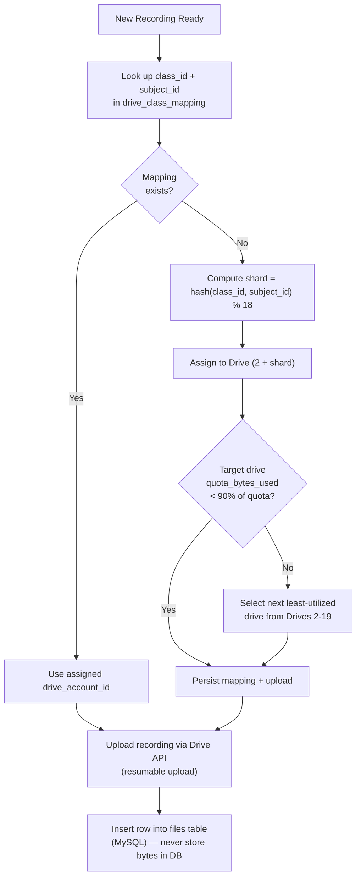

A supporting lookup table (not listed above to keep the core schema lean) can be added if needed:

```sql
CREATE TABLE drive_class_mapping (
    id              BIGINT UNSIGNED PRIMARY KEY AUTO_INCREMENT,
    class_id        BIGINT UNSIGNED NOT NULL,
    subject_id      INT UNSIGNED NOT NULL,
    drive_account_id TINYINT UNSIGNED NOT NULL,
    UNIQUE KEY uq_class_subject (class_id, subject_id),
    CONSTRAINT fk_dcm_class FOREIGN KEY (class_id) REFERENCES classes(id) ON DELETE CASCADE,
    CONSTRAINT fk_dcm_subject FOREIGN KEY (subject_id) REFERENCES subjects(id) ON DELETE CASCADE,
    CONSTRAINT fk_dcm_drive FOREIGN KEY (drive_account_id) REFERENCES drive_accounts(id) ON DELETE RESTRICT
) ENGINE=InnoDB;
```

### 8.3 Storage Flow (Upload → Metadata → Retrieval)

```mermaid
sequenceDiagram
    autonumber
    participant U as User (Teacher/Admin)
    participant API as storage API (/api/v1/storage)
    participant SVC as storage.service.ts
    participant ROUTER as drive.router.ts
    participant GDRIVE as Google Drive API
    participant DB as MySQL (files table)

    U->>API: POST /storage/upload (file stream + category + context)
    API->>API: Validate MIME type, size, virus-scan hook
    API->>SVC: initiateUpload()
    SVC->>ROUTER: resolveDriveAccount(category, class_id, subject_id)
    ROUTER-->>SVC: drive_account_id + OAuth client
    SVC->>GDRIVE: Create resumable upload session
    GDRIVE-->>SVC: resumable_uri
    SVC->>DB: INSERT upload_sessions (status=initiated)
    loop Chunked Upload
        U->>GDRIVE: PUT chunk (via signed proxy)
    end
    GDRIVE-->>SVC: file_id, webViewLink, size, checksum
    SVC->>DB: INSERT files (drive_file_id, metadata, checksum)
    SVC->>DB: UPDATE upload_sessions SET status='completed'
    SVC-->>API: File metadata DTO
    API-->>U: 201 Created { fileId, viewUrl }

    Note over U,DB: Retrieval never streams through the app server for large media;<br/>the app issues a short-lived signed/embed link to Drive.
```

### 8.4 Google Drive Flow — Service Account & Permission Model

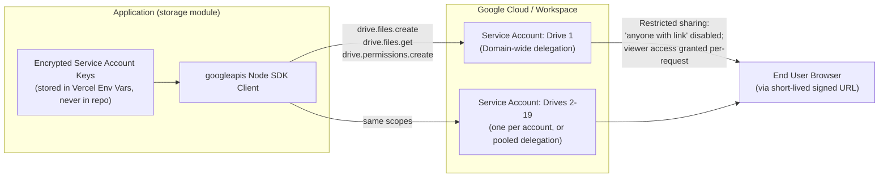

### 8.5 Storage Governance Rules

| Rule | Enforcement |
|---|---|
| MySQL never stores file bytes | Application-level: no `BLOB`/`LONGBLOB` columns exist in schema; code review + CI lint rule blocks such column types |
| Every file has exactly one owning Drive account | `files.drive_account_id` FK is `NOT NULL` |
| File deduplication | `checksum_sha256` computed on upload; duplicate uploads by the same owner return the existing `file_id` instead of re-uploading |
| Quota monitoring | `drive_accounts.quota_bytes_used` maintained via trigger; a scheduled Vercel Cron job checks utilization hourly and alerts admins above 85% |
| Soft delete | Files are soft-deleted (`is_deleted=TRUE`) in MySQL first; a background job later removes them from Drive after a grace period, protecting against accidental data loss |
| Access control | Files are never made public; access is mediated by the app which verifies the requester's enrollment/role before issuing a Drive `viewer` permission or signed streaming link |


---

## 9. Authentication & Authorization

### 9.1 Authentication Architecture

The platform uses a **stateless JWT scheme with server-side revocation capability**:

- **Access Token**: Short-lived (15 minutes), JWT signed with `HS256` (or `RS256` in multi-service future), contains `{ sub: userId, role, uuid, iat, exp }`, sent as an HTTP-only, `Secure`, `SameSite=Strict` cookie.
- **Refresh Token**: Long-lived (7–30 days), opaque random string; only its **SHA-256 hash** is stored in `refresh_tokens`, enabling revocation without storing the raw secret.
- **Password Storage**: `bcrypt` with cost factor 12, unique salt per password (bcrypt handles salting internally).

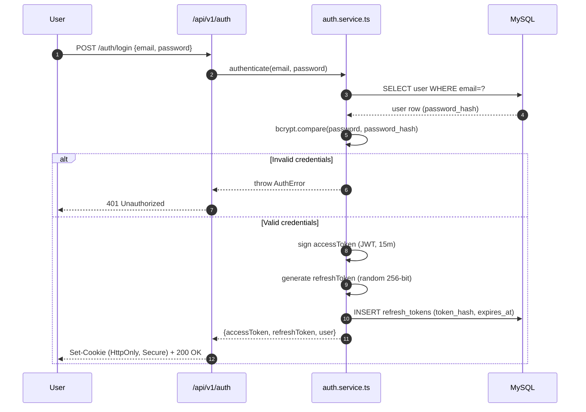

### 9.2 Token Refresh & Revocation Flow

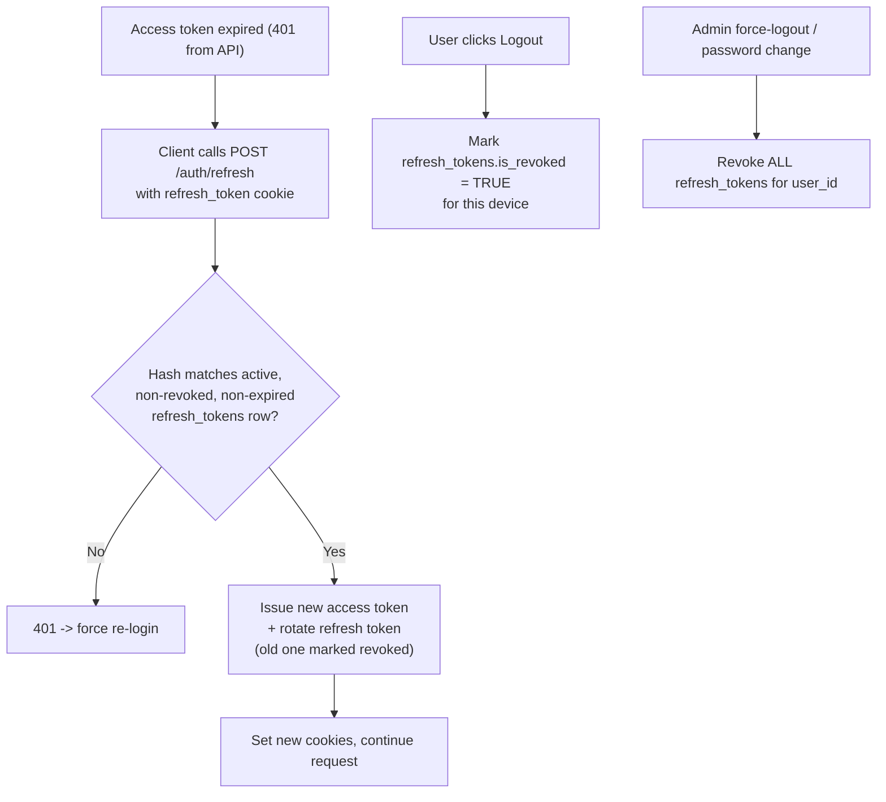

### 9.3 Authorization (RBAC) Flow

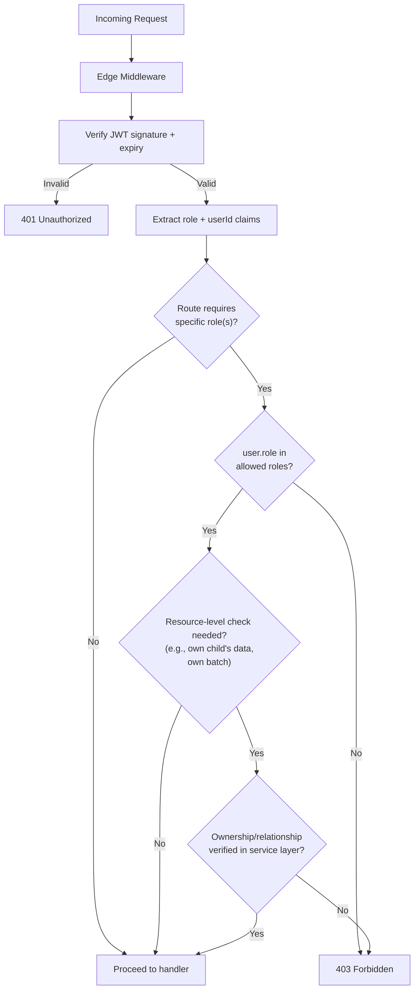

---

## 10. Role-Based Access Control (RBAC)

### 10.1 Role Definitions

| Role | Description |
|---|---|
| `student` | Enrolled learner; accesses own classes, assignments, tests, recordings, invoices |
| `teacher` | Delivers classes; manages own batches, assignments, tests, grading, materials |
| `parent` | Linked to one or more students; read-only visibility into linked students' progress, attendance, invoices |
| `admin` | Operational staff; manages users, classes, payments, announcements platform-wide |
| `super_admin` | Full system access; manages admins, system config, drive account provisioning |

### 10.2 Permission Matrix

| Resource / Action | Student | Teacher | Parent | Admin | Super Admin |
|---|:---:|:---:|:---:|:---:|:---:|
| View own profile | ✅ | ✅ | ✅ | ✅ | ✅ |
| Edit own profile | ✅ | ✅ | ✅ | ✅ | ✅ |
| View linked student's data | ❌ | ❌ | ✅ (own children only) | ✅ | ✅ |
| Create/manage classes & batches | ❌ | ✅ (own) | ❌ | ✅ | ✅ |
| Enroll a student | ❌ | ❌ | ❌ | ✅ | ✅ |
| Upload materials/notes | ❌ | ✅ (own batch) | ❌ | ✅ | ✅ |
| Create assignments/tests | ❌ | ✅ (own batch) | ❌ | ✅ | ✅ |
| Submit assignment | ✅ | ❌ | ❌ | ❌ | ❌ |
| Grade submission | ❌ | ✅ (own batch) | ❌ | ✅ | ✅ |
| View own invoices/pay | ✅ | ❌ | ✅ (linked student) | ✅ | ✅ |
| Issue refund | ❌ | ❌ | ❌ | ✅ | ✅ |
| View platform-wide analytics | ❌ | ✅ (own batches only) | ❌ | ✅ | ✅ |
| Manage user roles | ❌ | ❌ | ❌ | ✅ (limited) | ✅ |
| Configure Drive accounts / system config | ❌ | ❌ | ❌ | ❌ | ✅ |
| Send announcements | ❌ | ✅ (own batch) | ❌ | ✅ (global) | ✅ (global) |

### 10.3 Implementation Pattern

- **Coarse-grained** checks (role gate) enforced in `middleware.ts` before the request reaches a route handler — cheap, fast rejection.
- **Fine-grained** checks (ownership: "is this teacher's batch", "is this parent linked to this student") enforced inside the **service layer**, close to the SQL query, using a `WHERE` clause that scopes by the authenticated user's ID rather than trusting client-supplied IDs blindly.

```typescript
// Example: fine-grained ownership enforcement in service layer
export async function getBatchAnalytics(teacherId: number, batchId: number) {
  const [rows] = await pool.query(
    `SELECT b.* FROM batches b
     JOIN classes c ON c.id = b.class_id
     WHERE b.id = ? AND c.teacher_id = ?`,   // ownership enforced in SQL, not just app logic
    [batchId, teacherId]
  );
  if (rows.length === 0) throw new ForbiddenError('Not your batch');
  return rows[0];
}
```


---

## 11. Core Business Flows

### 11.1 Registration Flow

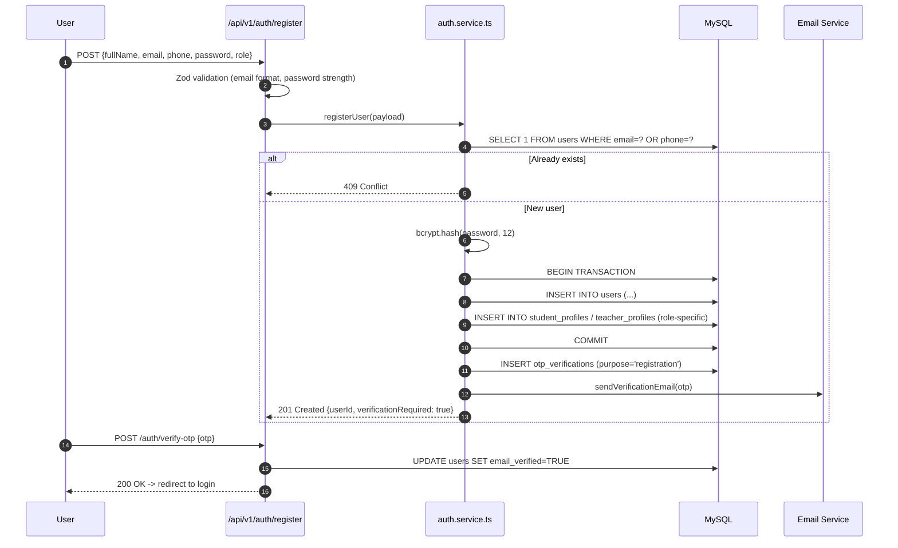

### 11.2 Login Flow

Covered in detail in Section 9.1. Summary: credential check → bcrypt compare → JWT + refresh token issuance → HTTP-only cookies set → redirect to role-specific dashboard.

### 11.3 Payment Flow

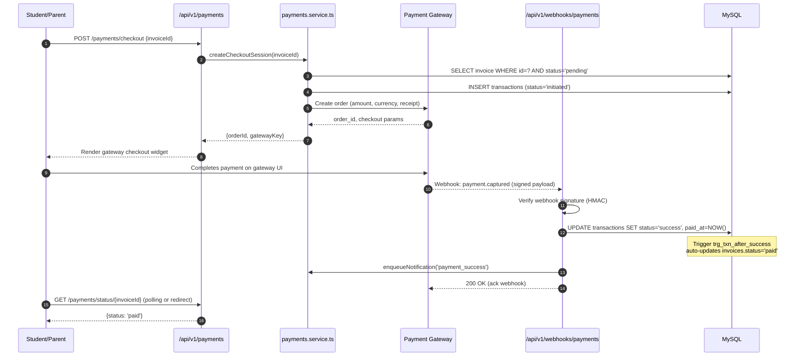

**Idempotency**: The `transactions` table's unique key `(gateway, gateway_txn_id)` guarantees that a retried or duplicate webhook delivery cannot double-process a payment.

### 11.4 Live Class Flow

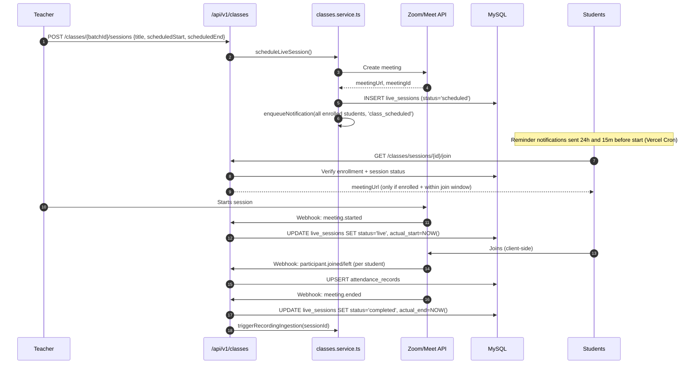

### 11.5 Recording Flow

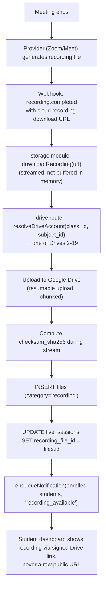

### 11.6 Assignment Flow

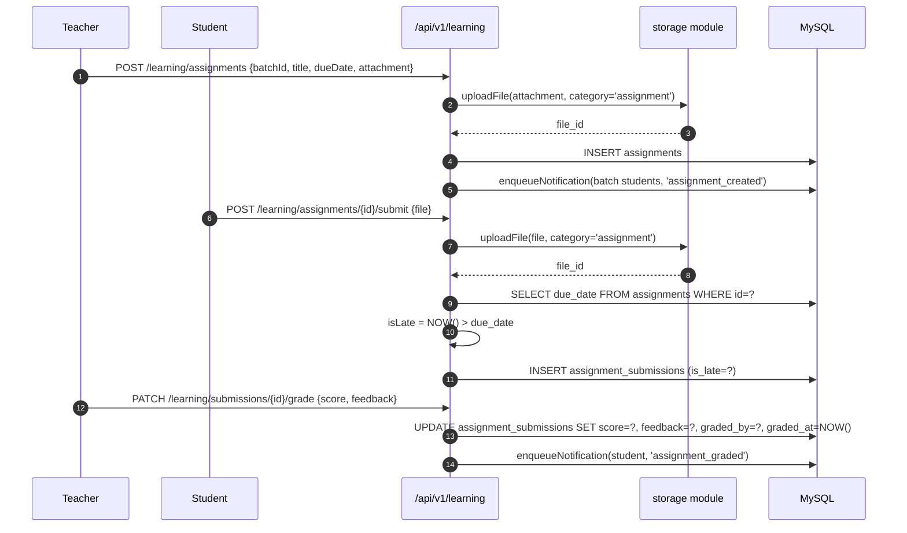

### 11.7 Weekly Test Flow

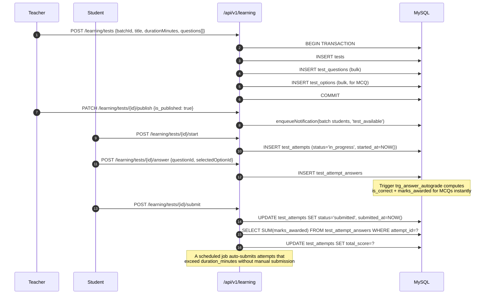

### 11.8 Analytics Flow

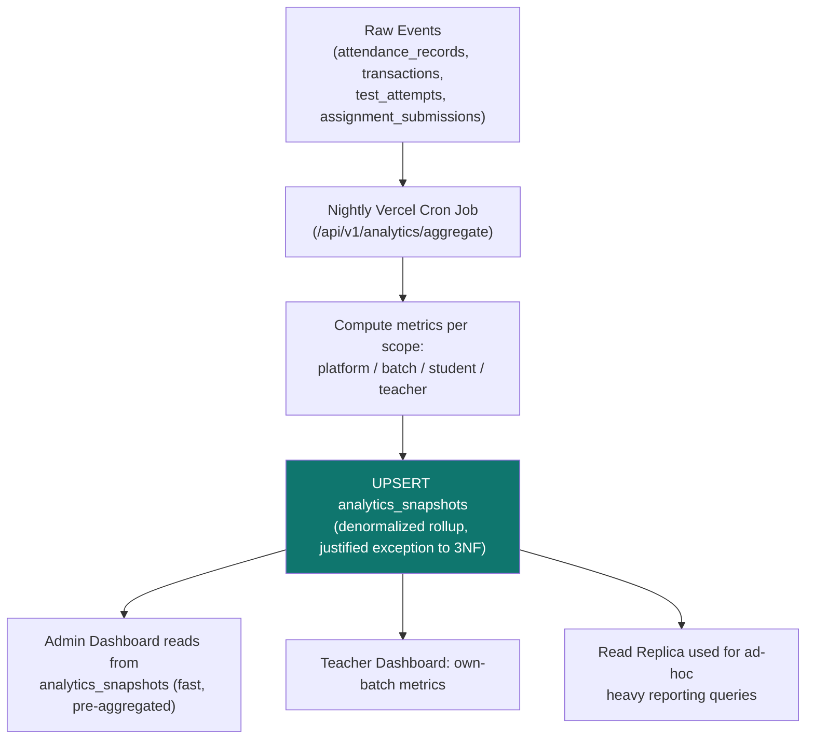

Key metrics computed: attendance rate per batch, assignment completion rate, average test scores, revenue per period, churn/renewal rate, teacher engagement score.

### 11.9 Notification Flow

```mermaid
sequenceDiagram
    autonumber
    participant TRIGGER as Domain Event<br/>(payment, assignment, class, etc.)
    participant SVC as notifications.service.ts
    participant DB as MySQL
    participant Q as Delivery Queue (in-process / Vercel Cron batch)
    participant EMAIL as Email Provider
    participant SMS as SMS/WhatsApp Provider

    TRIGGER->>SVC: notify(userId, type, payload)
    SVC->>DB: INSERT notifications (is_read=false)
    SVC->>DB: SELECT notification_preferences WHERE user_id=?
    SVC->>DB: INSERT notification_deliveries (channel, status='queued') per enabled channel
    SVC->>Q: enqueue delivery jobs
    Q->>EMAIL: send (if email_enabled)
    Q->>SMS: send (if sms_enabled)
    EMAIL-->>Q: delivery result
    SMS-->>Q: delivery result
    Q->>DB: UPDATE notification_deliveries SET status='sent'|'failed'
    Note over SVC,DB: In-app (push/in_app channel) is always delivered<br/>via the notifications table itself + optional WebSocket/SSE push
```

### 11.10 Storage Flow (Recap Reference)

See Section 8.3 for the detailed upload/metadata/retrieval sequence, and Section 8.5 for governance rules that apply to every storage operation regardless of which flow triggers it.


---

## 12. API Architecture & REST Endpoint Catalog

### 12.1 Conventions

| Convention | Rule |
|---|---|
| Base path | `/api/v1/{module}` |
| Versioning | URL-based (`v1`, `v2`...) to allow breaking changes without disrupting existing clients |
| Naming | Plural nouns for collections (`/classes`, `/assignments`); verbs only for actions with no clean REST mapping (`/auth/login`, `/tests/{id}/publish`) |
| Pagination | `?page=1&limit=20`, response includes `meta.pagination { page, limit, total, totalPages }` |
| Filtering/Sorting | `?status=pending&sortBy=createdAt&order=desc` |
| Response envelope | Standard success/error shape (Section 5.4) |

### 12.2 Endpoint Catalog

**Auth Module** (`/api/v1/auth`)

| Method | Endpoint | Description | Auth |
|---|---|---|---|
| POST | `/register` | Create new account | Public |
| POST | `/verify-otp` | Verify email/phone OTP | Public |
| POST | `/login` | Authenticate, issue tokens | Public |
| POST | `/refresh` | Rotate access token | Refresh cookie |
| POST | `/logout` | Revoke current session | Authenticated |
| POST | `/forgot-password` | Send reset link | Public |
| POST | `/reset-password` | Set new password | Reset token |

**Users Module** (`/api/v1/users`)

| Method | Endpoint | Description | Auth |
|---|---|---|---|
| GET | `/me` | Current user profile | Authenticated |
| PATCH | `/me` | Update own profile | Authenticated |
| GET | `/{id}` | Get user by ID | Admin, or self |
| GET | `/` | List/search users | Admin |
| PATCH | `/{id}/role` | Change user role | Super Admin |
| POST | `/{id}/deactivate` | Deactivate account | Admin |
| GET | `/students/{id}/parents` | List linked parents | Admin, self, linked parent |
| POST | `/parent-links` | Link parent to student | Admin |

**Payments Module** (`/api/v1/payments`)

| Method | Endpoint | Description | Auth |
|---|---|---|---|
| GET | `/invoices` | List own/linked invoices | Student, Parent, Admin |
| POST | `/checkout` | Create gateway checkout session | Student, Parent |
| GET | `/invoices/{id}` | Invoice detail | Owner, Admin |
| POST | `/webhooks/gateway` | Gateway payment webhook | Signed webhook |
| POST | `/{invoiceId}/refund` | Issue refund | Admin |
| GET | `/subscriptions` | List own subscriptions | Student |

**Classes Module** (`/api/v1/classes`)

| Method | Endpoint | Description | Auth |
|---|---|---|---|
| GET | `/` | List classes/batches | Authenticated |
| POST | `/` | Create class | Teacher, Admin |
| POST | `/{classId}/batches` | Create batch | Teacher, Admin |
| POST | `/batches/{id}/enroll` | Enroll student | Admin |
| GET | `/batches/{id}/timetable` | Get schedule | Enrolled/Teacher |
| POST | `/batches/{id}/sessions` | Schedule live session | Teacher |
| GET | `/sessions/{id}/join` | Get join link | Enrolled student |
| GET | `/sessions/{id}/attendance` | View attendance | Teacher, Admin |

**Learning Module** (`/api/v1/learning`)

| Method | Endpoint | Description | Auth |
|---|---|---|---|
| POST | `/assignments` | Create assignment | Teacher |
| GET | `/assignments?batchId=` | List assignments | Enrolled/Teacher |
| POST | `/assignments/{id}/submit` | Submit assignment | Student |
| PATCH | `/submissions/{id}/grade` | Grade submission | Teacher |
| POST | `/tests` | Create test + questions | Teacher |
| PATCH | `/tests/{id}/publish` | Publish test | Teacher |
| POST | `/tests/{id}/start` | Start attempt | Student |
| POST | `/tests/{id}/answer` | Submit answer | Student |
| POST | `/tests/{id}/submit` | Finalize attempt | Student |
| GET | `/materials?batchId=` | List materials | Enrolled/Teacher |
| POST | `/materials` | Upload material | Teacher |

**Announcements Module** (`/api/v1/announcements`)

| Method | Endpoint | Description | Auth |
|---|---|---|---|
| GET | `/` | List relevant announcements | Authenticated |
| POST | `/` | Create announcement | Teacher (own batch), Admin (global) |
| DELETE | `/{id}` | Remove announcement | Author, Admin |

**Notifications Module** (`/api/v1/notifications`)

| Method | Endpoint | Description | Auth |
|---|---|---|---|
| GET | `/` | List own notifications | Authenticated |
| PATCH | `/{id}/read` | Mark as read | Owner |
| PATCH | `/preferences` | Update channel preferences | Authenticated |

**Storage Module** (`/api/v1/storage`)

| Method | Endpoint | Description | Auth |
|---|---|---|---|
| POST | `/upload` | Initiate/perform upload | Authenticated (role-scoped by category) |
| GET | `/files/{id}` | Get signed view link | Authorized owner/enrollee |
| DELETE | `/files/{id}` | Soft-delete file | Owner, Admin |

**Analytics Module** (`/api/v1/analytics`)

| Method | Endpoint | Description | Auth |
|---|---|---|---|
| GET | `/platform` | Platform-wide KPIs | Admin |
| GET | `/batches/{id}` | Batch performance | Teacher (own), Admin |
| GET | `/students/{id}` | Student progress report | Self, Parent, Admin |
| POST | `/aggregate` | Trigger nightly rollup (cron-invoked) | System/Cron secret |

---

## 13. Error Handling, Logging & Validation

### 13.1 Error Taxonomy

| Error Class | HTTP Status | Example |
|---|---|---|
| `ValidationError` | 400 | Malformed request body |
| `AuthenticationError` | 401 | Missing/expired/invalid JWT |
| `ForbiddenError` | 403 | Valid user, insufficient role/ownership |
| `NotFoundError` | 404 | Resource does not exist |
| `ConflictError` | 409 | Duplicate email, double enrollment |
| `RateLimitError` | 429 | Too many requests |
| `InternalServerError` | 500 | Unhandled exception |
| `ExternalServiceError` | 502/503 | Google Drive/Payment gateway failure |

All custom errors extend a base `AppError` class (`src/modules/core/errors.ts`) carrying `code`, `httpStatus`, and `details`, which a global error-handling wrapper around every route handler converts into the standard error envelope.

### 13.2 Validation Strategy

- **Zod schemas** per module (`*.schema.ts`) validate every request body, query param, and route param before it reaches business logic.
- Validation failures return `400` with a `details[]` array pinpointing the offending field(s).
- Server-side validation is authoritative; client-side (React Hook Form + Zod) is UX-only and never trusted alone.

### 13.3 Logging Strategy

| Log Type | Destination | Retention |
|---|---|---|
| Application logs (info/warn/error) | Structured JSON via `pino`/`winston` → Vercel Logs → optionally shipped to a log sink (Logtail/Datadog) | 30 days |
| Error tracking | Sentry (captures stack traces, request context, user id) | 90 days |
| Audit logs (sensitive mutations) | `audit_logs` MySQL table (immutable, no UPDATE/DELETE granted to app role) | Indefinite / per compliance policy |
| Activity logs (general usage) | `activity_logs` MySQL table | 180 days, then archived/purged |

Every log line includes a `requestId` (UUID generated at the edge middleware) to allow full request tracing across logs, error tracker, and audit trail.


---

## 14. Security Architecture

| Layer | Control |
|---|---|
| Transport | HTTPS enforced everywhere (Vercel default TLS); HSTS header |
| Authentication | JWT (short-lived access token) + rotating refresh tokens; bcrypt (cost 12) for passwords |
| Session Cookies | `HttpOnly`, `Secure`, `SameSite=Strict` — inaccessible to JS, mitigates XSS token theft |
| CSRF | SameSite cookies + double-submit CSRF token on state-changing form posts from non-JSON clients |
| SQL Injection | 100% parameterized queries via `mysql2` placeholders; zero string concatenation into SQL |
| XSS | React's default escaping; `dangerouslySetInnerHTML` banned by lint rule except for sanitized rich text (DOMPurify) |
| File Upload Safety | MIME-type allow-list, max size enforcement, extension/content-type cross-check, optional antivirus scan hook before persisting to Drive |
| Secrets Management | All credentials (DB, JWT secret, Drive service account keys, gateway keys) in Vercel encrypted environment variables — never committed to Git |
| Least Privilege DB User | Application DB user has `SELECT/INSERT/UPDATE/DELETE` only — no `DROP`/`ALTER`/`GRANT`; migrations run under a separate elevated-but-still-scoped user |
| Rate Limiting | Redis-backed sliding window limiter at edge middleware (see Section 17) |
| Webhook Verification | HMAC signature verification for payment gateway and meeting provider webhooks; reject unsigned/invalid payloads |
| RBAC | Coarse role gate + fine-grained ownership checks (Section 10) |
| Dependency Hygiene | `npm audit` / Dependabot in CI; lockfile committed |
| Data Privacy | PII (DOB, address, phone) access logged via `activity_logs`; parent visibility strictly scoped to linked students only |
| Content Security Policy | Strict CSP headers via `next.config.ts` limiting script/style/frame sources |

---

## 15. Caching & Performance Strategy

| Cache Layer | Technology | What's Cached | TTL |
|---|---|---|---|
| CDN/Edge | Vercel Edge Network | Static assets, marketing pages (SSG/ISR) | 1 hour (ISR revalidate) |
| Application cache | Redis (Upstash) | Session/role lookups, subject/class lists, `system_config` | 5–15 min |
| Query result cache | Redis | Expensive aggregate queries (dashboard summaries) with cache-aside pattern | 1–5 min |
| Read replica | MySQL replica | Analytics/report queries offloaded from primary | N/A (always fresh within replication lag) |
| Client cache | TanStack Query | API responses on the client, background refetch on window focus | Configurable per query key |

### 15.1 Performance Practices

- Database: composite indexes matched to actual query WHERE/JOIN patterns (see Section 7.6); `EXPLAIN` reviewed for all new queries in code review.
- Connection pooling via `mysql2` pool (min/max sized per Vercel function concurrency expectations); serverless-aware pool sizing to avoid exhausting MySQL `max_connections` (consider PlanetScale/Aurora Serverless or an external pooler like ProxySQL/RDS Proxy for high concurrency).
- Large file transfers (recordings) never proxy through the Next.js server; the client uploads/downloads directly to/from Google Drive using resumable/signed URLs.
- Images served via `next/image` with automatic optimization and lazy loading.
- Code-splitting: heavy libraries (chart libs, video players) dynamically imported (`next/dynamic`) only on the routes that need them.

---

## 16. Scalability Strategy

```mermaid
flowchart LR
    subgraph Now["Launch Scale"]
        A1["Single MySQL Primary"]
        A2["Modular Monolith on Vercel"]
        A3["19 Google Drive Accounts"]
    end
    subgraph Growth["Growth Scale"]
        B1["MySQL Primary + Read Replicas"]
        B2["Redis Cache Layer Introduced"]
        B3["Add Drive Accounts Horizontally<br/>(20th, 21st... as recording volume grows)"]
    end
    subgraph Scale["Enterprise Scale"]
        C1["Extract 'storage' and 'analytics'<br/>modules into standalone services"]
        C2["MySQL sharding by tenant/region<br/>or migrate to distributed SQL (Vitess/PlanetScale)"]
        C3["Move recordings to a dedicated<br/>object store (S3/GCS) behind Drive-compatible API"]
    end
    Now --> Growth --> Scale
```

- **Stateless compute** on Vercel scales horizontally by default; no code changes needed for more concurrent users.
- **Database is the primary bottleneck** at scale — mitigated first via read replicas + caching, then via sharding/managed distributed MySQL if needed.
- **Drive storage scales linearly** by adding more accounts to the `drive_accounts` registry and extending the sharding hash range — no schema change required.
- **Module boundaries** (Section 5) are deliberately service-shaped so any module can be lifted into an independent deployment without a data model rewrite.

---

## 17. Session Management & Rate Limiting

### 17.1 Session Management

| Aspect | Approach |
|---|---|
| Session representation | Stateless JWT (access token) + DB-tracked refresh token for revocation |
| Multi-device support | Each login creates a distinct `refresh_tokens` row keyed by device info; users can view/revoke individual sessions |
| Idle timeout | Access token expires in 15 min; silent refresh while refresh token valid and not revoked |
| Absolute timeout | Refresh token hard-expires after 30 days; forces re-login |
| Forced logout | Admin/password-change triggers bulk revocation of all `refresh_tokens` for a user |

### 17.2 Rate Limiting

| Scope | Limit | Store |
|---|---|---|
| Login/OTP endpoints | 5 requests / 15 min per IP+email | Redis sliding window |
| General authenticated API | 120 requests / min per user | Redis token bucket |
| Public/unauthenticated API | 30 requests / min per IP | Redis token bucket |
| File upload endpoints | 10 uploads / min per user | Redis sliding window |
| Webhook endpoints | Exempt from user-based limiting; protected instead by signature verification + IP allow-list where the provider supports it | — |

Rate-limit responses return `429 Too Many Requests` with a `Retry-After` header, using the standard error envelope with `code: "RATE_LIMIT_EXCEEDED"`.


---

## 18. Deployment Architecture (GitHub + Vercel)

```mermaid
flowchart TD
    DEV["Developer"] -->|"git push feature/*"| GH["GitHub Repository"]
    GH -->|"Pull Request"| CI["GitHub Actions CI<br/>Lint, TypeCheck, Unit Tests, Build"]
    CI -->|"Pass"| REVIEW["Code Review + Approval"]
    REVIEW -->|"Merge to develop"| PREVIEW["Vercel Preview Deployment<br/>(unique URL per PR/branch)"]
    PREVIEW -->|"QA sign-off"| MERGEMAIN["Merge develop -> main"]
    MERGEMAIN --> PRODCI["GitHub Actions:<br/>Production Build + DB Migration Check"]
    PRODCI --> PRODDEPLOY["Vercel Production Deployment"]
    PRODDEPLOY --> MONITOR["Post-deploy: Sentry + Vercel Analytics<br/>monitored for error-rate spike"]
    MONITOR -->|"Regression detected"| ROLLBACK["Vercel Instant Rollback<br/>to previous deployment"]
```

### 18.1 Environment Strategy

| Environment | Branch | Database | Purpose |
|---|---|---|---|
| Development | `feature/*`, local | Local MySQL / Dev instance | Active development |
| Preview | `develop`, PR branches | Staging MySQL (isolated) | QA, stakeholder review, automatic per-PR URLs |
| Production | `main` | Production MySQL (managed, e.g., PlanetScale/AWS RDS) | Live traffic |

---

## 19. CI/CD Recommendations

| Stage | Tooling | Gate |
|---|---|---|
| Lint | ESLint + Prettier | Must pass, zero errors |
| Type Check | `tsc --noEmit` | Must pass |
| Unit Tests | Vitest/Jest | ≥ 80% coverage on `modules/*/service.ts` |
| Integration Tests | Supertest against a test MySQL instance (Docker service in CI) | Critical flows: auth, payments, enrollment |
| Security Scan | `npm audit`, Dependabot, Snyk (optional) | No high/critical vulnerabilities |
| Migration Check | Verify new `db/migrations/*.sql` is additive/backward-compatible before allowing merge to `main` | Manual approval for destructive migrations |
| Build | `next build` | Must succeed |
| Deploy | Vercel GitHub integration (auto preview on PR, auto production on `main` merge) | Health check post-deploy |

Example `ci.yml` outline:

```yaml
name: CI
on: [pull_request]
jobs:
  build-and-test:
    runs-on: ubuntu-latest
    services:
      mysql:
        image: mysql:8.0
        env:
          MYSQL_ROOT_PASSWORD: root
          MYSQL_DATABASE: tuition_test
        ports: ["3306:3306"]
    steps:
      - uses: actions/checkout@v4
      - uses: actions/setup-node@v4
        with: { node-version: '20' }
      - run: npm ci
      - run: npm run lint
      - run: npm run typecheck
      - run: npm run db:migrate:test
      - run: npm run test
      - run: npm run build
```

---

## 20. Environment Variables

| Variable | Purpose | Scope |
|---|---|---|
| `DATABASE_URL` / `DB_HOST`, `DB_USER`, `DB_PASSWORD`, `DB_NAME` | MySQL connection | All environments |
| `JWT_ACCESS_SECRET` | Sign/verify access tokens | All environments |
| `JWT_REFRESH_SECRET` | Sign/verify refresh token hashing salt (if HMAC-based) | All environments |
| `BCRYPT_SALT_ROUNDS` | Password hashing cost factor | All environments |
| `REDIS_URL` | Rate limiting + cache | All environments |
| `GOOGLE_DRIVE_SA_KEY_1` ... `GOOGLE_DRIVE_SA_KEY_19` | Base64-encoded service account JSON per Drive account | Production/Preview |
| `GOOGLE_DRIVE_ACCOUNT_MAP` | JSON mapping of account purpose/scope metadata | Production/Preview |
| `PAYMENT_GATEWAY_KEY_ID` / `PAYMENT_GATEWAY_SECRET` | Gateway auth | Production/Preview |
| `PAYMENT_WEBHOOK_SECRET` | HMAC webhook verification | Production/Preview |
| `EMAIL_PROVIDER_API_KEY` | Transactional email | All environments |
| `SMS_PROVIDER_API_KEY` | SMS/WhatsApp | Production |
| `MEET_PROVIDER_API_KEY` / `MEET_PROVIDER_SECRET` | Zoom/Google Meet API | Production/Preview |
| `SENTRY_DSN` | Error tracking | All environments |
| `CRON_SECRET` | Authenticates Vercel Cron-invoked internal endpoints | Production |
| `NEXT_PUBLIC_APP_URL` | Public base URL for links in emails/notifications | All environments |

All secrets are stored in **Vercel Environment Variables** (encrypted at rest, scoped per environment), never in `.env` files committed to Git. `.env.example` documents required keys with placeholder values only.

---

## 21. Database Backup & Disaster Recovery

| Strategy | Detail |
|---|---|
| Automated backups | Daily full logical backup (`mysqldump` or managed-provider snapshot) retained 30 days |
| Point-in-time recovery | Binary logging (`binlog`) enabled, enabling PITR to any second within the retention window (managed MySQL providers like PlanetScale/RDS provide this natively) |
| Replication | Read replica doubles as a warm standby; promotable to primary on failure |
| Backup verification | Weekly automated restore-to-scratch-instance test to confirm backup integrity |
| Off-site storage | Backups replicated to a separate cloud region/provider from the primary DB |
| Google Drive redundancy | Google Drive itself provides underlying storage redundancy; additionally, `files` metadata + `checksum_sha256` allow integrity verification and, if ever needed, re-derivation of a manifest to re-fetch/re-upload content |
| RPO / RTO targets | RPO ≤ 15 minutes (via binlog PITR), RTO ≤ 1 hour for full database restoration |
| Audit trail durability | `audit_logs` table excluded from any destructive retention/purge job — retained indefinitely or per compliance policy |

---

## 22. File Upload Strategy

```mermaid
flowchart TD
    A["Client selects file"] --> B["Client-side validation:<br/>size, MIME type (UX only)"]
    B --> C["POST /api/v1/storage/upload<br/>(multipart or resumable init)"]
    C --> D["Server-side validation:<br/>MIME allow-list, max size, filename sanitization"]
    D --> E{"Valid?"}
    E -->|No| F["400 Bad Request"]
    E -->|Yes| G["Resolve target Drive account<br/>(drive.router.ts)"]
    G --> H["Stream directly to Google Drive<br/>(no full buffering in serverless function memory)"]
    H --> I["Compute checksum during stream"]
    I --> J["Persist files row in MySQL"]
    J --> K["Return file metadata to client"]
```

| Category | Max Size | Allowed MIME Types | Target Drive |
|---|---|---|---|
| Profile photo | 5 MB | `image/jpeg`, `image/png`, `image/webp` | Drive 1 |
| Notes / PDFs | 50 MB | `application/pdf` | Drive 1 |
| Assignment submissions | 25 MB | `application/pdf`, `image/*`, `application/msword`, `.docx` | Drive 1 |
| Solutions | 50 MB | `application/pdf` | Drive 1 |
| Website assets | 10 MB | `image/*`, `image/svg+xml` | Drive 1 |
| Live class recordings | Up to provider limit (streamed, chunked) | `video/mp4`, `video/webm` | Drives 2–19 (sharded) |

Given serverless function execution/memory limits on Vercel, large uploads (recordings) are handled via **server-initiated resumable upload sessions** where the client (or the meeting provider's webhook-triggered background fetch) streams directly to Google's resumable endpoint using a short-lived signed session, keeping the Next.js function's own memory/execution footprint minimal.


---

## 23. Appendices

### 23.1 User Flow Overview (End-to-End)

```mermaid
flowchart TD
    START(["Visitor lands on marketing site"]) --> REG["Registers (student/parent/teacher)"]
    REG --> VERIFY["Verifies email/phone OTP"]
    VERIFY --> LOGIN["Logs in"]
    LOGIN --> ROLECHECK{"Role?"}
    ROLECHECK -->|Student| SDASH["Student Dashboard:<br/>Enrolled batches, upcoming classes,<br/>assignments, tests, invoices"]
    ROLECHECK -->|Teacher| TDASH["Teacher Dashboard:<br/>My batches, schedule live class,<br/>grade submissions, upload materials"]
    ROLECHECK -->|Parent| PDASH["Parent Dashboard:<br/>Linked children's progress,<br/>attendance, invoices"]
    ROLECHECK -->|Admin| ADASH["Admin Dashboard:<br/>Users, classes, payments,<br/>platform analytics"]

    SDASH --> ENROLL["Admin enrolls student in batch<br/>(after payment)"]
    ENROLL --> PAY["Pays invoice via gateway"]
    PAY --> ACCESS["Gains access to batch content"]
    ACCESS --> JOIN["Joins live class / watches recording"]
    ACCESS --> SUBMIT["Submits assignments / takes tests"]
    SUBMIT --> GRADED["Views grades & feedback"]
```

### 23.2 Non-Functional Requirements Summary

| NFR | Target |
|---|---|
| Availability | 99.9% uptime (Vercel + managed MySQL SLAs) |
| API p95 latency | < 300ms for standard CRUD endpoints |
| Concurrent live class capacity | Delegated to meeting provider (Zoom/Meet); platform tracks metadata only |
| Data retention | User data retained per privacy policy; audit logs indefinite |
| Accessibility | WCAG 2.1 AA |
| Browser support | Last 2 versions of Chrome, Firefox, Safari, Edge; mobile Safari/Chrome |
| Internationalization readiness | Schema and UI text externalized to support future i18n (currency stored with `CHAR(3)` ISO codes, dates in UTC) |

### 23.3 Glossary

| Term | Definition |
|---|---|
| Batch | A specific running cohort/section of a Class, with its own schedule, capacity, and enrollments |
| Drive Account | One of the 19 Google accounts used as a storage backend |
| Modular Monolith | Single deployable application internally organized into independently-testable, loosely-coupled modules |
| RBAC | Role-Based Access Control |
| Resumable Upload | Google Drive API upload mode allowing large files to be sent in chunks with resume-on-failure support |
| Snapshot | A precomputed analytics rollup row stored in `analytics_snapshots` |

---

*End of Design Requirements Document.*
