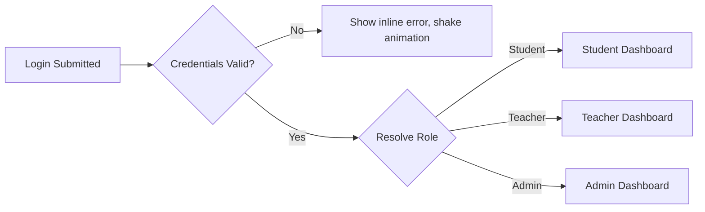
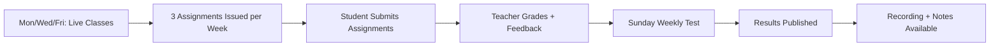
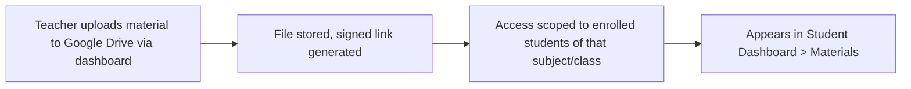
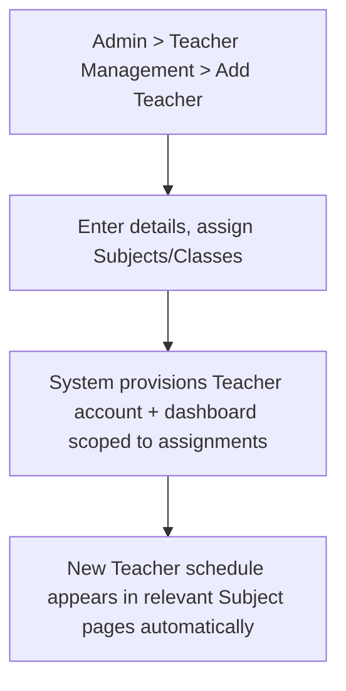
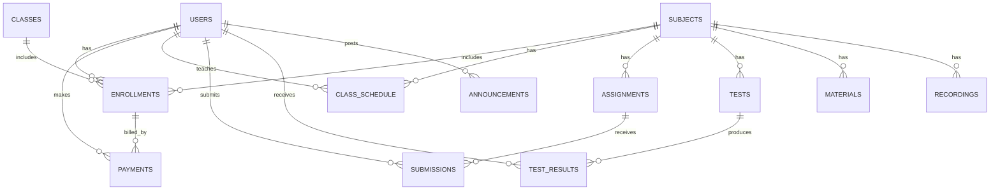
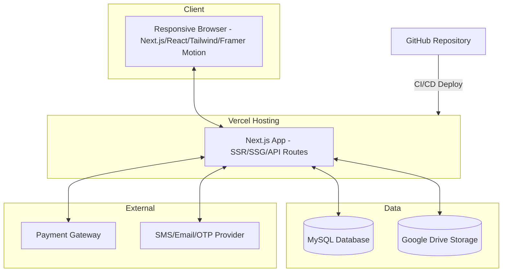
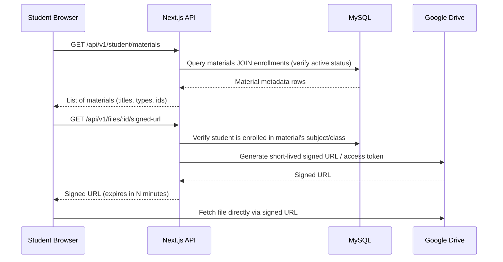

# Product Requirements Document (PRD)
## Premium Online Tuition Platform

| | |
|---|---|
| **Document Type** | Product Requirements Document |
| **Product Name** | TBD (working name: "Elevate Tuitions") |
| **Version** | 1.0 |
| **Status** | Draft for Engineering & Design Kickoff |
| **Platform Type** | Responsive Marketing + Application Website (Next.js, not a native app) |
| **Prepared For** | Founder / Single-Teacher Online Tuition Business |
| **Prepared By** | Product, UX, and Technical Architecture Function |

---

## Table of Contents

1. [Executive Summary](#1-executive-summary)
2. [Visual & Brand Language Extraction](#2-visual--brand-language-extraction)
3. [Goals & Success Metrics](#3-goals--success-metrics)
4. [User Roles & Personas](#4-user-roles--personas)
5. [Information Architecture & Sitemap](#5-information-architecture--sitemap)
6. [Design System](#6-design-system)
7. [Animation & Motion Specification](#7-animation--motion-specification)
8. [Public Website — Page-by-Page Specification](#8-public-website--page-by-page-specification)
9. [Authentication & Onboarding](#9-authentication--onboarding)
10. [Payments Module](#10-payments-module)
11. [Student Dashboard](#11-student-dashboard)
12. [Teacher Dashboard](#12-teacher-dashboard)
13. [Admin Dashboard](#13-admin-dashboard)
14. [Core Domain Modules](#14-core-domain-modules)
15. [Key User Flows](#15-key-user-flows)
16. [Data Model (MySQL, Raw SQL)](#16-data-model-mysql-raw-sql)
17. [API Design](#17-api-design)
18. [Technical Architecture](#18-technical-architecture)
19. [Non-Functional Requirements](#19-non-functional-requirements)
20. [Security Requirements](#20-security-requirements)
21. [Acceptance Criteria (Global)](#21-acceptance-criteria-global)
22. [Edge Cases & Error States](#22-edge-cases--error-states)
23. [Future Roadmap](#23-future-roadmap)
24. [Appendix](#24-appendix)

---

## 1. Executive Summary

The Premium Online Tuition Platform is a responsive **website** (not a native app) that allows students in Classes 8–10 to discover, enroll in, pay for, and attend live online tuition for six subjects, taught initially by a single teacher, with the underlying architecture designed to scale to unlimited teachers, classes, and subjects.

The product must look and feel like a premium SaaS product — comparable to Stripe, Linear, Framer, Vercel, and Notion — rather than a typical coaching-institute website. The reference image (a "MyTutor"-style tutoring homepage) is used **only** for its visual language: premium typography, generous whitespace, rounded UI, an educational-but-modern tone, minimal navigation, and soft, confident color balance. The layout, structure, and information architecture of this platform must be original and materially more premium than the reference.

The platform consists of:

- A **public marketing site** (landing, pricing, subjects, teacher profile, demo booking, contact/FAQ, legal pages).
- A **student application area** (dashboard, live classes, assignments, tests, results, materials, recordings, profile, billing).
- A **teacher application area** (schedule management, content upload, assignment/test creation, grading, announcements, analytics).
- An **admin application area** (enrollment management, payments oversight, teacher management, content moderation, platform analytics, configuration).

The system is built on **Next.js + TypeScript + Tailwind CSS + Framer Motion** on the frontend, with a **Next.js API layer, MySQL (raw SQL, no ORM), and Google Drive as file storage**, deployed via **GitHub → Vercel**.

---

## 2. Visual & Brand Language Extraction

### 2.1 What Is Extracted From the Reference

The reference image is a homepage hero for a UK-based tutoring brand. The following *qualities* — not layout — are extracted and elevated:

| Quality Observed in Reference | How It Is Elevated in This Product |
|---|---|
| Bold, oversized serif/sans display headline | Larger, tighter-tracked variable-weight sans display type with animated line reveals |
| Flat mint/teal accent color on a warm off-white background | A refined two-tone palette (deep indigo/ink + a single vivid accent) with soft gradient meshes instead of flat shapes |
| Organic blob shapes behind a product photo | Abstract animated SVG blobs / gradient orbs with parallax instead of static flat blobs |
| Simple horizontal nav with a pill-shaped primary CTA button | Minimal floating/glass navbar that compresses on scroll, with a single pill CTA |
| Search bar + CTA pairing in hero | Reimagined as a "Find your subject" interactive selector card, animated on load |
| Friendly lifestyle photography | Replaced with premium custom illustration + optional real photography, treated with consistent color grading and soft shadow/mockup framing |
| Flat, undecorated cookie/utility bar | Consent bar restyled as a minimal glass toast, bottom-corner, non-blocking |

### 2.2 Non-Negotiable Differentiators From the Reference

- No boxed, dense top navigation with 6+ text links; navigation is minimal (4 links max + CTA).
- No flat single-color geometric shapes; all decorative elements use soft gradients, blur, and motion.
- No default system fonts; a premium type pairing is mandatory (see §6.2).
- No visible page "chrome" — everything is treated as a single continuous premium surface.

---

## 3. Goals & Success Metrics

### 3.1 Business Goals

1. Convert visiting parents/students into **paid demo bookings** (₹100).
2. Convert demo bookings into **monthly subject subscriptions** (₹1,500/month/subject).
3. Present a single-teacher operation as a **scalable, trustworthy institution**.
4. Reduce manual admin overhead (scheduling, payment tracking, content distribution) through self-serve dashboards.
5. Build a technical foundation that supports unlimited teachers, classes, and subjects without redesign.

### 3.2 Success Metrics (KPIs)

| Metric | Target (Phase 1) |
|---|---|
| Visitor → Demo booking conversion rate | ≥ 4% |
| Demo → Paid subscription conversion rate | ≥ 35% |
| Landing page Largest Contentful Paint (LCP) | < 2.0s on 4G |
| Lighthouse Performance Score | ≥ 90 |
| Lighthouse Accessibility Score | ≥ 95 |
| Monthly payment failure/retry rate | < 5% |
| Student weekly test completion rate | ≥ 80% |
| Dashboard task completion (self-serve, no support ticket) | ≥ 90% |

---

## 4. User Roles & Personas

### 4.1 Role Matrix

| Role | Description | Primary Goals | Access Level |
|---|---|---|---|
| **Visitor** | Anonymous user browsing the marketing site | Understand offering, book demo, view pricing | Public pages only |
| **Student** | Enrolled learner (Class 8–10) | Attend classes, submit assignments, take tests, view results/materials | Student Dashboard |
| **Teacher** | Subject instructor | Manage schedule, upload content, create assignments/tests, grade, message | Teacher Dashboard |
| **Admin** | Platform/business owner or operator | Manage enrollments, payments, teachers, content, configuration, analytics | Admin Dashboard (superset) |
| **Parent (Future)** | Guardian of a student | View child's progress, pay fees, receive reports | Not built in Phase 1; schema reserved |

### 4.2 Representative Personas

**Persona 1 — "Ananya" (Student, Class 10)**
Needs a distraction-free way to see today's class link, this week's assignments, and her last test score without digging through WhatsApp groups or email.

**Persona 2 — "Mrs. Sharma" (Prospective Parent)**
Compares 3–4 tutoring options in one evening on her phone. Needs instant trust signals (teacher credibility, transparent pricing, easy demo booking) within the first screen.

**Persona 3 — "Mr. Verma" (Teacher/Founder)**
Currently manages classes manually via spreadsheets and messaging apps. Needs a single place to schedule classes, upload recordings/materials, set assignments/tests, and see who has/hasn't paid.

**Persona 4 — "Admin/Owner"**
Same person as the teacher initially, but the system must separate the **Admin** role from the **Teacher** role so that adding a second teacher later doesn't require restructuring permissions.

---

## 5. Information Architecture & Sitemap

### 5.1 Sitemap Diagram

```mermaid
graph TD
    A[Public Website] --> A1[Home]
    A --> A2[How It Works]
    A --> A3[Subjects & Classes]
    A --> A4[Pricing]
    A --> A5[Teacher / About]
    A --> A6[Book a Demo]
    A --> A7[FAQ / Support]
    A --> A8[Legal: Terms, Privacy, Refund Policy]
    A --> A9[Login]
    A --> A10[Register]

    A9 --> B{Role Router}
    A10 --> B

    B --> C[Student Dashboard]
    B --> D[Teacher Dashboard]
    B --> E[Admin Dashboard]

    C --> C1[Overview]
    C --> C2[My Classes / Live Schedule]
    C --> C3[Assignments]
    C --> C4[Weekly Tests]
    C --> C5[Results]
    C --> C6[Study Materials & Recordings]
    C --> C7[Announcements]
    C --> C8[Billing & Subscriptions]
    C --> C9[Profile & Settings]

    D --> D1[Overview]
    D --> D2[Class Scheduling]
    D --> D3[Content Upload]
    D --> D4[Assignments Management]
    D --> D5[Weekly Tests Management]
    D --> D6[Grading & Feedback]
    D --> D7[Announcements]
    D --> D8[Student Roster]
    D --> D9[Analytics]
    D --> D10[Profile & Settings]

    E --> E1[Overview / Analytics]
    E --> E2[Enrollment Management]
    E --> E3[Payments & Invoices]
    E --> E4[Teacher Management]
    E --> E5[Class/Subject Configuration]
    E --> E6[Content Moderation]
    E --> E7[Announcements Broadcast]
    E --> E8[Platform Settings]
```



### 5.2 Navigation Rules

- **Public navbar** (max 4 items + CTA): `How It Works`, `Subjects`, `Pricing`, `Teacher` — plus a single pill CTA `Book a Demo` and a secondary text link `Log in`.
- Navbar **transforms** on scroll: transparent/oversized at top of Home → compact, glass, elevated with shadow after 80px scroll.
- **Dashboard navigation** uses a persistent left sidebar (desktop) collapsing to a bottom tab bar (mobile) — never a hamburger-only pattern for logged-in users, to keep frequent actions one tap away.
- Breadcrumbs are used only inside nested dashboard views (e.g., Assignments → Assignment Detail → Submission).

---

## 6. Design System

### 6.1 Design Principles

1. **Whitespace is a feature.** Generous vertical rhythm (minimum 96–140px between major sections on desktop).
2. **One accent color, used sparingly.** Prevents the "coaching institute" look caused by multi-color badges/banners.
3. **Depth through light, not borders.** Soft, diffused shadows and subtle gradient fills rather than hard 1px borders everywhere.
4. **Every interactive element has a resting, hover, active, and focus state.**
5. **Motion communicates hierarchy**, not decoration — see §7.

### 6.2 Typography

| Role | Typeface Direction | Notes |
|---|---|---|
| Display / Headlines | A modern variable grotesk (e.g., a Neue Montreal / General Sans / Söhne-class typeface) | Large sizes (56–96px desktop hero), tight tracking, 1.0–1.05 line-height |
| Body / UI Text | A highly legible humanist sans (e.g., Inter or a similar variable font) | 16–18px base, 1.5–1.6 line-height |
| Numerals (pricing, counters) | Tabular figures, slightly bolder weight | Used in pricing cards and dashboard stat counters |

### 6.3 Color System

| Token | Purpose | Example Value Direction |
|---|---|---|
| `--color-ink` | Primary text, headlines | Near-black navy (#0B0E14) |
| `--color-surface` | Base background | Warm off-white (#FAF9F6) |
| `--color-surface-alt` | Section alternation | Very light tint of accent |
| `--color-accent` | Primary CTA, links, highlights | A single confident hue (e.g., deep violet or emerald — finalized in visual design phase) |
| `--color-accent-soft` | Backgrounds, chips, hover fills | 10–15% opacity of accent |
| `--color-success` | Payment success, completed states | Green |
| `--color-warning` | Pending payment, due soon | Amber |
| `--color-danger` | Failed payment, overdue, errors | Red |
| `--color-border` | Hairline dividers | Neutral gray at low opacity |

Color usage is capped: **no more than one accent + one semantic color visible per screen region** to avoid visual noise.

### 6.4 Shape, Elevation & Surfaces

- **Corner radius scale:** 8px (inputs/small chips) · 16px (cards) · 24px (large panels/hero media) · full-pill (buttons, tags).
- **Elevation scale:** `sm` (resting cards), `md` (hover-lifted cards), `lg` (modals, popovers), `glass` (navbar, toasts — blurred translucent background).
- **Glassmorphism** is reserved for: navbar-on-scroll, modal overlays, and floating notification toasts — not applied broadly to content cards (per "glassmorphism only where necessary").

### 6.5 Grid & Layout

- 12-column responsive grid, 1280px max content width, fluid gutters (24px mobile → 32px tablet → 40px desktop).
- Breakpoints: `sm` 375px · `md` 768px · `lg` 1024px · `xl` 1280px · `2xl` 1536px.

### 6.6 Iconography & Illustration

- Single icon family throughout (line-style, 1.5–2px stroke, consistent corner radius) — no mixed icon packs.
- Illustrations follow one consistent style (either fully custom line/gradient illustration, or color-graded photography) — never mixed within the same page.

### 6.7 Core Components (Library)

| Component | States Required | Notes |
|---|---|---|
| Primary Button (pill) | default, hover (magnetic + scale), active, loading (spinner), disabled | Magnetic hover per §7 |
| Secondary/Ghost Button | default, hover, active, disabled | |
| Input Field | empty, focused, filled, error, disabled | Floating label animation |
| Select / Dropdown | closed, open (animated), selected, disabled | |
| Card (pricing/subject/content) | resting, hover-lift, selected | |
| Modal / Dialog | enter, exit, backdrop blur | |
| Toast / Notification | enter (slide+fade), auto-dismiss, manual dismiss | |
| Tabs | default, active, animated underline indicator | |
| Accordion (FAQ) | collapsed, expanding, expanded | Height auto-animation |
| Progress/Stepper (registration, payment) | step states, completed check animation | |
| Data Table (dashboards) | sortable header, hover row, empty state, loading skeleton | |
| Badge/Tag (status: Paid, Pending, Overdue) | semantic color-coded | |
| Avatar | image, initials fallback | |
| Calendar/Schedule Grid | day/week view, current-time indicator | |
| Video/Recording Player Card | thumbnail, play overlay, progress bar | |
| Empty State | illustration + CTA | Used across all dashboards |
| Skeleton Loader | shimmer animation | Used during data fetch |

---

## 7. Animation & Motion Specification

Motion is implemented primarily with **Framer Motion**, supplemented by CSS transitions for micro-interactions and native scroll-linked effects. All motion respects `prefers-reduced-motion`.

### 7.1 Motion Principles

- **Duration:** micro-interactions 120–200ms; section reveals 400–700ms; page transitions 300–500ms.
- **Easing:** standard ease-out for entrances, ease-in-out for state changes, spring physics for playful elements (magnetic buttons, floating cards).
- **Never block interaction:** animations are additive; content must be usable even if animation is skipped/reduced.

### 7.2 Catalogue of Required Animations

| Category | Where Used | Behavior |
|---|---|---|
| **Hero animation** | Home hero | Staggered headline line-reveal (mask/slide-up), fade-in subtext, CTA scale-in, floating decorative blob loop |
| **Scroll reveal** | All marketing sections | Elements fade + translate-Y (16–24px) into view on intersection, staggered per child |
| **Fade** | Route/page transitions, modals | Opacity 0→1 with slight scale (0.98→1) |
| **Slide** | Drawer menus, mobile nav, testimonial carousel | Translate-X/Y with ease-out |
| **Scale** | Cards on hover, buttons on press | 1 → 1.02–1.05 on hover, 0.97 on press |
| **Parallax** | Hero background blobs, subject illustration section | Background layers move at 0.3–0.6x scroll speed |
| **Floating cards** | Hero product visual, subject cards | Continuous subtle Y-axis float loop (±6px, 3–4s ease-in-out) |
| **Hover animations** | Cards, nav links, icons | Color/shadow/transform transitions, 150–250ms |
| **Magnetic buttons** | Primary CTAs | Button visually "pulls" toward cursor within a small radius using pointer-tracked transform |
| **Ripple effects** | Button clicks, tab selection | Radial expanding opacity-fade circle from click point |
| **Page transitions** | Route changes | Cross-fade + slight vertical shift between pages |
| **Loading animations** | Initial load, dashboard data fetch | Branded animated logo mark or skeleton shimmer |
| **Number counter animations** | Stats section ("500+ students", "₹ saved", ratings), dashboard KPIs | Count-up from 0 on scroll-into-view |
| **Timeline animations** | "How It Works" steps | Sequential draw-in of connecting line + step nodes as user scrolls |
| **Accordion animations** | FAQ | Height auto-expand/collapse with chevron rotation |
| **Button micro interactions** | All buttons | Icon shift, subtle shadow bloom on hover |
| **Card hover effects** | Pricing/subject cards | Lift (translateY -4px) + shadow increase + border-glow in accent color |
| **Navbar transformations** | All pages on scroll | Height reduction, background blur-in, logo scale-down |
| **Smooth scrolling** | Anchor links, "Learn more" CTAs | Eased scroll-to behavior |
| **Section transitions** | Between marketing sections | Background color/gradient cross-fades as user scrolls |
| **Animated background elements** | Hero, CTA band, footer | Slow-moving gradient mesh / particle dots |
| **Animated blobs** | Hero, testimonials, footer | SVG blob morph animation (looping path interpolation) |
| **Animated gradients** | Buttons, section backgrounds | Slow hue/position shift on a subtle gradient |
| **Animated SVG decorations** | Section dividers, subject icons | Draw-on-scroll (stroke-dashoffset animation) |
| **Cursor interactions** | Hero, portfolio-style teacher section | Custom cursor state change on hover over media (e.g., "Play" label follows cursor) |
| **Timer/countdown** | Demo class booking confirmation, live class "starts in" | Live-updating countdown animation |

### 7.3 Motion Governance

- A shared `motion.config.ts` defines all durations/easings as tokens — no ad hoc values in components.
- All entrance animations use `viewport={{ once: true }}` to avoid re-triggering and feeling "gimmicky" on re-scroll.
- Maximum of **one** looping/ambient animation visible per viewport at a time to avoid visual overload.

---

## 8. Public Website — Page-by-Page Specification

### 8.1 Home Page

**Purpose:** Establish premium trust instantly, communicate the core value proposition, and drive visitors to either "Book a Demo" or "View Pricing" within the first viewport.

**Sections (in order) & Rationale:**

| # | Section | Purpose | Key Elements |
|---|---|---|---|
| 1 | Navbar | Persistent orientation + primary CTA access | Logo, 4 links, "Book a Demo" pill CTA, Login |
| 2 | Hero | Immediate value prop + emotional hook | Animated headline, subhead, dual CTA ("Book ₹100 Demo" / "See Pricing"), floating class-preview visual with parallax blobs |
| 3 | Trust Bar | Reduce first-screen skepticism | Small stat counters (students taught, avg. rating, years of experience) with count-up animation |
| 4 | How It Works | Explain the model in 3–4 steps to reduce confusion about "online tuition" | Animated timeline: Choose Subject → Book Demo → Enroll → Attend Live Classes |
| 5 | Subjects & Classes Grid | Let visitor self-identify their need | Cards for Class 8/9/10 × subjects, hover-lift, links to Subject detail |
| 6 | What's Included | Justify the ₹1,500/month price with concrete deliverables | Iconized list: 3 Live Classes/week, 3 Assignments/week, Sunday Test, Recordings, Notes, Solutions |
| 7 | Meet the Teacher | Build personal trust (critical for single-teacher trust deficit) | Photo, credentials, teaching philosophy quote, subjects taught |
| 8 | Pricing Preview | Transparent pricing removes a major objection | Compact pricing card linking to full Pricing page |
| 9 | Testimonials | Social proof | Carousel with slide animation, student/parent quotes, star rating |
| 10 | FAQ Preview | Pre-empt objections (safety, missed classes, refunds) | Accordion, 4–5 top questions, link to full FAQ |
| 11 | Final CTA Band | Last-chance conversion | Animated gradient background, "Book your ₹100 demo class today" |
| 12 | Footer | Navigation, legal, contact, social | Sitemap links, legal links, contact email/phone, social icons |

**Acceptance Criteria:**
- Hero CTA is visible without scrolling on viewports ≥ 360px width.
- All count-up stats animate only once, triggered on first viewport entry.
- Page achieves LCP < 2.0s (hero image/text optimized, no render-blocking fonts).

### 8.2 How It Works Page

**Purpose:** Deep-dive explanation of the process for visitors who need more detail before committing.

**Sections:** Step-by-step animated timeline (expanded version of homepage summary), "A Day in the Life of a Student" illustrative walkthrough, embedded short explainer content block, FAQ accordion, CTA band.

### 8.3 Subjects & Classes Page

**Purpose:** Let a visitor filter by Class (8/9/10) and see subject-specific detail before enrolling.

**Key Elements:**
- Sticky filter bar: Class selector (8/9/10) — tab or segmented control with animated active-indicator.
- Subject cards (Mathematics, Science, English, Hindi, Social Studies, Computer) filtered by selected class.
- Each subject card expands (accordion or modal) to show: weekly structure (3 live classes, 3 assignments, Sunday test), sample materials preview, price (₹1,500/month), "Book Demo for this Subject" CTA.

**Acceptance Criteria:**
- Changing the Class filter updates subject list without full page reload (client-side state), with cross-fade transition.
- Each subject card links directly into the Demo Booking flow pre-filled with Class + Subject.

### 8.4 Pricing Page

**Purpose:** Fully transparent, objection-handling pricing presentation.

**Key Elements:**
- Pricing model explanation: **per subject, per month**, billed monthly, cancel anytime.
- Interactive calculator: select Class + one or more Subjects → live total price calculation (e.g., 3 subjects × ₹1,500 = ₹4,500/month), animated number transitions.
- Demo class callout: "Try any subject for ₹100 before subscribing."
- Comparison of what's included at this price vs. typical alternatives (private tutor, generic recorded courses) — presented as a clean comparison table, not a competitor-bashing table.
- FAQ specific to billing (refunds, missed classes, mid-month cancellation).

**Pricing Table Example:**

| Plan | Price | Billing | Includes |
|---|---|---|---|
| Demo Class | ₹100 | One-time | 1 live trial class, any subject |
| Single Subject | ₹1,500 | Per month | 3 live classes/week, 3 assignments/week, Sunday test, recordings, notes, solutions |
| Multi-Subject (n subjects) | ₹1,500 × n | Per month | Same as above, per subject |

**Acceptance Criteria:**
- Calculator updates total instantly (no page reload) as subjects are toggled.
- "Enroll Now" CTA carries selected Class + Subjects into Registration flow.

### 8.5 Teacher / About Page

**Purpose:** Humanize the brand; critical since there is only one teacher and trust is concentrated in this individual.

**Key Elements:** Professional photo, qualifications, years of experience, subjects/classes taught, teaching philosophy, short video introduction (optional), student success highlights, architecture note (structured as a "Team" section that can list multiple teacher cards in future without redesign).

### 8.6 Book a Demo Page

**Purpose:** Low-friction, low-cost entry point (₹100) to convert curious visitors.

**Flow:** Select Class → Select Subject → Select available time slot (calendar widget with animated slot selection) → Enter contact details (name, phone, email) → Pay ₹100 → Confirmation screen with countdown to class + calendar-add option.

### 8.7 FAQ / Support Page

**Purpose:** Reduce support burden; full accordion-based FAQ organized by category (Enrollment, Payments, Classes, Technical, Refunds), plus a contact form/WhatsApp link for unresolved queries.

### 8.8 Legal Pages

Terms of Service, Privacy Policy, Refund & Cancellation Policy — plain, clean typographic layout, no special components required, but must follow the same type system.

---

## 9. Authentication & Onboarding

### 9.1 Registration Flow (Student)

**Purpose:** Convert a demo booking or direct visitor into an account holder.

**Steps:**
1. Choose role context is implicit — public registration always creates a **Student** account (Teacher/Admin accounts are provisioned by Admin only, not self-registered).
2. Enter basic details: Full Name, Class (8/9/10), Phone Number, Email, Password (or OTP-based passwordless option).
3. Phone/email verification via OTP.
4. Optional: select subjects of interest (pre-fills Payments step but does not charge yet).
5. Redirect to Student Dashboard with an onboarding checklist widget ("Complete your profile", "Choose your first subject", "Book a demo or subscribe").

**Acceptance Criteria:**
- Duplicate phone/email is detected before OTP is sent, with inline error.
- Password fields (if used) enforce minimum strength with live visual indicator.
- Registration completes in ≤ 3 steps to minimize drop-off.

### 9.2 Login Flow

- Single login page for **all roles** (Student, Teacher, Admin); role is resolved server-side post-authentication and the user is redirected to the correct dashboard.
- Supports Email/Phone + Password, with "Forgot Password" (OTP-based reset).
- Optional OTP-only login path for students (reduces password-fatigue for younger users).

### 9.3 Session & Role Routing



---

## 10. Payments Module

### 10.1 Purpose

Handle one-time Demo payments (₹100) and recurring monthly Subject subscriptions (₹1,500/subject), with clear status visibility for Students and Admin.

### 10.2 Payment Types

| Type | Amount | Recurrence | Trigger Point |
|---|---|---|---|
| Demo Class | ₹100 | One-time | Book a Demo flow |
| Subject Subscription | ₹1,500 per subject | Monthly recurring | Registration → Subject selection, or Dashboard → "Add Subject" |

### 10.3 Payment Flow

```mermaid
flowchart TD
    A[Student selects subject(s)] --> B[Review order summary]
    B --> C[Choose payment method]
    C --> D[Redirect to Payment Gateway]
    D --> E{Payment Result}
    E -- Success --> F[Create/extend Subscription record]
    F --> G[Send confirmation email/SMS]
    G --> H[Unlock subject content in Dashboard]
    E -- Failure --> I[Show error + Retry CTA]
    E -- Pending --> J[Show pending state, poll/webhook confirms later]
```

### 10.4 Billing States

| State | Meaning | Visible To |
|---|---|---|
| `active` | Subscription paid and current | Student, Admin |
| `pending` | Payment initiated, awaiting gateway confirmation | Student, Admin |
| `overdue` | Renewal date passed, payment not received | Student, Admin |
| `cancelled` | Student or Admin cancelled | Admin (archived) |
| `failed` | Payment attempt failed | Student (with retry) |

### 10.5 Acceptance Criteria

- A subscription's access is automatically suspended (read-only view of past materials, no new live class links) if it enters `overdue` beyond a configurable grace period (default 3 days).
- All payment events are logged immutably for audit (see §16 `payments` and `payment_events` tables).
- Admin can manually mark an offline payment (e.g., cash/UPI direct) as reconciled.
- Refunds for the Demo class are handled per the Refund Policy page; the system supports an Admin-initiated refund status update.

---

## 11. Student Dashboard

### 11.1 Overview (Home)

**Purpose:** Single-glance summary of what matters today.

**Widgets:** Today's live classes (with join links, countdown), pending assignments count, next weekly test date, latest announcement, subscription status banner (if payment due).

### 11.2 My Classes / Live Schedule

- Weekly calendar view (list view on mobile) showing all live classes across enrolled subjects.
- Each class card: subject, teacher, time, "Join Class" button (active only within a join window, e.g., 10 min before start), status badge (Upcoming/Live/Completed/Missed).

### 11.3 Assignments

- List grouped by subject, filterable by status (Pending, Submitted, Graded, Overdue).
- Assignment detail view: instructions, attachments (via Google Drive-backed file links), submission uploader, due countdown, grade + teacher feedback once graded.

### 11.4 Weekly Tests

- Sunday Weekly Test module: countdown to next test, past test list with scores, detail view showing question-level breakdown if enabled by teacher.

### 11.5 Results

- Aggregated performance view: per-subject trend chart (assignment scores + test scores over time), overall standing summary, downloadable report (future: PDF export).

### 11.6 Study Materials & Recordings

- Organized by Subject → Topic/Week.
- Materials: notes, solutions (PDFs/docs stored in Google Drive, streamed via signed links).
- Recordings: video player cards with thumbnail, duration, watched/unwatched indicator.

### 11.7 Announcements

- Chronological feed of teacher/admin announcements, filterable by subject, with read/unread state.

### 11.8 Billing & Subscriptions

- Current subscriptions list (subject, price, renewal date, status badge).
- Payment history table.
- "Add Subject" flow entry point.
- Invoice download (PDF).

### 11.9 Profile & Settings

- Personal details, Class, password/OTP settings, notification preferences (email/SMS/WhatsApp toggle), account deactivation request.

---

## 12. Teacher Dashboard

### 12.1 Overview

KPI cards: total active students, classes this week, pending grading count, upcoming class in next 24h, revenue-adjacent metrics hidden from Teacher role by default (visible only if Admin grants a "view earnings" permission — supports future multi-teacher commission models).

### 12.2 Class Scheduling

- Calendar interface to create/edit recurring weekly class slots per subject/class (e.g., "Class 10 Mathematics — Mon/Wed/Fri 6:00 PM").
- Generates a join link (third-party video conferencing link, pasted or auto-generated depending on integration chosen in a later phase).
- Reschedule/cancel single occurrence vs. entire series, with student notification triggered automatically.

### 12.3 Content Upload

- Upload/link Study Materials, Notes, Solutions, and Recordings, tagged by Subject → Class → Week/Topic.
- Files stored via Google Drive integration (service account upload, shared link generation, access scoped to enrolled students only via signed proxy links).

### 12.4 Assignments Management

- Create assignment: title, instructions, attachment, subject, class, due date/time.
- View submissions list with status (submitted/late/missing), open submission, grade + written feedback, optional rubric score.

### 12.5 Weekly Tests Management

- Create Sunday test: subject, class, question set (upload or structured question builder for MCQ/short-answer), duration, auto-grading for MCQ, manual grading for subjective answers.
- View result distribution (score histogram) after test window closes.

### 12.6 Grading & Feedback

- Unified grading queue across assignments and tests, sortable by due date/subject/class.

### 12.7 Announcements

- Compose announcement scoped to: all students, a specific class, or a specific subject; schedule send time.

### 12.8 Student Roster

- List of enrolled students per subject/class with contact info, attendance history, payment status (read-only payment status, full control lives in Admin).

### 12.9 Analytics

- Per-subject performance trends, attendance rate, assignment completion rate — helps the teacher identify students needing attention.

### 12.10 Profile & Settings

- Bio, photo, qualifications (feeds the public Teacher page), availability preferences, notification settings.

---

## 13. Admin Dashboard

### 13.1 Overview / Analytics

- Platform-wide KPIs: total students, active subscriptions, MRR (monthly recurring revenue), churn rate, demo-to-paid conversion rate, teacher utilization — presented with animated counters and trend sparklines.

### 13.2 Enrollment Management

- Full student list, filters (Class, Subject, Status), manual enrollment/edit/deactivation, bulk actions.

### 13.3 Payments & Invoices

- All transactions (demo + subscriptions), status filters, manual reconciliation, refund processing, exportable reports (CSV).

### 13.4 Teacher Management

- Add/edit/deactivate teacher accounts, assign subjects/classes to teachers (this is the key extensibility point for "unlimited teachers in future"), set permissions (e.g., view earnings, manage own schedule only vs. full access).

### 13.5 Class/Subject Configuration

- Manage the master list of Classes, Subjects, and Pricing — Admin can add a new Class (e.g., "Class 11") or Subject without a code deployment, via a configuration UI backed by the database (see §16 `classes`, `subjects`, `pricing_plans` tables).

### 13.6 Content Moderation

- Review/approve teacher-uploaded content before it goes live to students (optional workflow toggle — can be disabled for a trusted single-teacher setup and enabled automatically once more teachers are added).

### 13.7 Announcements Broadcast

- Platform-wide announcements (e.g., holidays, policy changes) independent of subject-level teacher announcements.

### 13.8 Platform Settings

- Branding basics (logo, contact info), payment gateway configuration, notification templates, feature flags (e.g., enabling the future Parent Portal).

---

## 14. Core Domain Modules

| Module | Description | Primary Actors |
|---|---|---|
| Enrollment | Student-subject-class relationship + subscription status | Student, Admin |
| Scheduling | Recurring/one-off live class slots | Teacher, Admin |
| Content | Materials, Notes, Solutions, Recordings | Teacher, Admin, Student (read) |
| Assignments | Creation, submission, grading | Teacher, Student |
| Assessments | Weekly tests, auto/manual grading, results | Teacher, Student |
| Payments | Demo + subscription billing, invoices | Student, Admin |
| Announcements | Scoped messaging | Teacher, Admin, Student (read) |
| Analytics | Aggregated reporting per role | Teacher, Admin |
| Identity & Access | Auth, roles, permissions | All |

---

## 15. Key User Flows

### 15.1 Visitor → Paid Subscriber (Primary Business Flow)

```mermaid
flowchart TD
    A[Visitor lands on Home] --> B[Browses Subjects/Pricing]
    B --> C[Books ₹100 Demo Class]
    C --> D[Attends Demo]
    D --> E{Satisfied?}
    E -- Yes --> F[Registers Account]
    F --> G[Selects Subject(s) + Pays ₹1,500/subject]
    G --> H[Subscription Active]
    H --> I[Access Student Dashboard]
    E -- No --> J[Receives follow-up / re-engagement email]
```

### 15.2 Weekly Academic Cycle (Student Perspective)



### 15.3 Teacher Content-to-Student Delivery Flow



### 15.4 Admin Onboards a Second Teacher (Future-Readiness Flow)



---

## 16. Data Model (MySQL, Raw SQL)

> No ORM/Prisma is used. All queries are raw parameterized SQL executed from the Next.js API layer via a MySQL driver (e.g., `mysql2`), with a thin query-builder-free repository pattern for maintainability.

### 16.1 Entity Relationship Overview



### 16.2 Core Table Definitions

```sql
-- Users (covers Student, Teacher, Admin; Parent reserved for future)
CREATE TABLE users (
  id BIGINT UNSIGNED AUTO_INCREMENT PRIMARY KEY,
  role ENUM('student','teacher','admin','parent') NOT NULL DEFAULT 'student',
  full_name VARCHAR(150) NOT NULL,
  email VARCHAR(191) UNIQUE,
  phone VARCHAR(20) UNIQUE,
  password_hash VARCHAR(255),
  class_id BIGINT UNSIGNED NULL, -- applicable for students only
  status ENUM('active','inactive','suspended') NOT NULL DEFAULT 'active',
  created_at DATETIME DEFAULT CURRENT_TIMESTAMP,
  updated_at DATETIME DEFAULT CURRENT_TIMESTAMP ON UPDATE CURRENT_TIMESTAMP,
  FOREIGN KEY (class_id) REFERENCES classes(id)
);

-- Classes (Class 8, 9, 10, extensible)
CREATE TABLE classes (
  id BIGINT UNSIGNED AUTO_INCREMENT PRIMARY KEY,
  name VARCHAR(50) NOT NULL UNIQUE,       -- e.g., "Class 10"
  sort_order INT NOT NULL DEFAULT 0,
  is_active BOOLEAN NOT NULL DEFAULT TRUE
);

-- Subjects (Mathematics, Science, etc., extensible)
CREATE TABLE subjects (
  id BIGINT UNSIGNED AUTO_INCREMENT PRIMARY KEY,
  name VARCHAR(100) NOT NULL,             -- e.g., "Mathematics"
  is_active BOOLEAN NOT NULL DEFAULT TRUE
);

-- Pricing plans (decoupled from hardcoded prices)
CREATE TABLE pricing_plans (
  id BIGINT UNSIGNED AUTO_INCREMENT PRIMARY KEY,
  plan_type ENUM('demo','subscription') NOT NULL,
  subject_id BIGINT UNSIGNED NULL,
  class_id BIGINT UNSIGNED NULL,
  price_paise INT NOT NULL,               -- stored in paise to avoid float errors
  billing_cycle ENUM('one_time','monthly') NOT NULL,
  is_active BOOLEAN NOT NULL DEFAULT TRUE,
  FOREIGN KEY (subject_id) REFERENCES subjects(id),
  FOREIGN KEY (class_id) REFERENCES classes(id)
);

-- Teacher-Subject-Class assignment (enables unlimited teachers)
CREATE TABLE teacher_assignments (
  id BIGINT UNSIGNED AUTO_INCREMENT PRIMARY KEY,
  teacher_id BIGINT UNSIGNED NOT NULL,
  subject_id BIGINT UNSIGNED NOT NULL,
  class_id BIGINT UNSIGNED NOT NULL,
  FOREIGN KEY (teacher_id) REFERENCES users(id),
  FOREIGN KEY (subject_id) REFERENCES subjects(id),
  FOREIGN KEY (class_id) REFERENCES classes(id),
  UNIQUE KEY uniq_assignment (teacher_id, subject_id, class_id)
);

-- Enrollments (Student <-> Subject <-> Class)
CREATE TABLE enrollments (
  id BIGINT UNSIGNED AUTO_INCREMENT PRIMARY KEY,
  student_id BIGINT UNSIGNED NOT NULL,
  subject_id BIGINT UNSIGNED NOT NULL,
  class_id BIGINT UNSIGNED NOT NULL,
  status ENUM('active','pending','overdue','cancelled') NOT NULL DEFAULT 'pending',
  start_date DATE NOT NULL,
  renewal_date DATE NOT NULL,
  created_at DATETIME DEFAULT CURRENT_TIMESTAMP,
  FOREIGN KEY (student_id) REFERENCES users(id),
  FOREIGN KEY (subject_id) REFERENCES subjects(id),
  FOREIGN KEY (class_id) REFERENCES classes(id)
);

-- Payments
CREATE TABLE payments (
  id BIGINT UNSIGNED AUTO_INCREMENT PRIMARY KEY,
  user_id BIGINT UNSIGNED NOT NULL,
  enrollment_id BIGINT UNSIGNED NULL,     -- null for demo payments
  pricing_plan_id BIGINT UNSIGNED NOT NULL,
  amount_paise INT NOT NULL,
  status ENUM('initiated','pending','success','failed','refunded') NOT NULL DEFAULT 'initiated',
  gateway_reference VARCHAR(191),
  created_at DATETIME DEFAULT CURRENT_TIMESTAMP,
  updated_at DATETIME DEFAULT CURRENT_TIMESTAMP ON UPDATE CURRENT_TIMESTAMP,
  FOREIGN KEY (user_id) REFERENCES users(id),
  FOREIGN KEY (enrollment_id) REFERENCES enrollments(id),
  FOREIGN KEY (pricing_plan_id) REFERENCES pricing_plans(id)
);

-- Immutable payment event log (for audit trail)
CREATE TABLE payment_events (
  id BIGINT UNSIGNED AUTO_INCREMENT PRIMARY KEY,
  payment_id BIGINT UNSIGNED NOT NULL,
  event_type VARCHAR(50) NOT NULL,        -- e.g., 'gateway_webhook_received'
  payload JSON,
  created_at DATETIME DEFAULT CURRENT_TIMESTAMP,
  FOREIGN KEY (payment_id) REFERENCES payments(id)
);

-- Class schedule (recurring or single live classes)
CREATE TABLE class_schedule (
  id BIGINT UNSIGNED AUTO_INCREMENT PRIMARY KEY,
  subject_id BIGINT UNSIGNED NOT NULL,
  class_id BIGINT UNSIGNED NOT NULL,
  teacher_id BIGINT UNSIGNED NOT NULL,
  day_of_week TINYINT NULL,               -- 0-6, null if one-off
  start_time TIME NOT NULL,
  duration_minutes INT NOT NULL DEFAULT 60,
  join_link VARCHAR(500),
  is_recurring BOOLEAN NOT NULL DEFAULT TRUE,
  specific_date DATE NULL,                -- used for one-off overrides/cancellations
  status ENUM('scheduled','cancelled') NOT NULL DEFAULT 'scheduled',
  FOREIGN KEY (subject_id) REFERENCES subjects(id),
  FOREIGN KEY (class_id) REFERENCES classes(id),
  FOREIGN KEY (teacher_id) REFERENCES users(id)
);

-- Assignments
CREATE TABLE assignments (
  id BIGINT UNSIGNED AUTO_INCREMENT PRIMARY KEY,
  subject_id BIGINT UNSIGNED NOT NULL,
  class_id BIGINT UNSIGNED NOT NULL,
  teacher_id BIGINT UNSIGNED NOT NULL,
  title VARCHAR(200) NOT NULL,
  instructions TEXT,
  attachment_drive_id VARCHAR(191),
  due_at DATETIME NOT NULL,
  created_at DATETIME DEFAULT CURRENT_TIMESTAMP,
  FOREIGN KEY (subject_id) REFERENCES subjects(id),
  FOREIGN KEY (class_id) REFERENCES classes(id),
  FOREIGN KEY (teacher_id) REFERENCES users(id)
);

-- Submissions
CREATE TABLE submissions (
  id BIGINT UNSIGNED AUTO_INCREMENT PRIMARY KEY,
  assignment_id BIGINT UNSIGNED NOT NULL,
  student_id BIGINT UNSIGNED NOT NULL,
  attachment_drive_id VARCHAR(191),
  submitted_at DATETIME DEFAULT CURRENT_TIMESTAMP,
  status ENUM('submitted','late','missing') NOT NULL DEFAULT 'submitted',
  grade DECIMAL(5,2),
  feedback TEXT,
  graded_at DATETIME NULL,
  FOREIGN KEY (assignment_id) REFERENCES assignments(id),
  FOREIGN KEY (student_id) REFERENCES users(id)
);

-- Weekly Tests
CREATE TABLE tests (
  id BIGINT UNSIGNED AUTO_INCREMENT PRIMARY KEY,
  subject_id BIGINT UNSIGNED NOT NULL,
  class_id BIGINT UNSIGNED NOT NULL,
  teacher_id BIGINT UNSIGNED NOT NULL,
  title VARCHAR(200) NOT NULL,
  test_date DATE NOT NULL,
  duration_minutes INT NOT NULL DEFAULT 30,
  total_marks DECIMAL(5,2) NOT NULL,
  FOREIGN KEY (subject_id) REFERENCES subjects(id),
  FOREIGN KEY (class_id) REFERENCES classes(id),
  FOREIGN KEY (teacher_id) REFERENCES users(id)
);

-- Test Results
CREATE TABLE test_results (
  id BIGINT UNSIGNED AUTO_INCREMENT PRIMARY KEY,
  test_id BIGINT UNSIGNED NOT NULL,
  student_id BIGINT UNSIGNED NOT NULL,
  score DECIMAL(5,2),
  published BOOLEAN NOT NULL DEFAULT FALSE,
  FOREIGN KEY (test_id) REFERENCES tests(id),
  FOREIGN KEY (student_id) REFERENCES users(id)
);

-- Study Materials
CREATE TABLE materials (
  id BIGINT UNSIGNED AUTO_INCREMENT PRIMARY KEY,
  subject_id BIGINT UNSIGNED NOT NULL,
  class_id BIGINT UNSIGNED NOT NULL,
  title VARCHAR(200) NOT NULL,
  type ENUM('notes','solutions','other') NOT NULL DEFAULT 'notes',
  drive_file_id VARCHAR(191) NOT NULL,
  uploaded_by BIGINT UNSIGNED NOT NULL,
  created_at DATETIME DEFAULT CURRENT_TIMESTAMP,
  FOREIGN KEY (subject_id) REFERENCES subjects(id),
  FOREIGN KEY (class_id) REFERENCES classes(id),
  FOREIGN KEY (uploaded_by) REFERENCES users(id)
);

-- Recordings
CREATE TABLE recordings (
  id BIGINT UNSIGNED AUTO_INCREMENT PRIMARY KEY,
  subject_id BIGINT UNSIGNED NOT NULL,
  class_id BIGINT UNSIGNED NOT NULL,
  title VARCHAR(200) NOT NULL,
  drive_file_id VARCHAR(191) NOT NULL,
  recorded_on DATE NOT NULL,
  duration_seconds INT,
  FOREIGN KEY (subject_id) REFERENCES subjects(id),
  FOREIGN KEY (class_id) REFERENCES classes(id)
);

-- Announcements
CREATE TABLE announcements (
  id BIGINT UNSIGNED AUTO_INCREMENT PRIMARY KEY,
  posted_by BIGINT UNSIGNED NOT NULL,
  scope ENUM('platform','class','subject') NOT NULL,
  class_id BIGINT UNSIGNED NULL,
  subject_id BIGINT UNSIGNED NULL,
  title VARCHAR(200) NOT NULL,
  body TEXT NOT NULL,
  scheduled_at DATETIME NULL,
  created_at DATETIME DEFAULT CURRENT_TIMESTAMP,
  FOREIGN KEY (posted_by) REFERENCES users(id),
  FOREIGN KEY (class_id) REFERENCES classes(id),
  FOREIGN KEY (subject_id) REFERENCES subjects(id)
);
```

### 16.3 Design Notes for Scalability

- `pricing_plans`, `classes`, and `subjects` are **data-driven**, not hardcoded, so Admin can introduce Class 11/12 or new subjects without a deployment.
- `teacher_assignments` decouples teachers from subjects/classes — the single-teacher constraint is a **data state**, not a structural limitation.
- All monetary values stored in **paise (integer)** to avoid floating-point rounding issues.
- File storage references store only the **Google Drive file ID**; actual access is brokered through a signed-URL API route that checks the requesting student's enrollment before returning a temporary link.

---

## 17. API Design

### 17.1 Conventions

- REST-style routes under `/api/v1/*`, implemented as Next.js Route Handlers.
- JSON request/response bodies; standard envelope: `{ "data": ..., "error": null }` or `{ "data": null, "error": { "code": "...", "message": "..." } }`.
- Auth via HTTP-only session cookie (JWT or database session) with role embedded in server-side session lookup — never trust client-provided role.

### 17.2 Representative Endpoints

| Method | Route | Purpose | Roles |
|---|---|---|---|
| `POST` | `/api/v1/auth/register` | Create student account | Public |
| `POST` | `/api/v1/auth/login` | Authenticate | Public |
| `POST` | `/api/v1/auth/otp/verify` | Verify OTP | Public |
| `GET` | `/api/v1/subjects` | List subjects (filter by class) | Public |
| `GET` | `/api/v1/pricing` | Get current pricing plans | Public |
| `POST` | `/api/v1/demo-bookings` | Book a demo class | Public/Student |
| `POST` | `/api/v1/payments/checkout` | Initiate payment (demo or subscription) | Student |
| `POST` | `/api/v1/payments/webhook` | Gateway webhook receiver | Gateway (signed) |
| `GET` | `/api/v1/student/dashboard` | Aggregated dashboard data | Student |
| `GET` | `/api/v1/student/assignments` | List assignments | Student |
| `POST` | `/api/v1/student/assignments/:id/submit` | Submit assignment | Student |
| `GET` | `/api/v1/teacher/schedule` | Get/manage schedule | Teacher |
| `POST` | `/api/v1/teacher/assignments` | Create assignment | Teacher |
| `POST` | `/api/v1/teacher/tests` | Create weekly test | Teacher |
| `POST` | `/api/v1/teacher/materials` | Upload material (Drive) | Teacher |
| `GET` | `/api/v1/admin/enrollments` | List/manage enrollments | Admin |
| `GET` | `/api/v1/admin/payments` | Payment oversight | Admin |
| `POST` | `/api/v1/admin/teachers` | Create/manage teacher | Admin |
| `PUT` | `/api/v1/admin/pricing` | Update pricing plans | Admin |
| `GET` | `/api/v1/files/:id/signed-url` | Get temporary signed Drive link | Authenticated + enrollment check |

### 17.3 Authorization Model

- Middleware resolves session → role → permission set on every protected route.
- Row-level checks enforced in SQL (e.g., a student's assignment query always filters by `student_id` derived from session, never from client input).

---

## 18. Technical Architecture

### 18.1 High-Level Architecture Diagram



### 18.2 Frontend Architecture

- **Next.js (App Router)** with a mix of Server Components (data-heavy dashboard pages) and Client Components (interactive marketing sections, forms, animated widgets).
- **TypeScript** throughout; shared types for API contracts in a `types/` package to keep frontend/backend in sync.
- **Tailwind CSS** with a custom design-token configuration matching §6 (colors, radii, spacing, typography scale).
- **Framer Motion** for all declared animations in §7; shared `motion.config.ts` for tokens.
- Component-driven structure: `components/ui` (primitives), `components/marketing`, `components/dashboard/{student,teacher,admin}`.

### 18.3 Backend Architecture

- **Next.js Route Handlers** as the API layer — no separate backend service required for Phase 1.
- **Raw SQL via `mysql2`** with a repository-pattern abstraction (`lib/db/repositories/*.ts`) — each repository exposes typed functions (e.g., `getStudentAssignments(studentId)`) wrapping parameterized queries; **no Prisma or query builder ORM**.
- Connection pooling configured for serverless (Vercel) constraints (short-lived connections, pool reuse where possible, or a managed MySQL provider supporting serverless drivers).
- **Google Drive Storage**: service-account-based upload/read; files are shared "anyone with link" only at the Drive layer is avoided — access brokered exclusively through backend signed-URL endpoints that verify enrollment before generating a short-lived link.

### 18.4 Data Flow Example — Student Viewing Materials



### 18.5 Deployment Pipeline

- Source controlled in **GitHub**; feature branches → pull requests → main.
- **Vercel** auto-deploys preview environments per PR and production on merge to `main`.
- Environment variables (DB credentials, Drive service account keys, payment gateway keys) managed via Vercel Environment Variables, never committed to the repo.

---

## 19. Non-Functional Requirements

| Category | Requirement |
|---|---|
| **Performance** | LCP < 2.0s, TTI < 3.5s on mid-tier mobile over 4G; images served via Next.js Image Optimization in modern formats (AVIF/WebP) |
| **SEO** | Server-rendered marketing pages, semantic HTML, structured data (Organization, Course schema), sitemap.xml, robots.txt, per-page metadata/OpenGraph tags |
| **Accessibility** | WCAG 2.1 AA: color contrast ≥ 4.5:1 for text, full keyboard navigation, visible focus states, ARIA labels on interactive/animated components, `prefers-reduced-motion` support |
| **Scalability** | Data-driven Classes/Subjects/Teachers (see §16.3); stateless API layer suitable for horizontal scaling on Vercel |
| **Security** | See §20 |
| **Responsive Design** | Fully functional and visually polished from 360px to 2560px+ widths; dashboards usable one-handed on mobile |
| **Error Handling** | Every API call has a defined error envelope; UI shows friendly inline errors, never raw stack traces, with a "Try again" affordance |
| **Caching** | Static marketing pages statically generated/ISR; API responses for semi-static data (pricing, subjects) cached with short TTL + revalidation |
| **Image Optimization** | All raster images served through Next.js Image component with responsive `srcset` |
| **Code Splitting** | Route-based automatic splitting via Next.js; heavy dashboard-only libraries (charting) lazy-loaded only on relevant dashboard routes |
| **Lazy Loading** | Below-the-fold marketing sections and dashboard tables/charts lazy-loaded with skeleton placeholders |

---

## 20. Security Requirements

- Passwords hashed with a strong adaptive algorithm (e.g., bcrypt/argon2); OTPs rate-limited and expire within minutes.
- All API routes validate the session and role server-side; role is never trusted from client payloads.
- Parameterized SQL queries exclusively — no string concatenation — to prevent SQL injection, especially critical given raw SQL usage without an ORM's built-in protections.
- File access to Google Drive content is always brokered via signed, time-limited URLs generated after an enrollment check; direct Drive links are never exposed to the client.
- Payment gateway webhooks verified via signature validation; raw webhook payloads logged in `payment_events` for auditability.
- HTTPS enforced end-to-end (Vercel default); secure, HTTP-only, SameSite cookies for sessions.
- Rate limiting on auth endpoints (login, OTP request) to mitigate brute-force/enumeration attacks.
- Principle of least privilege: Teacher role scoped strictly to `teacher_assignments`; Admin actions (pricing changes, teacher creation) require re-authentication or step-up confirmation for sensitive actions.

---

## 21. Acceptance Criteria (Global)

1. The public site achieves a Lighthouse Performance score ≥ 90 and Accessibility score ≥ 95 on both mobile and desktop presets.
2. Every animated section defined in §7 respects `prefers-reduced-motion: reduce` by disabling non-essential motion while preserving content visibility.
3. All prices displayed match the values in `pricing_plans` — no hardcoded prices in frontend code.
4. A student can complete Registration → Subject Selection → Payment → Dashboard access in under 3 minutes on a typical mobile connection.
5. A teacher can schedule a recurring weekly class in ≤ 3 form steps.
6. Admin can add a new Teacher and assign them to a Subject/Class without any code changes or redeployment.
7. All dashboards render a meaningful empty state (not a blank screen) when no data exists yet.
8. All monetary calculations (pricing calculator, invoices) are verified server-side before any payment is charged; client-side totals are advisory only.
9. Overdue subscriptions correctly restrict access to new live class links while preserving access to already-purchased historical content per policy.
10. The website is fully navigable via keyboard alone, with visible focus rings on every interactive element.

---

## 22. Edge Cases & Error States

| Area | Edge Case | Expected Behavior |
|---|---|---|
| Registration | Duplicate email/phone | Inline error before OTP send; suggest login instead |
| Registration | OTP expired/incorrect | Clear error, "Resend OTP" with cooldown timer |
| Payments | Payment gateway timeout | Show "pending" state; reconcile via webhook; do not double-charge on retry |
| Payments | Webhook received before user redirect returns | Dashboard reflects success as soon as webhook lands, regardless of redirect timing |
| Payments | Partial multi-subject checkout failure | Only successfully paid subjects are activated; failed ones remain in cart for retry |
| Scheduling | Teacher cancels a class < 1 hour before start | Students notified immediately via push/email/SMS; class marked "Cancelled" with reason field |
| Scheduling | Two classes overlap for the same teacher | System blocks creation with a conflict warning |
| Assignments | Student submits after due date | Marked "Late"; teacher setting controls whether late submissions are accepted |
| Assignments | Student submits with no attachment | Validation error; submission blocked until file attached or explicit "text-only" option used |
| Tests | Student misses the weekly test window | Marked "Missed"; teacher can manually allow a late attempt |
| Content | Google Drive file deleted/moved externally | Signed URL generation fails gracefully; UI shows "File unavailable, contact your teacher" instead of a broken link |
| Access | Overdue subscription tries to join a live class | Blocked with a clear "Renew to continue" modal linking to Billing |
| Access | Suspended/inactive account attempts login | Generic "Account inactive, contact support" message (no leakage of internal status detail) |
| Admin | Attempt to delete a Subject with active enrollments | Blocked; must deactivate (soft-delete) instead, preserving historical records |
| General | Slow/failed network on form submit | Optimistic UI disabled for payments/critical actions; buttons show loading state and disable to prevent double-submit |
| General | JavaScript disabled or animation library fails to load | Core content and navigation remain usable (progressive enhancement; motion is additive, not load-bearing) |

---

## 23. Future Roadmap

| Phase | Feature | Notes |
|---|---|---|
| Phase 2 | Parent Portal | Guardian login linked to one or more student accounts; view-only progress/billing; schema field `role = 'parent'` and future `parent_student_links` table already reserved |
| Phase 2 | Multiple Teachers | Fully supported today at the data layer via `teacher_assignments`; Phase 2 adds richer teacher-facing UI (e.g., teacher public profile pages, per-teacher ratings) |
| Phase 2 | Live Video Integration | Native in-browser video (vs. external join links) for a fully self-contained classroom experience |
| Phase 3 | Mobile App | Native/PWA wrapper reusing the same API layer, once web platform is validated |
| Phase 3 | Automated Question Bank | Structured MCQ bank for auto-generated weekly tests |
| Phase 3 | Referral Program | Student/parent referral incentives, tracked via a `referrals` table |
| Phase 3 | Multi-language Support | Hindi/regional language UI toggle, given Hindi is already a subject offering |

---

## 24. Appendix

### 24.1 Glossary

| Term | Definition |
|---|---|
| Subject Subscription | A recurring monthly enrollment in a single subject at ₹1,500/month |
| Demo Class | A one-time, low-cost (₹100) trial live class |
| Grace Period | Configurable window after a missed renewal before access is restricted |
| Signed URL | Time-limited, access-controlled link to a Google Drive-hosted file |

### 24.2 Assumptions

- A third-party payment gateway supporting UPI/cards/netbanking (India-focused) will be selected during technical design; this PRD is gateway-agnostic.
- Live classes are conducted via an external video conferencing tool (link-based) in Phase 1; native video is a Phase 2 consideration.
- SMS/Email/OTP delivery relies on a third-party provider integrated at the technical design stage.

### 24.3 Open Questions for Stakeholder Confirmation

1. Preferred payment gateway (Razorpay, Cashfree, etc.)?
2. Preferred video conferencing tool for live classes (Zoom, Google Meet, Jitsi)?
3. Should the Demo Class be limited to one per student overall, or one per subject?
4. Refund policy specifics for mid-month cancellations?
5. Should content moderation (teacher upload approval) be active from day one, or only once a second teacher is added?

---

*End of Document.*
