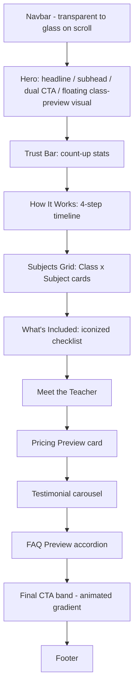

# UIDS.md
## UI Design System — Premium Online Tuition Platform

| | |
|---|---|
| **Document Type** | UI Design System (Single Source of Truth for Visual, Interaction, Motion & Accessibility Design) |
| **Companion Documents** | PRD.md · DRD.md · DATABASE.md (this document never contradicts them) |
| **Version** | 1.0 |
| **Status** | Ready for Frontend Implementation |
| **Stack Target** | Next.js · TypeScript · Tailwind CSS · Framer Motion |
| **Visual Inspiration Source** | Reference tutoring homepage (visual language only — layout is original) |

---

## Table of Contents

1. [Design Philosophy](#1-design-philosophy)
2. [Design Principles](#2-design-principles)
3. [Design Tokens](#3-design-tokens)
4. [Typography](#4-typography)
5. [Color System](#5-color-system)
6. [Spacing System](#6-spacing-system)
7. [Grid System](#7-grid-system)
8. [Iconography](#8-iconography)
9. [Illustration Style](#9-illustration-style)
10. [Component Library](#10-component-library)
11. [Page Specifications](#11-page-specifications)
12. [Dashboard Design](#12-dashboard-design)
13. [Animation System](#13-animation-system)
14. [Responsive Design](#14-responsive-design)
15. [Accessibility](#15-accessibility)
16. [UX Guidelines](#16-ux-guidelines)
17. [Design Governance](#17-design-governance)
18. [Quality Standards](#18-quality-standards)

---

## 1. Design Philosophy

### 1.1 What We Are Building

A premium SaaS-grade experience for a tuition platform — not a "coaching institute" website. Every screen should read like it belongs next to Stripe, Linear, Framer, Vercel, Notion, Raycast, Apple, and Arc Browser — while retaining the warmth and approachability appropriate for students (Class 8–10) and their parents.

### 1.2 What We Borrow From the Reference — and What We Reject

The reference image (a UK tutoring homepage) is a **mood reference only**. We extract its *feeling*, never its *layout*.

| Extracted Quality | How It Shows Up Here |
|---|---|
| Oversized, confident headline type | Variable-weight grotesk display type with staggered line-reveal animation |
| Warm, uncluttered background | Warm off-white surface, never stark white or gray-100 |
| Rounded, soft UI shapes | 8/16/24px radius scale + full-pill buttons, never sharp corners |
| Single flat accent color | One confident accent hue used sparingly, elevated with soft gradient meshes instead of flat blobs |
| Friendly education tone | Retained via illustration style and copy tone, never via cartoonish color-blocking |
| Simple nav + pill CTA | Minimal 4-link floating/glass navbar with one pill CTA |

**Explicitly rejected:** boxed dense navigation, flat multi-color geometric shapes, default system fonts, visible "page chrome," anything that reads as a template or WordPress theme.

### 1.3 Reference Points (Aspirational, Not Literal)

| Product | What We Take From It |
|---|---|
| Stripe | Confident typographic hierarchy, restrained color, precise spacing |
| Linear | Dark-mode-ready contrast system, keyboard-first interaction feel |
| Framer | Motion as a hierarchy tool, not decoration |
| Vercel | Monochrome-plus-one-accent discipline |
| Notion | Approachable density in dashboard tables/lists |
| Raycast | Glass/blur surfaces used sparingly and purposefully |
| Apple | Micro-interaction polish, physical/spring motion |
| Arc Browser | Playful-but-premium personality without clutter |

---

## 2. Design Principles

Each principle below is a *governing rule*, not a suggestion — every component and page spec in this document is judged against these.

| Principle | Rule |
|---|---|
| **Visual Hierarchy** | Every screen has exactly one primary action. Size, weight, and color contrast — never color count — establish hierarchy. |
| **Whitespace** | Whitespace is treated as a component. Minimum 96–140px between major marketing sections (desktop); dashboard cards never touch — minimum 24px gutter. |
| **Consistency** | Every recurring pattern (card, button, empty state) is built once as a primitive and reused; no bespoke one-off versions. |
| **Contrast** | Text-on-surface always meets WCAG AA (4.5:1 body, 3:1 large text). Accent is used against neutral fields only, never accent-on-accent. |
| **Balance** | Asymmetric layouts are allowed (e.g., hero text left / visual right) but must balance optical weight — a large illustration is offset by denser text block, not empty space. |
| **Alignment** | All content aligns to the 12-column grid baseline; nothing "floats" arbitrarily. Optical alignment overrides mathematical alignment for icons/text pairing. |
| **Motion** | Motion clarifies state changes and hierarchy (see §13). It is never applied without a functional reason. |
| **Accessibility** | WCAG 2.1 AA is the floor, not the ceiling. Every interactive element is operable via keyboard and screen reader before it ships. |
| **Interaction** | Every interactive element declares 4 states minimum: resting, hover, active/pressed, focus — plus disabled/loading where relevant. |
| **Content Hierarchy** | Headline → Supporting line → Action, in that order, on every marketing block. Dashboards: Status → Data → Action. |
| **Focus** | One primary CTA per viewport region. Secondary actions are visually quieter (ghost/text buttons). |
| **Readability** | Body copy max-width 65–75 characters (`ch` unit); line-height 1.5–1.6 for body, 1.0–1.15 for display type. |
| **Scanning** | F-pattern for text-heavy pages (FAQ, legal); Z-pattern for marketing hero sections; left-aligned data tables for dashboards. |
| **Affordance** | Anything clickable looks clickable: cursor change, hover elevation/color shift, and — for destructive actions — a confirming second step. |
| **Feedback** | Every user action produces a visible response within 100ms (loading state, toast, inline validation) — never a silent void. |
| **Error Prevention** | Inline validation before submission attempts (e.g., password strength, duplicate email) rather than only on submit-failure. |
| **Recognition over Recall** | Persistent navigation, breadcrumbs in nested dashboard views, and labeled icons (never icon-only for primary actions) reduce memory burden. |
| **Minimal Cognitive Load** | Maximum 7±2 primary navigation items anywhere; progressive disclosure (accordions, "show more") over dense walls of content. |

---

## 3. Design Tokens

All tokens are defined once in `tailwind.config.ts` (design layer) and mirrored in `motion.config.ts` (animation layer per DRD §6.4). No component may declare a raw hex, px, or ms value outside these tokens.

### 3.1 Typography Tokens

| Token | Value |
|---|---|
| `--font-display` | "General Sans Variable", "Neue Montreal", ui-sans-serif |
| `--font-body` | "Inter Variable", ui-sans-serif, system-ui |
| `--font-mono` | "IBM Plex Mono", ui-monospace |
| `--text-xs` … `--text-9xl` | See §4.4 scale |
| `--leading-tight` | 1.05 |
| `--leading-snug` | 1.3 |
| `--leading-normal` | 1.5 |
| `--leading-relaxed` | 1.6 |
| `--tracking-tighter` | -0.04em |
| `--tracking-tight` | -0.02em |
| `--tracking-normal` | 0em |
| `--tracking-wide` | 0.02em |

### 3.2 Color Tokens

See full table in §5. Token names: `--color-ink`, `--color-ink-muted`, `--color-surface`, `--color-surface-alt`, `--color-surface-raised`, `--color-accent`, `--color-accent-soft`, `--color-accent-strong`, `--color-success` (+`-soft`), `--color-warning` (+`-soft`), `--color-danger` (+`-soft`), `--color-info` (+`-soft`), `--color-border`, `--color-border-strong`, `--color-focus-ring`, `--color-selection`.

### 3.3 Spacing Tokens (4px base scale)

`--space-0` 0 · `--space-1` 4px · `--space-2` 8px · `--space-3` 12px · `--space-4` 16px · `--space-5` 20px · `--space-6` 24px · `--space-8` 32px · `--space-10` 40px · `--space-12` 48px · `--space-16` 64px · `--space-20` 80px · `--space-24` 96px · `--space-32` 128px · `--space-40` 160px.

### 3.4 Grid Tokens

`--container-max` 1280px · `--container-max-wide` 1440px (dashboards only) · `--gutter-mobile` 24px · `--gutter-tablet` 32px · `--gutter-desktop` 40px · `--columns` 12.

### 3.5 Radius Tokens

`--radius-xs` 6px (checkboxes, tiny chips) · `--radius-sm` 8px (inputs, small buttons) · `--radius-md` 16px (cards) · `--radius-lg` 24px (large panels, hero media, modals) · `--radius-full` 9999px (pill buttons, avatars, tags).

### 3.6 Shadow Tokens

| Token | Use | Value Direction |
|---|---|---|
| `--shadow-xs` | Inputs, resting chips | `0 1px 2px rgba(11,14,20,0.04)` |
| `--shadow-sm` | Resting cards | `0 2px 8px rgba(11,14,20,0.06)` |
| `--shadow-md` | Hover-lifted cards | `0 8px 24px rgba(11,14,20,0.10)` |
| `--shadow-lg` | Modals, popovers | `0 24px 48px rgba(11,14,20,0.16)` |
| `--shadow-glow-accent` | Selected/focused pricing card | `0 0 0 3px var(--color-accent-soft)` |

### 3.7 Blur & Opacity Tokens

`--blur-glass` 16px (navbar-on-scroll, toasts, modal backdrops) · `--blur-hero-bg` 60px (background gradient meshes) · `--opacity-disabled` 0.45 · `--opacity-muted` 0.65 · `--opacity-overlay` 0.4 (modal backdrop).

### 3.8 Elevation Tokens

`elevation-0` flat content · `elevation-1` resting card (`shadow-sm`) · `elevation-2` hover card (`shadow-md`) · `elevation-3` modal/popover (`shadow-lg`) · `elevation-glass` translucent blurred surface (navbar, toast).

### 3.9 Animation & Motion Tokens

| Token | Value | Use |
|---|---|---|
| `--duration-instant` | 100ms | Toggle/checkbox flip |
| `--duration-fast` | 150ms | Hover color/shadow transitions |
| `--duration-base` | 200ms | Button press, tab switch |
| `--duration-moderate` | 350ms | Modal enter, dropdown open |
| `--duration-slow` | 500ms | Section scroll-reveal |
| `--duration-hero` | 700ms | Hero headline stagger completion |
| `--ease-out` | `cubic-bezier(0.16, 1, 0.3, 1)` | Entrances |
| `--ease-in-out` | `cubic-bezier(0.4, 0, 0.2, 1)` | State changes |
| `--spring-soft` | `stiffness:180, damping:20` | Magnetic buttons, floating cards |
| `--spring-snappy` | `stiffness:300, damping:24` | Modal pop-in, toast |
| `--stagger-child` | 60ms | Delay between staggered list/word children |

### 3.10 Icon Tokens

`--icon-stroke` 1.75px · `--icon-size-sm` 16px · `--icon-size-md` 20px · `--icon-size-lg` 24px · `--icon-size-xl` 32px · `--icon-radius` matches Lucide default (rounded joins).

### 3.11 Illustration Tokens

`--illustration-style` "line + soft gradient fill" · `--illustration-stroke` 2px · `--illustration-palette` derived from `--color-accent` + 2 tints, never more than 3 hues per illustration.

### 3.12 Border Tokens

`--border-hairline` 1px solid `var(--color-border)` at 100% · `--border-strong` 1.5px solid `var(--color-border-strong)` · `--border-focus` 2px solid `var(--color-focus-ring)`.

### 3.13 Breakpoint Tokens

`--bp-sm` 375px · `--bp-md` 768px · `--bp-lg` 1024px · `--bp-xl` 1280px · `--bp-2xl` 1536px.

### 3.14 Z-Index Tokens

`--z-base` 0 · `--z-dropdown` 20 · `--z-sticky-nav` 30 · `--z-drawer` 40 · `--z-modal-backdrop` 50 · `--z-modal` 51 · `--z-toast` 60 · `--z-tooltip` 70 · `--z-cursor-follower` 80.

---

## 4. Typography

### 4.1 Font Family & Pairing

| Role | Typeface | Fallback Stack |
|---|---|---|
| Display / Headlines | General Sans Variable (or Neue Montreal-class grotesk) | `ui-sans-serif, -apple-system, Segoe UI, sans-serif` |
| Body / UI | Inter Variable | `ui-sans-serif, -apple-system, Segoe UI, sans-serif` |
| Numerals (pricing, stats, dashboards) | Inter Variable, tabular-nums, weight 600 | same as body |
| Code / IDs (rarely used, e.g., invoice numbers) | IBM Plex Mono | `ui-monospace, SFMono-Regular` |

Both Display and Body are variable fonts loaded via `next/font` with `font-display: swap` and subset to Latin to protect LCP.

### 4.2 Letter Spacing & Line Height Rules

| Context | Tracking | Line Height |
|---|---|---|
| Hero display (56–96px) | `--tracking-tighter` | `--leading-tight` (1.0–1.05) |
| Section headings (32–48px) | `--tracking-tight` | 1.1 |
| Body copy (16–18px) | `--tracking-normal` | `--leading-relaxed` (1.5–1.6) |
| Captions / labels (12–13px) | `--tracking-wide` | 1.4 |
| Buttons | `--tracking-normal`, uppercase never used | 1 |

### 4.3 Paragraph Width

Body paragraphs are capped at `65–75ch` regardless of container width — enforced via a `.prose-measure` utility class, applied to all marketing body text, FAQ answers, and legal pages.

### 4.4 Type Scale (Responsive)

| Token | Mobile | Desktop | Typical Use |
|---|---|---|---|
| `--text-xs` | 12px | 12px | Captions, badges |
| `--text-sm` | 13px | 14px | Secondary labels, table cells |
| `--text-base` | 15px | 16px | Body copy |
| `--text-lg` | 17px | 18px | Lead paragraphs |
| `--text-xl` | 19px | 20px | Card titles |
| `--text-2xl` | 22px | 24px | Sub-section headings |
| `--text-3xl` | 26px | 32px | Section headings |
| `--text-4xl` | 32px | 40px | Page titles |
| `--text-5xl` | 38px | 56px | Hero (compact) |
| `--text-6xl` | 44px | 72px | Hero (standard) |
| `--text-7xl`–`--text-9xl` | 52–64px | 80–96px | Hero (maximal, Home page only) |

Fluid scaling uses CSS `clamp()` between mobile and desktop values rather than fixed breakpoint jumps, for smooth resizing across the responsive range.

### 4.5 Heading, Body & Caption Scales

| Level | Token | Weight |
|---|---|---|
| H1 (page hero) | `--text-6xl`/`--text-7xl` | 600–650 (variable) |
| H2 (section) | `--text-3xl`/`--text-4xl` | 600 |
| H3 (card/subsection) | `--text-xl`/`--text-2xl` | 600 |
| H4 (label-level heading) | `--text-lg` | 600 |
| Body | `--text-base` | 400 |
| Body emphasis | `--text-base` | 500 |
| Caption | `--text-xs`/`--text-sm` | 500, `--color-ink-muted` |

### 4.6 Button, Dashboard & Number Typography

- **Buttons:** `--text-sm`/`--text-base`, weight 600, no uppercase transform, `--tracking-normal`.
- **Dashboard labels:** `--text-xs` uppercase-free, weight 500, `--color-ink-muted`.
- **Dashboard KPI numbers:** `--text-4xl`/`--text-5xl`, weight 650, tabular-nums, `--color-ink`.
- **Pricing numbers:** `--text-5xl` for the primary figure, `--text-base` weight 500 muted for the "/month" suffix, always tabular-nums so digits don't jitter during the interactive calculator (§11.4).

---

## 5. Color System

### 5.1 Palette Direction

A **two-tone premium palette**: a near-black ink for text/structure, a warm off-white for surface, and exactly **one accent hue** (finalized as a deep violet, `#5B3DF5`-class, during visual QA — implementers may substitute an approved emerald alternative but never both). No more than one accent + one semantic color may be visible in any single screen region (per PRD §6.3).

### 5.2 Full Token Table

| Token | Light Mode | Dark Mode | Purpose |
|---|---|---|---|
| `--color-ink` | `#0B0E14` | `#F4F4F6` | Primary text, headlines |
| `--color-ink-muted` | `#5B6270` | `#9AA1AE` | Secondary text, captions |
| `--color-surface` | `#FAF9F6` | `#0E1116` | Base page background |
| `--color-surface-alt` | `#F2F0EA` | `#151922` | Alternating section background |
| `--color-surface-raised` | `#FFFFFF` | `#1A1F29` | Cards, modals, popovers |
| `--color-accent` | `#5B3DF5` | `#8B7BFF` | Primary CTA, links, active states |
| `--color-accent-soft` | `#5B3DF5` @ 10% | `#8B7BFF` @ 16% | Chip fills, hover backgrounds |
| `--color-accent-strong` | `#4527D6` | `#A296FF` | Pressed/active accent |
| `--color-success` | `#0F9D58` | `#3DDC84` | Paid, completed, graded |
| `--color-success-soft` | `#0F9D58` @ 10% | `#3DDC84` @ 14% | Success badge fill |
| `--color-warning` | `#B8720A` | `#F2B33D` | Pending, due soon |
| `--color-warning-soft` | `#B8720A` @ 10% | `#F2B33D` @ 14% | Warning badge fill |
| `--color-danger` | `#D0342C` | `#FF6B61` | Failed, overdue, errors |
| `--color-danger-soft` | `#D0342C` @ 10% | `#FF6B61` @ 14% | Error badge/field fill |
| `--color-info` | `#1971C2` | `#5FA8E8` | Informational banners |
| `--color-border` | `#0B0E14` @ 8% | `#F4F4F6` @ 10% | Hairline dividers |
| `--color-border-strong` | `#0B0E14` @ 16% | `#F4F4F6` @ 18% | Input borders, table rules |
| `--color-focus-ring` | `#5B3DF5` @ 60% | `#8B7BFF` @ 60% | Keyboard focus outline |
| `--color-selection` | `#5B3DF5` @ 20% | `#8B7BFF` @ 24% | Text selection highlight |

### 5.3 Semantic Usage Rules

- Success/Warning/Danger/Info are **status-only** — never used for decorative or branding purposes.
- Accent is reserved for the single primary action per view; a page may never contain two competing accent-colored CTAs.
- Hover = base color shifted toward `--color-accent-strong` or +4% ink; Pressed = −4% brightness plus 0.97 scale (see §13); Disabled = `--opacity-disabled` applied over resting state, never a separate gray token.

### 5.4 Data Visualization Palette

A 6-step categorical palette derived from the accent hue at varied lightness/saturation (never arbitrary rainbow colors), used for charts in Results and Analytics: `--chart-1` (accent) → `--chart-6` (lightest tint), plus `--color-success`/`--color-danger` reserved for pass/fail or above/below-average markers only.

### 5.5 Dark Mode

Dark mode is a first-class token swap (not an afterthought filter). All components must be authored against tokens, never raw hex, so theme switching requires zero component-level logic. Dark mode surfaces use elevation via *lightness steps* (`#0E1116` → `#1A1F29` → `#212736`) rather than shadows, since shadows barely read on dark backgrounds.

### 5.6 Contrast & Accessibility

| Pairing | Minimum Ratio | Status |
|---|---|---|
| `--color-ink` on `--color-surface` | 4.5:1 | ✅ (verified ~17:1) |
| `--color-ink-muted` on `--color-surface` | 4.5:1 | ✅ (verified ~4.6:1) |
| `--color-accent` text on `--color-surface` | 4.5:1 | ✅ (verified ~5.1:1) |
| White text on `--color-accent` (buttons) | 4.5:1 | ✅ (verified ~5.4:1) |
| All semantic colors on their `-soft` background | 4.5:1 for text label | Verified per pairing at build time via automated contrast lint |

Color is never the sole indicator of state — every semantic color pairing includes an icon or text label (e.g., a "Paid" badge is green **and** labeled, never a bare green dot).

---

## 6. Spacing System

### 6.1 Scale

Base unit: 4px. Full scale: 0, 4, 8, 12, 16, 20, 24, 32, 40, 48, 64, 80, 96, 128, 160 (see §3.3 tokens). All margin/padding/gap values in the codebase must resolve to this scale — arbitrary values (`mt-[13px]`) are disallowed by lint rule.

### 6.2 Section, Card & Container Spacing

| Context | Mobile | Tablet | Desktop |
|---|---|---|---|
| Vertical rhythm between marketing sections | 64px | 96px | 96–140px |
| Card internal padding (standard) | 20px | 24px | 24px |
| Card internal padding (pricing/feature cards) | 24px | 28px | 32px |
| Grid gap (card grids) | 16px | 24px | 24–32px |
| Dashboard widget padding | 16px | 20px | 24px |
| Dashboard grid gap | 12px | 16px | 20px |
| Form field vertical gap | 16px | 16px | 20px |
| Container side padding | 24px | 32px | 40px |

### 6.3 Margin & Container Rules

- Content never touches the viewport edge below 24px on any breakpoint.
- Dashboard tables/lists may extend closer to the sidebar edge (16px) since density is expected there, per §12.

---

## 7. Grid System

### 7.1 Breakpoint & Column Table

| Breakpoint | Width | Columns | Gutter | Container Max |
|---|---|---|---|---|
| Mobile (`sm`) | 375–767px | 4 | 16px | fluid, 24px side padding |
| Tablet (`md`) | 768–1023px | 8 | 24px | fluid, 32px side padding |
| Laptop (`lg`) | 1024–1279px | 12 | 32px | 1120px |
| Desktop (`xl`) | 1280–1535px | 12 | 40px | 1280px (1440px for dashboards) |
| Large Desktop (`2xl`) | ≥1536px | 12 | 40px | 1280px content, centered with generous side margin |

### 7.2 Responsive Behaviour

- Marketing pages: content column collapses from 12 → 8 → 4 columns; hero splits from 2-column (text/visual) to stacked single-column below `lg`.
- Dashboard pages: sidebar (fixed 260px) + fluid content region ≥`lg`; below `lg`, sidebar collapses to a bottom tab bar and content becomes full-width single column.
- Card grids: 3-up (subjects, pricing) → 2-up (`md`) → 1-up (`sm`).

### 7.3 Alignment Rules

- All text blocks left-align by default (no centered body paragraphs); only hero headline + CTA cluster and empty states may be center-aligned.
- Numeric/table columns are right-aligned; text columns are left-aligned; status badges are center-aligned within their cell.

---

## 8. Iconography

| Aspect | Rule |
|---|---|
| **Library** | Single family: Lucide (or Phosphor, line variant) — never mixed |
| **Stroke Width** | 1.75px, consistent regardless of icon size |
| **Corner Radius** | Rounded joins (library default) — no sharp-line icon substitutions |
| **Sizes** | 16px (inline with text-sm), 20px (default UI), 24px (nav/section headers), 32px (feature callouts) |
| **Spacing** | Minimum 8px between icon and adjacent label; icons never touch text |
| **Color** | Inherit `currentColor`; only status icons (success/warning/danger) break this rule |
| **Usage Rules** | Icons never appear alone as the *only* signifier of a primary action — always paired with a text label, except for universally recognized utility icons (search, close, chevron) inside already-labeled contexts |
| **Animation Rules** | Icon micro-motion only on hover/state-change (e.g., chevron rotates 180° on accordion expand, arrow nudges 2px on button hover) — durations use `--duration-fast` |
| **Accessibility** | Every standalone icon button has an `aria-label`; decorative icons get `aria-hidden="true"` |

---

## 9. Illustration Style

| Element | Direction |
|---|---|
| **Overall Style** | Custom line illustration with soft gradient-mesh fills, 2px stroke, restricted to accent hue + 2 tints — never flat multi-color cartoon style |
| **Hero Illustration** | Abstract representation of "live learning" (floating class card mockup, notebook, subject icons) with parallax blob backdrop, not literal stock photography |
| **Dashboard Illustrations** | Minimal, single-color-line, used only in empty/success states — never decorative in data-dense views |
| **Empty States** | Friendly, small (max 160px), centered above a one-line message + single CTA |
| **Error States** | Same line style, slightly desaturated, paired with a clear recovery action |
| **Loading** | No illustration — skeleton shimmer only (illustrations for loading feel slow/cute in a premium product) |
| **Success** | A single animated checkmark-in-circle (SVG stroke draw-on), not confetti or mascots |
| **Education Graphics** | Abstract iconographic representations of subjects (a graph for Math, a flask for Science) rather than literal photos of books/pencils |
| **Character Style** | If human figures are used at all (e.g., Teacher page), they are photographic (real photo, color-graded) — illustrated humans are avoided to prevent a "kids' app" feel |
| **Background Graphics** | Gradient-mesh blobs, 40–60px blur, opacity 30–50%, animated per §13 |
| **Blob Style** | Organic, 3–4 anchor points, animated morph loop (8–12s), never more than one per viewport |
| **Gradient Mesh** | Two-color blend from `--color-accent` to transparent, used behind hero/CTA sections only |

---

## 10. Component Library

> Convention: every component below specifies Purpose, Anatomy, Variants, Sizes, States, A11y, Animation, and Responsive behaviour. Components live in `components/ui/*` per DRD §6.2 and are consumed by `components/marketing/*` and `components/dashboard/{student,teacher,admin}/*`.

### 10.1 Button

- **Purpose:** Primary interaction trigger across marketing and dashboard surfaces.
- **Anatomy:** Container (pill or `radius-sm` for dashboard secondary actions) → optional leading icon → label → optional trailing icon/spinner.
- **Variants:** Primary (filled accent), Secondary (outline, `--color-border-strong`), Ghost (text-only, no border), Destructive (filled `--color-danger`), Link (underline-on-hover text).
- **Sizes:** `sm` (32px height, `--text-sm`), `md` (40px, `--text-base`) default, `lg` (48px, `--text-base`, used for hero CTAs).
- **States:** Resting → Hover (magnetic pull + 2% brightness lift, `--spring-soft`) → Active/Pressed (scale 0.97, `--duration-instant`) → Focus (2px `--color-focus-ring` outset ring) → Loading (label replaced/paired with spinner, button disabled to prevent double-submit) → Disabled (`--opacity-disabled`, no pointer events).
- **A11y:** Real `<button>` element; `aria-busy="true"` during loading; disabled buttons remain in the tab order only if they carry an explanatory tooltip, otherwise removed from tab order.
- **Animation:** Magnetic hover on primary CTAs only (hero, pricing, final CTA band) — pointer-tracked transform within an 8px radius, `--spring-soft`. Ripple effect on click origin point, 400ms fade. Icon nudges 2px on hover for "→" trailing icons.
- **Responsive:** Full-width on mobile for primary form-flow buttons (Book Demo, Pay Now); auto-width elsewhere.

### 10.2 Input Field

- **Purpose:** Single-line text entry (name, email, phone, price calculator fields).
- **Anatomy:** Floating label → input box (`radius-sm`, `border-strong`) → optional leading icon → optional trailing validation icon → helper/error text below.
- **Variants:** Text, Email, Phone (with country code prefix), Password (with show/hide toggle), Search (with leading icon + clear button).
- **States:** Empty (label centered as placeholder) → Focused (label floats up, border becomes `--color-accent`, `--duration-fast`) → Filled → Error (border `--color-danger`, helper text turns red, shake animation 200ms on submit-attempt) → Disabled (`--opacity-disabled`, `--color-surface-alt` fill).
- **A11y:** `<label>` programmatically associated via `for`/`id`; error text linked via `aria-describedby`; `aria-invalid="true"` on error.
- **Animation:** Label float uses `--duration-fast` `--ease-out`; error shake is a 3-cycle ±4px horizontal translate, respects `prefers-reduced-motion` (skips shake, keeps color change).

### 10.3 Textarea

Same conventions as Input Field; auto-grows up to a max of 8 lines before becoming internally scrollable; character counter appears bottom-right when a max length is defined (e.g., assignment feedback).

### 10.4 Select / Dropdown

- **Anatomy:** Trigger (styled like Input) → chevron icon (rotates 180° open) → floating panel (`elevation-3`, `radius-md`) → option list with hover/selected states.
- **States:** Closed → Open (panel scale-in from 0.96→1 + fade, `--duration-base`) → Option hover (`--color-accent-soft` background) → Selected (checkmark trailing icon) → Disabled.
- **A11y:** Full `role="listbox"`/`role="option"` pattern or native `<select>` progressive-enhanced; arrow-key navigation, `Enter` to select, `Escape` to close.
- **Use Cases:** Class selector, Subject multi-select (pricing calculator), sort/filter controls.

### 10.5 Checkbox / Radio / Switch

- **Checkbox:** `radius-xs`, checkmark draws on via stroke-dashoffset animation (`--duration-fast`) on check.
- **Radio:** Circular, filled dot scale-in (0→1) on selection.
- **Switch:** Pill track, thumb slides with `--spring-soft`; used for notification preference toggles (Student/Teacher Profile & Settings).
- **A11y:** All three are real form controls or fully ARIA-patterned equivalents; switch exposes `role="switch"` + `aria-checked`.

### 10.6 Badge / Chip / Tag

- **Badge:** Status indicator (Paid/Pending/Overdue/Active/Cancelled) — pill shape, `-soft` background + full-strength text of the matching semantic color, paired with a small dot or icon (never color alone, per §5.6).
- **Chip:** Removable filter/selection element (e.g., selected Subject in pricing calculator) — pill, `--color-accent-soft` fill, trailing "×" dismiss icon.
- **Tag:** Static categorical label (e.g., subject tag on a content card) — neutral `--color-surface-alt` fill.

### 10.7 Toast / Snackbar

- **Anatomy:** Glass surface (`elevation-glass`, `--blur-glass`) → status icon → message → optional action link → dismiss icon.
- **Position:** Bottom-center on mobile, bottom-right on desktop; stacks vertically with 8px gap for multiple toasts (max 3 visible, rest queued).
- **Animation:** Enter — slide-up 16px + fade, `--spring-snappy`; auto-dismiss after 5s (paused on hover/focus); exit — fade + slide-down.
- **A11y:** `role="status"` (info/success) or `role="alert"` (error), `aria-live="polite"`/`"assertive"` respectively.

### 10.8 Alert (Inline Banner)

Full-width or contained banner for persistent contextual messages (e.g., "Your subscription is overdue" on Student Dashboard). Left icon + message + optional inline CTA. Semantic color-coded background at `-soft` opacity with full-strength left border accent (4px).

### 10.9 Avatar

Circular (`radius-full`), image with graceful fallback to initials on a deterministic accent-tinted background if no photo is set. Sizes: 24/32/40/56/96px. A small colored ring indicates online/live status only where relevant (Teacher "live now" indicator).

### 10.10 Tooltip

Appears on hover/focus after 400ms delay, `elevation-3`, small `radius-sm`, max-width 240px, fades+scales in (`--duration-fast`). Never used to hide essential information — supplementary only.

### 10.11 Popover

Larger, richer tooltip-like surface (e.g., notification bell dropdown). Anchored, `elevation-3`, closes on outside-click/Escape, traps focus while open.

### 10.12 Cards (Family)

All cards share a base primitive: `radius-md`, `elevation-1` resting, `elevation-2` + `translateY(-4px)` on hover, `--duration-base` `--ease-out`.

| Card Type | Distinct Elements |
|---|---|
| **Pricing Card** | Plan name, large price (tabular numerals), feature checklist (icon+text rows), CTA button; "Popular"/selected variant gets `--shadow-glow-accent` border |
| **Subject Card** | Subject icon/illustration, name, class tag, weekly-structure summary, price, "Book Demo" link; expands (accordion or modal) for full detail |
| **Teacher Card** | Avatar, name, credentials line, subjects taught as tags; supports repeating in a grid for future multi-teacher scale |
| **Assignment Card** | Title, subject tag, due countdown chip, status badge (Pending/Submitted/Graded/Overdue) |
| **Test Card** | Title, date, countdown or score, status badge |
| **Recording Card** | Thumbnail (16:9, `radius-md`), play-overlay icon (scales on hover), duration chip, watched/unwatched dot |
| **Statistics Card** | Large tabular number (count-up on view), label, trend delta (↑/↓ with semantic color) |
| **Dashboard Card (generic widget container)** | Header (title + optional action link), body slot, optional footer |

### 10.13 Navbar

- **Public Navbar:** Logo (left) · 4 nav links (center/left-of-CTA) · "Log in" text link · "Book a Demo" pill CTA (right). Transparent + large logo at top of Home; on scroll >80px, compresses to `elevation-glass` (blurred, `--color-surface` @ 85% opacity), height reduces from 96px→72px, logo scales 1→0.85, all animated with `--duration-base` `--ease-in-out`.
- **Dashboard Topbar:** Search field (global), notification bell (popover), avatar menu (dropdown: Profile, Settings, Log out).

### 10.14 Sidebar (Dashboard)

Fixed 260px (desktop), collapsible to icon-only 72px rail (tablet), replaced by bottom tab bar (mobile, 5 items max). Active route indicated by `--color-accent-soft` background + left 3px accent bar, not just a color-only text change. Sections: primary nav group, secondary/settings group pinned to bottom.

### 10.15 Footer

Public-site only. 4-column layout (Sitemap · Company · Legal · Contact/Social) collapsing to accordion groups on mobile. Newsletter/contact CTA band sits above the footer, not inside it.

### 10.16 Breadcrumb

Used only inside nested dashboard views (e.g., `Assignments / Physics — Chapter 4 / Submission #12`). Chevron separators, current page non-interactive and `--color-ink-muted`.

### 10.17 Pagination

Numbered + prev/next chevrons for admin tables; "Load more" pattern preferred for student-facing recordings/materials lists to reduce cognitive overhead.

### 10.18 Calendar / Date Picker

Month-grid view with animated month-transition (slide), current day ring, selected day fill (`--color-accent`), disabled/past days at `--opacity-disabled`. Used in Demo booking (slot selection) and Teacher schedule creation.

### 10.19 Search

Persistent in dashboard topbar; command-style (⌘K) overlay available for Teacher/Admin power users — modal with fuzzy-filtered list, arrow-key navigation.

### 10.20 Filter

Segmented control (pill tabs) for small option sets (Class 8/9/10); popover checklist for larger option sets (Admin enrollment filters).

### 10.21 Tables (Data Table)

- **Anatomy:** Sticky header row → sortable column headers (chevron indicator) → rows with hover background (`--color-surface-alt`) → optional row-level actions (right-aligned icon buttons, revealed on hover on desktop, always visible on touch).
- **States:** Loading (skeleton rows, shimmer), Empty (illustration + CTA), Error (inline retry).
- **Responsive:** Below `md`, tables convert to stacked card rows (label:value pairs) rather than horizontal scroll, except Admin power-user tables which may retain horizontal scroll with a sticky first column.

### 10.22 Charts / Data Visualization

Line charts (score trends), bar/histogram (test score distribution), donut (subscription status breakdown). All animate in with a draw-on/grow-in effect on first view (`--duration-slow`, once). Tooltips on hover show exact values. Color drawn only from the categorical/semantic palettes in §5.4.

### 10.23 Accordion

Height auto-animates (measured via `FLIP` technique or Framer Motion `layout`) over `--duration-base`; chevron rotates 180°. Used in FAQ, Subject detail expansion, dashboard "show more" patterns.

### 10.24 Timeline

Vertical (mobile) / horizontal (desktop) connector line with step nodes; nodes and connecting line draw in sequentially as the section scrolls into view (stroke-dashoffset animation), used in "How It Works."

### 10.25 Progress Bar / Stepper

Linear bar for file uploads/payment processing; stepped indicator (numbered circles + connecting line) for multi-step flows (Registration, Demo Booking, Checkout) — completed steps show an animated checkmark draw-in.

### 10.26 Modal / Dialog

`elevation-3`, `radius-lg`, max-width 480–640px depending on content, backdrop blur + 40% dark overlay. Enter: scale 0.96→1 + fade, `--spring-snappy`. Exit: reverse, faster (`--duration-base`). Focus is trapped inside; `Escape` and backdrop-click close (except destructive-confirmation modals, which require explicit button choice).

### 10.27 Drawer / Bottom Sheet

Side drawer (desktop, e.g., notification panel) slides in from the right; bottom sheet (mobile equivalent) slides up and supports drag-to-dismiss. Both use `--spring-soft`.

### 10.28 Tabs

Underline indicator slides/resizes between active tabs (`layoutId` shared-element animation, `--duration-base`), rather than an abrupt jump.

### 10.29 Video Player Card

Custom-skinned player (thumbnail → play overlay icon scales 1→1.1 on hover → native or lightweight custom controls once playing): progress scrubber, duration, playback speed, fullscreen. Used for Recordings.

### 10.30 PDF Viewer

Inline paginated viewer for Notes/Solutions/Assignment attachments, with page-thumbnail rail on desktop, swipe-paginate on mobile, download action always available as a fallback.

### 10.31 Audio Player

Minimal waveform-style scrubber, used only if audio-only content is introduced later; same interaction language as Video Player Card.

### 10.32 Notification Panel

Popover/drawer listing chronological announcements/system notifications; unread items carry a left accent bar + bold text; "Mark all as read" action top-right.

### 10.33 Chat Bubble

Reserved primitive for future direct-messaging (not in Phase 1 scope per PRD, but styled now for consistency): rounded asymmetric bubbles, sender-right/accent-filled vs. receiver-left/surface-filled.

### 10.34 Countdown Timer

Monospace/tabular numerals, used for demo-class-starts-in and live-class-join-window contexts; updates every second, switches to a pulsing `--color-accent` treatment in the final 5 minutes.

### 10.35 Live Class Banner

Full-width persistent banner (Student/Teacher dashboards) when a class is live or starting within the join window; pulsing "LIVE" dot (respecting reduced-motion by using a static dot + text instead of pulse), one-tap "Join Class" button.

### 10.36 Skeleton Loader

Shimmer gradient sweep (`--duration-slow`, looping) across gray placeholder blocks matching the exact shape of the real content (card, table row, avatar) to prevent layout shift.

### 10.37 Empty State

Centered illustration (max 160px) + one-line headline + optional one-line supporting text + single primary CTA. Never more than one CTA in an empty state.

---

## 11. Page Specifications

> For every page: Purpose, Sections/Layout, Components used, Animation, Responsive behaviour, Loading/Empty/Error states, SEO, Accessibility, Interaction — per the source PRD §8–13 page list. Layout composition below is original; only visual language is shared with the reference.

### 11.1 Home

**Purpose:** Establish premium trust instantly and drive to "Book a Demo" or "View Pricing" within the first viewport (PRD §8.1).

**Layout (desktop, top→bottom):**

- **Hero:** Two-column (text left 55% / floating visual right 45%) on desktop, stacked on mobile. Headline uses staggered line-reveal (mask slide-up, `--stagger-child` per line). Floating visual: a mockup "live class card" with parallax gradient blobs behind it (0.4x scroll speed).
- **Components used:** Navbar, Button (primary+secondary), Statistics Card, Timeline, Subject Card, Teacher Card, Pricing Card, Testimonial Carousel (Slide), Accordion, Footer.
- **Loading state:** Hero text/CTA render immediately (SSR); below-fold sections lazy-mount with skeleton/blur-up placeholders.
- **Empty/Error:** N/A (static marketing content); testimonials degrade to a static single quote if the feed API fails.
- **SEO:** SSR via Next.js, `Organization` + `Course` structured data, descriptive `<title>`/meta description, single `<h1>` = hero headline.
- **Accessibility:** Skip-to-content link before Navbar; all count-up stats have a static `aria-label` with the final number for screen readers (motion is decorative only).
- **Interaction/Acceptance:** Hero CTA visible without scroll ≥360px width; count-up animates once on first viewport entry (`viewport={{ once: true }}`).

### 11.2 How It Works

**Purpose:** Deep-dive process explanation for visitors needing more detail (PRD §8.2).

**Sections:** Expanded animated timeline (4–6 steps) → "A Day in the Life of a Student" illustrated walkthrough (alternating left/right image-text rows) → short explainer block → FAQ accordion → CTA band. Timeline nodes/connector draw in sequentially as the section scrolls into view.

### 11.3 Subjects & Classes

**Purpose:** Filter by Class (8/9/10) and explore subject-specific detail (PRD §8.3).

**Layout:** Sticky segmented-control filter bar (Class 8/9/10, animated sliding active-indicator) directly under a compact page header → responsive Subject Card grid (3-up desktop / 2-up tablet / 1-up mobile) → each card expands via accordion-in-place (not modal, to preserve scroll context) revealing weekly structure, sample materials preview, price, and a "Book Demo for this Subject" CTA.

**States:** Changing Class filter cross-fades the grid (`--duration-base`) using client-side state, no reload. Empty state ("No subjects configured for this class yet") shown only if Admin has deactivated all subjects for a class.

### 11.4 Pricing

**Purpose:** Transparent, objection-handling pricing (PRD §8.4).

**Layout:** Page header → **interactive calculator card** (Class selector + multi-select Subject chips → live total, animated number roll-up on change) → Demo callout banner (₹100 trial) → comparison table (this platform vs. private tutor vs. recorded courses — neutral framing, not competitor-bashing) → billing FAQ accordion → CTA.

**Interaction:** Total price uses a digit-roll-up animation (`--duration-base`) whenever subjects are toggled; "Enroll Now" CTA carries selected Class+Subjects as query state into Registration (PRD §8.4 acceptance criteria).

### 11.5 Teacher / About

**Purpose:** Humanize the single-teacher brand (PRD §8.5). Structured as a repeatable "Team" section so a second Teacher Card can be added later with zero redesign.

**Layout:** Large photo + credentials panel → teaching philosophy pull-quote (large display type, not a boxed testimonial) → subjects/classes taught (tag row) → optional short video intro (custom-skinned Video Player Card) → student success highlights (Statistics Cards).

### 11.6 Book a Demo

**Purpose:** Low-friction ₹100 trial conversion (PRD §8.6).

**Flow (Stepper component, 4 steps):** Select Class → Select Subject → Select time slot (Calendar/Date Picker, animated slot selection) → Contact details + Pay ₹100 → Confirmation screen with live Countdown Timer + "Add to Calendar."

**States:** Each step validates before advancing (Error Prevention principle, §2); back-navigation preserves prior selections; payment step reuses the shared Payments components (§11.9 pattern).

### 11.7 FAQ / Support

**Purpose:** Reduce support burden (PRD §8.7). Full accordion FAQ grouped by category tabs (Enrollment/Payments/Classes/Technical/Refunds) + contact form/WhatsApp link fallback.

### 11.8 Legal Pages (Terms, Privacy, Refund Policy)

Plain single-column typographic layout using the standard type system (§4), max 75ch measure, sticky in-page table-of-contents on desktop for long documents, no special components.

### 11.9 Login

Single form for all roles (role resolved server-side, PRD §9.2): Email/Phone + Password fields, "Forgot Password" link, optional "Log in with OTP instead" toggle. Centered card (max 400px) on a subtly gradient-meshed background consistent with brand. Inline error uses the Input Field error state + a shake animation on failed submit.

### 11.10 Register

3-step Stepper (Full Name/Class/Phone/Email → Password or OTP → Verify OTP), per PRD §9.1. Live password-strength indicator (a segmented bar under the password field, filling and recoloring success→warning→danger tiers as strength increases — note: strength meter colors are semantic-status colors, not decorative).

### 11.11 Payment / Checkout

Order summary card (line items, total) → payment method selection (radio cards) → redirect-to-gateway state (full-screen loading with clear "Redirecting to secure payment" message, never a silent blank screen) → Success/Failure/Pending outcome screens, each with a distinct icon animation (checkmark draw-in / shake / pulsing clock respectively) and a clear next action.

### 11.12 Contact

Simple two-column layout: contact form (Input/Textarea/Button) + direct contact details (email, phone, WhatsApp) and office hours, consistent card styling with the rest of the site.

---

## 12. Dashboard Design

Shared dashboard shell across Student/Teacher/Admin: fixed Sidebar (§10.14) + Topbar (§10.13) + scrollable content region using the wide dashboard container (`--container-max-wide`).

### 12.1 Student Dashboard

| Section | Content |
|---|---|
| Overview | Today's live classes (join countdown), pending assignments count, next test date, latest announcement, subscription status Alert if payment due |
| My Classes | Weekly calendar (list on mobile); class cards with status badge (Upcoming/Live/Completed/Missed) |
| Assignments | Filterable list by status; detail view with submission uploader + countdown |
| Weekly Tests | Countdown to next test; past test list with score trend chart |
| Results | Per-subject trend Line Chart, overall standing summary |
| Materials & Recordings | Subject → Topic/Week tree; Recording Cards, PDF Viewer for notes |
| Announcements | Chronological feed, read/unread state |
| Billing | Subscription list with status Badges, payment history Table, "Add Subject" flow |
| Profile & Settings | Personal details, password/OTP, notification Switches |

**Empty states:** "No classes scheduled yet," "No assignments due — enjoy the break!" etc., always paired with a relevant next action (e.g., "Browse Subjects").

### 12.2 Teacher Dashboard

KPI cards (active students, classes this week, pending grading, next 24h class) → Class Scheduling calendar (conflict-detection inline warning per PRD §22 edge cases) → Content Upload (drag-drop zone + Google Drive-backed file list) → Assignments/Tests management tables → unified Grading queue (sortable by due date/subject/class) → Student Roster table → Analytics (attendance rate, completion rate charts) → Profile & Settings.

### 12.3 Admin Dashboard

Platform KPI band (animated counters + trend sparklines: total students, active subscriptions, MRR, churn, demo-to-paid conversion) → Enrollment Management table (filters, bulk actions) → Payments & Invoices table (status filters, manual reconciliation action, CSV export) → Teacher Management (add/edit teacher, assign Subjects/Classes — the key extensibility surface per PRD §13.4) → Class/Subject/Pricing Configuration forms → Content Moderation queue (optional, toggleable) → Announcements Broadcast composer → Platform Settings.

### 12.4 Shared Dashboard States

- **Loading:** Skeleton widgets matching final layout shape — never a spinner-only blank page.
- **Empty:** Illustration + CTA (§10.37), scoped per widget, not a full-page takeover.
- **Error:** Inline retry affordance per widget; a single widget's failure never blocks the rest of the dashboard from rendering (isolated fetch boundaries).

---

## 13. Animation System

### 13.1 Motion Philosophy

Motion exists to **reveal hierarchy and confirm state** — never as unearned decoration. Every animation in this system maps to one of: entrance/exit, hierarchy emphasis, state feedback, or spatial continuity. A maximum of **one** ambient/looping animation is visible per viewport at any time (PRD §7.3).

### 13.2 Motion Principles & Duration/Easing Tokens

See §3.9 for the canonical token table. Governing rule: micro-interactions 100–200ms, section reveals 350–700ms, page transitions 300–500ms; ease-out for entrances, ease-in-out for state changes, spring physics reserved for playful/tactile elements (magnetic buttons, floating cards, toasts).

### 13.3 Full Animation Catalogue

| Animation | Trigger | Duration/Easing | Purpose | Reduced-Motion Behaviour |
|---|---|---|---|---|
| Hero headline reveal | Page load | 700ms stagger, `--ease-out` | Establish premium first impression | Instant fade, no stagger |
| Scroll reveal (fade+translateY) | Intersection (`once:true`) | 500ms, `--ease-out` | Guide attention down the page | Instant appearance, no translate |
| Fade (route/modal) | Route/modal change | 300ms, `--ease-in-out` | Smooth context switch | Instant, no scale |
| Slide (drawer/carousel) | User action | 350ms, `--ease-out` | Spatial continuity | Instant position, no slide |
| Scale (hover/press) | Pointer hover/press | 150–200ms | Affordance feedback | Retained (not purely decorative) |
| Parallax (hero/section blobs) | Scroll position | Continuous, 0.3–0.6x | Depth cue | Disabled entirely |
| Floating cards | Idle loop | 3–4s ease-in-out, ±6px | Liveliness | Disabled entirely |
| Hover states (cards/nav/icons) | Pointer hover | 150–250ms | Affordance | Retained |
| Magnetic buttons | Pointer proximity | `--spring-soft` | Tactile premium feel | Disabled (static hover only) |
| Ripple effect | Click | 400ms fade | Click confirmation | Retained (short, low-motion) |
| Page transitions | Route change | 300–500ms cross-fade+shift | Continuity | Cross-fade only, no shift |
| Loading (skeleton shimmer) | Data fetch | 1.2s loop | Perceived performance | Retained (low-motion, essential feedback) |
| Number counter | Scroll into view | 1.2–1.8s count-up | Emphasize scale/trust | Show final value instantly |
| Timeline draw-in | Scroll into view | 600–900ms per step, staggered | Sequential storytelling | Instant full-line appearance |
| Accordion expand/collapse | Click | 300ms height auto | Progressive disclosure | Retained (functional) |
| Card hover lift | Pointer hover | 200ms, translateY -4px + shadow | Affordance/hierarchy | Shadow-only, no translate |
| Navbar transform | Scroll >80px | 250ms `--ease-in-out` | Persistent orientation w/ reduced chrome | Retained (low-motion) |
| Smooth scroll (anchor) | Click | Eased scroll, ~500ms | Wayfinding | Retained, respects OS setting |
| Section background cross-fade | Scroll | 500–800ms | Visual rhythm | Disabled (static section colors) |
| Animated gradient mesh | Idle loop | 8–12s loop | Ambient premium texture | Disabled entirely |
| Animated blob morph | Idle loop | 8–12s loop | Ambient premium texture | Disabled entirely |
| SVG draw-on (icons/dividers) | Scroll into view | 600–900ms stroke-dashoffset | Craft/polish signal | Instant full-stroke appearance |
| Cursor interaction (custom "Play" follower) | Hover over media | Instant follow, 150ms fade | Delight on Teacher/portfolio media | Disabled (standard cursor + static play icon) |
| Countdown/timer | Live update | 1s tick | Urgency/orientation for live classes | Retained (functional, not purely decorative) |

### 13.4 Motion Governance

- All tokens centralized in `motion.config.ts`; no ad hoc duration/easing values in component code (DRD §6.4 conformance).
- All entrance animations use `viewport={{ once: true }}` — nothing re-triggers on re-scroll.
- `prefers-reduced-motion: reduce` is checked once at the app root and exposed via a shared hook (`useReducedMotion()`); ambient/looping and parallax animations are fully disabled, while short functional feedback (button press scale, skeleton shimmer, countdown ticks) is preserved per PRD §21.2.

---

## 14. Responsive Design

| Context | Behaviour |
|---|---|
| **Desktop (≥1280px)** | Full 12-column layouts, two-column heroes, persistent dashboard sidebar |
| **Laptop (1024–1279px)** | Slightly compressed gutters/container per §7.1; dashboard sidebar remains but content density tightens |
| **Tablet (768–1023px)** | Marketing heroes may remain 2-column if content is short, otherwise stack; dashboard sidebar collapses to icon rail |
| **Mobile (375–767px)** | Single-column throughout; dashboard sidebar becomes a 5-item bottom tab bar; primary CTAs become full-width |
| **Landscape mobile** | Bottom tab bar remains but shrinks vertical padding to reclaim height for content |
| **Foldable devices** | Layout treated as a fluid width between `sm`/`md` breakpoints — no special fold-aware layout required in Phase 1, but no fixed-width elements that would break mid-fold |
| **Large screens (≥1536px)** | Content stays capped at `--container-max`/`--container-max-wide`; excess space becomes side margin, never stretched components |
| **Touch** | Minimum 44×44px tap targets; hover-only affordances (e.g., row action icons) become always-visible on touch devices |
| **Mouse** | Hover states fully active; magnetic button effect active |
| **Keyboard** | Full tab-order navigation; visible focus ring (`--border-focus`) on every interactive element; modal/drawer focus-trapped |

---

## 15. Accessibility

WCAG 2.1 AA is the floor across the entire platform (PRD §19, §21).

| Area | Requirement |
|---|---|
| **Focus** | Every interactive element shows a visible 2px `--color-focus-ring` outline on `:focus-visible`; focus never suppressed with `outline:none` alone |
| **Screen Readers** | Semantic HTML first (`<button>`, `<nav>`, `<table>`); ARIA only to fill genuine gaps (custom Select, Tabs, Accordion) |
| **Keyboard Navigation** | 100% of flows completable without a mouse, including Demo booking, Registration, Payment, and all dashboard CRUD actions |
| **ARIA** | Live regions (`aria-live`) for toasts and countdown-critical updates; `aria-expanded`/`aria-controls` on Accordion/Dropdown triggers |
| **Contrast** | ≥4.5:1 body text, ≥3:1 large text/UI components, verified per token pairing in §5.6 |
| **Motion Reduction** | `prefers-reduced-motion` respected globally per §13.4 |
| **Font Scaling** | Layout does not break up to 200% browser zoom / OS text-size scaling; `rem`-based type scale throughout |
| **Color Blindness** | Status always paired with icon/text, never color alone (§5.6, §10.6) |
| **Error Feedback** | Errors announced via `aria-live="assertive"` on the relevant field/region, not solely a visual shake |

---

## 16. UX Guidelines

| Area | Guideline |
|---|---|
| **Navigation** | Max 4 public nav items + 1 CTA; dashboard sidebar never exceeds 9 top-level items before grouping into "More" |
| **Feedback** | Every action (save, submit, delete) confirms within 100ms via inline state change, toast, or navigation — never silence |
| **Forms** | Multi-step flows (Register, Book Demo, Checkout) use a Stepper with visible progress and back-navigation; single-purpose forms stay one screen |
| **Validation** | Inline, on-blur validation before submit; submit-time validation is a final safety net, not the primary mechanism |
| **Search** | Instant client-side filtering for small sets (Subjects); debounced server search for large sets (Admin student search) |
| **Filtering/Sorting** | Filters are additive and visibly represented as removable Chips; sort state persists in the URL query string for shareability/back-button correctness |
| **Dashboard Usability** | Most-frequent action for each role is reachable within 1 click from Overview (Join Class for Student, Grade for Teacher, Reconcile Payment for Admin) |
| **Learning Experience** | Progress and status are always visible (assignment countdowns, test dates) to reduce anxiety and reliance on external reminders |
| **Assignment Flow** | Clear due-countdown, explicit late-submission labeling, feedback always paired with the grade (never a bare number) |
| **Test Flow** | Countdown before, timed indicator during (if timed), immediate confirmation on submit, results only visible once teacher publishes |
| **Payment Flow** | Order summary always shown before redirect; no surprise charges; retry path never re-charges without explicit confirmation |
| **Live Class Flow** | Join button disabled outside the join window with a clear "Opens 10 min before start" message rather than being hidden entirely |
| **Recording Flow** | Unwatched/watched state always visible; resuming playback from last position by default |
| **Notification UX** | Unread state visually distinct; notifications scoped and filterable by subject/class to avoid noise |

---

## 17. Design Governance

| Area | Convention |
|---|---|
| **Naming Convention** | `PascalCase` for React components, `camelCase` for props/functions, `kebab-case` for file names matching DRD §4 folder structure |
| **Component Naming** | Primitives in `components/ui/Button.tsx`; composed patterns in `components/marketing/HeroSection.tsx`, `components/dashboard/student/AssignmentCard.tsx` |
| **CSS/Tailwind Convention** | Utility-first via Tailwind, configured entirely from the tokens in §3 — no inline arbitrary values except one-off, clearly commented exceptions |
| **Animation Naming** | Motion variants named by intent, not by CSS property (`fadeUpEnter`, not `opacityTranslateY`), defined centrally in `motion.config.ts` |
| **Versioning** | This document is versioned alongside the component library (semantic versioning); breaking token changes require a major version bump and a migration note |
| **Reusable Components** | No page-specific one-off component may duplicate an existing primitive's function — extend via props/variants instead |
| **Design Review Rules** | Any new component or page must be checked against §2 principles and §15 accessibility requirements before merge |
| **Contribution Rules** | New tokens require addition to §3 of this document in the same PR that introduces them in code |

---

## 18. Quality Standards

The finished UI must be indistinguishable in polish from Stripe, Linear, Framer, Apple, Vercel, Notion, and Arc Browser — every screen handcrafted, no generic template layouts, no visual clutter. Concretely, before any page or component ships:

1. It satisfies every applicable Design Principle in §2.
2. It uses only tokens from §3 — zero raw hex/px/ms values.
3. It declares all required interaction states from the relevant §10 component spec.
4. It respects `prefers-reduced-motion` per §13.4.
5. It meets WCAG 2.1 AA per §15.
6. It matches the PRD's page/dashboard requirements (§8–§13 of PRD.md) exactly — this document styles those requirements, it never redefines them.
7. It renders a meaningful, on-brand empty/loading/error state — never a blank or broken screen.

---

*End of Document.*
